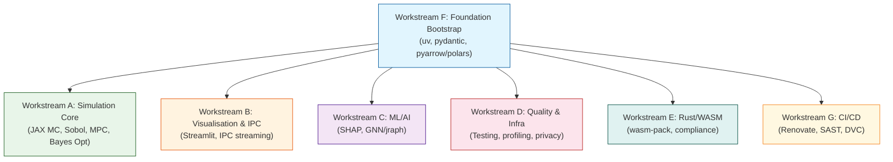
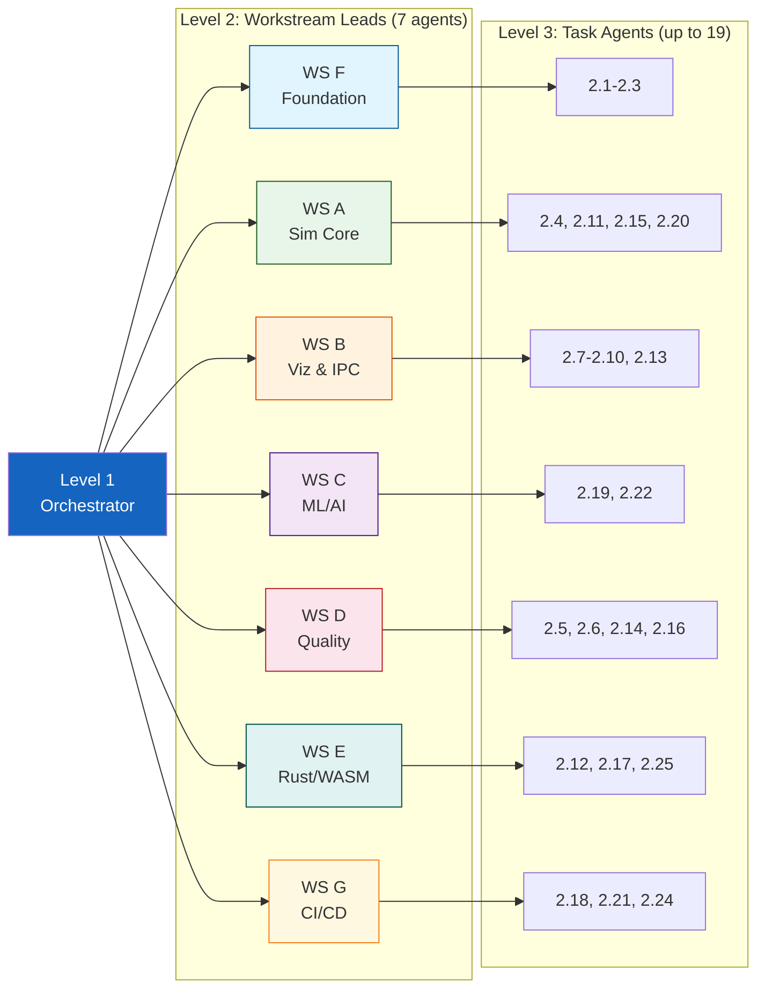

# Plan: Simulation Engine Evolution — Multi-Level Subagent Swarm

This plan covers the implementation track tasks for incorporating `kairos`, `voiage`, `mars`, and `innovate` into the model suite using SOTA Python best practices, executed via a **three-level subagent swarm** for maximum parallelism.

---

## Phase 0 — Foundation (completed)

- [x] Task 1.1: Map simulation inputs and calculations (`docs/calibration/simulation-inputs-calculations-map.md`).
- [x] Task 1.2: Generate CSL-JSON reference database (`docs/calibration/simulation-references.json`).
- [x] Task 1.3: Update Moscow Requirements, design file, and Conductor registry to cover Track 042.
- [x] Task 1.4: Add Vale prose linting configs and renovate configuration.
- [x] Task 1.5: Add Vale linter checks to GitHub Actions CI workflow.
- [x] Task 1.6: Run check_repo_health.py and verify that all quality gates pass successfully.

---

## Phase 1 — Workstreams

Tasks grouped into **7 independent workstreams**, each led by a Level-2 subagent that spawns Level-3 task agents.

### Workstream F: Foundation Bootstrap (Level 2: Foundation Lead)
Sequential within — single agent executes all three in one pass.

- [x] **Task 2.1**: Configure `uv` for local and CI dependency tracking.
  - *Output:* `pyproject.toml` with `[tool.uv]`; `uv.lock`
- [x] **Task 2.2**: Implement `pydantic` schemas for simulation settings/parameters.
  - *Depends:* 2.1 — *Output:* `models/primarycare_model/schemas.py`
- [x] **Task 2.3**: Integrate `pyarrow` and `polars` for memory layout and data frames.
  - *Depends:* 2.1 — *Output:* Data layer with Arrow tables, Polars I/O, telemetry schema

### Workstream A: Simulation Core (Level 2: Sim Core Lead)
JAX MC → 3 parallel tasks (Sobol, MPC, Bayes Opt). Spawns 4 Level-3 agents.

- [x] **Task 2.4**: Build Monte Carlo compiling layers with `JAX` / XLA.
  - *Depends:* 2.1, 2.3 — *Output:* `models/primarycare_model/jax_mc.py`
- [x] **Task 2.11**: Implement Sobol variance-based GSA grids. *Depends:* 2.4
- [x] **Task 2.15**: Model regulatory adjustment loops as JAX MPC functions. *Depends:* 2.4
- [x] **Task 2.20**: Integrate Bayesian Optimization into policy auto-tuning. *Depends:* 2.4

### Workstream B: Visualisation & IPC (Level 2: Viz Lead)
4 Streamlit animations + IPC streaming — parallel after foundation. Spawns 5 Level-3 agents.

- [x] **Task 2.7**: Streamlit live animations for `kairos` patient-flow ABM. *Depends:* 2.1, 2.3
- [x] **Task 2.8**: Animated `innovate` Bass diffusion choropleth/line chart. *Depends:* 2.1, 2.3
- [x] **Task 2.9**: Nash optimisation convergence trace viz. *Depends:* 2.1, 2.3
- [x] **Task 2.10**: Rolling histogram for batched JAX Monte Carlo sweeps. *Depends:* 2.4
- [x] **Task 2.13**: PyArrow IPC streaming endpoints (runtime ↔ UI). *Depends:* 2.3

### Workstream C: ML/AI (Level 2: ML Lead)
SHAP attribution → GNN pathway model (sequential within). 2 Level-3 agents.

- [x] **Task 2.19**: Extract/serialize SHAP from agent decision networks. *Depends:* 2.4
- [x] **Task 2.22**: GNN with `jraph` on JAX for referral bottlenecks. *Depends:* 2.4, 2.19

### Workstream D: Quality & Infrastructure (Level 2: Quality Lead)
Testing, profiling, privacy, formal verification — parallel after foundation. Spawns 4 Level-3 agents.

- [x] **Task 2.5**: Hypothesis + mutmut test suite. *Depends:* 2.1, 2.2
- [x] **Task 2.6**: Scalene profiling runs for bottleneck ID. *Depends:* 2.4
- [x] **Task 2.14**: Laplace noise demographic privacy modules. *Depends:* 2.2
- [x] **Task 2.16**: Queue safety invariants + formal spec. *Depends:* none (infra only)

### Workstream E: Rust/WASM (Level 2: Rust Lead)
Rust core, wasm-pack, compliance, Cargo caching. Spawns 3 Level-3 agents.

- [x] **Task 2.12**: Rust core `wasm-pack` compilation pipeline. *Depends:* 2.1
- [x] **Task 2.17**: Compliance test: zero patient-level data. *Depends:* 2.1
- [x] **Task 2.25**: Cargo compilation directory caching in CI. *Depends:* 2.12

### Workstream G: CI/CD & Infrastructure (Level 2: Infra Lead)
Renovate, SAST, DVC — independent, fully parallel. Spawns 3 Level-3 agents.

- [x] **Task 2.18**: Renovate auto-upgrades for bleeding-edge pinning. *Depends:* 2.1
- [x] **Task 2.21**: Bandit + Semgrep SAST + secret scanning. *Depends:* 2.1
- [x] **Task 2.24**: Git LFS or DVC for simulation outcome versioning. *Depends:* 2.1

---

## Phase 2 — Integration & Closeout

- [x] **Task 2.23**: Execute multi-level subagent swarm dispatch (runs concurrently with Phase 1)
  - Orchestrator spawns all 7 Level-2 workstream leads simultaneously
- [x] Final integration: merge all workstream outputs, resolve conflicts
- [x] Final gates: `pytest`, `ruff check`, `mypy`, `vale`, `check_repo_health.py`

## Implementation Notes

- 2026-05-26: Stabilised the existing Python simulation-engine slice rather than expanding into Rust/WASM or DVC while the active code was still unverified.
- 2026-05-26: Added NumPy fallbacks for JAX-dependent lanes so the public dashboard and tests import without optional JAX installed, while preserving JAX-compatible public APIs for accelerated environments.
- 2026-05-26: Added `models/tests/test_simulation_engine_evolution_042.py` covering Monte Carlo sweeps, deterministic trajectories, Arrow IPC, Bass diffusion, Nash traces, SHAP Arrow serialisation, sensitivity proxy indices, MPC optimisation and Bayesian optimisation fallback.
- 2026-05-26 validation: in-memory syntax compile passed for the touched Python modules; `pytest -q -p no:cacheprovider models/tests/test_simulation_engine_evolution_042.py` reported `6 passed`; full `pytest -q -p no:cacheprovider models/tests` reported `84 passed` with the known Windows temp cleanup warning after success.

---

## Subagent Dispatch Protocol

**Level 1 — Orchestrator (this agent):** Spawns all 7 Level-2 leads via `team_spawn_teammate()`, monitors via `team_await_runs()`, handles merge conflicts, runs final gates.

**Level 2 — Workstream Leads (7 agents):** Each receives a task list and dependency map, spawns Level-3 agents for parallel tasks, collects outputs, runs workstream-level tests, reports completion.

**Level 3 — Task Agents (up to 19):** Each implements one task (code + tests + docs), reports output paths, shuts down.

| Level | Count | Role |
|-------|-------|------|
| 1 (Orchestrator) | 1 | Master dispatch, integration, final gates |
| 2 (Workstream Leads) | 7 | Foundation, Sim Core, Viz, ML, Quality, Rust, Infra |
| 3 (Task Agents) | Up to 19 | One per Phase 1 task |
| **Peak concurrent** | **~20** | After foundation bootstrap completes |

**Estimated wall time:** Foundation ~1 cycle → Parallel tasks ~2-3 cycles → Integration ~1 cycle = **~4-5 cycles total** (vs ~19 sequentially).
