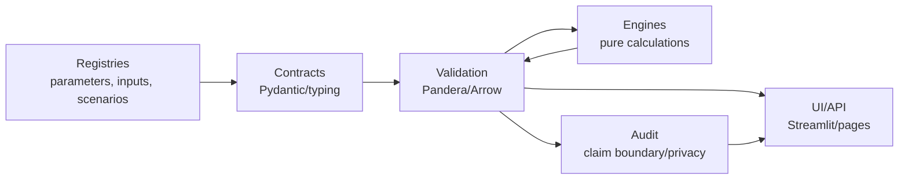

# Concern Extraction and Strict Validation Architecture

**Status:** Complete

## Problem

The model now has enough runtime capability that the next risk is architectural drift. Inputs, parameter metadata, scenario settings, calculation formulas, Streamlit controls, validation checks, and claim-boundary text are partly separated, but they still cross module boundaries in ways that make it hard to prove what is being calculated, what is merely a UI control, and what is a public-data assumption.

This track defines the extraction target: every model concern should have one authoritative typed contract, one validation path, and one runtime adapter into the calculation engines.

## Goal

Create a strict, testable architecture where:

- inputs are data contracts, not engine constants;
- parameters are registry entries with units, bounds, provenance, sensitivity class, and validation rules;
- scenarios are named override bundles that reference known parameter IDs;
- calculation engines are pure typed functions over validated inputs;
- outputs are typed result objects and validated data frames;
- UI pages render and edit typed objects but do not own calculation formulas;
- audit and claim-boundary metadata travel with public outputs.

## Current Concern Map

| Concern | Current locations | Current separation | Gap |
|---|---|---:|---|
| Core runtime settings | `models/primarycare_model/schemas.py` | Partial | Pydantic schemas exist, but they do not yet cover the whole registry/scenario/result surface. |
| Public parameter inputs | `models/primarycare_model/parameterised_model.py` | Partial | `ParameterInput` captures source/provenance/current value, but parameter definitions remain code-owned. |
| Full parameter catalogue | `models/primarycare_model/full_parameterised_model_v170.py` | Partial | `ParameterSpec`, `DataInputSpec`, and `ScenarioSpec` are useful contracts, but they are embedded in executable code instead of external registries. |
| Educational levers and labels | `models/primarycare_model/scenario_service.py` | Weak | UI lever definitions and calculation formulae are co-located. |
| Agent-based simulation | `models/primarycare_model/abm.py` | Weak | `ABMParameters` and engine logic live together. |
| System dynamics simulation | `models/primarycare_model/sd.py` | Weak | `SDParameters` and stock-flow equations live together. |
| Monte Carlo and sensitivity | `models/primarycare_model/jax_mc.py`, `models/primarycare_model/sensitivity.py` | Partial | Runtime methods are testable, but typed array/data-frame contracts are incomplete. |
| Diffusion and optimisation | `models/primarycare_model/diffusion.py`, `models/primarycare_model/mpc.py`, `models/primarycare_model/nash_opt.py` | Partial | Calculation functions exist, but inputs/results should be normalised through shared contracts. |
| ML/graph features | `models/primarycare_model/shap_attribution.py`, `models/primarycare_model/gnn_pathways.py` | Partial | Feature/result metadata needs stronger schema coverage. |
| Columnar data layer | `models/primarycare_model/data_layer.py` | Good foundation | Arrow contracts should align with Pandera and Pydantic exports. |
| Streamlit pages | `models/primarycare_model/pages/*`, `models/primarycare_model/app.py` | Weak | Pages instantiate settings directly from widgets; widgets should bind to registry-backed scenario services. |
| Public claim boundary | `docs/calibration/model-card-v1.7.2.md`, `docs/launch/claim-boundaries-v1.7.2.md`, public dashboard copy | Partial | Claim-boundary text exists, but result manifests should carry structured claim-boundary metadata. |
| Compliance gates | `scripts/check_no_patient_data.py`, tests | Good foundation | Need a concern-boundary scanner and typed-schema validation gate. |

## Target Architecture

### Contract Layer

Create `models/primarycare_model/contracts/` with small, import-safe modules:

- `parameters.py`: `ParameterDefinition`, `ParameterValue`, `ParameterVector`, unit, bounds, transform, source, confidence tier, sensitivity class, and evidence tags.
- `inputs.py`: `InputDataset`, `InputField`, input provenance, public/template/sensitive classification, and refresh metadata.
- `scenarios.py`: `ScenarioDefinition`, `ScenarioOverride`, compatibility metadata, and scenario bundle validation.
- `results.py`: `ResultManifest`, `MetricSeries`, `ScenarioResult`, `UncertaintySummary`, and claim-boundary tags.
- `engine.py`: `EngineProtocol`, `EngineInput`, `EngineOutput`, and adapter signatures for pure calculation engines.

### Registry Layer

Create `models/primarycare_model/registries/` for versioned manifests:

- `parameters.v1.yaml` or `parameters.v1.json`;
- `inputs.v1.yaml` or `inputs.v1.json`;
- `scenarios.v1.yaml` or `scenarios.v1.json`;
- `educational_levers.v1.yaml` or `educational_levers.v1.json`.

Registries become the only production source for defaults, bounds, labels, units, provenance, and scenario overrides. Existing in-code definitions may remain temporarily as compatibility shims, but they should be generated from or checked against registries.

### Validation Layer

Create `models/primarycare_model/validation/`:

- `pandera_schemas.py`: Pandera `DataFrameModel` schemas for parameter registries, scenario registries, input tables, monthly metrics, simulation traces, uncertainty summaries, and public export tables.
- `arrow_schemas.py`: Arrow schemas aligned with Pandera where columnar IPC is used.
- `registry_loader.py`: schema-checked loading with Pydantic v2 validation and JSON Schema export.
- `runtime_checks.py`: low-cost checks for public app execution.

### Engine Layer

Calculation modules should accept validated `EngineInput` objects or typed parameter/result adapters. They should not import Streamlit or own UI defaults.

Target dependency direction:

## SOTA Typing and Validation Stack

- Pydantic v2 for object contracts, manifest validation, JSON Schema export, and strict runtime coercion control.
- Pandera for pandas/polars data-frame schemas, statistical ranges, column-level checks, and batch validation.
- PyArrow schemas for IPC and columnar memory contracts.
- Python `typing.Protocol`, `TypedDict`, `Literal`, `Annotated`, `NewType`, and `dataclass(frozen=True)` where appropriate.
- `numpy.typing.NDArray` for NumPy array boundaries.
- Optional `jaxtyping` plus `beartype` for JAX/NumPy shape and dtype contracts where acceleration code justifies the dependency.
- `pydantic-settings` for environment and runtime configuration, if configuration moves outside simple model settings.
- Hypothesis strategies derived from contracts for property-based boundary tests.
- Static type gate with `mypy --strict` or Pyright once the contract layer stabilises.
- `ruff` for import hygiene and code-style enforcement.
- Existing patient-data scanners plus a new concern-boundary scanner.

## Architectural Invariants

- No Streamlit imports in engine, contract, validation, or registry modules.
- No production parameter default outside a registry, except compatibility shims that are tested against the registry.
- Every scenario override references a known parameter ID.
- Every parameter value validates against declared type, bounds, unit, and transform constraints.
- Every data-frame output passes Pandera validation before public display or export.
- Every public output carries claim-boundary metadata stating whether it is public-data anchored, linked-data calibrated, patient-level, forecast-grade, or educational.
- Engines are deterministic for fixed inputs and seed values.
- Stochastic engines expose seed, sample count, distribution assumptions, and uncertainty summary.
- UI pages bind widgets to typed parameter/scenario services, not directly to engine internals.
- Privacy classification is explicit for every input table and public export.

## Acceptance Criteria

- `contracts/` exists with Pydantic v2 models and protocols for parameters, inputs, scenarios, engine IO, and results.
- `registries/` exists with versioned parameter, input, scenario, and educational-lever manifests.
- Pandera schemas validate canonical parameter, scenario, input, and output data frames.
- Existing in-code parameter/scenario catalogues are either replaced by registry loaders or checked for equivalence.
- Calculation engines expose typed adapter entrypoints and do not import Streamlit.
- Streamlit pages load controls from typed services rather than owning calculation defaults.
- A concern-boundary gate detects forbidden UI-to-engine coupling and direct production defaults in engine modules.
- Existing model and public claim-boundary tests continue to pass.
- Documentation states what is calculated at runtime, what is deterministic, what is stochastic, and what remains demonstrative.

## Non-Goals

- This track does not make stronger empirical or predictive claims.
- This track does not require linked patient-level data.
- This track does not replace all engines in one commit.
- This track does not remove public educational educational simulations; it makes their assumptions explicit and validated.