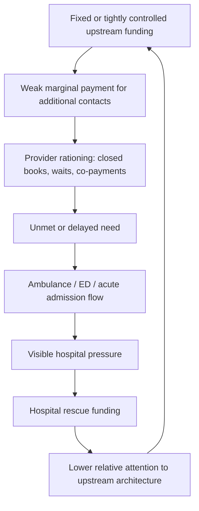
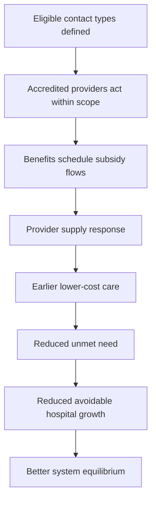

# Causal logic model: lower-cost access constraints and hospital growth

## Core causal claim

The model tests whether tight control of lower-cost primary, urgent and ambulance/prehospital care creates unmet need that later appears as higher-cost hospital demand.

This is not a claim that all hospital growth is avoidable. It is a claim that some hospital growth may be the predictable downstream consequence of upstream constraint.

## Main causal chain

## Alternative architecture

## Feedback loops

### R1: Hospital rescue loop

Unmet need increases hospital pressure; hospital pressure increases political salience; political salience increases hospital funding response; hospital funding response reduces attention to upstream redesign; upstream constraint persists.

### B1: Upstream resolution loop

Benefits schedule increases marginal payment for eligible contacts; providers expand supply or enter market; patients receive earlier care; unmet need falls; avoidable hospital pressure falls.

### R2: Provider viability loop

Weak marginal funding reduces provider viability; reduced viability increases closed books and workforce exit; closed books increase unmet need; unmet need increases workload intensity and burnout; burnout further reduces viability.

### B2/R3: Co-payment loop

Moderate co-payment can signal demand and prevent low-value use; excess co-payment deters necessary care. The loop can be balancing or reinforcing depending on co-payment design.

### R4: Telehealth substitution loop

Telehealth increases simple-contact access; if not integrated or paired with local in-person funding, it may reduce local practice viability; lower local viability reduces in-person capacity; reduced in-person capacity increases ED and ambulance use for problems needing examination or procedures.

## Policy levers

- capitation weight;
- benefit amount per contact type;
- co-payment cap;
- provider eligibility rules;
- rural loading;
- data reporting burden;
- PHO intermediation requirement;
- ACC payment settings;
- ambulance treat-and-refer eligibility;
- hospital and upstream KPI prominence.
