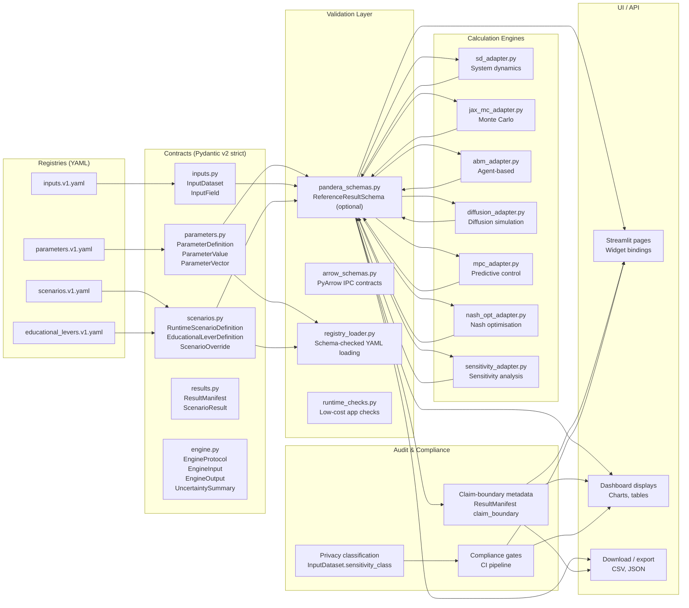

# Concern Extraction and Strict Validation Architecture v1.8.3

This document describes the layered architecture that enforces separation of concerns across all model components — from YAML registries through to public-facing Streamlit displays and compliance audits.

## Full architecture flowchart



## Simplified dependency direction

```mermaid
flowchart LR
    R["Registries"]
    C["Contracts"]
    V["Validation"]
    E["Engines"]
    U["UI/API"]
    A["Audit"]

    R -->|"Strict"| C
    C -->|"Strict"| V
    V -->|"Strict"| E
    E -->|"Validation feedback"| V
    V -->|"Safe for display"| U
    V -->|"Claim metadata"| A

## What is strict vs. optional

| Component | Strictness | Rationale |
|---|---|---|
| **Pydantic v2 contracts** | **Strict** — `StrictContract` uses `extra="forbid"`, `frozen=True`, `strict=True`. Every input, output, scenario and parameter value validates at construction. | Architectural invariant: no malformed data can enter the engine or leave for public display. |
| **YAML registry loading** | **Strict** — `registry_loader.py` applies Pydantic schema validation to every loaded YAML record. Registry files are checked in CI for structural conformance. | A malformed YAML registry is a production defect. CI must catch it. |
| **Streamlit import ban** | **Strict** — `check_concern_boundaries.py` blocks any Streamlit import in `contracts/`, `validation/`, `registries/`, or engine adapters. | Ensuring engine/contract modules remain pure (no UI coupling) is a safety property. |
| **No-patient-data gate** | **Strict** — `check_no_patient_data.py` scans all tracked files for identifiable data patterns. Zero matches are required for deployment. | Privacy compliance is non-negotiable for a public repository. |
| **Pandera DataFrame validation** | **Optional** — Pandera is installed in CI and test environments but not required for the lean Streamlit deployment. The `validate_reference_results_frame` function provides equivalent checks with pure pandas. | The Streamlit hosting environment has a constrained dependency set. Pandera adds value without being a deployment blocker. |
| **PyArrow schemas** | **Optional** — Arrow schema alignment with Pandera is prepared but only exercised when columnar IPC is used for large result sets. | Most public display paths use pandas DataFrames, not Arrow tables. |
| **Mypy --strict** | **Enforced in CI** — `mypy --strict` now runs on contracts, validation and all engine modules as a compatibility gate (with per-module overrides in `pyproject.toml`). | This aligns static typing with the strict concern boundary before deployment. |
| **Hypothesis property tests** | **Optional** — Strategies can be derived from contracts, but are not yet part of the standard CI suite. | Property-based testing is valuable but not yet production-critical. |
| **UI widget → service binding** | **Monitored** — Streamlit pages are expected to bind widgets to typed services, but the current codebase has partial migration. The concern-boundary scanner flags direct engine imports. | Complete migration is a Track 043 non-goal; the scanner catches regressions. |

    A -->|"Boundaries enforced"| U
```

## Layer descriptions

### Registries (source of truth)

Four versioned YAML files in `models/primarycare_model/registries/`:

- **`parameters.v1.yaml`** — 25+ parameters across capitation, FFS, copayment, population, workforce and governance domains. Each record includes `parameter_id`, `label`, `value_type`, `unit`, `default_value`, `lower_bound`, `upper_bound`, `category_values`, `description`, `source`, `sensitivity_class`, `evidence_tier`, and `tags`.
- **`inputs.v1.yaml`** — Input dataset definitions with field schemas, sensitivity classifications, and refresh metadata.
- **`scenarios.v1.yaml`** — Named scenario bundles that override known parameter IDs. Each scenario has a `scenario_kind` (`reference`, `educational`, `stochastic_demo`) and a `claim_boundary`.
- **`educational_levers.v1.yaml`** — Slider definitions for the Streamlit educational lab. Each lever has a `public_label`, `health_economics_meaning`, `high_value_meaning`, `educational_output_effect`, slider bounds, and a `claim_boundary`.

### Contracts (typed boundaries)

Seven Python modules in `models/primarycare_model/contracts/`:

| Module | Key types | Purpose |
|---|---|---|
| `parameters.py` | `StrictContract`, `ParameterDefinition`, `ParameterValue`, `ParameterVector` | Parameter metadata, validated values, named bundles |
| `inputs.py` | `InputDataset`, `InputField`, `InputSensitivity` | Dataset definitions with privacy classification |
| `scenarios.py` | `RuntimeScenarioDefinition`, `EducationalLeverDefinition`, `ScenarioOverride`, `ScenarioKind` | Scenario and UI-control contracts |
| `results.py` | `ResultManifest`, `ScenarioResult`, `CalculationMode` | Public output contracts with claim-boundary metadata |
| `engine.py` | `EngineProtocol`, `EngineInput`, `EngineOutput`, `UncertaintySummary` | Calculation engine boundary contracts |

### Validation (data integrity)

Four modules in `models/primarycare_model/validation/`:

- **`pandera_schemas.py`** — `ReferenceResultSchema` DataFrameModel with per-column bounds (0–100 for all scores). Optional; pure-pandas fallback `validate_reference_results_frame` provides equivalent checks.
- **`arrow_schemas.py`** — PyArrow schemas aligned with Pandera where columnar IPC is used.
- **`registry_loader.py`** — Schema-checked YAML loading via Pydantic v2 validation, with JSON Schema export.
- **`runtime_checks.py`** — Low-cost validation checks executed during public app runtime.

### Engines (pure calculation)

Seven modules in `models/primarycare_model/engines/`, each exposing an `EngineProtocol`-compatible adapter:

| Module | Engine | Input type | Output type | Deterministic? |
|---|---|---|---|---|
| `sd_adapter.py` | System dynamics | `EngineInput` | `EngineOutput` + `ScenarioResult` | Yes (fixed seed) |
| `jax_mc_adapter.py` | Monte Carlo | `EngineInput` | `EngineOutput` + `ScenarioResult` + `UncertaintySummary` | Yes (seeded) |
| `abm_adapter.py` | Agent-based | `EngineInput` | `EngineOutput` + `ScenarioResult` | Yes (seeded) |
| `diffusion_adapter.py` | Diffusion simulation | `EngineInput` | `EngineOutput` + `ScenarioResult` | Yes (seeded) |
| `mpc_adapter.py` | Model predictive control | `EngineInput` | `EngineOutput` + `ScenarioResult` | Yes (fixed seed) |
| `nash_opt_adapter.py` | Nash optimisation | `EngineInput` | `EngineOutput` + `ScenarioResult` | Yes (fixed seed) |
| `sensitivity_adapter.py` | Sensitivity analysis | `EngineInput` | `EngineOutput` + `ScenarioResult` | Yes (no seed) |

### UI/API (presentation)

Streamlit pages in `models/primarycare_model/pages/` and `app.py`. Pages bind widgets to typed parameter/scenario services. They do not own calculation defaults or formulas. The `_render_result_manifest_badge` function displays the coloured mode badge (precomputed/deterministic/stochastic/educational) for every public result.

### Audit (compliance)

Claim-boundary metadata travels with every `ResultManifest` via the `claim_boundary` field. Privacy classification is explicit on every `InputDataset` via `sensitivity_class`. Compliance gates run in CI and block deployment on failure.


