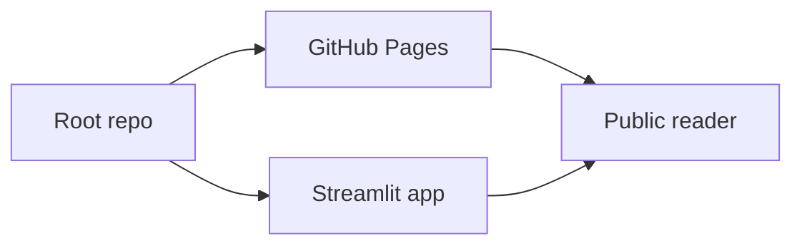
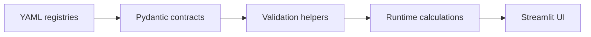
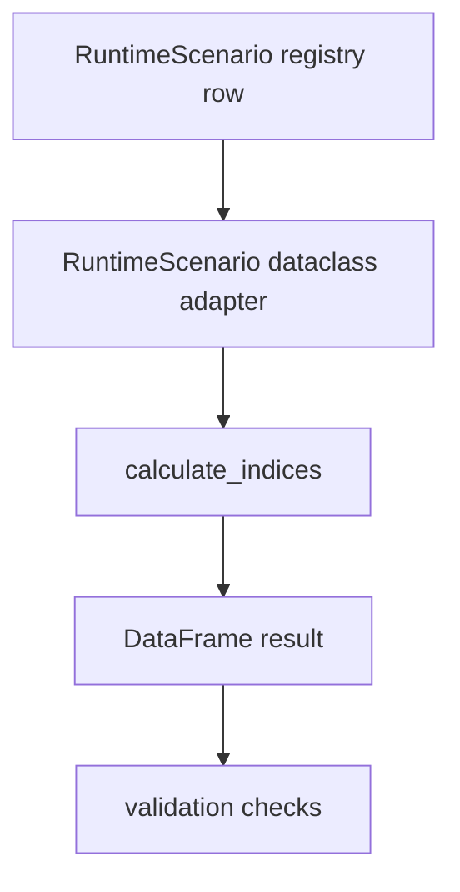
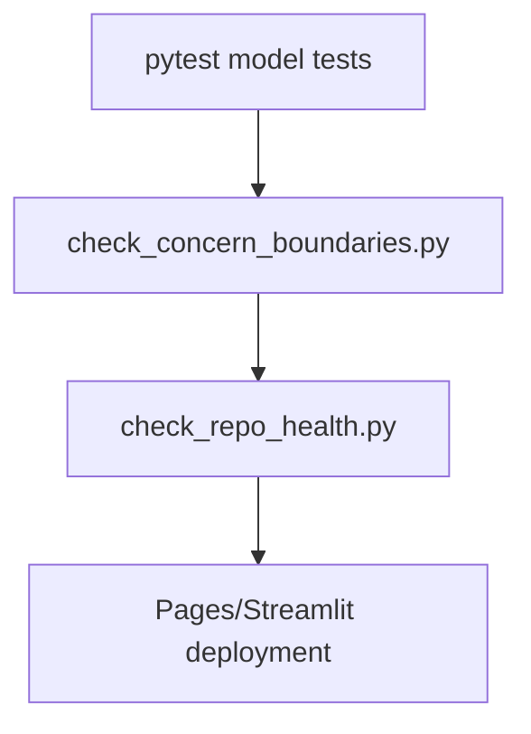

# Repo, GitHub Pages and Streamlit Design v1.8.3

This design records the current strict-validation architecture without changing the empirical claim boundary.

## Public Surface

## Concern Boundaries

## Runtime Calculation Path

## Test And Release Gates

