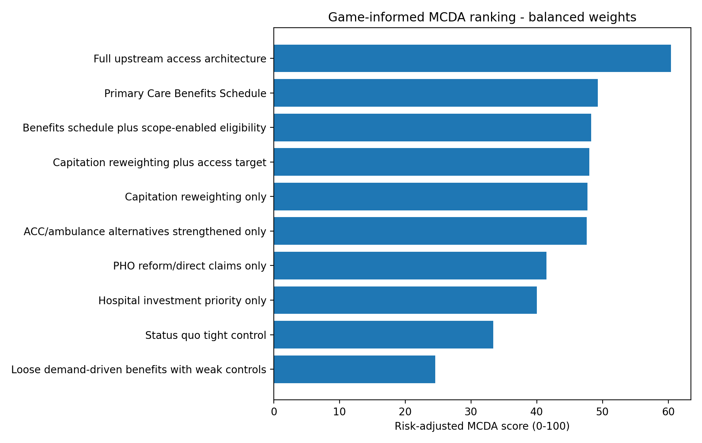
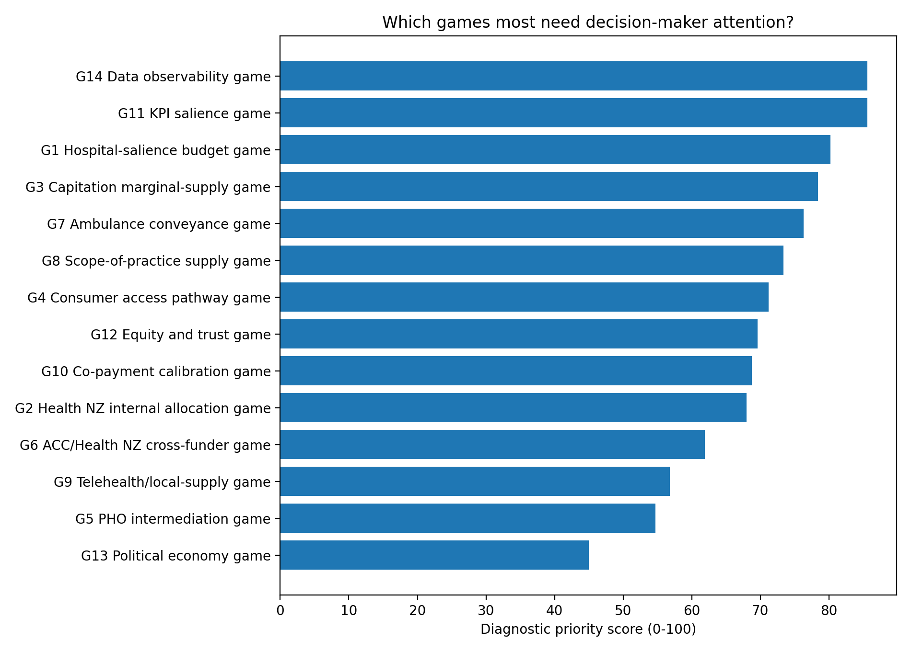
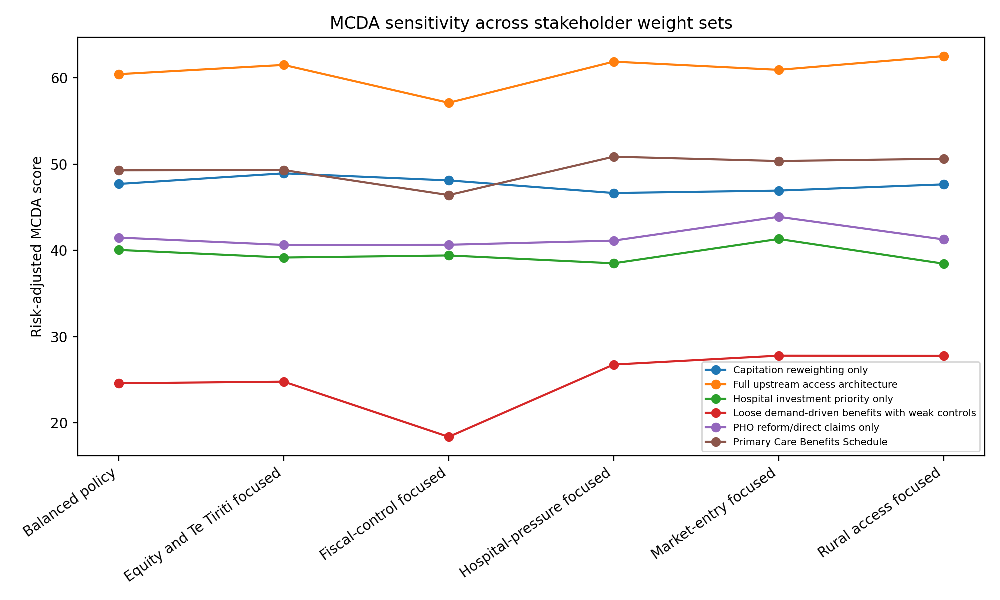

# Game-informed MCDA decision-support report v0.9.0

**Project:** Primary care funding architecture in Australia and New Zealand  
**Focus:** New Zealand upstream access, primary care, ambulance and hospital-pressure games  
**Version:** v0.9.0  
**Status:** Demonstrative decision-support layer; not empirically calibrated

## Executive summary

This report adds a game-informed MCDA layer to the final hybrid model. The purpose is to help decision-makers evaluate whether the mapped games matter, how strongly each game contributes to the policy problem, and which policy options are most likely to move the system toward better equilibria.

The MCDA does not replace empirical modelling. It makes judgement explicit. It is designed for RACMA discussion, stakeholder workshops, policy option screening and validation planning.

The central thesis remains:

> New Zealand may be managing primary care and ambulance activity so tightly that unmet need is channelled into hospitals by default.

The MCDA translates that thesis into two decision-support tools:

1. **Diagnostic game-position mapping**: where does each game currently sit, and how important is it?
2. **Policy-option MCDA**: which reform option best balances access, equity, hospital deflection, fiscal control, governance, market entry and feasibility?

## Why MCDA is useful here

This policy problem is not just a technical funding-design problem. It also involves values, risk tolerance, professional boundaries, equity, Te Tiriti legitimacy, rural resilience, fiscal exposure, data observability and political feasibility.

A pure model can show what follows from assumptions. MCDA shows which assumptions and values decision-makers are using.

## Diagnostic game map

The highest-priority diagnostic games in the example scoring are:

| game_id   | game_name                       | current_equilibrium                 | better_equilibrium                        |   priority_score_0_to_100 |
|:----------|:--------------------------------|:------------------------------------|:------------------------------------------|--------------------------:|
| G11       | KPI salience game               | hospital-target dominance           | upstream target salience                  |                      85.6 |
| G14       | Data observability game         | hidden-unmet-need equilibrium       | observable upstream-flow equilibrium      |                      85.6 |
| G1        | Hospital-salience budget game   | hospital-rescue equilibrium         | upstream-salience equilibrium             |                      80.2 |
| G3        | Capitation marginal-supply game | marginal-rationing equilibrium      | marginal-expansion equilibrium            |                      78.4 |
| G7        | Ambulance conveyance game       | ED-conveyance default               | safe alternative-disposition equilibrium  |                      76.3 |
| G8        | Scope-of-practice supply game   | professional-bottleneck equilibrium | scope-enabled supply equilibrium          |                      73.4 |
| G4        | Consumer access pathway game    | delay/pay/ED substitution           | early-access equilibrium                  |                      71.2 |
| G12       | Equity and trust game           | transactional-access without trust  | benefits plus equity-function equilibrium |                      69.6 |

The diagnostic map suggests that KPI salience, data observability, hospital salience, capitation marginal supply, ambulance conveyance and scope-of-practice supply are especially important games to test and discuss.

## Policy-option MCDA

The default MCDA criteria are:

| criterion_id   | criterion                                  |   default_weight | related_games    |
|:---------------|:-------------------------------------------|-----------------:|:-----------------|
| C1             | Access and supply generation               |               14 | G3, G4, G8       |
| C2             | Hospital deflection                        |               14 | G1, G2, G7       |
| C3             | Equity and Te Tiriti legitimacy            |               14 | G10, G12         |
| C4             | Rural and in-person resilience             |                9 | G7, G8, G9       |
| C5             | Fiscal sustainability                      |               12 | G1, G2, G6, G10  |
| C6             | Gaming and low-value activity risk         |               10 | G3, G5, G10, G13 |
| C7             | Administrative simplicity and market entry |                9 | G5, G8, G14      |
| C8             | Governance and clinical safety             |               10 | G8, G11, G14     |
| C9             | Political feasibility                      |                5 | G5, G12, G13     |
| C10            | Data and accountability readiness          |                8 | G11, G14         |

The default policy options are:

| option_id   | option                                           | mapped_scenario   |
|:------------|:-------------------------------------------------|:------------------|
| O0          | Status quo tight control                         | S0                |
| O1          | Capitation reweighting only                      | S1                |
| O2          | Capitation reweighting plus access target        | S1+target         |
| O3          | Primary Care Benefits Schedule                   | S2                |
| O4          | Benefits schedule plus scope-enabled eligibility | S2+scope          |
| O5          | Full upstream access architecture                | S3                |
| O6          | Loose demand-driven benefits with weak controls  | S4                |
| O7          | ACC/ambulance alternatives strengthened only     | partial           |
| O8          | PHO reform/direct claims only                    | partial           |
| O9          | Hospital investment priority only                | hospital          |

## Balanced-weight result

|   rank | option_id   | option                                           |   weighted_total_before_penalty |   risk_penalty |   risk_adjusted_score |
|-------:|:------------|:-------------------------------------------------|--------------------------------:|---------------:|----------------------:|
|      1 | O5          | Full upstream access architecture                |                           70.77 |          10.35 |                 60.42 |
|      2 | O3          | Primary Care Benefits Schedule                   |                           59.37 |          10.1  |                 49.27 |
|      3 | O4          | Benefits schedule plus scope-enabled eligibility |                           60.58 |          12.3  |                 48.28 |
|      4 | O2          | Capitation reweighting plus access target        |                           54.5  |           6.5  |                 48    |
|      5 | O1          | Capitation reweighting only                      |                           52.89 |           5.2  |                 47.69 |
|      6 | O7          | ACC/ambulance alternatives strengthened only     |                           55.78 |           8.2  |                 47.58 |
|      7 | O8          | PHO reform/direct claims only                    |                           53.72 |          12.25 |                 41.47 |
|      8 | O9          | Hospital investment priority only                |                           48.04 |           8    |                 40.04 |
|      9 | O0          | Status quo tight control                         |                           40.9  |           7.5  |                 33.4  |
|     10 | O6          | Loose demand-driven benefits with weak controls  |                           47.33 |          22.75 |                 24.58 |

The full upstream access architecture ranks first in the demonstrative MCDA. The Primary Care Benefits Schedule ranks second. Benefits plus scope-enabled eligibility ranks third but is more heavily penalised for implementation and governance risk. Capitation reweighting and capitation reweighting plus an access target perform moderately: they improve allocation and visibility, but do not fully solve marginal supply.

Loose demand-driven benefits with weak controls rank last, despite scoring well on access. This is because the risk-adjustment layer penalises weak equity protections, weak data, weak governance, and high gaming/fiscal exposure.

## Sensitivity across stakeholder weight sets

| option                                           |   Balanced policy |   Equity and Te Tiriti focused |   Fiscal-control focused |   Hospital-pressure focused |   Market-entry focused |   Rural access focused |
|:-------------------------------------------------|------------------:|-------------------------------:|-------------------------:|----------------------------:|-----------------------:|-----------------------:|
| ACC/ambulance alternatives strengthened only     |                 6 |                              6 |                        4 |                           4 |                      4 |                      4 |
| Benefits schedule plus scope-enabled eligibility |                 3 |                              5 |                        6 |                           3 |                      3 |                      2 |
| Capitation reweighting only                      |                 5 |                              3 |                        2 |                           6 |                      6 |                      6 |
| Capitation reweighting plus access target        |                 4 |                              4 |                        3 |                           5 |                      4 |                      5 |
| Full upstream access architecture                |                 1 |                              1 |                        1 |                           1 |                      1 |                      1 |
| Hospital investment priority only                |                 8 |                              8 |                        8 |                           8 |                      8 |                      8 |
| Loose demand-driven benefits with weak controls  |                10 |                             10 |                       10 |                          10 |                     10 |                     10 |
| PHO reform/direct claims only                    |                 7 |                              7 |                        7 |                           7 |                      7 |                      7 |
| Primary Care Benefits Schedule                   |                 2 |                              2 |                        5 |                           2 |                      2 |                      3 |
| Status quo tight control                         |                 9 |                              9 |                        9 |                           9 |                      9 |                      9 |

The ranking is not intended to force consensus. It is intended to show where the result is robust and where it depends on stakeholder values.

## Interpretation

The MCDA supports a refined version of the policy thesis:

> A demand-driven Primary Care Benefits Schedule may improve marginal supply and hospital-deflection logic, but it becomes a viable policy architecture only when paired with scope governance, equity protections, co-payment calibration, ambulance alternatives, direct/optional claiming, data observability and top-tier KPIs.

This can be expressed as:

> Demand-driven within rules; not demand-driven without rules.

## How to use this package

Use the MCDA in three ways:

1. **Internal RACMA discussion**: test whether colleagues accept the game map and priority scores.
2. **Stakeholder workshop**: compare group-specific scores and weight sets.
3. **Empirical validation planning**: turn low-confidence, high-impact criteria into research tasks.

## Audit status

This is a structured decision-support artefact. It is not proof of policy effectiveness. It should be updated after OIA responses, stakeholder validation, review findings, fiscal modelling and calibrated simulation.

## Included artefacts

- MCDA framework.
- Game-position scoring rubric.
- Policy-option scoring rubric.
- Stakeholder workshop guide.
- Weighting methods note.
- Results interpretation guide.
- Criteria, option, scorecard and weight-set CSVs.
- Blank scoring templates.
- Executable MCDA model.
- Example figures and workbook.
