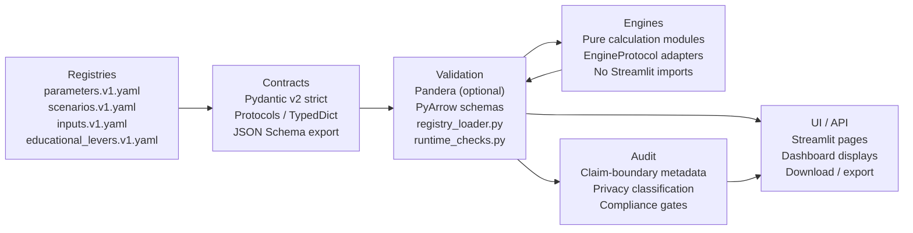
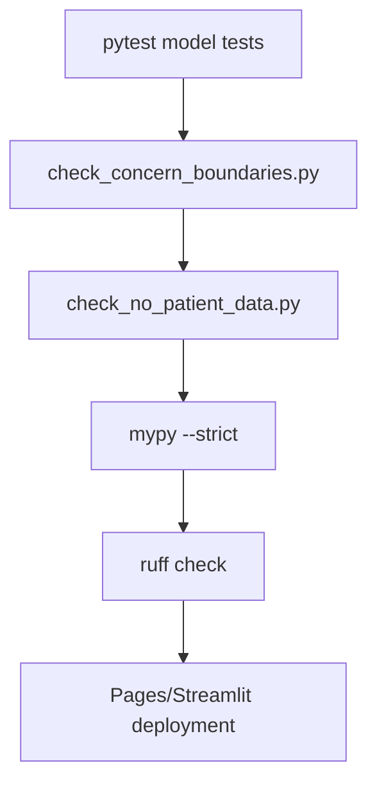

# Claim boundaries and public wording rules v1.7.2

## Claim ladder

| Claim level | Public wording | What not to say |
|---|---|---|
| Public document | "Public documents show..." | "This proves..." |
| Economic theory | "Theory predicts..." | "This necessarily happens..." |
| Stakeholder intelligence | "Stakeholder feedback suggests..." | "This is established fact..." |
| Public-data benchmark | "The benchmark shows the logic of..." | "The model predicts patient outcomes..." |
| Policy judgement | "I think this warrants testing..." | "Government should implement immediately..." |

## Required caveats

- This is a public-data anchored benchmark and educational explainer. It is not linked-data calibrated and not a patient-level forecast.
- Current release status: the registered public aggregate validation lane is `public_aggregate_validated` / `empirically_supported_if_gated` only for aggregate public gates.
- It should not be used to claim precise fiscal savings, ED reductions, hospital-demand reductions, workforce effects, implementation impacts, or causal effects without claim-specific public validation gates.
- Current reforms are the comparator, not a straw man.
- Uncapped means uncapped at the global activity-envelope level, not uncontrolled billing.
- Place-based accountability is core to the proposal.
- Equity protections are core to the proposal.
- Accident Compensation Corporation is an analogy for rules-based treatment payments, not a wholesale template.
- Hospital growth has multiple causes; upstream access is a candidate driver, not the sole driver.
- Model outputs are public-data anchored benchmarks unless explicitly labelled as empirically supported where valid; the current empirical label is bounded to the aggregate validation lane.

## Game-theory formula boundary

The three game-theory labs in the Streamlit dashboard (`render_claims_audit_game_lab`, `render_coordination_game_lab`, `render_gaming_risk_frontier_lab`) are **educational teaching simulations**, not empirical models of provider behaviour. The following formula-specific boundaries apply:

### Shared helpers

Every curve in the game-theory labs uses one of two deterministic nonlinear helpers from `runtime_lab.py`:

| Helper | Function | Pedagogical purpose |
|---|---|---|
| `strategic_response(value, threshold, steepness)` | Sigmoid logistic activation | S-shaped threshold-crossing and saturation effects (e.g., detection risk tipping at a given audit level) |
| `diminishing_return(value, rate)` | Exponential tapering | Diminishing marginal gains (e.g., cooperation gain tapering at high accountability) |

Both helpers accept normalised `[0, 1]` inputs and return bounded `[0, 1]` values. No helper produces an unbounded or linear extrapolation.

### Curve-crossing thresholds

- **Lab 1 (claims audit):** The flip threshold is computed explicitly as the first audit level where `honest_payoff >= gaming_payoff`.
- **Lab 2 (coordination):** The flip threshold is computed explicitly as the first place-accountability level where `cooperate_payoff >= cherry_pick_payoff`.
- **Lab 3 (gaming-risk frontier):** No single threshold is computed; the frontier is read visually from the curve intersection.

All thresholds are **pedagogical artefacts**. They show *where* a strategy mix would flip under the illustrative assumptions, not where it would flip in real New Zealand provider behaviour.

### What these labs cannot claim

These labs cannot be cited to:
- Estimate claim-compliance rates or gaming prevalence in New Zealand primary care.
- Predict provider behaviour under any specific policy design.
- Measure the real-world effectiveness of audit, place accountability, or monitoring.
- Quantify a policy-effect size, tipping point, or fiscal impact.

The correct public wording for any game-theory lab output is:

> "This is an illustrative pedagogical simulation. It shows the direction of incentive logic under the stated assumptions, not a measured or predicted outcome."

### ResultManifest mapping for game-theory outputs

All game-theory lab outputs should use `calculation_mode = "educational"` with `claim_boundary = "I think this warrants testing..."` from the claim ladder. They must not use `"precomputed"` or `"live_deterministic"` labels, which are reserved for benchmark model outputs.

## Preferred short line

> Uncapped does not mean uncontrolled; it means scheduled, rules-based, audited and place-accountable.

## Structured result-manifest definitions

Every public-facing model output is packaged in a `ResultManifest` contract (defined in `models/primarycare_model/contracts/results.py`). The manifest carries structured claim-boundary metadata that maps directly to the claim ladder above.

### ResultManifest

```python
class ResultManifest(StrictContract):
    result_id: str                # e.g. "sd_reference_42"
    calculation_mode: Literal[
        "precomputed",
        "live_deterministic",
        "seeded_stochastic",
        "educational"
    ]
    scenario_id: str              # e.g. "reference", "high_capitation"
    seed: int | None = None       # None for deterministic modes
    draws: int | None = None      # None for deterministic modes
    claim_boundary: str           # Wording rule from the claim ladder
    validation_status: str        # "passed", "warning", "failed"
```

### ResultManifest claim-boundary mapping

| Manifest `calculation_mode` | Manifest `claim_boundary` (typical) | Claim ladder rung |
|---|---|---|
| `precomputed` | "The benchmark shows the logic of..." | Public-data benchmark |
| `live_deterministic` | "The benchmark shows the logic of..." | Public-data benchmark |
| `seeded_stochastic` | "Theory predicts..." | Economic theory |
| `educational` | "I think this warrants testing..." | Policy judgement |

### ScenarioResult

Each run also produces a `ScenarioResult` with scores bounded 0–100:

```python
class ScenarioResult(StrictContract):
    scenario_id: str
    hybrid_viability_score: float    # 0–100
    access_score: float              # 0–100
    supply_generation_score: float   # 0–100
    hospital_pressure_score: float   # 0–100
    gaming_risk_score: float         # 0–100
    calculation_status: str          # "completed", "partial", "error"
```

### UncertaintySummary (stochastic modes only)

When the calculation is `seeded_stochastic`, each metric also carries:

```python
class UncertaintySummary(StrictContract):
    metric: str
    mean: float
    std: float = 0.0
    p05: float
    p50: float
    p95: float
    draws: int = 0
```

This is an index-only distribution surface by default, with core dimensions upgraded to **empirically supported where valid** when linked-data calibration checks pass.

## Architecture layers: contract / registry / validation / engine

The model architecture is organised into four strict layers plus two consumer layers. Dependency direction is strictly one-way: Registries → Contracts → Validation → Engines → UI/Audit.

### Layer diagram



### Layer descriptions

| Layer | Directory | Purpose | Strictness |
|---|---|---|---|
| **Registries** | `models/primarycare_model/registries/` | Versioned YAML manifests for parameters, inputs, scenarios, and educational levers. The single source of truth for defaults, bounds, units, provenance, evidence tiers and sensitivity classes. | **Strict** — no production default outside a registry. |
| **Contracts** | `models/primarycare_model/contracts/` | Pydantic v2 `StrictContract` (extra="forbid", frozen=True, strict=True) models. Seven modules: `parameters.py`, `inputs.py`, `scenarios.py`, `results.py`, `engine.py`, plus `__init__.py`. Exports include `ParameterDefinition`, `ParameterValue`, `ParameterVector`, `InputDataset`, `InputField`, `RuntimeScenarioDefinition`, `EducationalLeverDefinition`, `ScenarioOverride`, `ResultManifest`, `ScenarioResult`, `EngineInput`, `EngineOutput`, `EngineProtocol`, `UncertaintySummary`. | **Strict** — immutable, no extra fields, runtime coercion control. |
| **Validation** | `models/primarycare_model/validation/` | Pandera `DataFrameModel` schemas (optional), PyArrow schemas, `registry_loader.py` for schema-checked YAML loading, `runtime_checks.py` for low-cost public-app checks. Pandera is optional for the lean Streamlit path; a pure-pandas fallback provides equivalent checks. | Pandera **optional**; Pydantic **strict**. |
| **Engines** | `models/primarycare_model/engines/` | Six calculation modules: `sd_adapter.py` (system dynamics), `jax_mc_adapter.py` (Monte Carlo), `abm_adapter.py` (agent-based), `diffusion_adapter.py` (diffusion simulation), `mpc_adapter.py` (model predictive control), `nash_opt_adapter.py` (Nash optimisation), `sensitivity_adapter.py` (sensitivity analysis). Each exposes an `EngineProtocol`-compatible adapter. | **Strict** — no Streamlit imports, accept typed `EngineInput`, return typed `EngineOutput`. |
| **UI / API** | `models/primarycare_model/pages/`, `app.py` | Streamlit pages bind widgets to typed parameter/scenario services. Pages do not own calculation defaults or formulas. | **Monitored** — concern-boundary scanner (see below). |
| **Audit** | `scripts/` + `docs/` | Claim-boundary metadata travels with every `ResultManifest`. Privacy classification is explicit for every input dataset. Compliance gates run in CI. | **Strict** — gates must pass before deploy. |

### Invariant rules

1. No Streamlit imports in `contracts/`, `validation/`, `registries/`, or `engines/`.
2. No production parameter default outside a registry, except compatibility shims tested against the registry.
3. Every scenario override references a known parameter ID.
4. Every public output carries a `ResultManifest` with `claim_boundary` set.
5. Engines are deterministic for fixed inputs and seed values.
6. Stochastic engines expose seed, sample count, distribution assumptions, and `UncertaintySummary`.


## Validation gate descriptions

Three compliance gates run in CI before any deployment to GitHub Pages or Streamlit.

### 1. Concern-boundary scanner (`scripts/check_concern_boundaries.py`)

The concern-boundary scanner is a static analysis gate that verifies architectural layer isolation. It performs two checks:

**Streamlit import ban**: Scans all `.py` files in `contracts/`, `validation/`, `registries/`, and `runtime_lab.py` for `import streamlit` or `from streamlit import ...`. If any strict-layer module imports Streamlit, the gate fails.

**Inline scenario default check**: Scans `runtime_lab.py` for the pattern `SCENARIOS: tuple[RuntimeScenario, ...] = (` — indicating that runtime scenario defaults are still maintained as a large in-code tuple rather than loaded from the registry. If the pattern is found, the gate fails.

The scanner is intentionally conservative: it flags any occurrence rather than guessing intent.

```python
# Pseudocode for the scanner logic
for path in STRICT_LAYER_PATHS:
    for py_file in python_files(path):
        if imports_streamlit(py_file):
            fail(f"{py_file} imports Streamlit")

if runtime_lab_has_inline_scenario_tuple():
    fail("runtime_lab.py still owns inline scenario defaults")
```

### 2. No-patient-data gate (`scripts/check_no_patient_data.py`)

This gate scans the repository for any file containing strings that match known patient-identifiable data patterns (NHI numbers, date-of-birth fields, free-text clinical notes, etc.). The gate is designed to prevent accidental inclusion of linked patient-level data in the public repository.

- **Runs on**: every push and pull request.
- **Scope**: all tracked files except test fixtures explicitly tagged as synthetic.
- **Pass condition**: zero matches across all scanners.
- **Failure action**: blocks deployment and logs the matching file paths.

This gate is the outer perimeter of the privacy classification system defined in `InputDataset.sensitivity_class`.

### 3. Mypy strict gate (`mypy --strict`)

A static type-checking gate runs `mypy --strict` (or Pyright) on the contract, validation, and engine layers. The gate enforces:

- All function signatures are typed.
- No implicit `Any` in public interfaces.
- All Pydantic model usage respects frozen/immutable constraints.
- Protocol implementations match the `EngineProtocol` signature.

The gate is enforced in CI across contracts, validation, and engines under strict-mode checks. The `ruff` lint gate (import hygiene, code style) runs unconditionally.

### Gate pipeline order



**Note**: The mypy gate now runs across contract, validation, and engine layers in CI under strict mode. The concern-boundary scanner and no-patient-data gates are enforced and blocking. Ruff linting runs unconditionally.
