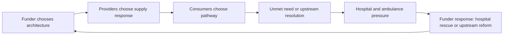

# Formal game-theoretic payoff model

## Purpose

This document formalises the policy hypothesis that constrained upstream funding can create a repeated-game equilibrium in which hospital growth is funded after the fact rather than avoided earlier through primary, urgent and ambulance/prehospital care.

The model is deliberately simple. It is designed to support policy reasoning, simulation specification and empirical falsification, not to claim final proof.

## Players

1. **Funder/government**: Ministry, Health NZ, ACC, Treasury and Ministers as a composite actor for the simplified model.
2. **Upstream providers**: general practices, nurse practitioners, pharmacists, allied health, urgent care, kaupapa Maori/Pacific providers, paramedics and telehealth providers.
3. **Hospital system**: hospital and specialist services, ED, acute admissions and planned care as a pressure domain.
4. **Consumers/patients**: heterogeneous users with different need, price sensitivity, rurality, trust, transport and digital access.
5. **Intermediaries**: PHOs/locality entities, where modelled separately.

## Strategies

### Funder strategies

- `TightControl`: fixed or quasi-fixed capitation and programme envelopes, PHO-mediated payment, narrow provider eligibility and limited marginal payments.
- `ReweightOnly`: improved capitation allocation, but without a substantial demand-driven activity stream.
- `BenefitsSchedule`: nationally administered public benefit for defined contact types, with transaction-level controls.
- `HospitalRescue`: response to visible hospital pressure through additional hospital investment without materially changing upstream supply architecture.

### Provider strategies

- `Ration`: close books, lengthen waits, raise co-payments, shorten appointments, triage or reduce in-person supply.
- `Maintain`: hold capacity constant.
- `Expand`: increase appointments, employ broader workforce, offer new contact types, extend hours or enter underserved markets.

### Consumer strategies

- `EarlyCare`: seek primary/urgent/pre-hospital care.
- `Delay`: defer or forgo care.
- `EDAmbulance`: use ambulance or ED.
- `Telehealth`: use digital care where available and acceptable.

## Single-period structure

1. Funder selects architecture `A`.
2. Providers choose supply response `S`.
3. Consumers choose access pathway `C`.
4. Unmet need and hospital pressure materialise.
5. Funder observes hospital pressure and political cost.
6. Next period begins with changed provider viability, patient trust and hospital baseline demand.

## Payoff variables

Let:

- `G` = government/funder utility;
- `P` = provider utility;
- `U` = consumer utility;
- `H` = hospital pressure;
- `B` = public upstream benefit expenditure;
- `K` = hospital expenditure;
- `Q` = quality/safety;
- `E` = equity performance;
- `T` = transaction/admin cost;
- `M` = marginal payment for additional eligible contact;
- `c` = patient co-payment;
- `w` = waiting cost;
- `r` = rural/travel cost;
- `x` = unmet need flow;
- `p_h` = political penalty per unit of hospital pressure.

### Funder payoff

```text
G = -B - K - p_h*H - p_c*CopaymentBurden - p_e*EquityGap - p_q*SafetyFailure + AvoidanceBenefit
```

The key hypothesis is that `p_h` is high and immediate, while upstream access failure is dispersed and often only indirectly observed.

### Provider payoff

```text
P = Capitation + M*EligibleContacts + Copayments + ACCRevenue + ProgrammeFunding
    - MarginalCost(Contacts) - AdminCost - BurnoutCost - GovernanceCost
```

Under dominant capitation, `M` is weak or zero for many additional contacts. Under a benefits schedule, `M` is positive for eligible contacts.

### Consumer payoff

```text
U = HealthBenefit - c - w - r - FragmentationCost - SafetyRisk + ContinuityBenefit
```

Co-payment can help signal demand, but excessive `c` reduces early care, especially for high-need and low-income groups.

### Hospital pressure

```text
H_t = BaselineDemand_t + a*UnmetNeed_t + AmbulanceConveyance_t - UpstreamResolution_t
```

The model does not assume all hospital demand is avoidable. It models the avoidable flow component.

## Equilibrium hypotheses

1. **Hospital-rescue dominance:** if hospital political penalty is high, upstream marginal payment is low, and unmet need is weakly observed until it reaches ED/hospital, equilibrium favours tight upstream control plus periodic hospital rescue.
2. **Reweighting improves allocation but not supply:** if capitation is reweighted without a sufficient marginal payment for additional access contacts, distribution improves but total supply may remain constrained.
3. **Benefits schedule shifts provider response:** if benefit levels exceed marginal cost plus administration and governance cost for eligible contacts, providers expand supply where workforce exists or can enter.
4. **Co-payment calibration determines equity:** if co-payments are too high, demand shifts from early care to delayed care or ED; if too low across all contacts, low-value utilisation risk increases.
5. **Broader provider eligibility increases supply elasticity:** eligible activity not restricted to GP-only models creates more flexible supply response.
6. **PHO intermediation is an empirical variable:** PHO/locality functions may lower coordination costs or raise transaction costs; model as a parameter.

## Falsification criteria

The hypothesis should be weakened or rejected if:

- capitation reweighting alone substantially improves access, open books and lower-cost care supply without worsening co-payments;
- marginal payment changes do not produce any measurable provider supply response;
- unmet primary care need does not materially contribute to ED/ambulance/hospital demand after adjustment;
- broader provider eligibility worsens quality or fragmentation more than it improves access;
- PHO intermediation demonstrably lowers transaction costs and improves access relative to direct claiming;
- co-payment settings cannot be designed to preserve equity while enabling demand-driven supply.

## Repeated-game sequence


