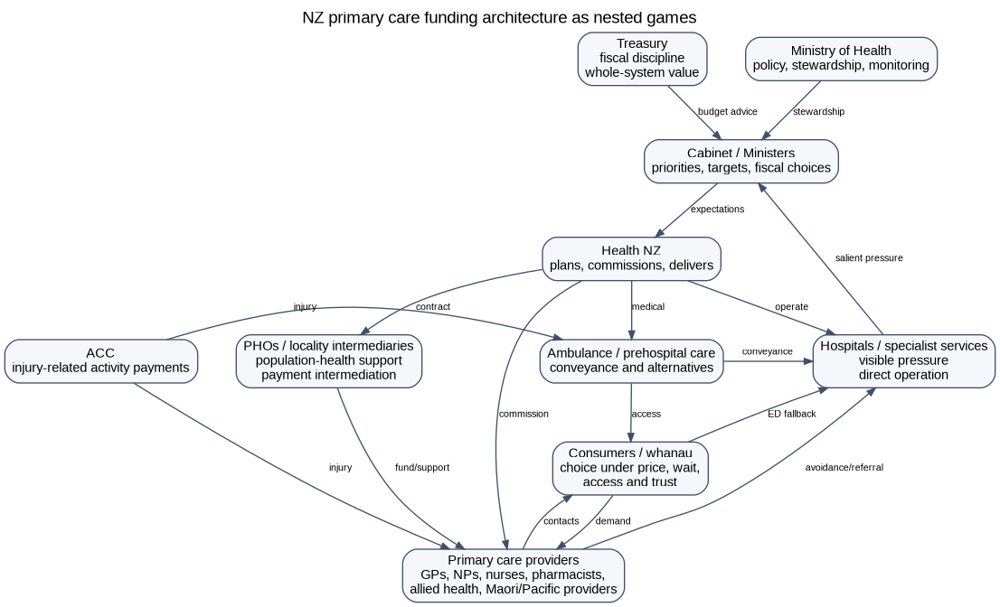

# New Zealand primary care, ambulance and hospital funding: broader game-theoretic map

## Status

This document maps the New Zealand policy problem as a nested set of games. Earlier versions contained a core payoff scaffold. This version explicitly maps the broader policy problem: primary care, ambulance/prehospital care, Health NZ budget competition, PHO intermediation, capitation, professional scope constraints, consumer co-payment behaviour, health targets, ACC spillovers, telehealth and hospital pressure.

It is a policy-modelling framework, not proof. Its purpose is to make the hypothesised mechanisms explicit enough to test with simulation modelling, qualitative evidence and administrative data.

## One-sentence thesis

New Zealand may be tightly managing activity and expenditure in lower-cost upstream sectors - primary care, urgent care and ambulance/prehospital care - in ways that unintentionally channel unmet demand into the higher-cost, more visible hospital system.

## Central game-theoretic claim

The problem is not one simple game. It is a nested repeated game with multiple principals, multiple agents, incomplete information, asymmetric political salience, weakly observed upstream failure and strong hospital-rescue incentives.

The key equilibrium risk is:

> Tight upstream control + weak marginal supply incentives + provider/professional entry barriers + high co-payment/waiting costs -> delayed or displaced care -> visible hospital and ambulance pressure -> hospital rescue funding -> continued upstream constraint.

This can be described as **hospital-rescue dominance**.



## Public-policy anchors

1. The current NZ capitation reweighting work is a technical allocation exercise, not a fundamental redesign of the primary care funding model.
2. The Health and Disability System Review recommended more flexible Tier 1 arrangements, including moving away from mandatory PHO contracting and increasingly paying providers directly through new commissioning arrangements.
3. Health NZ is responsible for planning and commissioning hospital, primary and community health services, which creates an institutional setting where visible hospital pressure and upstream access constraints are in the same broader system but may not have equal salience.
4. A new primary care access target and National Primary Care Dataset are being introduced, but targets alone do not generate supply unless the funding and workforce architecture make additional contacts viable.
5. Ambulance services are commissioned by Health NZ and ACC. Ambulance performance is measured, but ambulance alternatives to ED conveyance need to be treated as access infrastructure rather than just transport operations.

## Map of actors

| Actor | Formal role in the model | Main incentives | Information problem |
|---|---|---|---|
| Ministers / Cabinet | Political principal | visible access, fiscal discipline, hospital stability, election risk | upstream failure is less visible than hospital failure |
| Treasury | fiscal/value principal | whole-of-Crown exposure, value for money, macro-fiscal control | siloed health cost shifts may be hard to see |
| Ministry of Health | steward, policy adviser, monitor | system settings, equity, performance, advice quality | limited operational visibility unless datasets mature |
| Health NZ | commissioner and hospital operator | meeting targets, controlling deficits, delivering hospitals, commissioning services | dual role creates asymmetric salience: hospitals are direct and visible |
| ACC | injury funder and purchaser | claims cost, injury rehabilitation, scheme sustainability | constrained ACC FFS may affect general primary care supply |
| PHOs/locality intermediaries | contract/payment/data/support intermediaries | organisational survival, coordination, programme delivery | transaction costs and margins may be opaque |
| Primary care providers | supply agents | viability, workload, professional autonomy, patient care, risk | demand/unmet need observed locally but not always nationally |
| Pharmacists/NPs/allied health/Maori/Pacific providers | potential supply entrants | scope utilisation, viability, patient access | funding may not follow scope capability |
| Ambulance/paramedic providers | prehospital access agents | response, conveyance, safety, workforce capacity | alternative pathways may be underfunded or unavailable |
| Hospitals/ED | visible pressure domain | throughput, safety, target performance, deficit control | demand appears unavoidable once it arrives |
| Patients/whanau | consumers and voters | access, price, continuity, cultural safety, travel, trust | may lack clear signals about appropriate pathway |

## Core repeated game

### Sequence

1. Government and Health NZ set budget architecture and targets.
2. Health NZ allocates attention and resources across hospitals, primary/community care, ambulance and other priorities.
3. Primary/urgent/ambulance providers decide whether to expand, maintain or ration supply.
4. Consumers decide whether to seek early care, delay, use telehealth, call ambulance or attend ED.
5. Unmet need either resolves, worsens or appears as ambulance/ED/hospital demand.
6. Hospital pressure becomes politically visible.
7. Government responds with hospital rescue, upstream reform or both.
8. The next period begins with changed baselines, expectations and provider viability.

### Simplified dynamic

```text
hospital_pressure_t = baseline_hospital_demand_t
                      + alpha * unmet_primary_need_t
                      + beta * ambulance_conveyance_t
                      - gamma * upstream_resolution_t

unmet_primary_need_t = need_t - accessible_upstream_contacts_t

accessible_upstream_contacts_t = f(provider_FTE,
                                   scope_eligible_providers,
                                   marginal_payment,
                                   co_payment,
                                   wait,
                                   rurality,
                                   transaction_cost,
                                   governance)
```

### Equilibrium risk

If hospital pressure has a high immediate political penalty and upstream access failure has a low immediate political penalty, the rational repeated-game response is to protect hospital delivery first. This can persist even if upstream investment would be more efficient over the long run.

## Game 1: Hospital-rescue budget allocation game

**Game type:** repeated budget allocation; salience game; common-pool resource problem.

**Players:** Government, Treasury, Ministry of Health, Health NZ, hospitals, primary/community/ambulance sectors.

**Logic:** Hospitals are visible, politically salient and directly operated. Upstream access failure is dispersed, partly privately absorbed and often only becomes visible after delayed care appears as ED attendance, ambulance conveyance or admission.

**Equilibrium risk:** hospital-rescue dominance.

**Policy lever:** lift primary care and ambulance KPIs to hospital-equivalent top-tier accountability and create a rules-based upstream benefits schedule.

## Game 2: Capitation marginal-supply game

**Game type:** principal-agent problem; marginal-cost game.

**Players:** Health NZ/PHO, primary care provider, patient.

**Logic:** Under dominant capitation, the marginal public payment for an additional clinically necessary contact can be weak or zero. If marginal cost exceeds marginal revenue, providers rationally ration access, close books, raise co-payments, shorten visits or exit.

**Equilibrium risk:** reweighting improves allocation but does not necessarily expand supply.

**Policy lever:** retain capitation for continuity and baseline viability, but add contact-type benefits for defined primary, urgent and prehospital contacts.

## Game 3: PHO intermediation and transaction-cost game

**Game type:** transaction-cost economics; intermediation; principal-agent problem.

**Players:** Health NZ, PHOs/locality intermediaries, practices, new entrants, patients.

**Logic:** PHOs may add value through equity, data, locality support and quality improvement, but payment intermediation may create transaction costs, opacity and barriers to entry.

**Equilibrium risk:** useful PHO functions become bundled with payment gatekeeping.

**Policy lever:** separate PHO/locality support functions from mandatory payment gateway functions.

## Game 4: Primary Care Benefits Schedule mechanism-design game

**Game type:** mechanism design with audit and anti-gaming.

**Players:** Government, Health NZ, providers, patients, auditors.

**Logic:** A demand-driven benefit schedule can generate supply, but must be controlled at the transaction level: eligible contact type, scope, credentialing, clinical governance, data, audit, co-payment and equity settings.

**Equilibrium sought:** regulated supply expansion rather than uncontrolled low-value volume.

**Policy lever:** define benefits for contact types, not professional guilds; audit outliers; monitor access, safety and equity.

## Game 5: Professional-scope and guild game

**Game type:** coalition game; entry-barrier game.

**Players:** professional groups, regulators, payment system, providers, patients.

**Logic:** Funding architecture can impose professional constraints beyond legal scope. If public benefits can be generated only through a traditional GP-centred enrolment model, pharmacists, nurse practitioners, physiotherapists, paramedics, psychologists, Maori/Pacific providers and community providers may be underused.

**Equilibrium risk:** GP bottleneck and underused workforce.

**Policy lever:** claimable activity should be based on contact type + scope + credentialing + governance, not profession alone.

## Game 6: Consumer co-payment and pathway game

**Game type:** price/congestion game; equity mechanism-design problem.

**Players:** patients/whanau, primary/urgent care providers, ED/ambulance, funders.

**Logic:** Co-payment can be a demand signal, but it can also become an equity failure mechanism. Patients respond to price, waiting time, travel, trust, continuity and perceived urgency.

**Equilibrium risk:** delayed care and ED fallback for price-sensitive or access-constrained patients.

**Policy lever:** co-payment calibration with exemptions, caps or higher public benefits for high-need groups and priority contact types.

## Game 7: Ambulance conveyance and alternative-pathway game

**Game type:** liability game; queueing game; payment-incentive game.

**Players:** ambulance providers, paramedics, Health NZ, ACC, EDs, primary/urgent care providers, patients.

**Logic:** If ED conveyance is the safest funded and legally defensible pathway, conveyance becomes the default even when an alternative pathway could be safe and lower cost.

**Equilibrium risk:** ambulance becomes a hospital-demand channel rather than hospital-avoidance infrastructure.

**Policy lever:** fund hear-and-treat, treat-and-refer, alternative destination and community follow-up pathways, with safety monitoring.

## Game 8: ACC primary-care spillover game

**Game type:** dual-funder externality game.

**Players:** ACC, Health NZ, practices, patients, Treasury.

**Logic:** ACC injury-care payments may act as an activity-sensitive revenue stream inside the primary care market. This may stabilise practice viability and appointment capacity, including capacity used by non-injury patients.

**Equilibrium risk:** ACC cost control in isolation unintentionally reduces broader primary care supply.

**Policy lever:** assess ACC policy changes through whole-system modelling, not ACC-only fiscal logic.

## Game 9: Telehealth adverse-selection game

**Game type:** adverse selection; two-sided platform game.

**Players:** telehealth providers, local practices, patients, Health NZ, PHOs.

**Logic:** Telehealth can extend access. But if scalable telehealth captures low-complexity contacts while local practices are left with complex, frailty, procedural and rural in-person work, local viability can worsen.

**Equilibrium risk:** low-complexity capture and local in-person erosion.

**Policy lever:** integrate telehealth with local care, continuity and rural/in-person loadings.

## Game 10: KPI and target-gaming game

**Game type:** audit game; signalling game; multi-tasking problem.

**Players:** Ministers, Health NZ, providers, auditors, public.

**Logic:** A single seven-day appointment target can focus attention, but it can also produce metric-management behaviour if not paired with quality, continuity, co-payment, equity and hospital-avoidance measures.

**Equilibrium risk:** reported target improvement without true capacity improvement.

**Policy lever:** use a balanced scorecard with audited definitions and patient-reported access.

## Game 11: Equity and Te Tiriti constraint game

**Game type:** distributional mechanism design; risk-selection game.

**Players:** Maori/iwi providers, Pacific providers, high-needs communities, funders, mainstream providers.

**Logic:** A demand-driven benefit stream can expand supply, but can reward easy volume unless equity is designed into the mechanism.

**Equilibrium risk:** average access improves while inequity worsens.

**Policy lever:** equity-weighted benefits, low/zero co-payments for priority contacts, and support for kaupapa Maori and Pacific provision.

## Game 12: Political-economy bargaining game

**Game type:** bargaining; rent-seeking; coalition game.

**Players:** political parties, Health NZ, PHOs, professional colleges, GP owners, unions, pharmacists, nurses, ambulance providers, patient groups.

**Logic:** Organised actors will perceive winners and losers. A narrow GP-income framing will be attacked as a money grab. A patient-access and system-design framing can build a broader coalition.

**Equilibrium risk:** incremental capitation reweighting and targets are chosen because they are administratively safer than architecture reform.

**Policy lever:** frame reform as non-partisan, patient-linked, rules-based access architecture.

## Normal-form matrix: capitation versus contact benefits

| Funder architecture | Provider rations supply | Provider maintains supply | Provider expands supply |
|---|---|---|---|
| Tight capitation / contract control | Funder short-term cost control; long-run hospital pressure. Provider protected from overload. Patients lose. | Provider absorbs cost; burnout risk. Patients somewhat protected. | Provider loses financially unless cross-subsidised. Not stable. |
| Reweighted capitation only | Distribution improves, but marginal supply remains weak. | Better allocation for high-need populations, but access may remain constrained. | Expansion depends on workforce and co-payment, not the public marginal signal. |
| Contact benefits plus capitation | Rationing less attractive if benefits exceed marginal cost. | Stable access more likely. | Expansion becomes rational where benefit + co-payment + professional value exceeds marginal cost and risk. |

## Formal modelling skeleton

Let:

```text
D_t = underlying primary/urgent/pre-hospital demand in period t
Q_t = accessible lower-cost contacts supplied
U_t = max(0, D_t - Q_t) = unmet or delayed need
H_t = hospital pressure
A_t = ambulance conveyance pressure
B_j = public benefit for eligible contact type j
p_j = patient co-payment for contact type j
c_ij = marginal cost to provider i of delivering contact j
g_ij = governance/scope eligibility indicator
r_i = risk/liability/admin cost for provider i
```

Provider i supplies contact type j where:

```text
B_j + p_j + v_ij - c_ij - r_i > 0 and g_ij = 1
```

Under dominant capitation, for many additional contacts after enrolment:

```text
B_j approximately equals 0
```

Hospital pressure evolves as:

```text
H_(t+1) = rho * H_t + alpha * U_t + beta * A_t - gamma * V_t
```

where V_t is effective upstream hospital avoidance.

## Mechanism-design implications

A Primary Care Benefits Schedule should be constrained at the transaction level:

1. Eligible contact type: urgent, complex, procedural, chronic review, rural in-person, after-hours, pharmacist medicines review, ambulance treat-and-refer, etc.
2. Provider scope: claimable only where provider scope, credentialing, standing orders or prescribing/referral rights permit.
3. Clinical governance: audit, protocols, escalation pathways and adverse event monitoring.
4. Co-payment rules: demand signal with caps, exemptions and equity protections.
5. Data reporting: encounter type, provider type, patient characteristics, time-to-care, outcome, co-payment, referral/conveyance.
6. Anti-gaming: outlier detection, repeat-contact review, low-value-contact rules, quality and continuity metrics.
7. Hospital-avoidance evaluation: ED, admissions, ambulance conveyance, ambulatory-sensitive hospitalisations and patient-reported unmet need.

## What would falsify the hypothesis?

The theory should be weakened if:

- reweighted capitation alone materially improves waits, open books, rural in-person access and co-payment burden;
- broader scope-based provider eligibility does not increase supply;
- direct benefits payment does not reduce transaction costs or improve entry;
- PHO intermediation demonstrably improves access and equity at lower total transaction cost than direct payment alternatives;
- ambulance alternative pathways do not reduce avoidable ED conveyance or hospital pressure;
- top-tier primary/ambulance KPIs do not change resource allocation or operational focus;
- co-payment settings cannot be made compatible with equity.

## Policy interpretation

The shortest statement of the game-theoretic result is:

> Capitation reweighting may improve who gets the existing primary care funding, but it does not necessarily change the game that determines whether lower-cost primary, urgent and ambulance care can expand fast enough to prevent hospital growth.

The policy intervention is not simply more money. It is a change in the rules of the game:

> Define eligible lower-cost contacts; allow accredited providers within scope to deliver them; fund them through a transparent patient-linked claims platform; calibrate co-payments with equity safeguards; and hold primary care and ambulance to hospital-equivalent accountability.
