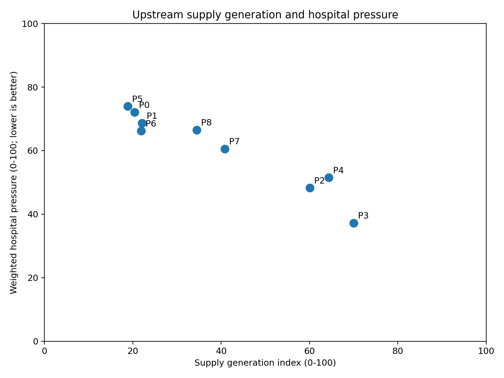
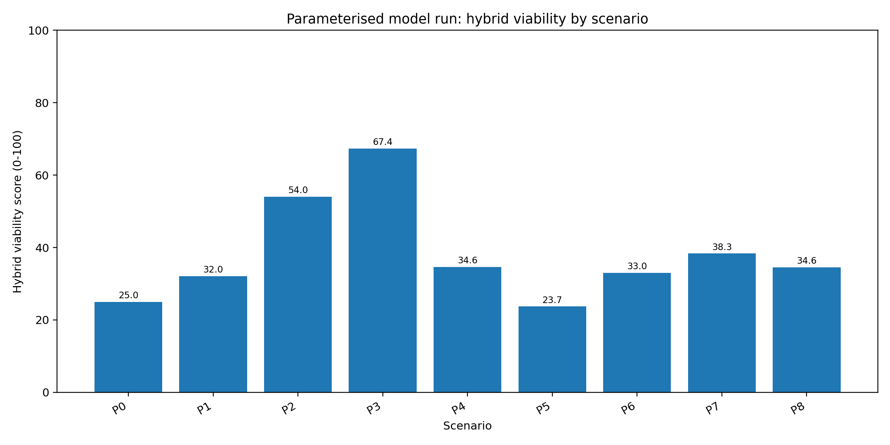
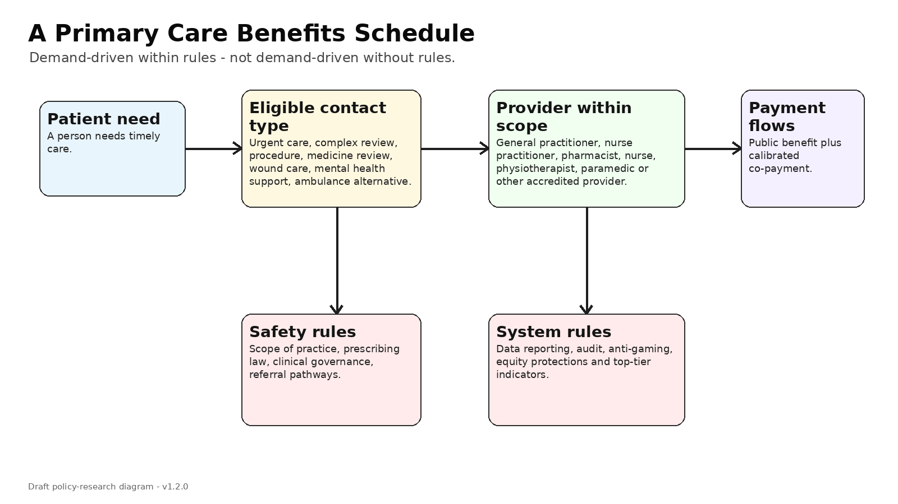
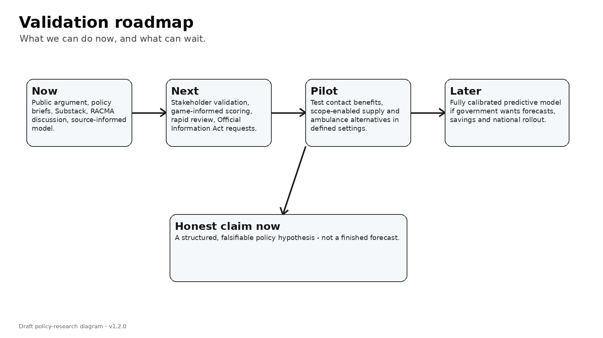

# The Primary Care Funding Game - complete Substack draft pack v1.2.0

---
title: "Why primary care funding is not just about more money"
series: "The Primary Care Funding Game"
post_number: 1
version: "1.2.0"
status: "Substack-ready draft"
owner: "Dylan A Mordaunt"
readability_target: "Readable for a 14-year-old interested reader; technical terms explained in plain English."
voice_note: "Drafted to sound candid, systems-minded, non-partisan, slightly contrarian, careful with uncertainty, and clinically grounded."
---

# Why primary care funding is not just about more money

**One-line version:** The deeper question is not only how much money goes into primary care, but what the rules make possible.

I want to make an argument that is easy to misunderstand, so I will start with what I am **not** saying.

I am not saying hospitals are bad.

I am not saying general practitioners should simply be paid more for doing the same thing.

I am not saying New Zealand should copy Australia.

And I am not saying every problem in primary care can be solved with a new payment code.

What I am saying is simpler, and I think more important.

A health system can spend a lot of time trying to control costs in the cheaper parts of care, then accidentally buy growth in the expensive part.

That sounds strange, but it is not complicated. If people cannot get timely care from a local clinician, the health problem does not vanish. It waits. It worsens. It gets handled over the phone when it really needed examination. It becomes an ambulance call. It becomes an emergency department visit. Sometimes it becomes an admission.

By the time that happens, the need is visible. It is urgent. It is politically hard to ignore. And because it is visible, the hospital system gets rescued.

The earlier missed appointment is much less visible.

That is the funding architecture problem.

## What is funding architecture?

Funding architecture just means the rules for how money moves through the health system.

It includes questions like:

- Who gets paid?
- What are they paid for?
- Is the payment fixed, or does it grow when more care is delivered?
- Does the money go directly to the provider, or through an intermediary?
- Can different health professionals generate funded care, or only one professional group?
- Are rural and in-person services protected?
- Are ambulance services funded to treat and refer, or mostly to transport people to hospital?
- Are the main performance targets focused only on hospitals, or also on the earlier parts of care?

These questions matter because funding is not just accounting. Funding is a set of signals. It tells a practice whether it is safe to open its books. It tells a pharmacist whether it is viable to deliver a service. It tells a nurse practitioner whether a clinic can afford to use their full scope. It tells ambulance services whether the safest funded pathway is always the emergency department.

## The New Zealand issue

New Zealand general practice is mainly funded through **capitation**. Capitation means a fixed payment for each enrolled patient. [The Ministry of Health says capitation was introduced in 2002 and remains the core way general practice is funded.](https://www.health.govt.nz/strategies-initiatives/programmes-and-initiatives/primary-and-community-health-care/capitation-reweighting) The formula is being reweighted so that it better reflects factors such as age, sex, multimorbidity, rurality and deprivation. That is important.

But there is a bigger question.

Reweighting capitation asks: **how should the existing capitation pool be distributed more fairly?**

The question I am interested in asks: **what if the overall architecture is constraining supply?**

Those are not the same question.

Imagine a clinic has already enrolled a patient. The patient needs one more appointment. That appointment requires time, staff, space, notes, risk, follow-up and sometimes a procedure. Under a strongly fixed-payment model, the next piece of work may bring little extra income to cover the extra cost.

That does not mean capitation is bad. It means capitation has a limit.

Capitation is good for continuity, population care and predictability. It is less good at funding the next clinically necessary contact when the system is already stretched.

## The public signs are already there

[The 2023/24 New Zealand Health Survey reported that time taken to get an appointment was the most common barrier to visiting a general practitioner.](https://www.health.govt.nz/publications/annual-update-of-key-results-202324-new-zealand-health-survey) It reported that one in four adults had this barrier, and one in six adults did not visit a general practitioner because of cost.

[At the same time, the Ministry of Health is introducing a primary care health target.](https://www.health.govt.nz/strategies-initiatives/programmes-and-initiatives/primary-and-community-health-care/primary-care-health-target) The proposed target is that more than 80 percent of people can access an appointment with a general practice provider within one week.

That target is useful. But a target does not create appointments by itself.

If the funding model does not make the next safe contact viable, the target becomes pressure without capacity.

## The uncomfortable possibility

The uncomfortable possibility is this:

New Zealand may be tightly managing the cheaper parts of the system - primary care, urgent care, and ambulance alternatives to hospital - in a way that channels growth into hospitals.

This is not because hospital leaders are doing anything wrong.

Hospitals are where visible system failure lands.

The person who could not get seen early becomes the person waiting in the emergency department. The minor illness becomes the admission. The delayed review becomes the crisis. The lack of local in-person care becomes the ambulance call.

Once that happens, the system has to respond.

## The direction I think we should test

The answer is not simply to abandon capitation. Nor is it to copy a pure fee-for-service system.

The answer is probably a deliberate hybrid model:

- keep capitation for continuity, enrolment and population health;
- keep targeted programmes for chronic disease and high-need groups;
- add a rules-based primary care benefit for defined contact types;
- allow a wider range of accredited providers to generate care within their scope;
- protect equity through co-payment rules;
- make primary care and ambulance outcomes top-tier performance measures;
- use data and audit to prevent gaming.

The key phrase is:

> **Demand-driven within rules; not demand-driven without rules.**

That means the system should not tightly cap upstream care and then be surprised when hospitals grow. But it also should not open a blank cheque for low-value activity.

## Why this series exists

This series is my attempt to explain the idea in plain English.

It will cover funding models, capitation, fee-for-service, Primary Health Organisations, Accident Compensation Corporation funding, ambulance, co-payments, professional scopes, game theory and decision-making.

That sounds technical. But the basic idea is not.

The basic idea is this:

> If we want people to get the right care early, the rules have to make early care possible.

**Important caveat:** this series is not claiming that a fully calibrated national forecasting model already exists. The model I am using here is a structured, source-informed way to test the logic of the problem. It is useful for policy discussion. It should not be used to claim exact savings or exact reductions in hospital demand without further data and validation.

## Sources and further reading
- [Ministry of Health: Capitation reweighting](https://www.health.govt.nz/strategies-initiatives/programmes-and-initiatives/primary-and-community-health-care/capitation-reweighting) — Public description of New Zealand capitation funding and the 2026 reweighting.
- [Ministry of Health briefing: Sapere report and re-weighting primary care capitation funding](https://www.health.govt.nz/system/files/2025-10/Briefing-Sapere-report-and-re-weighting-primary-care-capitation-funding-H2024057558.pdf) — States the work was a technical analysis of capitation variables and did not consider fundamental changes to the overall primary care funding model.
- [Ministry of Health: Primary care health target](https://www.health.govt.nz/strategies-initiatives/programmes-and-initiatives/primary-and-community-health-care/primary-care-health-target) — Proposed target that more than 80% of people can access a general practice provider appointment within one week, taking effect from 1 July 2026.
- [Ministry of Health: 2023/24 New Zealand Health Survey key results](https://www.health.govt.nz/publications/annual-update-of-key-results-202324-new-zealand-health-survey) — Reports barriers to general practitioner access, cost barriers, and emergency department use.
- [Health New Zealand: National Primary Care Dataset](https://www.healthnz.govt.nz/about-us/what-we-do/planning-and-performance/primary-care-tactical-action-plan/national-primary-care-dataset-and-new-primary-care-health-target) — Dataset to collect general practice encounter and appointment information, beginning with appointment booking, date seen and outcome.

---

---
title: "Fee-for-service, capitation and blended funding: a plain-English guide"
series: "The Primary Care Funding Game"
post_number: 2
version: "1.2.0"
status: "Substack-ready draft"
owner: "Dylan A Mordaunt"
readability_target: "Readable for a 14-year-old interested reader; technical terms explained in plain English."
voice_note: "Drafted to sound candid, systems-minded, non-partisan, slightly contrarian, careful with uncertainty, and clinically grounded."
---

# Fee-for-service, capitation and blended funding: a plain-English guide

**One-line version:** No funding model is perfect. The trick is to use each one for what it does well.

Health funding debates often sound more complicated than they need to.

A lot of the argument comes down to three simple questions.

Do we pay for a person being enrolled?

Do we pay each time care is delivered?

Or do we pay for a planned programme of care?

Each answer creates different behaviour.

That is why funding models matter.

## 1. Capitation: paying for the enrolled person

**Capitation** means a provider receives a fixed payment for each enrolled person.

In New Zealand, capitation is the core way general practice is funded. A clinic receives a fixed amount each year for each enrolled patient. The public idea is sensible: the practice has responsibility for a population, not just one-off visits.

Capitation can support:

- continuity of care;
- planning for a known enrolled population;
- prevention;
- budget predictability;
- equity, if the formula properly weights higher-need groups.

But capitation has a weakness.

Once a patient is enrolled, the next appointment still costs time and money. If the patient needs another review, a longer visit, wound care, a medicine check, urgent assessment or complex follow-up, the practice has to provide the work. But the payment may not change much.

That creates what economists call a **marginal problem**.

Marginal just means **the next one**.

The next appointment. The next home visit. The next complex review. The next urgent slot.

If the next piece of work costs more than the next payment, a stretched provider will eventually ration care. Not necessarily by saying no. More often through waiting, closed books, shorter appointments, higher patient charges, or shifting care to cheaper modes such as phone or video.

## 2. Fee-for-service: paying for the contact

**Fee-for-service** means a provider is paid when a service is delivered.

That service might be a consultation, procedure, assessment, medicine review or treatment.

The strength of fee-for-service is obvious: it creates a payment signal for activity. If patients need more care and providers can safely supply it, funding can flow.

That is useful when the problem is access.

But fee-for-service also has a weakness. If it is badly designed, it can reward volume rather than value. It can encourage more visits, more billing and more fragmented care. It can also make public expenditure harder to control.

So I do not think the answer is simply “more fee-for-service”.

I think the answer is: use activity-based payments where activity is actually what the system needs.

That includes timely access, urgent care, procedures, rural in-person care, complex care, care delivered by a wider workforce, and safe alternatives to hospital.

## 3. Programme funding: paying for a planned activity

Programme funding means money is attached to a specific goal or group.

For example:

- diabetes care;
- heart disease management;
- immunisation;
- mental health support;
- care coordination;
- outreach for high-need groups.

Programme funding can be excellent. It says: this work matters, so we are going to fund it deliberately.

But it can also become narrow. Providers may end up with many small funding streams, each with its own rules, forms, reporting and eligibility. A system can become full of tiny gates.

That matters because clinicians do not experience funding streams as tidy policy ideas. They experience them as admin, eligibility checks, audit risk and time away from patients.

## The evidence direction

[The Australian Journal of General Practice has a useful explainer on funding models.](https://www1.racgp.org.au/ajgp/2024/december/understanding-general-practice-funding-models-in-a) It says common models include fee-for-service, capitation, pay-for-performance and bundled payments. It also says blended models can reduce the downsides of any single model, though they add complexity.

That is exactly the point.

[A Cochrane review of payment methods in outpatient care found that payment methods can affect provider behaviour, although the evidence on patient outcomes and unintended effects is less certain.](https://www.cochrane.org/evidence/CD011865/payment-methods-healthcare-providers-outpatient-healthcare-settings)

So the question is not: which model is morally superior?

The question is: which blend creates access, continuity, equity and sustainability?

## Why blended funding makes sense

A blended model lets each payment do a different job.

Capitation can pay for the enrolled population and continuity.

Fee-for-service or contact-based benefits can pay for the next clinically necessary contact.

Programme funding can pay for planned care that needs structure.

Quality and outcome measures can discourage gaming and low-value activity.

Equity protections can stop co-payments becoming the reason people miss care.

Data can show whether the system is actually improving.

## The key mistake to avoid

The mistake is treating capitation and fee-for-service as if one must win.

They solve different problems.

Capitation is better at saying: **you are responsible for this population.**

Fee-for-service is better at saying: **the next piece of work is worth doing.**

Programme funding is better at saying: **this particular problem needs planned attention.**

A modern primary care system needs all three.

The real policy challenge is not choosing a favourite. It is designing the blend.

**Important caveat:** this series is not claiming that a fully calibrated national forecasting model already exists. The model I am using here is a structured, source-informed way to test the logic of the problem. It is useful for policy discussion. It should not be used to claim exact savings or exact reductions in hospital demand without further data and validation.

## Sources and further reading
- [Australian Journal of General Practice: Understanding general practice funding models in Australia and beyond](https://www1.racgp.org.au/ajgp/2024/december/understanding-general-practice-funding-models-in-a) — Explains fee-for-service, capitation, pay-for-performance, bundled payments and blended models.
- [Cochrane Review: Payment methods for healthcare providers in outpatient healthcare settings](https://www.cochrane.org/evidence/CD011865/payment-methods-healthcare-providers-outpatient-healthcare-settings) — Summarises evidence that payment methods can affect provider behaviour, with uncertainty on health outcomes.
- [Ministry of Health: Capitation reweighting](https://www.health.govt.nz/strategies-initiatives/programmes-and-initiatives/primary-and-community-health-care/capitation-reweighting) — Public description of New Zealand capitation funding and the 2026 reweighting.
- [OECD: Do financial incentives to providers improve performance?](https://www.oecd.org/en/publications/how-do-health-system-features-influence-health-system-performance_7b877762-en/full-report/do-financial-incentives-to-providers-improve-performance_1ea7bce9.html) — Discusses payment incentives, including mixed payment schemes.
- [Australian Government: Review of General Practice Incentives - Expert Advisory Panel report](https://www.health.gov.au/resources/publications/review-of-general-practice-incentives-expert-advisory-panel-report-to-the-australian-government?language=en) — Final report with proposed new funding architecture for Australian primary care practices.

---

---
title: "Why capitation can be fair and still constrain supply"
series: "The Primary Care Funding Game"
post_number: 3
version: "1.2.0"
status: "Substack-ready draft"
owner: "Dylan A Mordaunt"
readability_target: "Readable for a 14-year-old interested reader; technical terms explained in plain English."
voice_note: "Drafted to sound candid, systems-minded, non-partisan, slightly contrarian, careful with uncertainty, and clinically grounded."
---

# Why capitation can be fair and still constrain supply

**One-line version:** A better capitation formula may improve fairness, but it may not create the next appointment.

Capitation has a lot going for it.

It is not a silly idea. It is not a bad idea. And I do not think New Zealand should simply throw it away.

Capitation means a provider gets a fixed payment for each enrolled person. The idea is that a clinic is responsible for a population, not just for billing individual visits.

That matters. A good health system should care about continuity, prevention and long-term relationships.

So why am I worried?

Because a fairer capitation formula can still leave the system short of actual appointments.

## The difference between allocation and supply

This is the key distinction.

**Allocation** asks: how should money be shared between providers?

**Supply** asks: how much care can the system actually deliver?

New Zealand is doing important work on allocation. [The Ministry of Health says the capitation formula is being reweighted to better account for factors such as age, sex, multimorbidity, rurality and socio-economic deprivation.](https://www.health.govt.nz/strategies-initiatives/programmes-and-initiatives/primary-and-community-health-care/capitation-reweighting)

That is a real improvement.

But a reweighted formula may still be a fixed-payment formula.

It can shift money from one enrolled population to another. It can better reflect need. It can reduce unfairness.

But it does not automatically fund the next extra contact.

## The next appointment problem

Imagine a practice has already enrolled a patient.

That patient develops a new problem. They need another appointment. Maybe it is complex. Maybe it takes longer. Maybe it needs a nurse, a general practitioner, a pharmacist and follow-up calls. Maybe it is not dramatic enough for hospital, but it is very real.

The practice has to supply time, staff, rooms, technology, records, notes, risk management and follow-up.

If the payment for that extra contact is small or absent, then the extra appointment becomes a cost.

A stretched clinic will still try to help. But over time, the system adapts.

It adapts by making patients wait.

It adapts by closing books.

It adapts by lifting patient charges.

It adapts by offering shorter appointments.

It adapts by shifting more work to phone or video.

None of those responses require anyone to be greedy or uncaring. They are what happens when demand rises but supply is tightly constrained.

## What the official material says

[The released briefing on the Sapere capitation work is very useful here.](https://www.health.govt.nz/system/files/2025-10/Briefing-Sapere-report-and-re-weighting-primary-care-capitation-funding-H2024057558.pdf) It says the work was a technical analysis of variables needed to improve the capitation formula. It also says it did **not** consider fundamental changes to the overall funding model for primary care.

That sentence matters.

It means the current work is asking: how do we improve the formula?

It is not fully asking: is the architecture itself creating supply constraints?

That is the question I think we need to add.

## The policy risk

If government sets an access target but mostly changes the capitation weights, the system may become fairer without becoming much more available.

The target might say people should be able to access an appointment within a week.

But targets do not answer the question:

Who creates the extra appointment?

Who pays for it?

Which professional can provide it?

Can it be local and in person?

Can ambulance services treat and refer instead of conveying to hospital?

Can a pharmacist, nurse practitioner, physiotherapist or paramedic safely deliver some of the funded contacts?

Can a new provider enter the market without needing to pass through old payment gateways?

These are supply questions.

## Why this is not anti-capitation

It is tempting to turn this into a fight: capitation versus fee-for-service.

That is not the right argument.

Capitation should probably remain. It is useful for continuity, enrolment and population accountability.

But it should not be asked to do everything.

If you use capitation to pay for population responsibility, and then expect it also to solve urgent access, complex care, rural in-person services, scope expansion, procedures and ambulance alternatives, you are asking one tool to do too many jobs.

## The better question

The better question is:

> What should capitation pay for, and what should be paid for separately?

My answer is:

Capitation should help pay for the baseline relationship.

A Primary Care Benefits Schedule should help pay for defined contacts that the system wants to make available.

Programme funding should support planned long-term care.

And data, audit and equity rules should keep the system honest.

That is not capitation versus fee-for-service.

It is capitation plus the missing marginal payment.

Or in plain English:

> Pay for having patients on the books, but also make it viable to see them when they need care.

**Important caveat:** this series is not claiming that a fully calibrated national forecasting model already exists. The model I am using here is a structured, source-informed way to test the logic of the problem. It is useful for policy discussion. It should not be used to claim exact savings or exact reductions in hospital demand without further data and validation.

## Sources and further reading
- [Ministry of Health: Capitation reweighting](https://www.health.govt.nz/strategies-initiatives/programmes-and-initiatives/primary-and-community-health-care/capitation-reweighting) — Public description of New Zealand capitation funding and the 2026 reweighting.
- [Ministry of Health briefing: Sapere report and re-weighting primary care capitation funding](https://www.health.govt.nz/system/files/2025-10/Briefing-Sapere-report-and-re-weighting-primary-care-capitation-funding-H2024057558.pdf) — States the work was a technical analysis of capitation variables and did not consider fundamental changes to the overall primary care funding model.
- [Ministry of Health: Primary care health target](https://www.health.govt.nz/strategies-initiatives/programmes-and-initiatives/primary-and-community-health-care/primary-care-health-target) — Proposed target that more than 80% of people can access a general practice provider appointment within one week, taking effect from 1 July 2026.
- [Health New Zealand: National Primary Care Dataset](https://www.healthnz.govt.nz/about-us/what-we-do/planning-and-performance/primary-care-tactical-action-plan/national-primary-care-dataset-and-new-primary-care-health-target) — Dataset to collect general practice encounter and appointment information, beginning with appointment booking, date seen and outcome.
- [Australian Journal of General Practice: Understanding general practice funding models in Australia and beyond](https://www1.racgp.org.au/ajgp/2024/december/understanding-general-practice-funding-models-in-a) — Explains fee-for-service, capitation, pay-for-performance, bundled payments and blended models.

---

---
title: "Why blended funding is not a blank cheque"
series: "The Primary Care Funding Game"
post_number: 4
version: "1.2.0"
status: "Substack-ready draft"
owner: "Dylan A Mordaunt"
readability_target: "Readable for a 14-year-old interested reader; technical terms explained in plain English."
voice_note: "Drafted to sound candid, systems-minded, non-partisan, slightly contrarian, careful with uncertainty, and clinically grounded."
---

# Why blended funding is not a blank cheque

**One-line version:** The goal is to create supply without creating low-value volume.

Whenever I argue for more activity-sensitive primary care funding, there is an obvious criticism.

Does this just mean opening the floodgates?

Does this just mean paying for more visits, more billing and more low-value care?

That criticism is fair. It is exactly why the model needs rules.

The point is not to make primary care completely unrestricted.

The point is to make it **demand-driven within rules**.

## The wrong version

The wrong version would be simple.

Create a long list of services. Let anyone bill anything. Add weak data. Add weak audit. Do not protect equity. Do not define what counts as appropriate care. Do not measure outcomes.

That would probably improve access on paper.

It would also risk waste, gaming, fragmented care and higher costs.

That is not the model I am proposing.

## The better version

The better version defines what the public system is actually willing to support.

A primary care benefit should be tied to a contact type, not just a professional title.

For example:

- same-day urgent assessment;
- complex multimorbidity review;
- wound care;
- medicines review;
- mental health brief intervention;
- minor procedure;
- rural in-person consultation;
- after-hours care;
- ambulance treat-and-refer pathway;
- care coordination for high-risk patients.

Each contact type would need rules.

Who can provide it?

What scope of practice is required?

What notes are needed?

When is referral required?

Can it be delivered by video, or must it be in person?

What is the patient co-payment?

What data must be reported?

What would trigger audit?

## Why this is still market-like

The model is more open than a tightly controlled fixed budget.

If patients need care, and accredited providers can safely supply it, public funding can flow.

That matters because New Zealand’s current problem is not only how money is allocated. It is whether the architecture lets supply expand at all.

A new nurse practitioner-led service should be able to provide eligible care if it meets safety and reporting rules.

A pharmacist should be able to generate funded care for contact types that fit pharmacy scope and governance.

A rural paramedic service should be able to avoid unnecessary emergency department conveyance if there is a safe funded pathway.

A physiotherapist should be able to manage defined musculoskeletal presentations where that is clinically appropriate.

The funding should follow the safe contact, not only the old organisational form.

## Why this is not pure fee-for-service

Fee-for-service usually means a payment for each service delivered.

That can be useful because it supports supply.

But if it is too broad, it can reward volume even when the volume is not useful.

A Primary Care Benefits Schedule is narrower.

It would say: these contact types matter; these providers can deliver them within scope; these rules apply; these co-payment protections apply; these outcomes will be monitored.

So the activity signal exists, but it is not unlimited.

## What the modelling showed

The source-informed model in this project is not a prediction of exact effects. But it is useful as a logic test.

In the model, capitation reweighting alone improves the system modestly. A Primary Care Benefits Schedule improves access and hospital-pressure logic more strongly. The best-performing scenario is the full upstream architecture: benefits schedule, scope-enabled providers, ambulance alternatives, direct claiming, data, equity protections, and stronger top-tier indicators.

The warning scenario is also important.

Loose benefits with weak controls perform worse than a properly governed benefits schedule. That is because access improves, but fiscal, gaming and equity risks rise.

That is why the slogan matters:

> **Demand-driven within rules; not demand-driven without rules.**

## The policy challenge

This will sound pro-market to some people.

It will sound anti-market to others, because it still has rules, audit and equity protections.

That is probably a sign that it is in the right space.

The goal is not a free-for-all.

The goal is a system where safe upstream care can expand before hospitals become the only option.

That requires activity-sensitive funding.

It also requires governance.

One without the other is not enough.

**Important caveat:** this series is not claiming that a fully calibrated national forecasting model already exists. The model I am using here is a structured, source-informed way to test the logic of the problem. It is useful for policy discussion. It should not be used to claim exact savings or exact reductions in hospital demand without further data and validation.

## Sources and further reading
- [Australian Journal of General Practice: Understanding general practice funding models in Australia and beyond](https://www1.racgp.org.au/ajgp/2024/december/understanding-general-practice-funding-models-in-a) — Explains fee-for-service, capitation, pay-for-performance, bundled payments and blended models.
- [Cochrane Review: Payment methods for healthcare providers in outpatient healthcare settings](https://www.cochrane.org/evidence/CD011865/payment-methods-healthcare-providers-outpatient-healthcare-settings) — Summarises evidence that payment methods can affect provider behaviour, with uncertainty on health outcomes.
- [OECD: Do financial incentives to providers improve performance?](https://www.oecd.org/en/publications/how-do-health-system-features-influence-health-system-performance_7b877762-en/full-report/do-financial-incentives-to-providers-improve-performance_1ea7bce9.html) — Discusses payment incentives, including mixed payment schemes.
- [Australian Government: Review of General Practice Incentives - Expert Advisory Panel report](https://www.health.gov.au/resources/publications/review-of-general-practice-incentives-expert-advisory-panel-report-to-the-australian-government?language=en) — Final report with proposed new funding architecture for Australian primary care practices.
- [Ministry of Health: Capitation reweighting](https://www.health.govt.nz/strategies-initiatives/programmes-and-initiatives/primary-and-community-health-care/capitation-reweighting) — Public description of New Zealand capitation funding and the 2026 reweighting.

---

---
title: "The case for a National Primary Care Benefits Schedule"
series: "The Primary Care Funding Game"
post_number: 5
version: "1.2.0"
status: "Substack-ready draft"
owner: "Dylan A Mordaunt"
readability_target: "Readable for a 14-year-old interested reader; technical terms explained in plain English."
voice_note: "Drafted to sound candid, systems-minded, non-partisan, slightly contrarian, careful with uncertainty, and clinically grounded."
---

# The case for a National Primary Care Benefits Schedule

**One-line version:** Define the care we want, let accredited providers deliver it, and fund it directly with clear rules.

The simplest way to describe the proposal is this:

New Zealand should create a **National Primary Care Benefits Schedule**.

That sounds dry. It is not.

It is a way to change the rules of the game.

Instead of relying mostly on capitation, programme funding and Primary Health Organisation-mediated flows, the public system would define eligible primary care contact types. If a patient needs one of those contacts, and an accredited provider delivers it within scope, a public benefit can be paid.

The patient may still pay a co-payment, depending on the contact and their circumstances. But the public benefit would be clear, portable and rules-based.

## Why a benefits schedule?

A benefits schedule is a list of funded services or contact types.

[Australia’s Medicare Benefits Schedule is one example, though it has its own problems and should not simply be copied.](https://www.health.gov.au/resources/publications/review-of-general-practice-incentives-expert-advisory-panel-report-to-the-australian-government?language=en)

New Zealand already has another useful example: the Accident Compensation Corporation. For injury care, [the Accident Compensation Corporation uses regulations and contracts to define who can be paid, what can be paid for, and how payment works.](https://www.acc.co.nz/for-providers/invoicing-us/paying-patient-treatment)

That does not make Accident Compensation Corporation perfect. But it shows that New Zealand is not allergic to rules-based contact funding when timely episodes of care matter.

The question is whether non-injury primary care should have something similar.

## What would be funded?

The schedule should not be a random list of everything.

It should start with contacts that solve real system problems:

- urgent same-day or next-day primary care;
- complex care for people with several long-term conditions;
- rural in-person assessment;
- procedures and treatments that prevent escalation;
- wound care;
- medication review;
- mental health brief support;
- after-hours care;
- ambulance treat-and-refer;
- care coordination after hospital discharge;
- pharmacist, nurse practitioner, nurse, physiotherapist and paramedic contacts where clinically appropriate.

Each item should answer four questions.

First: what patient problem is this for?

Second: who can safely deliver it?

Third: what rules apply?

Fourth: what data must be reported?

## Why provider-neutral matters

A provider-neutral payment does not mean anyone can do anything.

It means the funding rule does not artificially limit care to one professional group if another professional can safely provide the contact.

Clinical scope still matters.

Prescribing law still matters.

Referral rules still matter.

Credentialing still matters.

Clinical governance still matters.

But the payment architecture should not create unnecessary bottlenecks.

For example, if a nurse practitioner can safely manage a defined urgent presentation, the funding should allow that. If a pharmacist can safely deliver a medicines review or minor acute service within scope, the funding should allow that. If a physiotherapist can safely assess a defined musculoskeletal problem, the funding should allow that.

This is not anti-doctor.

It is pro-access.

Doctors should be used where doctors add unique value. The same is true for every other profession.

## How capitation fits

Capitation would not disappear.

It would remain useful for continuity, baseline viability, enrolment and population health.

The benefits schedule would fill the missing gap: the next clinically necessary contact.

That is the piece capitation struggles with.

So the model becomes:

- capitation for the ongoing relationship;
- programme funding for planned chronic disease and high-need work;
- contact benefits for timely, defined, clinically necessary care;
- co-payment protections for equity;
- data and audit for safety and fiscal control.

## What problem does this solve?

It solves the supply problem directly.

A new provider does not need to wait for a complex local arrangement to provide every eligible contact. A rural service can be paid for contacts it actually delivers. A multidisciplinary team can use the right professional for the right job. Ambulance services can be funded for alternatives to emergency department conveyance.

The funding follows the patient contact.

That is the change.

## What could go wrong?

A lot, if the design is sloppy.

The schedule could become too complex.

It could create gaming.

It could privilege better-resourced providers.

It could worsen inequity if co-payments are not protected.

It could fragment care if data and continuity rules are weak.

It could create low-value activity if the funded contacts are poorly defined.

So the answer is not “just pay for contacts”.

The answer is to define contacts carefully and govern them properly.

## The public policy test

The test is this:

Would this contact keep care earlier, cheaper, safer, closer to home and more appropriate than the alternative?

If yes, it belongs in the schedule.

If no, it probably does not.

A National Primary Care Benefits Schedule is not a magic fix.

But it would change the default.

Instead of asking stretched primary care to absorb rising need inside fixed funding, it would make safe upstream activity visible and fundable.

That is the shift I think New Zealand needs to consider.

**Important caveat:** this series is not claiming that a fully calibrated national forecasting model already exists. The model I am using here is a structured, source-informed way to test the logic of the problem. It is useful for policy discussion. It should not be used to claim exact savings or exact reductions in hospital demand without further data and validation.

## Sources and further reading
- [Accident Compensation Corporation (ACC): Paying you for your services](https://www.acc.co.nz/for-providers/invoicing-us/paying-patient-treatment) — Describes Cost of Treatment Regulations, contracts, provider types and payment approaches.
- [Ministry of Health: Capitation reweighting](https://www.health.govt.nz/strategies-initiatives/programmes-and-initiatives/primary-and-community-health-care/capitation-reweighting) — Public description of New Zealand capitation funding and the 2026 reweighting.
- [Ministry of Health briefing: Sapere report and re-weighting primary care capitation funding](https://www.health.govt.nz/system/files/2025-10/Briefing-Sapere-report-and-re-weighting-primary-care-capitation-funding-H2024057558.pdf) — States the work was a technical analysis of capitation variables and did not consider fundamental changes to the overall primary care funding model.
- [Ministry of Health: Primary care health target](https://www.health.govt.nz/strategies-initiatives/programmes-and-initiatives/primary-and-community-health-care/primary-care-health-target) — Proposed target that more than 80% of people can access a general practice provider appointment within one week, taking effect from 1 July 2026.
- [Health New Zealand: National Primary Care Dataset](https://www.healthnz.govt.nz/about-us/what-we-do/planning-and-performance/primary-care-tactical-action-plan/national-primary-care-dataset-and-new-primary-care-health-target) — Dataset to collect general practice encounter and appointment information, beginning with appointment booking, date seen and outcome.
- [Australian Government: Review of General Practice Incentives - Expert Advisory Panel report](https://www.health.gov.au/resources/publications/review-of-general-practice-incentives-expert-advisory-panel-report-to-the-australian-government?language=en) — Final report with proposed new funding architecture for Australian primary care practices.

---

---
title: "Who should be allowed to generate primary care supply?"
series: "The Primary Care Funding Game"
post_number: 6
version: "1.2.0"
status: "Substack-ready draft"
owner: "Dylan A Mordaunt"
readability_target: "Readable for a 14-year-old interested reader; technical terms explained in plain English."
voice_note: "Drafted to sound candid, systems-minded, non-partisan, slightly contrarian, careful with uncertainty, and clinically grounded."
---

# Who should be allowed to generate primary care supply?

**One-line version:** Funding should follow safe contact types and scopes of practice, not only old professional boundaries.

One of the most sensitive parts of this argument is professional boundaries.

That is not surprising. Health care is not just a market. It is safety-critical work.

People are right to worry about standards, prescribing, training, supervision and clinical accountability.

But safety rules and funding rules are not the same thing.

A health professional’s **scope of practice** says what they are legally and professionally allowed to do.

A funding rule says whether the system will pay them to do it.

My argument is that New Zealand should not confuse the two.

## The current bottleneck

Traditional primary care is often imagined as a doctor-centred model.

You enrol with a general practice. You see a general practitioner. Other professionals support that relationship.

That model still matters. It works well for many people, especially when there is continuity and trust.

But if the system is short of appointments, rural clinicians, same-day access and local in-person care, it cannot afford to waste capable workforce.

New Zealand has nurse practitioners, pharmacists, nurses, physiotherapists, paramedics, psychologists, counsellors, health improvement practitioners, kaupapa Māori providers, Pacific providers and community organisations.

Some can safely deliver specific primary care contacts.

The question is: does the funding architecture let them?

## Provider-neutral does not mean scope-free

A provider-neutral benefit should never mean that anyone can do anything.

It should mean this:

If a contact type is within a provider’s scope, training, credentialing and clinical governance, the payment system should not artificially block it.

That is a very different claim.

For example:

- a pharmacist may be appropriate for some medicines reviews and minor acute services;
- a nurse practitioner may be appropriate for many urgent and complex presentations;
- a physiotherapist may be appropriate for defined musculoskeletal problems;
- a paramedic may be appropriate for assessment, treatment and referral in some urgent situations;
- a general practitioner remains essential for diagnosis, complexity, prescribing, uncertainty and overall medical leadership;
- a kaupapa Māori provider may be best placed to deliver care that is culturally safe and trusted.

The contact type determines the safe provider group.

The provider group does not own the entire category of care.

## Why this matters for rural areas

Rural communities feel this problem more sharply.

A city may have enough volume to support multiple providers, urgent care clinics and telehealth options.

A rural area may not.

If funding rules require a traditional model that cannot be staffed locally, the result is not safety. It is no service.

Telehealth can help. But telehealth cannot examine an abdomen, listen to a chest, dress a wound, assess frailty properly, perform a procedure or understand every local context.

So rural funding needs to protect in-person local capacity.

That may mean paying for the contact differently when it is rural, in person, after hours or delivered by a scarce local workforce.

## What this would look like

A National Primary Care Benefits Schedule could list contact types and eligible provider groups.

For example:

| Contact type | Possible provider groups | Key safety rules |
|---|---|---|
| Medicines review | Pharmacist, nurse practitioner, general practitioner | Prescribing rules, record sharing, referral triggers |
| Minor wound care | Nurse, nurse practitioner, general practitioner, pharmacist in defined settings | Infection-risk rules, escalation pathway |
| Musculoskeletal assessment | Physiotherapist, nurse practitioner, general practitioner | Red-flag criteria, referral pathway |
| Urgent primary care | General practitioner, nurse practitioner, urgent care clinician, paramedic in defined pathways | Triage, prescribing, escalation |
| Ambulance treat-and-refer | Paramedic or extended care paramedic | Clinical protocol, follow-up, re-presentation monitoring |
| Complex multimorbidity review | General practitioner, nurse practitioner, team-based model | Continuity, care plan, medication reconciliation |

This is not a finished schedule. It is a design principle.

## The risk

There are real risks.

Professional groups may protect territory.

New entrants may undercut continuity.

Some contacts may be unsafe if scope is stretched too far.

Fragmentation may worsen if records are not shared.

High-need groups may be left with lower-quality substitutes if equity is not designed in.

So scope-enabled funding needs strong governance.

It needs shared records, clear referral rules, audit, outcome monitoring and patient protections.

## The opportunity

The opportunity is big.

If New Zealand lets safe providers generate eligible contacts, then primary care supply can expand without waiting only for more doctors.

That does not reduce the importance of doctors.

It makes the whole team more useful.

It also makes the funding model more honest.

If the system says it wants timely care, it should fund timely care by the people who can safely provide it.

The alternative is to keep saying there is a workforce shortage while refusing to use the workforce we already have.

**Important caveat:** this series is not claiming that a fully calibrated national forecasting model already exists. The model I am using here is a structured, source-informed way to test the logic of the problem. It is useful for policy discussion. It should not be used to claim exact savings or exact reductions in hospital demand without further data and validation.

## Sources and further reading
- [Accident Compensation Corporation (ACC): Paying you for your services](https://www.acc.co.nz/for-providers/invoicing-us/paying-patient-treatment) — Describes Cost of Treatment Regulations, contracts, provider types and payment approaches.
- [Ministry of Health: Capitation reweighting](https://www.health.govt.nz/strategies-initiatives/programmes-and-initiatives/primary-and-community-health-care/capitation-reweighting) — Public description of New Zealand capitation funding and the 2026 reweighting.
- [Ministry of Health: Primary care health target](https://www.health.govt.nz/strategies-initiatives/programmes-and-initiatives/primary-and-community-health-care/primary-care-health-target) — Proposed target that more than 80% of people can access a general practice provider appointment within one week, taking effect from 1 July 2026.
- [Health New Zealand: National Primary Care Dataset](https://www.healthnz.govt.nz/about-us/what-we-do/planning-and-performance/primary-care-tactical-action-plan/national-primary-care-dataset-and-new-primary-care-health-target) — Dataset to collect general practice encounter and appointment information, beginning with appointment booking, date seen and outcome.
- [Australian Journal of General Practice: Understanding general practice funding models in Australia and beyond](https://www1.racgp.org.au/ajgp/2024/december/understanding-general-practice-funding-models-in-a) — Explains fee-for-service, capitation, pay-for-performance, bundled payments and blended models.

---

---
title: "Primary Health Organisations: useful function or payment friction?"
series: "The Primary Care Funding Game"
post_number: 7
version: "1.2.0"
status: "Substack-ready draft"
owner: "Dylan A Mordaunt"
readability_target: "Readable for a 14-year-old interested reader; technical terms explained in plain English."
voice_note: "Drafted to sound candid, systems-minded, non-partisan, slightly contrarian, careful with uncertainty, and clinically grounded."
---

# Primary Health Organisations: useful function or payment friction?

**One-line version:** Some Primary Health Organisation functions may be valuable. That does not mean they must remain the gateway to public funding.

This is probably the most politically awkward part of the series.

Primary Health Organisations are not just an administrative detail. They have history, relationships, staff, data functions, quality programmes, equity work and local knowledge.

So I do not think the right starting point is: abolish Primary Health Organisations.

The right starting point is more precise:

> Which Primary Health Organisation functions add value, and which payment-gateway functions add friction?

Those are different questions.

## What a Primary Health Organisation can do well

A Primary Health Organisation can support population health.

It can help practices with quality improvement.

It can support local planning.

It can hold relationships with communities.

It can help with data, reporting, outreach and equity programmes.

It can coordinate across providers.

Those are real functions.

Some may need strengthening, not removal.

## What needs testing

The separate question is whether a Primary Health Organisation should have to sit between public funding and providers as a payment gateway.

If a patient needs an eligible contact, and an accredited provider can safely deliver it, should the public benefit depend on a Primary Health Organisation-mediated arrangement?

Maybe sometimes yes.

But maybe not always.

That is the point.

## Why this matters for market entry

Suppose a nurse practitioner-led service wants to provide urgent primary care.

Suppose a kaupapa Māori provider wants to deliver a defined set of local contacts.

Suppose a pharmacist network wants to deliver funded medicines reviews.

Suppose a rural paramedic service can safely treat and refer instead of conveying to an emergency department.

A rules-based benefits schedule would ask:

- is the provider accredited?
- is the contact type eligible?
- is it within scope?
- are data and audit requirements met?
- are co-payment and equity protections followed?

A payment-gateway model may ask additional organisational questions that slow entry or limit supply.

Some of those questions may be justified. Some may not.

We should know which is which.

## The transparency issue

[The Ministry of Health has released a briefing on Primary Health Organisation finances.](https://www.health.govt.nz/system/files/2025-11/H2025069314-Briefing-PHO-finances-a-summary-of-available-information.pdf) It says the Ministry does not have direct access to information about Primary Health Organisations’ financial activity and ownership structures, and used published financial statements to understand the sector.

That does not prove wrongdoing.

But it does support the case for transparency.

If public funding flows through an intermediary, the public should be able to understand what value that intermediary adds, what costs it creates, and whether it affects access.

## What previous review work suggested

[The Health and Disability System Review raised questions about the architecture of Tier 1 services, which includes primary and community care.](https://www.health.govt.nz/system/files/2022-09/health-disability-system-review-final-report.pdf) It suggested moving away from a system where contracting through Primary Health Organisations was mandatory.

That is important.

It means the question is not new.

New Zealand has already had a major review point toward more flexible arrangements.

## What I would propose

Separate the functions.

Keep or strengthen useful Primary Health Organisation-like functions where they add value:

- population health;
- equity programmes;
- quality improvement;
- locality support;
- data support;
- community relationships.

But do not assume Primary Health Organisation payment intermediation must remain the gateway to all public primary care funding.

A provider should be able to claim an eligible benefit directly if it meets the rules.

Primary Health Organisations could still support providers. They could even be contracted for specific population-health functions.

But payment access should be transparent and portable.

## The risk

There is a risk that direct claiming weakens local coordination.

There is a risk that new providers cherry-pick easier contacts.

There is a risk that population health gets lost if everything becomes transactional.

Those risks are real.

That is why the proposal keeps capitation, population accountability, equity funding and reporting.

The aim is not to replace every relationship with a transaction.

The aim is to stop payment architecture from becoming a quiet barrier to supply.

## The plain-English test

Here is the test I would apply to every Primary Health Organisation function:

Does this function help patients get better care earlier?

If yes, keep it or strengthen it.

Does this function mainly make public funding harder to access without clear patient benefit?

If yes, redesign it.

That is not anti-Primary Health Organisation.

It is pro-clarity.

**Important caveat:** this series is not claiming that a fully calibrated national forecasting model already exists. The model I am using here is a structured, source-informed way to test the logic of the problem. It is useful for policy discussion. It should not be used to claim exact savings or exact reductions in hospital demand without further data and validation.

## Sources and further reading
- [Ministry of Health briefing: Primary Health Organisation (PHO) finances - a summary of available information](https://www.health.govt.nz/system/files/2025-11/H2025069314-Briefing-PHO-finances-a-summary-of-available-information.pdf) — Notes limited Ministry visibility of PHO financial activity and ownership structures.
- [Health and Disability System Review: Final report](https://www.health.govt.nz/system/files/2022-09/health-disability-system-review-final-report.pdf) — Relevant to Tier 1 services, PHO contracting and funding architecture.
- [Ministry of Health: Capitation reweighting](https://www.health.govt.nz/strategies-initiatives/programmes-and-initiatives/primary-and-community-health-care/capitation-reweighting) — Public description of New Zealand capitation funding and the 2026 reweighting.
- [Ministry of Health briefing: Sapere report and re-weighting primary care capitation funding](https://www.health.govt.nz/system/files/2025-10/Briefing-Sapere-report-and-re-weighting-primary-care-capitation-funding-H2024057558.pdf) — States the work was a technical analysis of capitation variables and did not consider fundamental changes to the overall primary care funding model.
- [Health New Zealand: National Primary Care Dataset](https://www.healthnz.govt.nz/about-us/what-we-do/planning-and-performance/primary-care-tactical-action-plan/national-primary-care-dataset-and-new-primary-care-health-target) — Dataset to collect general practice encounter and appointment information, beginning with appointment booking, date seen and outcome.

---

---
title: "Ambulance and Accident Compensation Corporation: the hidden upstream system"
series: "The Primary Care Funding Game"
post_number: 8
version: "1.2.0"
status: "Substack-ready draft"
owner: "Dylan A Mordaunt"
readability_target: "Readable for a 14-year-old interested reader; technical terms explained in plain English."
voice_note: "Drafted to sound candid, systems-minded, non-partisan, slightly contrarian, careful with uncertainty, and clinically grounded."
---

# Ambulance and Accident Compensation Corporation: the hidden upstream system

**One-line version:** Ambulance and injury funding may be doing more to hold primary care together than we usually admit.

Ambulance is often treated as transport.

A person calls 111. An ambulance arrives. The patient goes to hospital.

That is one role. But it is not the only role.

Ambulance can also be **access infrastructure**.

That means ambulance services can assess, treat, refer, connect people to community care, and sometimes safely avoid hospital altogether.

If the funding and accountability rules support that, ambulance can reduce hospital pressure.

If the rules do not support it, the emergency department becomes the default destination.

## Why ambulance belongs in this argument

Primary care access and ambulance pressure are connected.

If people cannot get timely local care, some will call an ambulance.

If ambulance services do not have safe funded alternatives, more people will be taken to the emergency department.

If the emergency department is crowded, ambulance crews can be delayed handing patients over.

Then ambulance capacity is reduced, which worsens response times.

This is not just a hospital problem.

It is an upstream access problem.

## What should be measured

[Health New Zealand already publishes emergency ambulance performance reports.](https://www.healthnz.govt.nz/publications/emergency-ambulance-service-national-performance-reports-for-2024) These include response times, types of calls, changes in demand and contracted performance targets.

That is useful.

But I think the top-tier accountability should go further.

We should also care about:

- how many people are safely treated at the scene;
- how many are referred to primary or community care;
- how many are conveyed to hospital because no alternative pathway exists;
- how often non-conveyed patients re-present;
- how long ambulance crews are stuck at hospital handover;
- how ambulance demand changes when primary care access worsens.

Ambulance should not only be measured as response time.

It should also be measured as part of the system’s ability to keep care earlier and closer to home.

## Where Accident Compensation Corporation fits

The Accident Compensation Corporation is New Zealand’s no-fault injury insurer.

For primary care, it matters because injury care often has a more activity-sensitive payment structure than ordinary capitation-funded care.

[The Accident Compensation Corporation describes payment through Cost of Treatment Regulations, contracts and purchase orders.](https://www.acc.co.nz/for-providers/invoicing-us/paying-patient-treatment) It sets out who it can pay, what types of treatment it can pay for and how much it will contribute.

This matters because Accident Compensation Corporation funding may be quietly supporting primary care supply.

A general practice that sees injury patients receives some revenue through Accident Compensation Corporation arrangements. Some nurses, nurse practitioners, general practitioners, physiotherapists and other providers can generate payment for defined injury-related care.

That activity signal may help keep services viable.

## The hypothesis

Here is the hypothesis I think is worth testing:

> Accident Compensation Corporation activity funding may be partly mitigating the supply constraints created by New Zealand’s broader capitation-heavy primary care model.

That does not mean the Accident Compensation Corporation should be treated as a blank cheque.

It means Accident Compensation Corporation policy should not be assessed in isolation.

If Accident Compensation Corporation fee-for-service or contract payments are tightened without considering the rest of primary care, the system could accidentally remove one of the activity signals helping keep primary care supply alive.

In plain English: do not pull the rug without checking what is standing on it.

## The cross-funder problem

This is a classic whole-system problem.

The Accident Compensation Corporation looks at injury costs.

Health New Zealand looks at health service delivery.

Treasury looks at fiscal risk.

Hospitals look at demand.

Primary care looks at viability.

Ambulance looks at response, safety and conveyance.

Each actor can make a rational decision from its own viewpoint.

But the whole system may still end up worse off.

That is why I think this is partly a Treasury problem, not only a health agency problem.

The fiscal question is not: can one budget line be constrained?

The fiscal question is: what happens to the whole system if we constrain it?

## What a better model would do

A better model would fund ambulance and Accident Compensation Corporation-linked upstream activity in a way that supports safe alternatives to hospital.

That could include:

- treat-and-refer payments;
- hear-and-treat pathways;
- primary care follow-up after ambulance assessment;
- paramedic pathways for defined low-risk cases;
- injury care payments that support primary care viability without creating waste;
- data links between ambulance, primary care, Accident Compensation Corporation and hospitals.

The goal is not to avoid hospital when hospital is needed.

The goal is to avoid hospital being the only funded and defensible path.

## The key question

When a patient calls for help, what does the system make easy?

Does it make the safe community pathway easy?

Or does it make hospital conveyance the default?

That is the ambulance game.

And it is part of the primary care funding game.

**Important caveat:** this series is not claiming that a fully calibrated national forecasting model already exists. The model I am using here is a structured, source-informed way to test the logic of the problem. It is useful for policy discussion. It should not be used to claim exact savings or exact reductions in hospital demand without further data and validation.

## Sources and further reading
- [Health New Zealand: Emergency ambulance service national performance reports](https://www.healthnz.govt.nz/publications/emergency-ambulance-service-national-performance-reports-for-2024) — Monthly reports include response times, call types, demand changes and contracted performance targets.
- [Health New Zealand: Ambulance services and commissioning](https://www.healthnz.govt.nz/about-us/what-we-do/programmes-and-initiatives/the-ambulance-team) — Describes emergency ambulance commissioning for Health NZ and ACC.
- [Accident Compensation Corporation (ACC): Paying you for your services](https://www.acc.co.nz/for-providers/invoicing-us/paying-patient-treatment) — Describes Cost of Treatment Regulations, contracts, provider types and payment approaches.
- [Ministry of Health: 2023/24 New Zealand Health Survey key results](https://www.health.govt.nz/publications/annual-update-of-key-results-202324-new-zealand-health-survey) — Reports barriers to general practitioner access, cost barriers, and emergency department use.
- [Health New Zealand: National Primary Care Dataset](https://www.healthnz.govt.nz/about-us/what-we-do/planning-and-performance/primary-care-tactical-action-plan/national-primary-care-dataset-and-new-primary-care-health-target) — Dataset to collect general practice encounter and appointment information, beginning with appointment booking, date seen and outcome.

---

---
title: "Why hospitals win the funding game"
series: "The Primary Care Funding Game"
post_number: 9
version: "1.2.0"
status: "Substack-ready draft"
owner: "Dylan A Mordaunt"
readability_target: "Readable for a 14-year-old interested reader; technical terms explained in plain English."
voice_note: "Drafted to sound candid, systems-minded, non-partisan, slightly contrarian, careful with uncertainty, and clinically grounded."
---

# Why hospitals win the funding game

**One-line version:** Hospitals win because hospital failure is visible. Primary care failure is often invisible until it becomes hospital demand.

Hospitals do not win the funding game because hospital leaders are villains.

Hospitals win because the rules make hospital pressure visible.

An emergency department wait is visible.

A cancelled operation is visible.

A hospital deficit is visible.

A workforce crisis is visible.

A minister can be asked about it. A board can be held accountable for it. A news story can be written about it. A patient can say: I waited, I was admitted, my surgery was cancelled.

Primary care failure is different.

It is often scattered across thousands of small moments.

A person did not call because they thought the clinic was too busy.

A parent could not afford the co-payment.

A rural patient used telehealth when they needed an examination.

A practice quietly closed its books.

A nurse practitioner could have helped, but the funding model did not support the service.

A paramedic conveyed to hospital because the alternative pathway was not funded or safe enough.

A patient waited until the problem became acute.

Those moments are harder to see.

But they are real.

## The game

This is the repeated game I think New Zealand is playing.

Step one: primary care and ambulance funding are tightly managed.

Step two: some patient need is delayed, priced out, shifted online, or pushed to ambulance and emergency departments.

Step three: hospital demand rises.

Step four: hospital pressure becomes visible and politically urgent.

Step five: resources are directed toward hospital rescue.

Step six: primary care and ambulance remain constrained.

Step seven: the cycle repeats.

That is why I call it a negative-sum game.

A negative-sum game is a game where the players’ rational moves can leave the whole system worse off.

No one has to be irrational.

No one has to be malicious.

The rules are enough.

## Why Health New Zealand matters

Health New Zealand has responsibility across hospital, primary and community services.

That sounds like integration.

But it can also create an internal allocation problem.

Hospitals are directly visible and operationally urgent. Primary care is more dispersed, partly privately provided, and easier for the system to under-observe.

So even inside one large health system, the pressure is not equal.

The hospital problem shouts.

The primary care problem murmurs until it becomes a hospital problem.

## Why targets matter

[New Zealand is adding a primary care access target.](https://www.health.govt.nz/strategies-initiatives/programmes-and-initiatives/primary-and-community-health-care/primary-care-health-target) That is a good sign.

The proposed target is that more than 80 percent of people can access an appointment with a general practice provider within one week.

But targets matter only if they change the game.

A target without supply can become another pressure point.

A target with data but no payment architecture can identify the problem without fixing it.

A target with real upstream funding, broader provider eligibility, ambulance alternatives and public reporting could shift the system.

That is why I think primary care and ambulance indicators should sit much closer to hospital indicators in the top tier of system accountability.

## What should be top-tier?

A hospital-centric dashboard is not enough.

A whole-system dashboard should include:

- primary care appointment access;
- same-day urgent primary care access;
- general practices open or closed to enrolment;
- patient co-payment burden;
- rural in-person access;
- ambulance response and handover delay;
- ambulance treat-and-refer and hear-and-treat;
- avoidable emergency department demand;
- avoidable admissions;
- equity breakdowns by ethnicity, deprivation, rurality and disability.

If we do not measure the upstream system at the same level as the hospital system, we should not be surprised when hospitals dominate decisions.

## The policy fix

The fix is not only more primary care funding.

It is a different rule set.

Make upstream need visible.

Make safe upstream care fundable.

Make ambulance alternatives real.

Make scope-enabled care possible.

Make co-payment equity visible.

Make data links show when primary care failure becomes hospital demand.

And make the performance conversation whole-system, not hospital-first.

## The simplest version

If we tightly ration lower-cost access, we should expect higher-cost demand.

If we want less hospital pressure, we need to stop treating primary care and ambulance as residual services that absorb pressure quietly.

Hospitals win the game because the game is designed that way.

So change the game.

**Important caveat:** this series is not claiming that a fully calibrated national forecasting model already exists. The model I am using here is a structured, source-informed way to test the logic of the problem. It is useful for policy discussion. It should not be used to claim exact savings or exact reductions in hospital demand without further data and validation.

## Sources and further reading
- [Ministry of Health: Primary care health target](https://www.health.govt.nz/strategies-initiatives/programmes-and-initiatives/primary-and-community-health-care/primary-care-health-target) — Proposed target that more than 80% of people can access a general practice provider appointment within one week, taking effect from 1 July 2026.
- [Health New Zealand: National Primary Care Dataset](https://www.healthnz.govt.nz/about-us/what-we-do/planning-and-performance/primary-care-tactical-action-plan/national-primary-care-dataset-and-new-primary-care-health-target) — Dataset to collect general practice encounter and appointment information, beginning with appointment booking, date seen and outcome.
- [Ministry of Health: 2023/24 New Zealand Health Survey key results](https://www.health.govt.nz/publications/annual-update-of-key-results-202324-new-zealand-health-survey) — Reports barriers to general practitioner access, cost barriers, and emergency department use.
- [Health New Zealand: Emergency ambulance service national performance reports](https://www.healthnz.govt.nz/publications/emergency-ambulance-service-national-performance-reports-for-2024) — Monthly reports include response times, call types, demand changes and contracted performance targets.
- [Ministry of Health briefing: Sapere report and re-weighting primary care capitation funding](https://www.health.govt.nz/system/files/2025-10/Briefing-Sapere-report-and-re-weighting-primary-care-capitation-funding-H2024057558.pdf) — States the work was a technical analysis of capitation variables and did not consider fundamental changes to the overall primary care funding model.

---

---
title: "Co-payments: demand signal or equity failure?"
series: "The Primary Care Funding Game"
post_number: 10
version: "1.2.0"
status: "Substack-ready draft"
owner: "Dylan A Mordaunt"
readability_target: "Readable for a 14-year-old interested reader; technical terms explained in plain English."
voice_note: "Drafted to sound candid, systems-minded, non-partisan, slightly contrarian, careful with uncertainty, and clinically grounded."
---

# Co-payments: demand signal or equity failure?

**One-line version:** Co-payments can help manage use, but they can also become the reason people miss necessary care.

Co-payments are uncomfortable.

They are uncomfortable because both sides of the argument are partly right.

A co-payment can be a demand signal. It can reduce very low-value use. It can help preserve public money for services that need public subsidy most.

But a co-payment can also become a barrier.

If a person does not seek care because they cannot afford it, the system has not managed demand. It has rationed care by income.

That is not a small problem.

[The 2023/24 New Zealand Health Survey reported that one in six adults did not visit a general practitioner because of cost in the previous 12 months.](https://www.health.govt.nz/publications/annual-update-of-key-results-202324-new-zealand-health-survey)

So any model that uses co-payments must be very careful.

## Why co-payments exist

Co-payments exist because care is not free to produce.

Someone pays.

The patient pays directly.

The public pays through taxes.

A funder pays through a budget.

A provider absorbs the cost through unpaid work.

Or the hospital system pays later when delayed care gets worse.

The question is not whether there is a cost.

The question is where the cost lands.

## The economic argument

In simple economics, when something is cheaper to the user, people may use more of it.

That is sometimes good. We want people to use care that prevents harm.

It is sometimes bad. We do not want to create unnecessary visits or low-value activity.

A co-payment can help separate high-value and low-value demand.

But health care is not like buying a coffee.

Patients do not always know whether their symptom is minor or serious. A poor patient delaying care may cost the system more later. A parent may avoid care for a child because the price is frightening. A rural person may already face travel costs, time costs and lost wages.

So price can be a dangerous filter.

## The model I think is worth testing

A Primary Care Benefits Schedule could allow co-payments, but only with strong protections.

For example:

- zero or very low co-payment for children;
- lower co-payment for Community Services Card holders;
- lower co-payment for high-need and high-risk patients;
- capped co-payment for defined essential contacts;
- higher public benefit for rural in-person care;
- clear reporting of fees;
- monitoring of unmet need by deprivation, ethnicity, rurality and disability;
- no hidden charges for contacts meant to prevent hospital use.

The co-payment should not be the only control.

There should also be eligibility rules, clinical governance, data, audit and anti-gaming controls.

## The danger of pretending co-payments do not matter

Sometimes policy debates pretend co-payments are separate from public funding.

They are not.

If the public benefit is too low, providers may raise co-payments.

If co-payments rise, some patients delay care.

If patients delay care, hospitals may see the problem later.

So a low public subsidy can look cheap in one budget while creating cost somewhere else.

That is the whole-system point.

## How to think about fairness

Fairness is not everyone paying the same amount.

Fairness is people being able to get necessary care without price becoming the deciding factor.

A wealthy person and a low-income person do not experience a $60 charge the same way.

A rural person may pay with travel time as well as money.

A disabled person may face more contacts, more transport problems and more complexity.

A person with multiple long-term conditions may need repeated care that is not optional.

So the co-payment design must be equity-sensitive.

## The practical policy question

The practical question is not: should co-payments exist?

The practical question is:

> For which contacts, for which patients, at what level, with what protections, and with what monitoring?

That is a better debate.

It allows co-payments to function as a demand signal where appropriate.

It also stops co-payments becoming the hidden mechanism of rationing.

## The line I would use

Co-payments can be part of a primary care benefits model.

But they must not be allowed to become the reason the model fails.

If the goal is to keep care earlier and closer to home, then the price signal has to be calibrated.

Too low, and the system may invite low-value volume.

Too high, and the system may buy hospital demand later.

That is the co-payment game.

**Important caveat:** this series is not claiming that a fully calibrated national forecasting model already exists. The model I am using here is a structured, source-informed way to test the logic of the problem. It is useful for policy discussion. It should not be used to claim exact savings or exact reductions in hospital demand without further data and validation.

## Sources and further reading
- [Ministry of Health: 2023/24 New Zealand Health Survey key results](https://www.health.govt.nz/publications/annual-update-of-key-results-202324-new-zealand-health-survey) — Reports barriers to general practitioner access, cost barriers, and emergency department use.
- [Ministry of Health: Capitation reweighting](https://www.health.govt.nz/strategies-initiatives/programmes-and-initiatives/primary-and-community-health-care/capitation-reweighting) — Public description of New Zealand capitation funding and the 2026 reweighting.
- [Ministry of Health: Primary care health target](https://www.health.govt.nz/strategies-initiatives/programmes-and-initiatives/primary-and-community-health-care/primary-care-health-target) — Proposed target that more than 80% of people can access a general practice provider appointment within one week, taking effect from 1 July 2026.
- [Health New Zealand: National Primary Care Dataset](https://www.healthnz.govt.nz/about-us/what-we-do/planning-and-performance/primary-care-tactical-action-plan/national-primary-care-dataset-and-new-primary-care-health-target) — Dataset to collect general practice encounter and appointment information, beginning with appointment booking, date seen and outcome.
- [Cochrane Review: Payment methods for healthcare providers in outpatient healthcare settings](https://www.cochrane.org/evidence/CD011865/payment-methods-healthcare-providers-outpatient-healthcare-settings) — Summarises evidence that payment methods can affect provider behaviour, with uncertainty on health outcomes.

---

---
title: "How decision-makers can use the game map without pretending it is a crystal ball"
series: "The Primary Care Funding Game"
post_number: 11
version: "1.2.0"
status: "Substack-ready draft"
owner: "Dylan A Mordaunt"
readability_target: "Readable for a 14-year-old interested reader; technical terms explained in plain English."
voice_note: "Drafted to sound candid, systems-minded, non-partisan, slightly contrarian, careful with uncertainty, and clinically grounded."
---

# How decision-makers can use the game map without pretending it is a crystal ball

**One-line version:** The game map shows the traps. Multi-Criteria Decision Analysis helps people decide which traps matter most.

A model can be useful without being a crystal ball.

That is important here.

I am not claiming the current model can forecast exact reductions in emergency department demand, hospital admissions or health spending.

A fully calibrated model would need linked national data and much more validation.

But we do not need to wait for perfect prediction before we have a better policy conversation.

What we can do now is map the strategic games and ask decision-makers to score them.

That is where **Multi-Criteria Decision Analysis** comes in.

Multi-Criteria Decision Analysis means a structured way of comparing options when there are several goals at once.

In health policy, that is almost always the case.

We care about access.

We care about equity.

We care about safety.

We care about cost.

We care about workforce.

We care about rural care.

We care about political feasibility.

No single number captures all of that.

## Why the game map helps

The game map names the traps.

For example:

- hospitals are more visible than missed primary care;
- capitation can weaken the payment signal for the next contact;
- Primary Health Organisation intermediation may add value in some places and friction in others;
- ambulance may default to emergency department conveyance if alternatives are not funded;
- co-payments can signal demand or create unmet need;
- data gaps make upstream failure hard to manage;
- professional boundaries can become supply bottlenecks;
- political narratives can distort the reform.

Once the games are named, people can disagree more usefully.

A Primary Health Organisation leader may say: you are overstating the friction.

A rural provider may say: you are understating the local supply problem.

Treasury may say: your fiscal risk controls are too weak.

A Māori provider may say: your model needs stronger trust, whakapapa and Te Tiriti legitimacy.

An ambulance leader may say: treat-and-refer is possible, but only if follow-up pathways are real.

That disagreement is valuable.

## The two-layer approach

I would use two layers.

First, a game-position score.

For each game, ask:

- Is this game real?
- How harmful is the current equilibrium?
- How much does it contribute to hospital growth?
- How much does it affect equity?
- How tractable is reform?
- How risky is reform?
- How confident are we?

Second, a policy-option score.

Compare options such as:

- status quo;
- capitation reweighting only;
- capitation reweighting plus access target;
- Primary Care Benefits Schedule;
- benefits schedule plus scope-enabled providers;
- full upstream access architecture;
- ambulance alternatives only;
- Primary Health Organisation reform only;
- loose benefits with weak controls.

Score these options against criteria like access, hospital deflection, equity, rural care, fiscal sustainability, gaming risk, safety, data readiness and political feasibility.

## Why this is not a black box

A bad decision tool hides judgement.

A good decision tool exposes judgement.

Multi-Criteria Decision Analysis should not pretend to remove politics or values. It should make them visible.

If Treasury weights fiscal sustainability heavily, we should see what happens.

If rural providers weight in-person resilience heavily, we should see what happens.

If Māori providers weight trust and equity heavily, we should see what happens.

If hospital leaders weight emergency department deflection heavily, we should see what happens.

The point is not to force everyone into the same view.

The point is to reveal where views differ.

## What would be useful now

I think a workshop would be more useful than another abstract debate.

Give people the 14 games.

Give them the policy options.

Ask them to score.

Then compare the results.

Where do people agree?

Where do they disagree?

Which assumptions matter most?

Which reforms survive different weightings?

Which options look good only if one group’s priorities dominate?

That is a much better way to handle a complex policy problem.

## The best use of the model

The model should not be used to say: this is proven.

It should be used to say:

> Here is the logic. Here are the games. Here are the policy options. Here is where we need judgement. Here is what we need to test.

That is enough for the next stage.

We can build a fully calibrated predictive model later if government wants exact forecasts.

For now, we need a better conversation.

The game map and decision tool can help create one.

**Important caveat:** this series is not claiming that a fully calibrated national forecasting model already exists. The model I am using here is a structured, source-informed way to test the logic of the problem. It is useful for policy discussion. It should not be used to claim exact savings or exact reductions in hospital demand without further data and validation.

## Sources and further reading
- [Health New Zealand: National Primary Care Dataset](https://www.healthnz.govt.nz/about-us/what-we-do/planning-and-performance/primary-care-tactical-action-plan/national-primary-care-dataset-and-new-primary-care-health-target) — Dataset to collect general practice encounter and appointment information, beginning with appointment booking, date seen and outcome.
- [Ministry of Health: Primary care health target](https://www.health.govt.nz/strategies-initiatives/programmes-and-initiatives/primary-and-community-health-care/primary-care-health-target) — Proposed target that more than 80% of people can access a general practice provider appointment within one week, taking effect from 1 July 2026.
- [Ministry of Health briefing: Primary Health Organisation (PHO) finances - a summary of available information](https://www.health.govt.nz/system/files/2025-11/H2025069314-Briefing-PHO-finances-a-summary-of-available-information.pdf) — Notes limited Ministry visibility of PHO financial activity and ownership structures.
- [Health New Zealand: Emergency ambulance service national performance reports](https://www.healthnz.govt.nz/publications/emergency-ambulance-service-national-performance-reports-for-2024) — Monthly reports include response times, call types, demand changes and contracted performance targets.
- [Australian Government: Review of General Practice Incentives - Expert Advisory Panel report](https://www.health.gov.au/resources/publications/review-of-general-practice-incentives-expert-advisory-panel-report-to-the-australian-government?language=en) — Final report with proposed new funding architecture for Australian primary care practices.
- [Australian Journal of General Practice: Understanding general practice funding models in Australia and beyond](https://www1.racgp.org.au/ajgp/2024/december/understanding-general-practice-funding-models-in-a) — Explains fee-for-service, capitation, pay-for-performance, bundled payments and blended models.

---

---
title: "What we need to test next"
series: "The Primary Care Funding Game"
post_number: 12
version: "1.2.0"
status: "Substack-ready draft"
owner: "Dylan A Mordaunt"
readability_target: "Readable for a 14-year-old interested reader; technical terms explained in plain English."
voice_note: "Drafted to sound candid, systems-minded, non-partisan, slightly contrarian, careful with uncertainty, and clinically grounded."
---

# What we need to test next

**One-line version:** We do not need a full national forecasting model before starting the policy conversation, but we do need targeted validation.

A fully calibrated predictive model would be useful one day.

It could estimate how much a reform might reduce emergency department demand. It could estimate fiscal risk. It could compare regions. It could show whether the preferred architecture holds under real-world New Zealand data.

But I do not think we need to wait for that before starting the policy conversation.

For now, the right standard is lower and more practical.

We need a structured, falsifiable hypothesis.

We need public sources.

We need stakeholder validation.

We need targeted empirical checks.

And we need to be honest about uncertainty.

## What the current work can claim

The current work can claim this:

New Zealand’s primary care funding architecture may be strategically misaligned.

Capitation reweighting may improve fairness within the current model, but it may not solve the marginal supply problem.

A rules-based Primary Care Benefits Schedule could let safe upstream care expand, but only if it has strong governance, equity protections, data and audit.

Ambulance and Accident Compensation Corporation funding should be assessed as part of the same upstream access system, not as isolated budget lines.

Primary care and ambulance outcomes should sit closer to hospitals in top-tier system accountability.

These are policy hypotheses, not finished predictions.

## What the current work should not claim

It should not claim that the model proves emergency department demand will fall by a specific percentage.

It should not claim that Primary Health Organisations are definitely causing market failure.

It should not claim that capitation is bad.

It should not claim that co-payments are harmless.

It should not claim that any provider can safely do any job.

Those would be overclaims.

The more honest claim is stronger:

> The current architecture may be solving the wrong problem. It is improving allocation inside a constrained system, rather than removing constraints that push need downstream.

## The five things to test first

I would start with five empirical checks.

### 1. Does contact-based payment increase safe supply?

If a defined contact is funded, do providers actually create more access?

This is the core test for a benefits schedule.

### 2. Does delayed primary care become ambulance, emergency department or hospital demand?

This is the core test of the “hospital growth by default” hypothesis.

### 3. Does Accident Compensation Corporation activity funding stabilise primary care?

If injury-related activity payments help keep practices viable, constraining them in isolation may create wider harm.

### 4. Does Primary Health Organisation payment intermediation create transaction costs or entry barriers?

This does not assume the answer. It asks the question directly.

### 5. Can scope-enabled providers safely generate extra supply?

This tests whether pharmacists, nurse practitioners, nurses, physiotherapists, paramedics and others can expand access without compromising safety, continuity or equity.

## What data would help

[The National Primary Care Dataset is important because it is designed to collect encounter and appointment information.](https://www.healthnz.govt.nz/about-us/what-we-do/planning-and-performance/primary-care-tactical-action-plan/national-primary-care-dataset-and-new-primary-care-health-target)

That should help answer questions about waiting, booking, access and outcomes.

But the data also needs to connect to other parts of the system:

- enrolment;
- provider type;
- patient co-payment;
- Accident Compensation Corporation claims;
- ambulance events;
- emergency department use;
- hospital admissions;
- rurality;
- deprivation;
- ethnicity;
- disability;
- practice open or closed books.

Without those links, the upstream problem may remain partly hidden.

## What policymakers should ask before the election

Here are the questions I think politicians should be asked.

How will your party make primary care access expand, rather than just reallocate existing capitation funding?

How will your party ensure the new access target is backed by real appointment supply?

How will your party protect rural in-person care rather than replacing it with telehealth by default?

How will your party fund ambulance alternatives to emergency department conveyance?

How will your party allow nurse practitioners, pharmacists, nurses, physiotherapists, paramedics and other providers to generate safe funded care within scope?

How will your party make co-payments transparent and equity-safe?

How will your party test whether Primary Health Organisation payment intermediation adds value or creates friction?

How will your party make primary care and ambulance outcomes as visible as hospital outcomes?

## The final point

The health system will always fund hospitals when hospitals are in crisis.

It has to.

The question is whether we keep waiting for upstream need to become hospital crisis before it becomes fundable.

I do not think that is sustainable.

The cheaper part of the system needs rules that let it grow safely.

Not a blank cheque.

Not a fixed envelope that quietly rations care.

A hybrid architecture.

Demand-driven within rules.

That is the policy conversation I think New Zealand needs now.

**Important caveat:** this series is not claiming that a fully calibrated national forecasting model already exists. The model I am using here is a structured, source-informed way to test the logic of the problem. It is useful for policy discussion. It should not be used to claim exact savings or exact reductions in hospital demand without further data and validation.

## Sources and further reading
- [Health New Zealand: National Primary Care Dataset](https://www.healthnz.govt.nz/about-us/what-we-do/planning-and-performance/primary-care-tactical-action-plan/national-primary-care-dataset-and-new-primary-care-health-target) — Dataset to collect general practice encounter and appointment information, beginning with appointment booking, date seen and outcome.
- [Ministry of Health: Primary care health target](https://www.health.govt.nz/strategies-initiatives/programmes-and-initiatives/primary-and-community-health-care/primary-care-health-target) — Proposed target that more than 80% of people can access a general practice provider appointment within one week, taking effect from 1 July 2026.
- [Ministry of Health: 2023/24 New Zealand Health Survey key results](https://www.health.govt.nz/publications/annual-update-of-key-results-202324-new-zealand-health-survey) — Reports barriers to general practitioner access, cost barriers, and emergency department use.
- [Accident Compensation Corporation (ACC): Paying you for your services](https://www.acc.co.nz/for-providers/invoicing-us/paying-patient-treatment) — Describes Cost of Treatment Regulations, contracts, provider types and payment approaches.
- [Health New Zealand: Emergency ambulance service national performance reports](https://www.healthnz.govt.nz/publications/emergency-ambulance-service-national-performance-reports-for-2024) — Monthly reports include response times, call types, demand changes and contracted performance targets.
- [Ministry of Health briefing: Primary Health Organisation (PHO) finances - a summary of available information](https://www.health.govt.nz/system/files/2025-11/H2025069314-Briefing-PHO-finances-a-summary-of-available-information.pdf) — Notes limited Ministry visibility of PHO financial activity and ownership structures.
- [Ministry of Health briefing: Sapere report and re-weighting primary care capitation funding](https://www.health.govt.nz/system/files/2025-10/Briefing-Sapere-report-and-re-weighting-primary-care-capitation-funding-H2024057558.pdf) — States the work was a technical analysis of capitation variables and did not consider fundamental changes to the overall primary care funding model.

---

