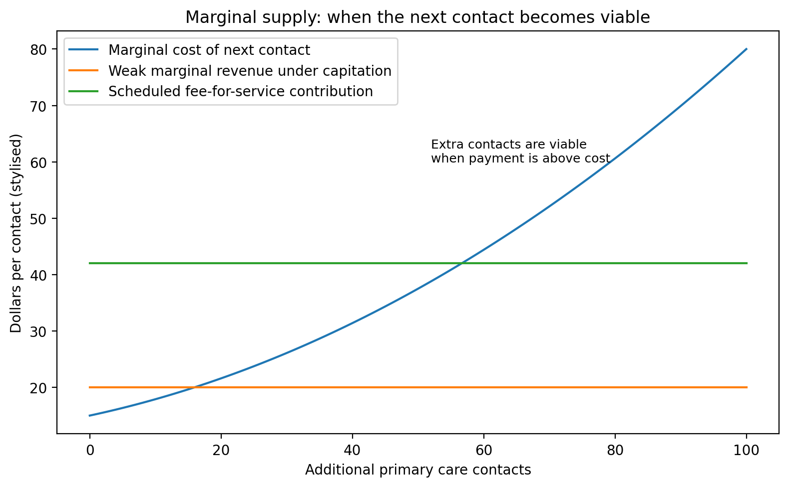

# Marginal supply: the tiny economic idea that decides whether appointments exist

A lot of this debate turns on one small economic idea: marginal supply.

“Marginal” means the next one.

The next appointment. The next prescription review. The next same-day urgent slot. The next rural clinic. The next wound dressing. The next complex consultation. The next follow-up after an ambulance crew decides not to take someone to hospital.

The question is simple:

> Is the next clinically useful contact financially viable for the provider to deliver?

That does not mean clinicians think only about money. They do not. But clinics are not abstract moral machines. They are organisations with finite staff, rooms, phones, software, admin support, rent, indemnity, clinical risk and exhaustion.

If the next contact has a cost, but little or no payment signal, the system will ration it.

That is especially true when workforce is tight.

Under a mostly capitated system, a practice receives a fixed payment per enrolled person. That payment helps support the practice. But after the patient is enrolled, seeing them more often may not bring enough additional revenue to cover the extra time and cost.

Under fee-for-service, the next eligible contact brings a payment. That payment may not fully cover cost either, but it creates a marginal signal. It tells the provider that expanding activity is possible.

The diagram below is deliberately simple. It shows marginal cost rising as a practice takes on more contacts. Early contacts may be easy to absorb. Later ones are harder because the practice needs extra staff, longer hours, more rooms or more administration.

Under weak marginal revenue, supply stops early. Under scheduled fee-for-service, more contacts become viable.

This is not an argument that fee-for-service is always good. It is an argument that every system needs some way to pay for the next clinically necessary contact.

If it does not, the rationing still happens. It just happens less honestly.

The system rations by:

- waiting time;
- closed books;
- appointment length;
- phone triage;
- co-payment increases;
- referral thresholds;
- telling patients to use emergency departments;
- shifting work to ambulance or urgent care;
- using telehealth for problems that may still need hands-on examination.

Some of those tools are useful. Triage is useful. Telehealth is useful. Co-payments can play a role. But when they become the main rationing mechanism, the system is in trouble.

A hard funding envelope can look tidy from the centre. The budget is controlled. The line item is stable. The formula is updated. The target is announced.

But from the patient’s point of view, the question is simpler: can I get care when I need it?

From the provider’s point of view: can we afford to open another slot without burning out staff or bankrupting the practice?

From the hospital’s point of view: why are more people turning up at the emergency department?

Those are all marginal-supply questions.

This is why I think New Zealand should explore an uncapped, scheduled, rules-based primary medical fee-for-service stream. Not uncapped prices. Not uncapped provider behaviour. Uncapped eligible activity.

The public contribution would be scheduled. The service would need to be eligible. The provider would need to be working within scope. Documentation would be required. Patterns of overuse would be audited. Co-payment protections would be needed for children, Community Services Card holders, rural patients, high-need groups and people with complex long-term conditions.

The point is to stop using a capped envelope as the main control.

A capped envelope is simple, but it pushes pressure elsewhere.

A rules-based activity stream is more complicated, but it can let supply grow where care is lower cost and earlier.

Microeconomics does not tell us the exact policy answer. But it does tell us what to look for.

If the next clinically useful contact is unfunded, that contact will eventually disappear.

And if enough contacts disappear upstream, they reappear downstream as ambulance calls, urgent care demand and hospital pressure.

### Why this matters for rural areas

Marginal supply is especially important in rural areas. A city practice may be able to absorb a bit more work by using a larger team, extending hours or shifting some care to telehealth. A rural service may have fewer staff, fewer rooms, longer travel times, fewer locums and less backup.

That means the marginal cost of the next in-person clinic can rise very quickly. If the payment signal does not rise with it, the system will drift toward remote-only care or no care at all.

This is why telehealth should be treated as an extender, not a replacement. It can help with simple problems, follow-up and convenience. But it cannot examine every abdomen, dress every wound, assess every frail patient safely, or replace the local knowledge of a team that knows the community.

The funding model has to make the local in-person contact viable when it is needed. Otherwise the system will look efficient on paper while local capacity quietly disappears.

## The plain-English version

The key idea in this post is **marginal supply and microeconomics**. The short version is that funding rules are not just accounting rules. They are behaviour rules. They tell patients where to go, providers what work is viable, intermediaries what power they hold, and hospitals what pressure they must absorb.

That is why I keep coming back to the same point: New Zealand should not only ask whether primary care has enough funding. It should ask whether the funding architecture lets safe, lower-cost care grow before patients end up in higher-cost settings.

This is not an argument against capitation. Capitation is useful for continuity, enrolled populations and proactive care. The problem is asking capitation to solve marginal access. If the next clinically necessary contact is weakly funded, the system will still ration it. It may ration through waiting time, closed books, higher co-payments, telehealth substitution, ambulance use or emergency department demand.

## What the diagram is showing

The diagram is there to make the argument visible. It is not a predictive estimate. It is a simple map of a mechanism.

A good public-facing diagram should do three things. First, it should show the reader where the pressure starts. Second, it should show where the pressure moves. Third, it should show which policy lever might change the flow.

For this series, the important flows are:

1. unmet need moving from primary care into urgent care, ambulance and hospitals;
2. providers choosing whether to expand, maintain or ration activity;
3. patients choosing whether to wait, pay, delay, use online care or go to hospital;
4. government seeing hospital pressure more clearly than upstream failure;
5. intermediaries either supporting population health or creating friction.

## The game underneath the policy

Every post in this series is built around a game. A game is simply a situation where each player responds to the rules and to what the other players do.

| Player | What they are trying to avoid | What they may do under pressure |
|---|---|---|
| Patients | Delay, cost, uncertainty, worsening illness | Wait, pay, delay, use telehealth, call ambulance, go to hospital |
| Providers | Unfunded work, burnout, financial risk | Close books, shorten appointments, raise fees, limit extra activity |
| Health New Zealand | Visible failure, deficits, hospital pressure | Prioritise urgent hospital pressures |
| Primary Health Organisations or locality bodies | Loss of role, loss of funding, accountability risk | Defend functions, manage pass-through, shape provider incentives |
| Accident Compensation Corporation | Uncontrolled claims cost, poor outcomes | Tighten payment rules or shift toward commissioning |
| Ministers | Publicly visible service failure | Fund the pressure people can see |

This is why an apparently technical funding issue becomes a political economy issue very quickly.

## How this fits the hybrid model

The hybrid model has five parts:

- **capitation** for continuity and population responsibility;
- **uncapped scheduled fee-for-service** for eligible primary medical activity;
- **place-based accountability** so providers cannot simply cherry-pick easy activity;
- **scope-enabled supply** so safe care can be generated by the right provider, not only the traditional provider;
- **data, audit and top-tier key performance indicators** so the system can see access failure before it becomes hospital pressure.

The model is deliberately not a blank cheque. The point is to remove the global cap on eligible primary medical activity, while keeping item prices, clinical eligibility, provider scope, documentation, audit, co-payment protections and place accountability.

## What this adds to the modelling

In the demonstrative model, this post corresponds to one or more component games. The model asks what happens if the system stays in the current equilibrium, and what happens if the policy architecture shifts the equilibrium.

The model does not claim, yet, that the preferred architecture will reduce emergency department presentations by a precise number. That would require linked data, calibration and validation. What the model does show is the logic of the mechanism and the assumptions that need to be tested.

The most important empirical tests are:

1. whether scheduled activity payments increase safe primary care supply;
2. whether unmet primary care need flows into urgent care, ambulance and hospitals;
3. whether Accident Compensation Corporation activity payments help sustain local primary care capacity;
4. whether Primary Health Organisation payment arrangements create material pass-through, transparency or entry barriers;
5. whether scope-enabled providers can expand supply safely and equitably.

## Read this alongside

This post connects to [Ministry of Health: capitation reweighting](https://www.health.govt.nz/strategies-initiatives/programmes-and-initiatives/primary-and-community-health-care/capitation-reweighting) [Accident Compensation Corporation: paying patient treatment](https://www.acc.co.nz/for-providers/invoicing-us/paying-patient-treatment) [Cochrane: payment methods for outpatient healthcare providers](https://www.cochrane.org/evidence/CD011865_payment-methods-healthcare-providers-outpatient-healthcare-settings) [RACGP/AJGP: understanding general practice funding models](https://www1.racgp.org.au/ajgp/2024/december/understanding-general-practice-funding-models-in-a).

## Sources and further reading

- [Ministry of Health: capitation reweighting](https://www.health.govt.nz/strategies-initiatives/programmes-and-initiatives/primary-and-community-health-care/capitation-reweighting)
- [Accident Compensation Corporation: paying patient treatment](https://www.acc.co.nz/for-providers/invoicing-us/paying-patient-treatment)
- [Cochrane: payment methods for outpatient healthcare providers](https://www.cochrane.org/evidence/CD011865_payment-methods-healthcare-providers-outpatient-healthcare-settings)
- [RACGP/AJGP: understanding general practice funding models](https://www1.racgp.org.au/ajgp/2024/december/understanding-general-practice-funding-models-in-a)
- [Cabinet material: Primary Health Care Funding Improvements](https://www.health.govt.nz/information-releases/cabinet-material-primary-health-care-funding-improvements-and-update-on-primary-health-care)
- [Health New Zealand: National Primary Care Dataset and new primary care health target](https://www.healthnz.govt.nz/about-us/what-we-do/planning-and-performance/primary-care-tactical-action-plan/national-primary-care-dataset-and-new-primary-care-health-target)
- [Ministry of Health: primary care health target](https://www.health.govt.nz/strategies-initiatives/programmes-and-initiatives/primary-and-community-health-care/primary-care-health-target)
- [Treasury: Vote Health 2025/26 Estimates](https://www.treasury.govt.nz/publications/estimates/vote-health-health-sector-estimates-appropriations-2025-26)
- [Health New Zealand: the Ambulance Team](https://www.healthnz.govt.nz/about-us/what-we-do/programmes-and-initiatives/the-ambulance-team)
- [Beehive: new and improved urgent and after-hours healthcare](https://www.beehive.govt.nz/release/new-and-improved-urgent-and-after-hours-healthcare)
- [Australian Department of Health: Review of General Practice Incentives](https://www.health.gov.au/resources/publications/review-of-general-practice-incentives-expert-advisory-panel-report-to-the-australian-government?language=en)
- [Ministry of Health: New Zealand Health Survey annual update](https://www.health.govt.nz/publications/annual-update-of-key-results-202324-new-zealand-health-survey)
