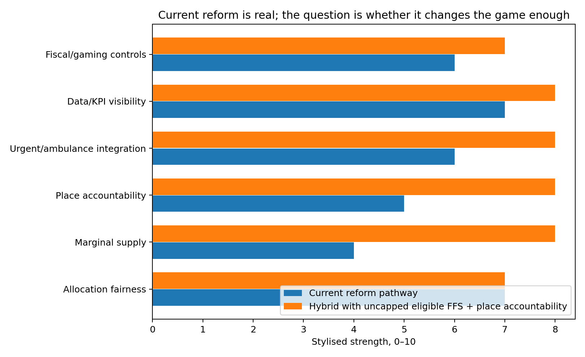

# The current reform pathway: stronger than a straw man, but maybe still incomplete

One criticism of my early framing was fair: New Zealand is not doing nothing.

The current reform pathway is more substantial than simply tweaking capitation.

The Government is reweighting capitation. It is introducing a primary care access target. Health New Zealand is building a National Primary Care Dataset. There is performance-based funding. There is 24/7 digital general practitioner access. There is a large urgent and after-hours programme. There are workforce initiatives. There is policy work on Primary Health Organisations. There is a separate appropriation for primary, community, public and population health services.

That matters.

If the critique is written as if the only thing happening is capitation reweighting, it becomes too easy to dismiss.

So the better question is not:

> Why is New Zealand only changing the capitation formula?

The better question is:

> Does the current reform pathway change the game enough?

That is a much stronger question.

The current reform has some obvious strengths.

First, the new capitation formula should be fairer. It includes factors such as age, sex, multimorbidity, rurality and deprivation. That is better than an old formula built from late-1990s utilisation patterns.

Second, the primary care access target makes access visible. For the first time, primary care has a national access target. The proposed target is that more than 80 percent of people can access an appointment with a general practice provider within one week.

Third, the National Primary Care Dataset should improve observability. If we can see when appointments are booked, when people are seen, and what the outcome was, we can start to understand access rather than guessing.

Fourth, urgent and after-hours care is being expanded. The Government has announced investment to support a goal of 98 percent of New Zealanders being able to access urgent care within one hour’s drive.

Fifth, official policy is starting to talk about the broader general practice team, not only doctors.

All of that is important.

But there are still gaps.

A target does not create appointments by itself.

A dataset does not create supply by itself.

A better capitation formula does not necessarily fund the next urgent contact.

A digital service does not replace all local, in-person care.

Urgent care does not solve routine continuity.

Performance payments do not necessarily fix the base economics of practices.

Separate appropriations do not automatically prevent hospital pressure from dominating political attention.

This is why I think the current reform should be treated as the comparator, not the endpoint.

The current reform may improve allocation, visibility and some access. The question is whether it removes the hard cap on eligible primary medical activity.

I do not think it fully does.

The most important missing mechanism is still the marginal supply signal.

If a practice has extra patient demand but no viable way to fund the next clinically useful contact, the system still rations. If a nurse practitioner, pharmacist, paramedic, physiotherapist, general practitioner or other clinician can safely deal with a defined problem, but the funding architecture does not let that activity be generated and paid for, supply is still artificially constrained.

That is why the proposal is to add an uncapped, rules-based fee-for-service stream for eligible primary medical care.

Not all care. Not all providers doing anything they want. Not all volume without controls.

Eligible medical activity.

Scheduled contribution rates.

Scope-based provider eligibility.

Clinical necessity rules.

Documentation.

Audit.

Co-payment protections.

Place-based accountability.

This would sit beside capitation, not replace it.

In other words, the current reform pathway may be the foundation. The hybrid model is the next layer.

The diagram below compares the current reform pathway with the hybrid architecture I am suggesting. It is not a statistical forecast. It is a structured way of thinking about where each architecture is strong and weak.

The current reform is strongest on allocation fairness, data, targets and some urgent-care access. The hybrid model is stronger where the current pathway may remain weaker: marginal supply, provider-scope flexibility, whole-population accountability and uncapped eligible activity.

So the critique is not “the Government has done nothing”.

The critique is:

> The Government has started to change the system. But it may still be managing upstream activity too tightly, while hospital demand remains the pressure valve.

That is the game we need to test.

### Why this matters for criticism

If we ignore the current reform agenda, the critique becomes weak. It sounds like we are arguing against a system that no longer exists. That is why the current reform pathway should be the real comparator.

The question is not: “Is New Zealand doing nothing?” It is clearly doing something.

The question is: “Does the package change the game enough?”

A target can make access visible. A dataset can make waiting time measurable. Reweighting can improve allocation. Urgent-care funding can reduce some emergency department pressure. Digital care can increase convenience.

But none of those automatically removes the hard cap problem for eligible primary medical activity. None of them automatically prevents cherry-picking. None of them automatically makes rural in-person care viable. None of them automatically solves the Accident Compensation Corporation and Health New Zealand split.

So I think the fair critique is not that the reform is wrong. It is that the reform may be incomplete.

## The plain-English version

The key idea in this post is **current reform comparator**. The short version is that funding rules are not just accounting rules. They are behaviour rules. They tell patients where to go, providers what work is viable, intermediaries what power they hold, and hospitals what pressure they must absorb.

That is why I keep coming back to the same point: New Zealand should not only ask whether primary care has enough funding. It should ask whether the funding architecture lets safe, lower-cost care grow before patients end up in higher-cost settings.

This is not an argument against capitation. Capitation is useful for continuity, enrolled populations and proactive care. The problem is asking capitation to solve marginal access. If the next clinically necessary contact is weakly funded, the system will still ration it. It may ration through waiting time, closed books, higher co-payments, telehealth substitution, ambulance use or emergency department demand.

## What the diagram is showing

The diagram is there to make the argument visible. It is not a predictive estimate. It is a simple map of a mechanism.

A good public-facing diagram should do three things. First, it should show the reader where the pressure starts. Second, it should show where the pressure moves. Third, it should show which policy lever might change the flow.

For this series, the important flows are:

1. unmet need moving from primary care into urgent care, ambulance and hospitals;
2. providers choosing whether to expand, maintain or ration activity;
3. patients choosing whether to wait, pay, delay, use online care or go to hospital;
4. government seeing hospital pressure more clearly than upstream failure;
5. intermediaries either supporting population health or creating friction.

## The game underneath the policy

Every post in this series is built around a game. A game is simply a situation where each player responds to the rules and to what the other players do.

| Player | What they are trying to avoid | What they may do under pressure |
|---|---|---|
| Patients | Delay, cost, uncertainty, worsening illness | Wait, pay, delay, use telehealth, call ambulance, go to hospital |
| Providers | Unfunded work, burnout, financial risk | Close books, shorten appointments, raise fees, limit extra activity |
| Health New Zealand | Visible failure, deficits, hospital pressure | Prioritise urgent hospital pressures |
| Primary Health Organisations or locality bodies | Loss of role, loss of funding, accountability risk | Defend functions, manage pass-through, shape provider incentives |
| Accident Compensation Corporation | Uncontrolled claims cost, poor outcomes | Tighten payment rules or shift toward commissioning |
| Ministers | Publicly visible service failure | Fund the pressure people can see |

This is why an apparently technical funding issue becomes a political economy issue very quickly.

## How this fits the hybrid model

The hybrid model has five parts:

- **capitation** for continuity and population responsibility;
- **uncapped scheduled fee-for-service** for eligible primary medical activity;
- **place-based accountability** so providers cannot simply cherry-pick easy activity;
- **scope-enabled supply** so safe care can be generated by the right provider, not only the traditional provider;
- **data, audit and top-tier key performance indicators** so the system can see access failure before it becomes hospital pressure.

The model is deliberately not a blank cheque. The point is to remove the global cap on eligible primary medical activity, while keeping item prices, clinical eligibility, provider scope, documentation, audit, co-payment protections and place accountability.

## What this adds to the modelling

In the demonstrative model, this post corresponds to one or more component games. The model asks what happens if the system stays in the current equilibrium, and what happens if the policy architecture shifts the equilibrium.

The model does not claim, yet, that the preferred architecture will reduce emergency department presentations by a precise number. That would require linked data, calibration and validation. What the model does show is the logic of the mechanism and the assumptions that need to be tested.

The most important empirical tests are:

1. whether scheduled activity payments increase safe primary care supply;
2. whether unmet primary care need flows into urgent care, ambulance and hospitals;
3. whether Accident Compensation Corporation activity payments help sustain local primary care capacity;
4. whether Primary Health Organisation payment arrangements create material pass-through, transparency or entry barriers;
5. whether scope-enabled providers can expand supply safely and equitably.

## Read this alongside

This post connects to [Ministry of Health: capitation reweighting](https://www.health.govt.nz/strategies-initiatives/programmes-and-initiatives/primary-and-community-health-care/capitation-reweighting) [Cabinet material: Primary Health Care Funding Improvements](https://www.health.govt.nz/information-releases/cabinet-material-primary-health-care-funding-improvements-and-update-on-primary-health-care) [Ministry of Health: primary care health target](https://www.health.govt.nz/strategies-initiatives/programmes-and-initiatives/primary-and-community-health-care/primary-care-health-target) [Health New Zealand: National Primary Care Dataset and new primary care health target](https://www.healthnz.govt.nz/about-us/what-we-do/planning-and-performance/primary-care-tactical-action-plan/national-primary-care-dataset-and-new-primary-care-health-target).

## Sources and further reading

- [Ministry of Health: capitation reweighting](https://www.health.govt.nz/strategies-initiatives/programmes-and-initiatives/primary-and-community-health-care/capitation-reweighting)
- [Cabinet material: Primary Health Care Funding Improvements](https://www.health.govt.nz/information-releases/cabinet-material-primary-health-care-funding-improvements-and-update-on-primary-health-care)
- [Ministry of Health: primary care health target](https://www.health.govt.nz/strategies-initiatives/programmes-and-initiatives/primary-and-community-health-care/primary-care-health-target)
- [Health New Zealand: National Primary Care Dataset and new primary care health target](https://www.healthnz.govt.nz/about-us/what-we-do/planning-and-performance/primary-care-tactical-action-plan/national-primary-care-dataset-and-new-primary-care-health-target)
- [Ministry of Health: PHO finances briefing](https://www.health.govt.nz/system/files/2025-11/H2025069314-Briefing-PHO-finances-a-summary-of-available-information.pdf)
- [Ministry of Health: meeting with General Practice New Zealand, July 2025](https://www.health.govt.nz/system/files/2025-11/H2025070512-Aide-Memoire-Meeting-with-General-Practice-New-Zealand-on-31-July-2025.pdf)
- [Beehive: new and improved urgent and after-hours healthcare](https://www.beehive.govt.nz/release/new-and-improved-urgent-and-after-hours-healthcare)
- [Treasury: Vote Health 2025/26 Estimates](https://www.treasury.govt.nz/publications/estimates/vote-health-health-sector-estimates-appropriations-2025-26)
- [Ministry of Health: Health Crown entities and Health New Zealand roles](https://www.health.govt.nz/about-us/new-zealands-health-system/health-system-roles-and-organisations/health-crown-entities)
- [Health and Disability System Review final report](https://www.health.govt.nz/system/files/2022-09/health-disability-system-review-final-report.pdf)
- [Ministry of Health: New Zealand Health Survey annual update](https://www.health.govt.nz/publications/annual-update-of-key-results-202324-new-zealand-health-survey)
- [Health New Zealand: the Ambulance Team](https://www.healthnz.govt.nz/about-us/what-we-do/programmes-and-initiatives/the-ambulance-team)
