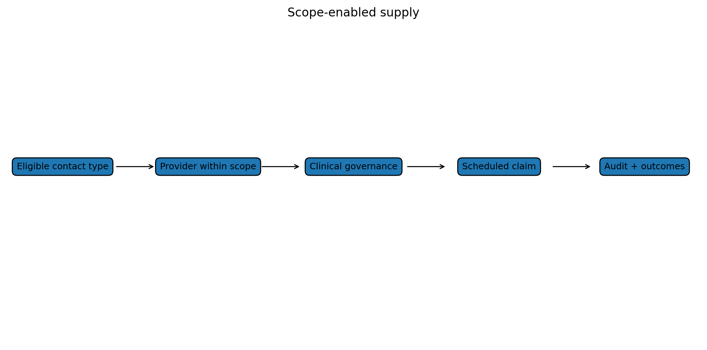

# Who should be allowed to generate primary care supply?

One of the quietest constraints in primary care is professional design.

A funding model can accidentally decide who is allowed to create supply.

If the funding system only recognises general-practitioner-led activity, then the system will behave as if primary care supply depends mainly on general practitioner numbers.

General practitioners are essential. This is not an argument against them. But they are not the only clinicians who can safely provide primary care activity.

Nurse practitioners can assess, diagnose, prescribe and manage many conditions. Pharmacists can support medicines optimisation, minor ailments, vaccination, prescribing in defined contexts and medication review. Physiotherapists can manage musculoskeletal problems. Paramedics can support urgent assessment, triage and alternative disposition. Nurses can provide a wide range of planned and acute services. Māori and Pacific providers can deliver care in ways that mainstream models often do not.

If all of that activity is clinically appropriate, why should funding be artificially constrained by one professional pathway?

The answer should be clinical governance, not professional protection.

The funding system should ask:

- Is this contact type eligible?
- Is the provider qualified and credentialed?
- Is it within scope of practice?
- Is prescribing regulated appropriately?
- Is documentation adequate?
- Is the service clinically necessary?
- Is the pattern of use reasonable?
- Is the patient protected from unsafe fragmentation?

Those are safety questions.

They are different from saying only one profession can generate supply.

The current primary care access target is already framed around a general practice provider, not only a general practitioner. That is helpful. But the broader architecture should go further. It should recognise defined contact types across the primary, urgent, community and ambulance workforce.

For example:

- a pharmacist medicine review;
- a nurse practitioner urgent-care consultation;
- a paramedic treat-and-refer episode;
- a physiotherapist first-contact musculoskeletal assessment;
- a general practitioner complex diagnostic consultation;
- a practice nurse wound review;
- a Māori health provider outreach contact;
- a mental health worker brief intervention in primary care.

Each of these could have different rules, item prices, co-payment protections, audit triggers and reporting requirements.

That is not deregulation.

It is smarter regulation.

The problem with a doctor-to-patient ratio mindset is that it can freeze the system around a workforce that is already short. The problem with a pure telehealth model is that it can scale simple contacts but hollow out local in-person supply. The problem with a pure capitation model is that it may fund responsibility without paying enough for activity.

A better model asks what work needs doing, then asks who can safely do it.

This is where the uncapped benefits schedule becomes useful.

A National Primary Medical Benefits Schedule could be provider-neutral where appropriate. That means the item is linked to the service, not automatically to a professional guild.

Some items would be doctor-only.

Some would be general practitioner or nurse practitioner.

Some would be pharmacist.

Some would be allied health.

Some would be paramedic.

Some would require a team.

The point is to fund safe activity, not preserve artificial bottlenecks.

That is especially important in rural areas.

A rural community may not have enough general practitioners. But it may have a nurse practitioner, pharmacist, paramedics, visiting general practitioner sessions, telehealth support, rural hospital staff and community providers. A good funding model would assemble those capabilities rather than pretending supply only exists when a traditional general practitioner clinic is fully staffed.

The recommendation is simple:

> Let scope of practice and clinical governance determine what providers can do. Do not let the payment model artificially restrict who can generate safe primary care supply.

### Funding should not freeze old professional boundaries

Clinical safety absolutely matters. Prescribing rules, scope of practice, competence, supervision, escalation pathways and audit all matter.

But funding rules should not make the workforce problem worse by pretending that only one professional group can generate useful primary care activity.

Some care needs a general practitioner. Some care needs a nurse practitioner. Some care can be provided by a pharmacist, physiotherapist, psychologist, paramedic, nurse, health coach, kaiāwhina or other member of a broader team. The right answer depends on the problem, the patient, the context and the risks.

If the funding model only pays properly when a doctor is involved, it creates an artificial bottleneck. It may also waste scarce medical time on contacts that other professionals could handle safely.

A better funding model would define eligible contact types, then allow the appropriate provider to generate the claim if they are accredited and working within scope. That is not anti-doctor. It is pro-access, pro-team and pro-safety.

### The claim should follow the contact type

In a scope-enabled model, the first question is not “which profession should be protected?” The first question is “what is the contact, and what level of competence and governance does it require?”

A medication review, a wound check, a musculoskeletal assessment, a mental health brief intervention, an immunisation, a frailty review and an urgent respiratory assessment are not the same kind of work. Some require a doctor. Some may be safely delivered by another professional. Some require a team. Some require escalation.

The funding model should be able to tell the difference.

That is how you expand supply without abandoning safety. You do not pay everyone to do everything. You define the work, define the scope, define the governance, then let the appropriate provider generate the activity.

## The plain-English version

The key idea in this post is **scope-enabled supply**. The short version is that funding rules are not just accounting rules. They are behaviour rules. They tell patients where to go, providers what work is viable, intermediaries what power they hold, and hospitals what pressure they must absorb.

That is why I keep coming back to the same point: New Zealand should not only ask whether primary care has enough funding. It should ask whether the funding architecture lets safe, lower-cost care grow before patients end up in higher-cost settings.

This is not an argument against capitation. Capitation is useful for continuity, enrolled populations and proactive care. The problem is asking capitation to solve marginal access. If the next clinically necessary contact is weakly funded, the system will still ration it. It may ration through waiting time, closed books, higher co-payments, telehealth substitution, ambulance use or emergency department demand.

## What the diagram is showing

The diagram is there to make the argument visible. It is not a predictive estimate. It is a simple map of a mechanism.

A good public-facing diagram should do three things. First, it should show the reader where the pressure starts. Second, it should show where the pressure moves. Third, it should show which policy lever might change the flow.

For this series, the important flows are:

1. unmet need moving from primary care into urgent care, ambulance and hospitals;
2. providers choosing whether to expand, maintain or ration activity;
3. patients choosing whether to wait, pay, delay, use online care or go to hospital;
4. government seeing hospital pressure more clearly than upstream failure;
5. intermediaries either supporting population health or creating friction.

## The game underneath the policy

Every post in this series is built around a game. A game is simply a situation where each player responds to the rules and to what the other players do.

| Player | What they are trying to avoid | What they may do under pressure |
|---|---|---|
| Patients | Delay, cost, uncertainty, worsening illness | Wait, pay, delay, use telehealth, call ambulance, go to hospital |
| Providers | Unfunded work, burnout, financial risk | Close books, shorten appointments, raise fees, limit extra activity |
| Health New Zealand | Visible failure, deficits, hospital pressure | Prioritise urgent hospital pressures |
| Primary Health Organisations or locality bodies | Loss of role, loss of funding, accountability risk | Defend functions, manage pass-through, shape provider incentives |
| Accident Compensation Corporation | Uncontrolled claims cost, poor outcomes | Tighten payment rules or shift toward commissioning |
| Ministers | Publicly visible service failure | Fund the pressure people can see |

This is why an apparently technical funding issue becomes a political economy issue very quickly.

## How this fits the hybrid model

The hybrid model has five parts:

- **capitation** for continuity and population responsibility;
- **uncapped scheduled fee-for-service** for eligible primary medical activity;
- **place-based accountability** so providers cannot simply cherry-pick easy activity;
- **scope-enabled supply** so safe care can be generated by the right provider, not only the traditional provider;
- **data, audit and top-tier key performance indicators** so the system can see access failure before it becomes hospital pressure.

The model is deliberately not a blank cheque. The point is to remove the global cap on eligible primary medical activity, while keeping item prices, clinical eligibility, provider scope, documentation, audit, co-payment protections and place accountability.

## What this adds to the modelling

In the demonstrative model, this post corresponds to one or more component games. The model asks what happens if the system stays in the current equilibrium, and what happens if the policy architecture shifts the equilibrium.

The model does not claim, yet, that the preferred architecture will reduce emergency department presentations by a precise number. That would require linked data, calibration and validation. What the model does show is the logic of the mechanism and the assumptions that need to be tested.

The most important empirical tests are:

1. whether scheduled activity payments increase safe primary care supply;
2. whether unmet primary care need flows into urgent care, ambulance and hospitals;
3. whether Accident Compensation Corporation activity payments help sustain local primary care capacity;
4. whether Primary Health Organisation payment arrangements create material pass-through, transparency or entry barriers;
5. whether scope-enabled providers can expand supply safely and equitably.

## Read this alongside

This post connects to [Accident Compensation Corporation: paying patient treatment](https://www.acc.co.nz/for-providers/invoicing-us/paying-patient-treatment) [Ministry of Health: capitation reweighting](https://www.health.govt.nz/strategies-initiatives/programmes-and-initiatives/primary-and-community-health-care/capitation-reweighting) [Ministry of Health: primary care health target](https://www.health.govt.nz/strategies-initiatives/programmes-and-initiatives/primary-and-community-health-care/primary-care-health-target) [Health New Zealand: National Primary Care Dataset and new primary care health target](https://www.healthnz.govt.nz/about-us/what-we-do/planning-and-performance/primary-care-tactical-action-plan/national-primary-care-dataset-and-new-primary-care-health-target).

## Sources and further reading

- [Accident Compensation Corporation: paying patient treatment](https://www.acc.co.nz/for-providers/invoicing-us/paying-patient-treatment)
- [Ministry of Health: capitation reweighting](https://www.health.govt.nz/strategies-initiatives/programmes-and-initiatives/primary-and-community-health-care/capitation-reweighting)
- [Ministry of Health: primary care health target](https://www.health.govt.nz/strategies-initiatives/programmes-and-initiatives/primary-and-community-health-care/primary-care-health-target)
- [Health New Zealand: National Primary Care Dataset and new primary care health target](https://www.healthnz.govt.nz/about-us/what-we-do/planning-and-performance/primary-care-tactical-action-plan/national-primary-care-dataset-and-new-primary-care-health-target)
- [RACGP/AJGP: understanding general practice funding models](https://www1.racgp.org.au/ajgp/2024/december/understanding-general-practice-funding-models-in-a)
- [Australian Department of Health: Review of General Practice Incentives](https://www.health.gov.au/resources/publications/review-of-general-practice-incentives-expert-advisory-panel-report-to-the-australian-government?language=en)
- [Cochrane: payment methods for outpatient healthcare providers](https://www.cochrane.org/evidence/CD011865_payment-methods-healthcare-providers-outpatient-healthcare-settings)
- [Beehive: new and improved urgent and after-hours healthcare](https://www.beehive.govt.nz/release/new-and-improved-urgent-and-after-hours-healthcare)
- [Health New Zealand: the Ambulance Team](https://www.healthnz.govt.nz/about-us/what-we-do/programmes-and-initiatives/the-ambulance-team)
- [Health and Disability System Review final report](https://www.health.govt.nz/system/files/2022-09/health-disability-system-review-final-report.pdf)
- [Ministry of Health: New Zealand Health Survey annual update](https://www.health.govt.nz/publications/annual-update-of-key-results-202324-new-zealand-health-survey)
- [Cabinet material: Primary Health Care Funding Improvements](https://www.health.govt.nz/information-releases/cabinet-material-primary-health-care-funding-improvements-and-update-on-primary-health-care)
