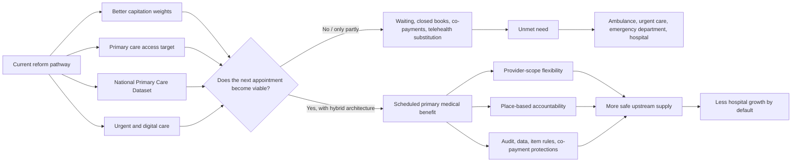

# One-page visual summary v1.6.0

## Primary care funding architecture: the question current reform may not answer

## Problem

New Zealand is improving capitation and measuring access, but the deeper question is whether the rules of the system allow lower-cost upstream care to expand before need becomes hospital demand.

## Proposed architecture

- Keep capitation for continuity and population responsibility.
- Add uncapped scheduled fee-for-service for eligible primary medical activity.
- Use place-based accountability to prevent cherry-picking.
- Let eligible providers generate activity within scope and governance.
- Integrate urgent care, ambulance alternatives and Accident Compensation Corporation interactions.
- Control risk through item rules, documentation, audit, co-payment protections and data.

## Five empirical checks

1. Does marginal payment increase safe appointment supply?
2. Does unmet primary care need convert into emergency department, ambulance or hospital demand?
3. Do Accident Compensation Corporation payments stabilise upstream supply?
4. Does Primary Health Organisation payment intermediation add transaction cost or opacity?
5. Can provider-scope expansion safely increase supply without worsening inequity?

## Policy ask

Do not only ask whether the capitation formula is fair. Ask whether the funding architecture changes the game enough.
