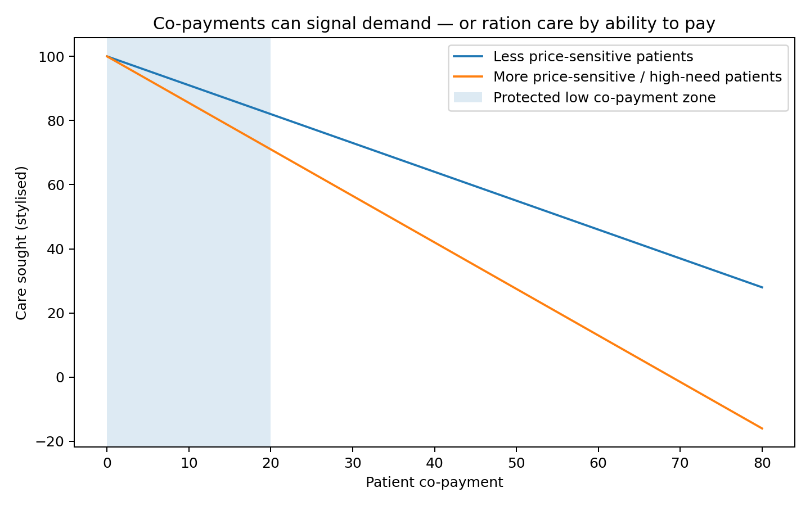

# Co-payments: demand signal or equity failure?

Co-payments are uncomfortable to talk about because they do two things at once.

They can be a demand signal.

They can also be an equity failure.

A demand signal means people face some cost when they use a service. In theory, this discourages low-value use and helps keep the system financially sustainable.

But health care is not like buying a coffee.

Patients often do not know whether their symptom is minor or serious. A parent with a feverish child may not be “shopping”. An older person with chest discomfort may be frightened. A person with mental distress may not have the capacity to navigate options. A rural patient may have only one practical choice.

If co-payments are too high, people delay care.

Delayed care can become more expensive care.

The New Zealand Health Survey shows cost is already a barrier for many people. In 2023/24, one in six adults reported not visiting a general practitioner because of cost. Waiting time was an even more common barrier.

So the co-payment question is not whether prices matter. They do.

The question is how to use co-payments without letting them ration necessary care by income.

In an uncapped eligible fee-for-service model, co-payments could help manage demand. But they need guardrails.

The diagram below shows the basic equity problem. More price-sensitive patients reduce use more sharply as co-payments rise. Those patients are often the very people the system should most protect.

A sensible model might include:

- zero or very low co-payments for children;
- low co-payments for Community Services Card holders;
- co-payment caps for high-need or frequent users;
- lower co-payments for defined urgent primary medical contacts;
- rural protections where travel costs are already high;
- no co-payment for some follow-up after ambulance non-conveyance;
- transparent published fees;
- monitoring by deprivation, ethnicity, disability, age and rurality.

The Accident Compensation Corporation system is useful here too. Accident Compensation Corporation contribution rates are capped by regulation. If provider costs rise faster than the regulated contribution, patients may face higher co-payments. The Ministry of Business, Innovation and Employment explicitly notes that rising co-payments may stop some claimants accessing treatment.

That is exactly the risk in primary care.

An uncapped activity stream is only equitable if the patient price is controlled enough for necessary care to be used.

This is also why I do not think “free care for everything” is the only equity model. Free care can increase demand, but if supply is still capped, the rationing may move to waiting time. Waiting time is also an equity problem.

The goal is not simply low price.

The goal is effective access.

A person should be able to get clinically appropriate care without being blocked by cost, distance, waiting time, digital exclusion or professional bottlenecks.

Co-payments can remain in the model.

But they should be designed as a calibrated signal, not a blunt rationing weapon.

### The uncomfortable trade-off

Co-payments are politically uncomfortable because they sit between two real concerns.

On one side, a zero-price service can create demand that is hard to manage, especially when supply is limited. On the other side, fees can stop people getting care they genuinely need.

Both things can be true.

That is why the real question is not whether co-payments are good or bad in the abstract. The question is where they sit, who pays them, how large they are, what services are protected, and what happens to people with high need.

A co-payment for a low-risk convenience contact is not the same as a co-payment for a child, a person with multiple long-term conditions, a rural patient with transport costs, or someone delaying care because rent is due.

If co-payments are used, they need to be calibrated. They should not become the main way the system rations care.

### Why equity protections have to be designed up front

Equity protections cannot be an afterthought. Once a funding model is running, providers and patients adapt to it. Fees become normal. Workflows become fixed. Business models emerge. Changing them later is hard.

That means the protections have to be designed into the schedule from the beginning.

Some groups may need zero or very low co-payments. Some contact types may need maximum fees. Some rural services may need extra public subsidy because travel and thin markets make care more expensive. Some high-need patients may need annual caps on out-of-pocket costs.

The point is not to remove every price signal. The point is to prevent price from becoming the reason people with the greatest need delay care.

If co-payments are used carefully, they can help manage demand. If they are used bluntly, they become a quiet form of rationing.

### A practical way to test it

The practical test is simple: after the policy change, do the people with the highest need use more appropriate primary care, or do they still delay care? If higher-income patients gain convenience while lower-income patients still face cost barriers, the model has failed. If fees are calibrated and protections work, the model should increase useful care without making access depend on income.

## Sources and further reading

- [Ministry of Health, capitation reweighting](https://www.health.govt.nz/strategies-initiatives/programmes-and-initiatives/primary-and-community-health-care/capitation-reweighting)
- [Cabinet material on primary care funding improvements](https://www.health.govt.nz/information-releases/cabinet-material-primary-health-care-funding-improvements-and-update-on-primary-health-care)
- [Health New Zealand, National Primary Care Dataset](https://www.healthnz.govt.nz/about-us/what-we-do/planning-and-performance/primary-care-tactical-action-plan/national-primary-care-dataset-and-new-primary-care-health-target)
- [Health New Zealand, Primary Care Tactical Action Plan](https://www.healthnz.govt.nz/about-us/what-we-do/planning-and-performance/primary-care-tactical-action-plan)
- [Vote Health 2025/26 Estimates](https://www.treasury.govt.nz/publications/estimates/vote-health-health-sector-estimates-appropriations-2025-26)

- [New Zealand Health Survey 2023/24](https://www.health.govt.nz/publications/annual-update-of-key-results-202324-new-zealand-health-survey)
- [MBIE ACC payment review](https://www.mbie.govt.nz/business-and-employment/employment-and-skills/employment-legislation-reviews/increasing-regulated-acc-payments-for-treatment/proposed-updates-to-acc-regulated-payments-for-treatment/options-for-payment-increases-and-how-they-were-assessed)