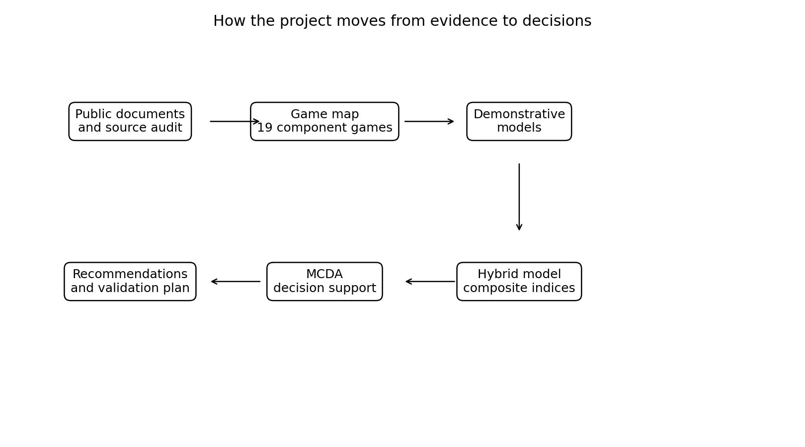

# The 19 games: a plain-English map of the policy problem

This policy problem is not one game. It is many games layered together.

That is why simple slogans fail.

“More capitation” does not solve everything.

“More fee-for-service” does not solve everything.

“More telehealth” does not solve everything.

“More urgent care” does not solve everything.

“More hospital funding” definitely does not solve everything.

The system is a hybrid game.

Here is the plain-English map.

**Game 1: the hospital salience game.** Hospital pressure is visible and politically urgent. Upstream unmet need is quieter until it becomes hospital demand.

**Game 2: the Health New Zealand allocation game.** Separate appropriations exist, but operational pressure, baselines, targets and political attention still shape what becomes fundable.

**Game 3: the capitation marginal-supply game.** Capitation supports responsibility but weakly funds the next contact.

**Game 4: the patient access pathway game.** Patients choose between waiting, paying, telehealth, urgent care, ambulance, emergency department or giving up.

**Game 5: the Primary Health Organisation intermediation game.** Primary Health Organisations may add population-health value, but payment intermediation may add opacity and friction.

**Game 6: the Accident Compensation Corporation / Health New Zealand cross-funder game.** Injury and non-injury funding streams interact. Constraining one can shift pressure to another.

**Game 7: the ambulance conveyance game.** Ambulance can be access infrastructure, but if alternatives are not funded, emergency department conveyance becomes the default.

**Game 8: the scope-of-practice supply game.** If funding recognises too narrow a provider group, safe supply from nurses, nurse practitioners, pharmacists, therapists and paramedics is suppressed.

**Game 9: the telehealth/local supply game.** Telehealth can extend care or hollow out local in-person supply.

**Game 10: the co-payment calibration game.** Co-payments can signal demand or block necessary care.

**Game 11: the key performance indicator salience game.** What is measured at the top tier gets managed. What is invisible gets ignored.

**Game 12: the equity and trust game.** National benefits do not replace trust, kaupapa Māori provision, Pacific models, outreach and local relationships.

**Game 13: the political economy game.** The same policy can be framed as pro-market, anti-GP, anti-PHO, pro-patient, neoliberal, pragmatic, or equity-enhancing depending on who tells the story.

**Game 14: the data observability game.** Unmet need is hard to fund if nobody can see it.

**Game 15: the place-based accountability game.** Demand-led benefits can create cherry-picking unless someone remains responsible for whole populations.

**Game 16: the current reform sufficiency game.** Current reform is real. The question is whether it changes enough incentives.

**Game 17: the formula-fixation game.** Stakeholders can fight about weights forever while the deeper supply constraint remains.

**Game 18: the urgent-care policy game.** Urgent care can reduce emergency department pressure, but only if integrated with primary care, ambulance, data and workforce.

**Game 19: the uncapped entitlement / fiscal-governance game.** Eligible activity can be uncapped at the envelope level, but only if item prices, audit, scope, co-payment and place rules are strong.

This is why the recommendation is a hybrid.

Each game has a failure mode. The policy design needs to avoid all of them at once.

That is difficult.

But it is more honest than pretending one funding model can solve the whole system.

### How to read the map

The map is not meant to be clever for the sake of it. It is meant to stop us arguing about only one piece of the system at a time.

If we argue only about capitation, we miss urgent care. If we argue only about urgent care, we miss ambulance. If we argue only about ambulance, we miss Accident Compensation Corporation. If we argue only about Accident Compensation Corporation, we miss provider scope. If we argue only about provider scope, we miss place-based accountability.

Each game is a small strategic trap. The policy problem is that the traps interact. A fix in one place can create a problem somewhere else.

That is why a hybrid model is needed. It is not a slogan. It is a way of admitting that no single lever is strong enough to solve the whole access problem.

### Why nineteen games is not overcomplication

Nineteen sounds like a lot. But the health system is already playing these games. Naming them does not create complexity. It reveals it.

The danger is pretending there is only one game. If we think the whole problem is the capitation formula, we will keep refining the formula while access problems shift elsewhere. If we think the whole problem is workforce, we will miss the payment rules that make extra work unviable. If we think the whole problem is hospitals, we will miss the upstream access failures that feed them.

The game map is a diagnostic tool. It helps decision-makers ask which strategic trap they are trying to fix, which trap might worsen, and which safeguards are needed.

That is the kind of thinking a funding reform needs before it becomes another narrow programme.

### The map also protects against overclaiming

A map like this makes the limits of the argument clearer. It shows which claims are about documented policy, which are about economic theory, which are modelling assumptions, and which are hypotheses needing validation. That matters because the goal is not to pretend the answer is already proven. The goal is to make the policy problem testable.

## Sources and further reading

- [Ministry of Health, capitation reweighting](https://www.health.govt.nz/strategies-initiatives/programmes-and-initiatives/primary-and-community-health-care/capitation-reweighting)
- [Cabinet material on primary care funding improvements](https://www.health.govt.nz/information-releases/cabinet-material-primary-health-care-funding-improvements-and-update-on-primary-health-care)
- [Health New Zealand, National Primary Care Dataset](https://www.healthnz.govt.nz/about-us/what-we-do/planning-and-performance/primary-care-tactical-action-plan/national-primary-care-dataset-and-new-primary-care-health-target)
- [Health New Zealand, Primary Care Tactical Action Plan](https://www.healthnz.govt.nz/about-us/what-we-do/planning-and-performance/primary-care-tactical-action-plan)
- [Vote Health 2025/26 Estimates](https://www.treasury.govt.nz/publications/estimates/vote-health-health-sector-estimates-appropriations-2025-26)