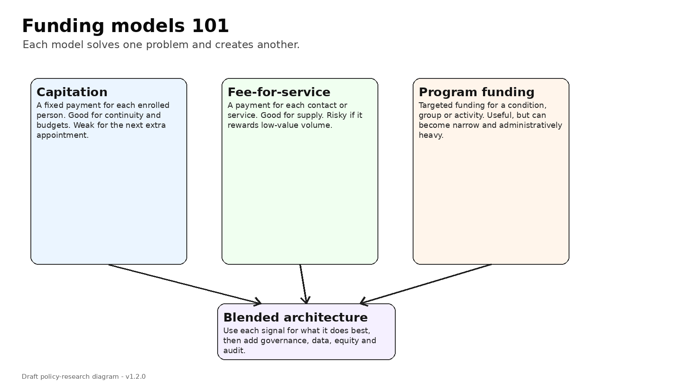

# Fee-for-service, capitation and blended funding: the plain-English version

Before talking about reform, it helps to understand the three basic ways we pay for primary care.

The first is fee-for-service. A provider does a service and receives a payment. The service might be a consultation, a procedure, a review, a wound dressing, a vaccination, a minor operation or an urgent assessment.

Fee-for-service has one major strength: it pays for the next piece of work.

If a clinic sees more patients, it receives more revenue. If a nurse practitioner provides more eligible consultations, those consultations can be funded. If a rural clinician does more urgent-care sessions, there is a payment signal attached to that work.

That can increase supply. It tells the system that doing more work is financially possible.

But fee-for-service has a danger. If it is poorly designed, it can reward volume rather than value. It can make short, simple, repeat contacts more attractive than slow, complex, relationship-based care. It can also encourage providers to focus on services that are easy to bill, rather than services that matter most.

So fee-for-service is useful, but dangerous.

The second model is capitation. A provider receives a fixed payment for each enrolled person, usually adjusted by patient characteristics such as age, sex, deprivation, rurality and illness burden.

Capitation has real strengths. It supports continuity. It gives a clinic responsibility for a defined population. It can support preventive care and team-based work that does not fit neatly into a single consultation. It is also attractive to funders because the total funding is more predictable.

But capitation has a different danger. Once the patient is enrolled, the next contact is often a cost rather than a revenue event. If a person needs more visits, more phone calls, more follow-up, more complexity and more risk management, the practice may receive little additional payment.

That can lead to rationing. Not necessarily because anyone is being lazy or uncaring. It happens because time and workforce are finite.

The third model is programme or targeted funding. This is money for specific activities, such as immunisation, long-term condition care, screening, care coordination or access programmes.

Targeted funding can be useful when government wants to promote particular outcomes. But it can become complicated. It can fragment care into many little funding streams, each with its own forms, rules, audits and reporting.

This is why most sensible systems use a blend.

A blended model uses capitation for baseline responsibility, fee-for-service for eligible activity, and targeted funding for priority programmes. The trick is not choosing one model as if it were perfect. None of them is perfect.

The trick is matching the payment signal to the type of care.

For example:

- continuity and preventive care suit capitation;
- urgent appointments and procedures suit fee-for-service;
- immunisation catch-up or outreach may suit targeted funding;
- rural access may need loading or place-based support;
- complex long-term care may need both capitation and activity-sensitive payments.

In New Zealand, the Government itself describes primary care funding as blended: capitation, co-payments and targeted streams. That is true. But the important question is whether the blend is strong enough at the margin.

The margin is the next appointment.

If the next appointment is clinically needed but weakly funded, the system may still ration access even if the overall model is technically “blended”.

That is why I keep coming back to an Accident Compensation Corporation-style analogy. Accident Compensation Corporation payments are not unlimited chaos. They are rules-based. Providers must be qualified. Treatment must be clinically appropriate. Documentation is required. Some items require approval. There are scheduled contributions.

In other words, activity can be demand-led without being uncontrolled.

That is the distinction I think New Zealand needs to explore for primary medical care.

Not a blank cheque.

Not a return to 1980s medicine.

Not replacing capitation.

A properly designed hybrid.

Capitation for population responsibility.

Fee-for-service for eligible medical activity.

Place-based commissioning for people and communities who might otherwise be left behind.

And transparent data so we can see whether the system is actually improving access, rather than just shifting patients around.

### The useful way to think about all three

A simple way to remember the three models is this:

- capitation pays for **responsibility**;
- fee-for-service pays for **activity**;
- programme funding pays for **specific organised work**.

A mature system usually needs all three. The argument starts when one of them is asked to do a job it cannot do well.

---

**Deep dive:** I’ve kept the fuller explanation, game table, modelling notes and full source list in the [appendix for this post](../appendices-v1.5.1/appendix-02-fee-for-service-capitation-and-blended-funding-the-plain-english-version-v1.5.1.md).

## Useful links

- [Ministry of Health: capitation reweighting](https://www.health.govt.nz/strategies-initiatives/programmes-and-initiatives/primary-and-community-health-care/capitation-reweighting)
- [RACGP/AJGP: understanding general practice funding models](https://www1.racgp.org.au/ajgp/2024/december/understanding-general-practice-funding-models-in-a)
- [Cochrane: payment methods for outpatient healthcare providers](https://www.cochrane.org/evidence/CD011865_payment-methods-healthcare-providers-outpatient-healthcare-settings)
- [Australian Department of Health: Review of General Practice Incentives](https://www.health.gov.au/resources/publications/review-of-general-practice-incentives-expert-advisory-panel-report-to-the-australian-government?language=en)
- [Accident Compensation Corporation: paying patient treatment](https://www.acc.co.nz/for-providers/invoicing-us/paying-patient-treatment)
