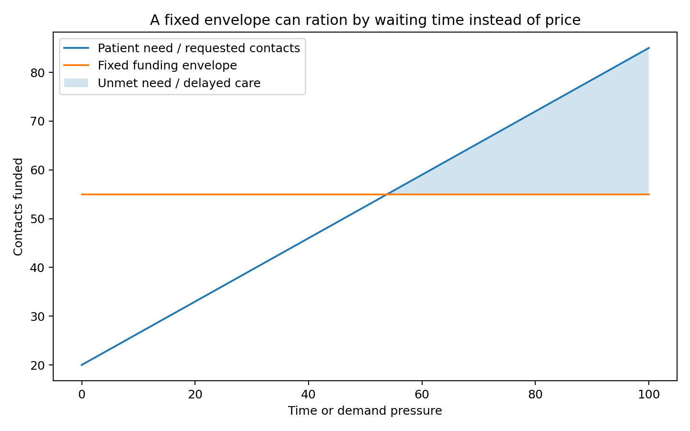

# Why formulas do not solve games

Funding formulas look technical. They feel objective. They use numbers, weights, datasets, regression models and official language.

But formulas do not remove politics. They often concentrate it.

New Zealand has seen this before with the Population-Based Funding Formula, which was used to distribute District Health Board funding. A New Zealand Medical Journal article analysed 487 newspaper articles about that formula between 2003 and 2016. The formula became a public flashpoint, especially in the South Island. A central theme was dissatisfaction with allocations and concern about transparency.

That should not surprise anyone.

A funding formula is a way of deciding shares. Once shares are at stake, everyone has a reason to argue that the formula misses something important.

Rurality. Deprivation. Age. Ethnicity. Unmet need. Complexity. Diseconomies of scale. Transport. Workforce costs. Growth. Decline. Fixed infrastructure. Historical underfunding. Future demand.

All of those things matter.

But the more variables you add, the more the debate becomes a contest about weights. One group says deprivation is underweighted. Another says rurality is underweighted. Another says age is underweighted. Another says historical utilisation bakes in past access failure. Another says the model punishes efficient providers. Another says it rewards providers who generate activity.

That does not mean formulas are useless. They are necessary. If public money is being allocated across populations, there must be some logic to the allocation.

But a formula can only answer one kind of question:

> How should a funding pool be distributed?

It cannot fully answer a different question:

> Should the pool itself be capped in a way that suppresses clinically useful activity?

That is the distinction I think matters in primary care.

The current capitation reweighting work is sensible. The Ministry of Health says the old formula was based on how people used general practice in the late 1990s. Since then New Zealand has changed: more long-term conditions, more multimorbidity, more treatment options, more complexity managed in the community, and different rural and deprivation patterns.

So yes, the formula should change.

But reweighting capitation does not solve the marginal-supply problem by itself.

It can make funding distribution fairer across practices. It can move more funding toward practices with higher-need enrolled populations. It can reduce some inequity. Those are good things.

But if the overall architecture remains heavily capped, the next appointment may still be weakly funded.

This is why I worry about “missing the wood from the trees”.

The tree is the formula. The wood is the system game.

The formula asks whether Practice A should get more than Practice B.

The game asks whether either practice can afford to provide the next clinically needed contact.

The formula asks whether rurality should have a higher weight.

The game asks whether a rural patient can actually see someone in person.

The formula asks whether multimorbidity is included.

The game asks whether complex patients get enough time, follow-up and coordination.

The formula asks whether deprivation is measured properly.

The game asks whether people in deprived communities are rationed by cost, waiting time or closed books.

The formula asks whether the model is fair.

The game asks whether the system grows in the right place.

That is why my proposal is not to stop capitation reweighting. It is to add another layer.

Keep improving the formula.

But do not expect the formula to do the job of a funding architecture.

The architecture should include:

- capitation for continuity and population accountability;
- uncapped scheduled fee-for-service for eligible primary medical contacts;
- targeted funding for priority programmes;
- place-based accountability to prevent cherry-picking;
- co-payment protections;
- transparent data;
- urgent-care and ambulance integration;
- audit and clinical governance.

That is more complicated than a formula.

But the system is complicated.

The danger is that we spend years arguing over capitation weights while the real supply constraint remains intact.

A better formula may distribute scarcity more fairly.

It may not remove the scarcity.

### The trap in formula politics

Formula fights are seductive because they look technical. Everyone can point to a variable. Age. Deprivation. Rurality. Ethnicity. Multimorbidity. Workforce cost. Practice size. Travel time.

All of those variables matter. But the deeper problem is that no formula can carry all the political expectations placed on it. If the total envelope is fixed, every added weight creates a redistribution. Someone gains. Someone loses. The debate then becomes a fight over the denominator, the coefficients and the evidence base.

---

**Deep dive:** I’ve kept the fuller explanation, game table, modelling notes and full source list in the [appendix for this post](../appendices-v1.5.1/appendix-04-why-formulas-do-not-solve-games-v1.5.1.md).

## Useful links

- [Ministry of Health: capitation reweighting](https://www.health.govt.nz/strategies-initiatives/programmes-and-initiatives/primary-and-community-health-care/capitation-reweighting)
- [Cabinet material: Primary Health Care Funding Improvements](https://www.health.govt.nz/information-releases/cabinet-material-primary-health-care-funding-improvements-and-update-on-primary-health-care)
- [New Zealand Medical Journal: media content analysis of the Population-Based Funding Formula](https://nzmj.org.nz/media/pages/journal/vol-131-no-1480/a-media-content-analysis-of-new-zealand-s-district-health-board-population-based-funding-formula/6ff2e1d910-1696474509/a-media-content-analysis-of-new-zealand-s-district-health-board-population-based-funding-formula.pdf)
- [New Zealand Medical Journal: Population-Based Funding Formula transparency article](https://nzmj.org.nz/media/pages/journal/vol-126-no-1376/6c9b9d56a4-1696469440/vol-126-no-1376.pdf)
- [Ministry of Health: PHO finances briefing](https://www.health.govt.nz/system/files/2025-11/H2025069314-Briefing-PHO-finances-a-summary-of-available-information.pdf)
