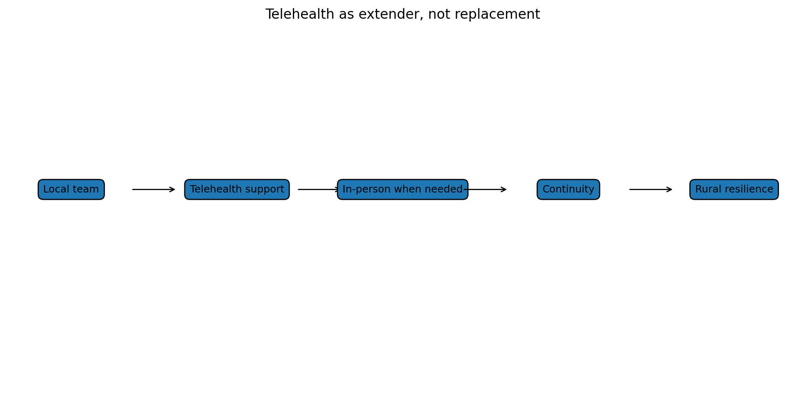

# Telehealth is an extender, not a replacement for local supply

Telehealth is useful.

It can save time. It can reduce travel. It can help people after hours. It can support rural communities. It can provide quick advice when a physical examination is not needed. It can connect patients to clinicians when local appointments are scarce.

But telehealth is not the whole answer.

Some problems need touch.

A clinician may need to listen to a chest, examine an abdomen, look in an ear, check a rash, assess hydration, dress a wound, remove sutures, feel a pulse, test mobility, take bloods, give an injection or simply see how someone walks into the room.

Some care also needs local knowledge.

Local clinicians know which services are actually available, which hospital is under pressure, which pharmacy is open, which families need extra support, which roads are cut off, which community providers can help and which patient is more unwell than they sound on the phone.

Telehealth can extend local care.

It can also undermine it if used badly.

If scalable virtual providers absorb the easier contacts, local practices may be left with complex, time-consuming, lower-margin work. That could weaken local viability. In rural areas, that matters. Once local in-person supply disappears, it is hard to rebuild.

So the telehealth game is a complement-versus-substitute game.

In the good equilibrium, telehealth supports local care. It provides overflow capacity, after-hours triage, advice, follow-up, prescription support and specialist input. It works with local records and local teams. It helps determine when in-person care is needed.

In the bad equilibrium, telehealth cherry-picks simple contacts, fragments records, weakens continuity and lets policymakers pretend rural access has been solved when it has not.

This is why the current reform pathway needs careful evaluation. A 24/7 digital general practitioner service may be valuable. But it should be measured against more than consultation numbers.

Questions to ask:

- Did it reduce emergency department demand?
- Did it improve continuity or fragment it?
- Did it reduce inequity or mainly help digitally confident patients?
- Did it reduce local practice viability?
- Did it increase or decrease follow-up burden?
- Did it safely identify when in-person care was needed?
- Did it support rural providers or replace them?

This also matters for funding.

If fee-for-service benefits are created, they should distinguish between contact types. Some contacts can be safely virtual. Some should have an in-person loading. Some should require local follow-up. Some should not be claimable virtually except in defined circumstances.

A rural in-person loading may be needed.

That means an extra payment signal for care that is physically present in rural or underserved communities. It recognises that local care has costs that digital care does not.

The goal is not to slow telehealth.

The goal is to stop telehealth being mistaken for total supply.

Telehealth is a bridge.

It should not become an excuse to remove the clinic, the nurse, the pharmacist, the paramedic, the visiting general practitioner or the rural hospital from the community.

### The rural risk

Telehealth can be wonderful for rural communities. It can reduce travel, improve follow-up, support medication reviews and give people faster advice when local appointments are scarce.

But it can also mask a deeper problem. If the local service keeps shrinking while telehealth grows, the community may appear to have access until someone needs examination, procedures, urgent assessment or continuity with a team that knows them.

That is the rural hollowing-out risk.

A funding model should therefore ask two questions at the same time.

First: can digital care improve access? Yes.

Second: does the model protect local in-person capacity when that capacity is clinically necessary? It must.

The goal is not nostalgia for old models of care. The goal is a mixed access system where digital care, local clinics, outreach, ambulance alternatives and urgent care are all funded for the jobs they do best.

### Telehealth can also change provider behaviour

Telehealth does not only change patient access. It changes the economics of supply. A digital provider can centralise clinicians, standardise workflows, reduce room costs and operate across geography. That can be good. It can also outcompete local in-person services for easier contacts.

If local clinics lose the simple work but remain responsible for the complex, procedural and urgent in-person work, their economics can worsen. That is a classic cream-skimming problem. The easy activity becomes scalable and remote. The hard activity stays local, expensive and underfunded.

So the policy design has to ask: does telehealth add capacity to the system, or does it pull the profitable activity away from local services?

---

**Deep dive:** I’ve kept the fuller explanation, game table, modelling notes and full source list in the [appendix for this post](../appendices-v1.5.1/appendix-12-telehealth-is-an-extender-not-a-replacement-for-local-supply-v1.5.1.md).

## Useful links

- [Ministry of Health: primary care health target](https://www.health.govt.nz/strategies-initiatives/programmes-and-initiatives/primary-and-community-health-care/primary-care-health-target)
- [Health New Zealand: National Primary Care Dataset and new primary care health target](https://www.healthnz.govt.nz/about-us/what-we-do/planning-and-performance/primary-care-tactical-action-plan/national-primary-care-dataset-and-new-primary-care-health-target)
- [Cabinet material: Primary Health Care Funding Improvements](https://www.health.govt.nz/information-releases/cabinet-material-primary-health-care-funding-improvements-and-update-on-primary-health-care)
- [Beehive: new and improved urgent and after-hours healthcare](https://www.beehive.govt.nz/release/new-and-improved-urgent-and-after-hours-healthcare)
- [Health New Zealand: the Ambulance Team](https://www.healthnz.govt.nz/about-us/what-we-do/programmes-and-initiatives/the-ambulance-team)
