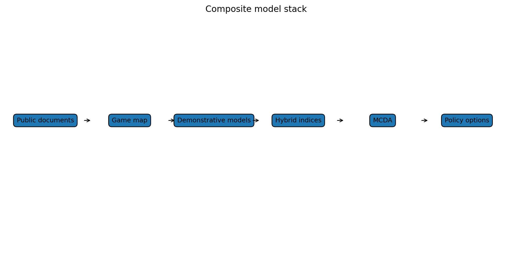

# Composite modelling: what the demonstrative model adds, and what it does not

I have been building this argument as a model, but I want to be clear about what kind of model it is.

It is not a fully calibrated predictive model.

It does not prove that a particular reform will reduce emergency department attendances by a specific percentage.

It does not prove a five-year fiscal saving.

It does not claim that every parameter is known.

At this stage, the model is demonstrative and source-informed. That means it does three things.

First, it maps the games.

Second, it turns those games into simple executable mechanisms.

Third, it asks whether different policy architectures move the system toward better or worse equilibria.

This is useful because it makes the argument falsifiable.

Instead of saying “I reckon capitation constrains supply”, the model asks: what would have to be true for that mechanism to matter? What parameter would drive it? What evidence would weaken it? What stakeholder would disagree? What data would we need?

The composite model combines several dimensions:

- supply generation;
- equity legitimacy;
- governance resilience;
- hospital deflection;
- fiscal and gaming risk.

A policy option that increases access but creates uncontrolled gaming should not score well.

A policy option that improves allocation but does not increase supply should not score well.

A policy option that improves supply but leaves high-need populations behind should not score well.

That is why the “loose benefits, weak controls” scenario performs poorly in the model. It improves access but creates gaming and equity risk.

The stronger scenario is the full hybrid architecture:

- capitation;
- uncapped eligible medical fee-for-service;
- place-based accountability;
- urgent and ambulance alternatives;
- scope-enabled providers;
- co-payment protections;
- data and audit;
- top-tier key performance indicators.

The model’s main insight is not a number.

The main insight is structural:

> Capitation reweighting improves allocation, but does not necessarily remove the marginal supply constraint. Uncapped eligible fee-for-service improves marginal supply, but requires place accountability and governance. Full hybrid architecture performs better than any single mechanism.

That is the insight.

The next step is not to pretend the model is predictive.

The next step is to use it as a decision-support and validation tool.

That means asking stakeholders:

- Do these games exist?
- Which games matter most?
- Which are overstated?
- Which policy options shift the games?
- Where are the biggest risks?
- What would you need to see before supporting the model?

Then targeted empirical checks can test the load-bearing assumptions:

- Does activity-sensitive payment increase primary care supply?
- Does unmet primary care need convert into ambulance and hospital demand?
- Does Accident Compensation Corporation activity funding stabilise primary care capacity?
- Does Primary Health Organisation intermediation create transaction cost or entry barriers?
- Can scope-enabled providers safely generate additional supply?

That is enough for the current policy conversation.

A fully calibrated model may be useful later.

But it is not necessary before publishing the argument.

The point now is to make the system game visible.

### Why bother modelling if it is not predictive yet?

A demonstrative model is useful for a different reason from a predictive model. It does not tell us exactly what will happen. It tells us whether the logic is coherent, where the assumptions are, and which assumptions matter most.

That is valuable at this stage because the policy debate is still confused. People can agree that access is a problem but disagree about whether the problem is funding quantum, formula design, professional scope, co-payments, urgent care, PHOs, hospitals, workforce or data.

The model forces those arguments into a structure.

If someone thinks the capitation marginal-supply problem is overstated, that can be scored differently. If someone thinks the cherry-picking risk is severe, that can be weighted heavily. If someone thinks urgent care will solve most of the problem, that can be tested.

The model is not a crystal ball. It is a disciplined argument. And disciplined arguments are easier to improve than loose ones.

### What the composite model adds

The composite model takes the individual games and asks how they behave together. That matters because a policy can look good in one game and bad in another.

For example, uncapped fee-for-service improves the marginal supply game. But if it has weak audit, weak place accountability and poor co-payment protections, it worsens the gaming and equity games. Capitation reweighting improves distribution, but may not move the marginal supply game enough. Urgent-care funding may reduce some hospital pressure, but only if it connects to primary care, ambulance and follow-up.

---

**Deep dive:** I’ve kept the fuller explanation, game table, modelling notes and full source list in the [appendix for this post](../appendices-v1.5.1/appendix-16-composite-modelling-what-the-demonstrative-model-adds-and-what-it-does-not-v1.5.1.md).

## Useful links

- [STRESS reporting guideline for empirical simulation studies](https://www.equator-network.org/reporting-guidelines/strengthening-the-reporting-of-empirical-simulation-studies-introducing-the-stress-guidelines/)
- [ODD protocol for agent-based models](https://www.usgs.gov/publications/odd-protocol-describing-agent-based-and-other-simulation-models-a-second-update)
- [ISPOR-SMDM modelling good research practices](https://www.ispor.org/heor-resources/good-practices/article/modeling-good-research-practices---overview)
- [PRISMA extension for Scoping Reviews](https://www.prisma-statement.org/scoping)
- [ISPOR: MCDA for healthcare decision-making](https://www.ispor.org/heor-resources/good-practices/article/multiple-criteria-decision-analysis-for-health-care-decision-making---an-introduction)
