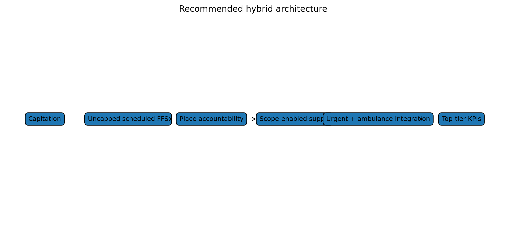

# Recommendations: a primary care system that can grow before hospitals have to

Here is the practical version of the proposal.

New Zealand should not abandon capitation.

It should not simply copy Medicare.

It should not create an uncontrolled fee-for-service system.

It should not pretend telehealth replaces local care.

It should not let Primary Health Organisation debates become a proxy war between incumbents, corporate entrants and provider groups.

It should not spend years arguing only about capitation weights.

It should build a hybrid architecture.

## Recommendation 1: Keep and reweight capitation

Capitation should remain for continuity, enrolment, preventive care, proactive follow-up, team-based care, population responsibility and baseline practice viability.

The current reweighting work is necessary.

But it is not sufficient.

## Recommendation 2: Add an uncapped eligible primary medical fee-for-service stream

Eligible primary medical activity should be able to grow when patients need it.

This should be modelled on the logic of Accident Compensation Corporation treatment payments: scheduled contribution rates, clinical necessity, documentation, provider qualifications, scope rules, audit and pre-approval where needed.

The stream should start with defined high-value contacts: urgent primary medical care, complex consultations, rural in-person care, minor procedures, ambulance follow-up, emergency department discharge follow-up and other hospital-avoidance contacts.

## Recommendation 3: Add place-based accountability

Uncapped activity without place accountability risks cherry-picking.

Every locality needs responsibility for hard-to-reach patients, rural communities, Māori and Pacific populations, disabled people, older people, complex patients and people without digital access.

This is where Primary Health Organisations, locality entities, iwi Māori partnership, Māori providers, Pacific providers and Health New Zealand commissioning may still have important roles.

## Recommendation 4: Separate PHO functions from PHO intermediation

Do not ask whether Primary Health Organisations are good or bad.

Ask which functions add value and which payment-gateway functions create opacity or friction.

Financial transparency, pass-through rules, non-capitated funding and performance accountability should be much clearer.

## Recommendation 5: Treat urgent care and ambulance as access infrastructure

Urgent care and ambulance are not side issues. They are part of the upstream access system.

Ambulance should be measured not only on response time, but on safe alternative disposition, non-conveyance, handover delay and connection to primary or urgent care.

Urgent care should be integrated with general practice, Accident Compensation Corporation, digital care and emergency departments.

## Recommendation 6: Let provider scope generate safe supply

Funding should follow eligible contact types and scope of practice, not professional habit.

General practitioners, nurse practitioners, nurses, pharmacists, paramedics, physiotherapists, mental health workers and Māori and Pacific providers can all generate supply in different ways.

Clinical governance should determine safety.

## Recommendation 7: Protect patients from co-payment harm

Co-payments can be a demand signal, but they can also block necessary care.

Use low or zero co-payments for priority groups and essential contacts. Publish fees. Monitor unmet need by deprivation, ethnicity, disability, rurality and age.

## Recommendation 8: Lift primary care and ambulance to top-tier accountability

Primary care and ambulance outcomes should sit beside hospital targets, not beneath them.

Measure access, closed books, co-payment burden, urgent care access, ambulance alternatives, continuity, patient experience, avoidable admissions and equity.

## Recommendation 9: Use the model as a validation tool

Do not wait for a fully calibrated predictive model before starting the conversation.

Use the game map, demonstrative modelling and Multi-Criteria Decision Analysis to run stakeholder workshops and identify the load-bearing assumptions.

Then test five things:

- marginal supply response;
- unmet primary care to hospital flow;
- Accident Compensation Corporation stabilisation effects;
- Primary Health Organisation transaction costs;
- scope-enabled provider safety and productivity.

## The final line

The issue is not whether New Zealand has started reform. It has.

The issue is whether the reform changes the game enough.

My answer is: not yet.

The next step is a hybrid model:

> capitation for responsibility, uncapped eligible fee-for-service for primary medical activity, place-based accountability for equity, and urgent/ambulance integration for hospital avoidance.

That is the model I think New Zealand should test.

### What I would do first

I would not start with a national big-bang implementation. I would start with a tightly designed policy trial.

Choose a few regions with different access problems: one metropolitan area, one rural area, one mixed area with high deprivation, and one area with significant urgent-care or ambulance pressure. Define eligible primary medical contact types. Set the public benefit. Apply co-payment protections. Allow claims from accredited providers working within scope. Require place-based accountability. Track appointment access, emergency department flow, ambulance conveyance, patient cost, provider behaviour, equity and safety.

Then compare it against the current reform pathway.

---

**Deep dive:** I’ve kept the fuller explanation, game table, modelling notes and full source list in the [appendix for this post](../appendices-v1.5.1/appendix-18-recommendations-a-primary-care-system-that-can-grow-before-hospitals-have-to-v1.5.1.md).

## Useful links

- [Ministry of Health: capitation reweighting](https://www.health.govt.nz/strategies-initiatives/programmes-and-initiatives/primary-and-community-health-care/capitation-reweighting)
- [Cabinet material: Primary Health Care Funding Improvements](https://www.health.govt.nz/information-releases/cabinet-material-primary-health-care-funding-improvements-and-update-on-primary-health-care)
- [Ministry of Health: primary care health target](https://www.health.govt.nz/strategies-initiatives/programmes-and-initiatives/primary-and-community-health-care/primary-care-health-target)
- [Health New Zealand: National Primary Care Dataset and new primary care health target](https://www.healthnz.govt.nz/about-us/what-we-do/planning-and-performance/primary-care-tactical-action-plan/national-primary-care-dataset-and-new-primary-care-health-target)
- [Accident Compensation Corporation: paying patient treatment](https://www.acc.co.nz/for-providers/invoicing-us/paying-patient-treatment)
