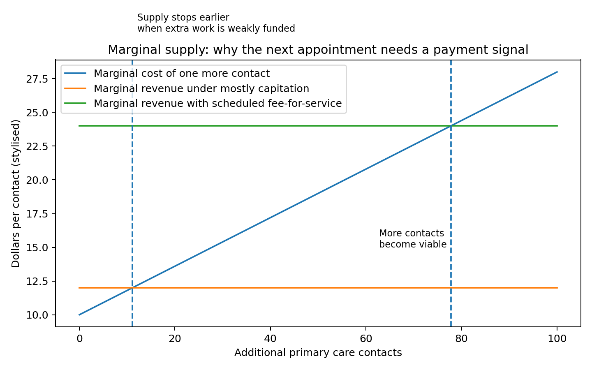

# The capitation marginal-supply game and the consumer access game

The capitation supply game is simple.

A clinic receives a fixed payment for an enrolled person. That payment supports the practice and gives it responsibility for that person’s care.

But the patient’s need can change.

They might become frail. They might develop diabetes. They might need mental health care. They might have a child with repeated infections. They might need forms, follow-up, prescriptions, referrals and coordination.

The workload rises.

The fixed payment does not necessarily rise with each contact.

At some point, the practice faces a choice. It can absorb the extra work, charge more, shorten appointments, limit enrolments, increase waits, rely on triage, use telehealth where possible, or direct people elsewhere.

That is not a moral failure. It is a predictable supply response.

New Zealand has public evidence of this pressure. A New Zealand Medical Journal study found that in 2022 only 28 percent of surveyed general practices were freely enrolling new people, while 79 percent had closed or limited enrolments at some point since 2019. Another area-based analysis found that 33 percent of general practices had closed books in June 2022.

Closed books are important because they show a boundary in the capitation model.

In theory, capitation gives a practice a financial incentive to enrol more patients. In practice, a practice may decide that more enrolments would overload staff, reduce quality or worsen burnout.

That is the supply constraint.

The patient access game follows from it.

A patient who cannot get timely primary care has choices, but they are not equal choices.

They can wait.

They can pay more.

They can use an online service.

They can go to urgent care.

They can call an ambulance.

They can go to an emergency department.

They can give up.

A wealthy, digitally connected person in an urban area has more options. A rural person, disabled person, older person, Māori or Pacific patient, or a person with low income may have fewer practical options.

This is where equity enters the model.

When a system says it is controlling costs, it must ask: controlling costs for whom?

If the public budget is controlled by pushing cost, delay or risk onto patients, practices, ambulance or hospitals, the saving may be an illusion.

The need still exists.

The New Zealand Health Survey shows this access problem in plain terms. In 2023/24, one in four adults reported that the time taken to get an appointment was too long as a barrier to visiting a general practitioner. One in six adults reported cost as a barrier. Over five years, general practitioner visits decreased while emergency department visits increased for adults and children.

That does not prove one caused the other. But it supports the hypothesis that upstream access constraints and downstream hospital demand need to be analysed together.

The microeconomic point is straightforward.

A fixed funding envelope can ration by waiting time.

If patient need rises faster than funded upstream capacity, something has to give.

In a well-designed system, some of that increased need should be met in primary care, urgent care, community pharmacy, nurse practitioner services, allied health, paramedic pathways and virtual care.

In a poorly designed system, the need leaks into the emergency department.

That is why capitation should be kept, but not asked to do everything.

Capitation is for responsibility.

Fee-for-service is for eligible activity.

Place accountability is for whole populations.

Co-payment protections are for equity.

Data is for visibility.

The patient does not care what the funding model is called.

They care whether care exists.

### The patient game is not theoretical

Patients play the game too, although usually not by choice. They make decisions inside the rules the system gives them.

If the general practice appointment is two weeks away, the patient may wait. If they are worried, they may go to urgent care. If they cannot afford the fee, they may delay. If they cannot travel, they may choose telehealth. If the problem gets worse, they may call an ambulance or present to an emergency department.

None of those choices is irrational. The patient is responding to access, cost, worry, transport, time off work and trust.

That is why access targets have to be interpreted carefully. A target that rewards fast appointments can help. But it can also create pressure to prioritise simple, bookable activity over complex planned care. It can change booking behaviour without actually solving capacity.

## What would change my mind?

I would be less convinced if fixed capitation did not affect the marginal decision to add appointments, or if consumers did not shift between delay, payment, telehealth, ambulance and emergency departments when access changes.

---

**Deep dive (optional, not required reading):** I’ve kept the fuller explanation, game table, modelling notes and full source list in the [appendix for this post](../appendices-v1.6.0/appendix-08-the-capitation-marginal-supply-game-and-the-consumer-access-game-v1.6.0.md).

## Useful links

- [Ministry of Health: capitation reweighting](https://www.health.govt.nz/strategies-initiatives/programmes-and-initiatives/primary-and-community-health-care/capitation-reweighting)
- [Ministry of Health: primary care health target](https://www.health.govt.nz/strategies-initiatives/programmes-and-initiatives/primary-and-community-health-care/primary-care-health-target)
- [Health New Zealand: National Primary Care Dataset and new primary care health target](https://www.healthnz.govt.nz/about-us/what-we-do/planning-and-performance/primary-care-tactical-action-plan/national-primary-care-dataset-and-new-primary-care-health-target)
- [Ministry of Health: New Zealand Health Survey annual update](https://www.health.govt.nz/publications/annual-update-of-key-results-202324-new-zealand-health-survey)
- [Cochrane: payment methods for outpatient healthcare providers](https://www.cochrane.org/evidence/CD011865_payment-methods-healthcare-providers-outpatient-healthcare-settings)
