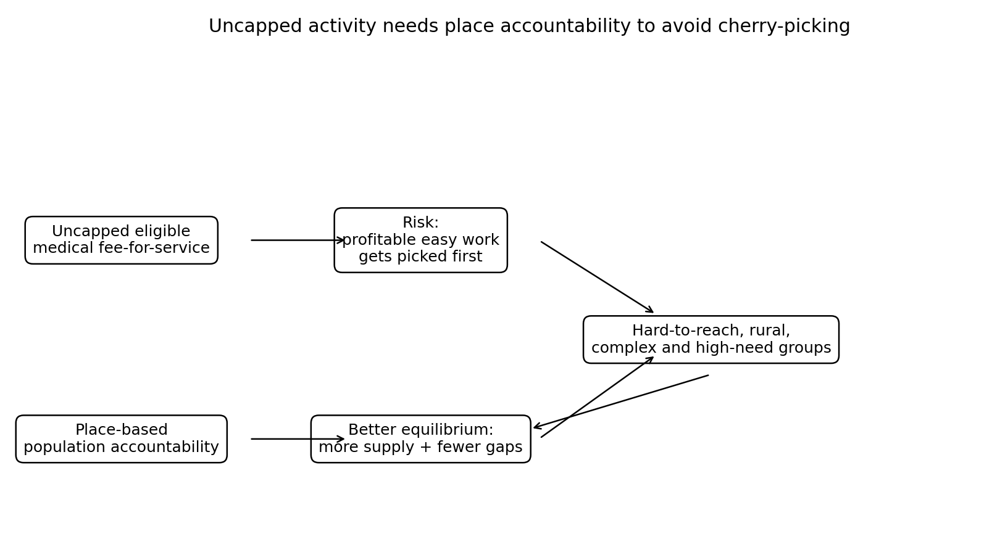

# Primary Health Organisations: useful functions, payment friction and cherry-picking

It is easy to make the Primary Health Organisation debate too simple.

One version says Primary Health Organisations are essential because they support population health, integration, quality improvement and local relationships.

Another version says Primary Health Organisations are bureaucratic intermediaries that sit between funding and frontline care.

Both can be true in different places.

That is why the better distinction is not “keep Primary Health Organisations” versus “abolish Primary Health Organisations”.

The better distinction is:

> Which functions add value, and which intermediation creates friction?

A Primary Health Organisation may add value by supporting outreach, immunisation, quality improvement, data, population health, locality planning, Māori and Pacific providers, and smaller practices that cannot do everything alone.

But payment intermediation can also create problems. It can reduce transparency. It can create pass-through disputes. It can add contracting complexity. It can make it harder for new providers to enter. It can allow different organisations to accumulate reserves or manage non-capitated funding in different ways.

The Ministry of Health’s PHO finance briefing is important here. It says the Ministry does not have direct access to information about Primary Health Organisations’ financial activity and ownership structures. It also says Primary Health Organisations vary widely and do not appear to follow uniform accounting practices, which constrains monitoring and regulation.

That does not prove Primary Health Organisations are bad.

It proves we need more transparent accountability.

The recent market-entry story makes this more interesting. Tend has been approved as its own Primary Health Organisation. Green Cross has reportedly moved toward its own entity. GenPro has sponsored thePHO. These developments could reduce bureaucracy for some providers, but they also raise questions about corporate power, provider ownership, market positioning and whether Primary Health Organisation status becomes a competitive asset.

That is the Primary Health Organisation intermediation game.

But there is another game that is just as important: cherry-picking.

If we create an uncapped primary medical fee-for-service stream, providers may rationally focus on easier, more profitable work. They may deliver lots of short, low-complexity contacts while hard-to-reach patients remain underserved.

That is not a reason to reject fee-for-service.

It is a reason to pair fee-for-service with place-based accountability.

Place-based accountability means someone is responsible for the whole population in a defined area, not only the people who are easy to serve.

That includes:

- rural patients;
- Māori and Pacific communities;
- disabled people;
- older people;
- people without digital access;
- people with transport barriers;
- people with complex multimorbidity;
- people who are not profitable in a simple activity model.

The Health and Disability System Review recommended a locality approach and said Tier 1 services should be planned around local needs. It also said there should be no requirement to contract primary care through the national Primary Health Organisation Services Agreement.

That combination is useful.

It suggests a middle path:

- national benefit rules for eligible activity;
- direct claiming where appropriate;
- transparent pass-through and financial reporting;
- optional Primary Health Organisation or locality support functions;
- place-based population accountability;
- equity obligations;
- data that shows who is not being reached.

The diagram below shows the risk.

The policy challenge is not just to create more primary care contacts.

It is to create the right contacts, in the right places, for the people most likely to be missed.

That is why I do not want a pure market model.

I want a hybrid.

Uncapped eligible medical activity can help supply grow.

Place-based accountability can stop that growth becoming selective.

Both are needed.

### Why place-based accountability belongs in the model

A national fee-for-service stream can increase activity. That is the point. But if it is not paired with place-based accountability, it can also allow providers to select easier work.

A provider might focus on simple contacts, low-risk patients, urban convenience care or services that are easiest to deliver remotely. Meanwhile, people with complex needs, low income, poor transport, disability, rurality, housing instability or low trust in the system can remain under-served.

That is why I do not think the answer is simply “make everything claimable”.

The better answer is: make eligible primary medical activity claimable, but require the system to remain accountable for whole populations. That may involve Primary Health Organisations, locality structures, Māori and Pacific providers, community health organisations, outreach teams, rural networks and other forms of commissioning.

The funding stream should help generate care. The place-based layer should make sure the care reaches the people who are hardest to reach.

### Why PHOs should not be treated as one thing

## What would change my mind?

I would be less convinced if PHO intermediation were transparent, low-cost, consistently passed through, and clearly superior to direct claiming plus place-based commissioning for the relevant functions.

---

**Deep dive (optional, not required reading):** I’ve kept the fuller explanation, game table, modelling notes and full source list in the [appendix for this post](../appendices-v1.6.0/appendix-09-primary-health-organisations-useful-functions-payment-friction-and-cherry-picking-v1.6.0.md).

## Useful links

- [Ministry of Health: PHO finances briefing](https://www.health.govt.nz/system/files/2025-11/H2025069314-Briefing-PHO-finances-a-summary-of-available-information.pdf)
- [Ministry of Health: meeting with General Practice New Zealand, July 2025](https://www.health.govt.nz/system/files/2025-11/H2025070512-Aide-Memoire-Meeting-with-General-Practice-New-Zealand-on-31-July-2025.pdf)
- [Health and Disability System Review final report](https://www.health.govt.nz/system/files/2022-09/health-disability-system-review-final-report.pdf)
- [Ministry of Health: capitation reweighting](https://www.health.govt.nz/strategies-initiatives/programmes-and-initiatives/primary-and-community-health-care/capitation-reweighting)
- [Cabinet material: Primary Health Care Funding Improvements](https://www.health.govt.nz/information-releases/cabinet-material-primary-health-care-funding-improvements-and-update-on-primary-health-care)
