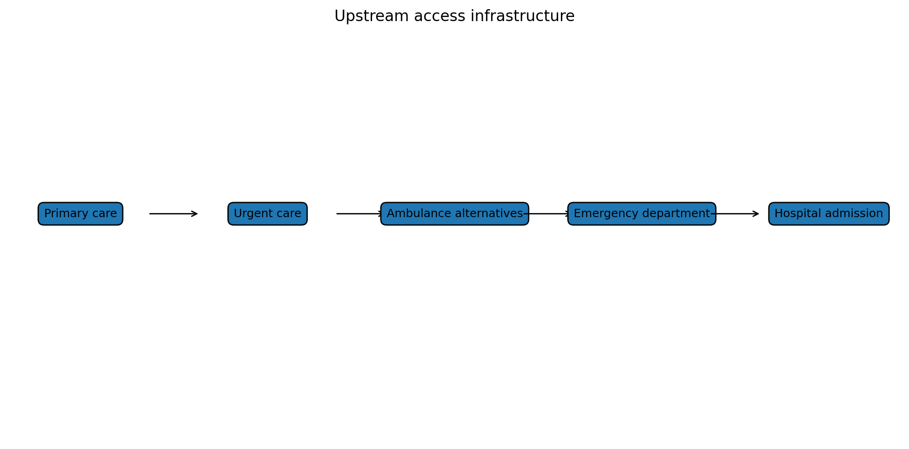

# Accident Compensation Corporation, ambulance and urgent care: the hidden upstream system

Primary care is not the only upstream part of the health system.

Urgent care, ambulance and Accident Compensation Corporation-funded injury care all matter.

They are different systems, but they meet the same person.

A person with a painful injury may see a general practitioner, nurse practitioner, physiotherapist, urgent care doctor, pharmacist, ambulance crew or emergency department.

Which path they take is shaped by funding rules.

Accident Compensation Corporation matters because it already funds activity in a way that looks more like fee-for-service. It pays or contributes to treatment under Cost of Treatment Regulations, contracts or purchase orders. It has rules about provider qualifications, clinical necessity, documentation, scope and pre-approval.

That is why I use Accident Compensation Corporation as an analogy.

Not because injury funding and general medical care are the same. They are not.

The analogy is that Accident Compensation Corporation shows New Zealand can run a rules-based, activity-sensitive payment architecture.

It can pay for eligible contacts without setting a hard global cap on all activity.

Ambulance matters because it is not only transport. It is access infrastructure.

If ambulance services are funded and governed only as conveyance-to-hospital services, the emergency department becomes the default destination. If ambulance services can safely treat and refer, hear and treat, link to urgent care, arrange primary care follow-up, access diagnostics or connect to community pathways, they can reduce hospital flow.

That requires funding and accountability.

Urgent care matters because it sits between primary care and hospital. The Government has invested in urgent and after-hours services, with a stated aim that 98 percent of New Zealanders can access urgent care within one hour’s drive. That is a major policy shift.

But urgent care can become another silo if it is not integrated with primary care, ambulance, Accident Compensation Corporation, digital care and hospital pathways.

The risk is fragmentation.

A patient might choose between:

- capitation-funded general practice;
- co-payment general practice;
- Accident Compensation Corporation injury care;
- urgent care;
- ambulance;
- digital general practitioner services;
- emergency department;
- doing nothing.

The patient does not experience these as separate appropriations. They experience them as a messy access system.

This creates an Accident Compensation Corporation / Health New Zealand cross-funder game.

If Accident Compensation Corporation tightens payments in isolation, some activity may move to Health New Zealand-funded services or to hospitals. If Health New Zealand underfunds primary medical access, some patients may prefer an Accident Compensation Corporation-funded pathway when injury is involved. If urgent care is easier to access than general practice, urgent care may absorb demand that might otherwise be handled by a regular care team.

None of this is inherently wrong.

But it should be modelled as a whole system.

That is why the recommendation is to treat primary care, urgent care and ambulance as a connected upstream access architecture.

The architecture should include:

- eligible medical fee-for-service contacts;
- Accident Compensation Corporation injury pathways;
- urgent care alternatives to emergency departments;
- ambulance non-conveyance and safe follow-up;
- shared data;
- shared performance measures;
- provider-scope flexibility;
- co-payment protections;
- place accountability.

If those pieces are designed separately, the system will game itself.

If they are designed together, they can reduce hospital growth by default.

### The funding-source problem

One of the strangest features of the New Zealand system is that two patients can enter the same clinic, see similar staff, use similar rooms, and trigger very different payment pathways depending on whether the problem is injury-related.

If the problem is covered by Accident Compensation Corporation, a treatment contribution or contract payment may be available. If the problem is not injury-related, the payment logic can be different.

Providers notice this. Patients notice it indirectly through fees and access. Funders notice it through cost pressure.

The risk is that each funder tries to optimise its own budget without seeing the full system effect. If Accident Compensation Corporation tightens payment in isolation, some primary care supply may become less viable. If Health New Zealand underfunds urgent primary care, ambulance and hospitals absorb more pressure.

That is why I think Accident Compensation Corporation, urgent care and ambulance must sit inside the same analysis as general practice funding. They are not side issues. They are part of the same access game.

### Urgent care is the stress test

Urgent care is where the theory becomes very practical. A person has a problem now. They may not need a hospital, but they do need timely assessment. If that option does not exist, the emergency department becomes the default.

## What would change my mind?

I would be less convinced if Accident Compensation Corporation and ambulance payment settings had little effect on primary, urgent, allied health and emergency department flows.

---

**Deep dive (optional, not required reading):** I’ve kept the fuller explanation, game table, modelling notes and full source list in the [appendix for this post](../appendices-v1.6.0/appendix-10-accident-compensation-corporation-ambulance-and-urgent-care-the-hidden-upstream-system-v1.6.0.md).

## Useful links

- [Accident Compensation Corporation: paying patient treatment](https://www.acc.co.nz/for-providers/invoicing-us/paying-patient-treatment)
- [Ministry of Business, Innovation and Employment: ACC regulated payments for treatment](https://www.mbie.govt.nz/business-and-employment/employment-and-skills/employment-legislation-reviews/increasing-regulated-acc-payments-for-treatment/proposed-updates-to-acc-regulated-payments-for-treatment/options-for-payment-increases-and-how-they-were-assessed)
- [Accident Compensation Corporation: using claims data](https://www.acc.co.nz/about-us/using-our-claims-data)
- [Health New Zealand: the Ambulance Team](https://www.healthnz.govt.nz/about-us/what-we-do/programmes-and-initiatives/the-ambulance-team)
- [Beehive: new and improved urgent and after-hours healthcare](https://www.beehive.govt.nz/release/new-and-improved-urgent-and-after-hours-healthcare)
