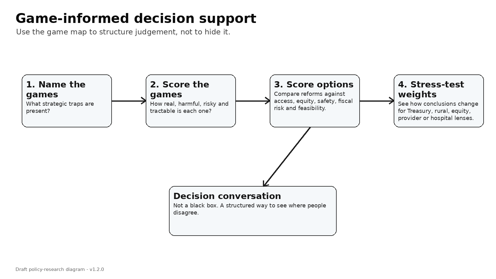

# Game-informed Multi-Criteria Decision Analysis: making disagreement useful

Multi-Criteria Decision Analysis sounds technical, but the idea is simple.

When a decision has many competing goals, make the trade-offs visible.

Primary care funding has many goals.

We want access. We want continuity. We want equity. We want fiscal control. We want rural care. We want less hospital pressure. We want less gaming. We want provider viability. We want patient choice. We want local relationships. We want national consistency.

No policy option maximises all of these at once.

That is why disagreement is inevitable.

A Treasury official may give more weight to fiscal risk.

A rural provider may give more weight to in-person access.

A Māori provider may give more weight to trust, whānau-centred care and Te Tiriti legitimacy.

A general practice owner may give more weight to viability and pass-through.

A hospital manager may give more weight to emergency department deflection.

A Primary Health Organisation may give more weight to place-based integration.

A patient advocate may give more weight to cost and choice.

Multi-Criteria Decision Analysis does not remove those disagreements. It structures them.

The game-informed version asks two questions.

First, where does each game currently sit?

For example, is the capitation marginal-supply game a major problem or a minor one? Is the Primary Health Organisation intermediation game real or overstated? Is the urgent-care policy game tractable? Is the co-payment game too risky? Is the hospital salience game the main driver?

Second, which policy option shifts the system toward a better equilibrium?

A simple scorecard might compare:

- current reform pathway;
- capitation reweighting only;
- current reform plus place accountability;
- uncapped eligible medical fee-for-service;
- uncapped eligible fee-for-service plus capitation and place accountability;
- urgent/ambulance alternatives only;
- scope-enabled supply only;
- weak-control demand-led benefits;
- hospital investment priority.

Each option can be scored against criteria:

- access and supply generation;
- hospital deflection;
- equity and Te Tiriti legitimacy;
- rural and in-person resilience;
- fiscal sustainability;
- gaming and low-value activity risk;
- administrative simplicity and market entry;
- governance and clinical safety;
- political feasibility;
- data and accountability readiness;
- comprehensive population responsibility.

The result is not a magic ranking.

It is a conversation tool.

If people disagree, that is useful. The disagreement tells us where the policy uncertainty sits.

If everyone agrees that access matters but disagrees about gaming risk, then gaming control becomes the design focus.

If everyone agrees that urgent care matters but disagrees about evidence, then urgent-care advice and outcomes become the research focus.

If everyone agrees that capitation reweighting is useful but not sufficient, then the question becomes what second mechanism should be added.

This is why MCDA belongs in the package.

The game map explains the traps.

The demonstrative model tests the logic.

The MCDA helps decision-makers decide which traps matter most.

### What disagreement can teach us

The most useful outcome of a Multi-Criteria Decision Analysis may not be agreement. It may be clearer disagreement.

A hospital leader may weight hospital deflection highly. A rural provider may weight local in-person resilience. A Māori provider may weight trust, whānau-centred care and Te Tiriti legitimacy. Treasury may weight fiscal sustainability. A general practice owner may weight viability and administrative simplicity. An ambulance leader may weight alternative disposition and handover delays.

Those are not just opinions. They are different views of the same game.

The value of the method is that it makes those values visible. Instead of pretending the decision is purely technical, it asks people to say what they care about, how confident they are, and what risks they are willing to tolerate.

That is much better than hiding judgement inside a formula and calling it neutral.

### Why MCDA belongs after the game map

Multi-Criteria Decision Analysis works best when the decision problem has already been structured. The game map does that structuring. It says: these are the traps; these are the players; these are the incentives; these are the plausible failure modes.

The Multi-Criteria Decision Analysis then asks: which outcomes matter most, which options perform best, and how does the answer change when different people weight the criteria differently?

That ordering is important. Without the game map, the Multi-Criteria Decision Analysis can become a generic scoring exercise. With the game map, it becomes a way to test whether a policy shifts the system out of bad equilibria.

### What I would ask stakeholders

I would ask them to score each game on five questions. Is it real? Is it harmful? Does it drive hospital pressure? Does it worsen equity? Is it tractable?

## What would change my mind?

I would be less convinced if a decision process without Multi-Criteria Decision Analysis could make the trade-offs more transparent. At the moment, disagreement is often hidden inside slogans.

---

**Deep dive (optional, not required reading):** I’ve kept the fuller explanation, game table, modelling notes and full source list in the [appendix for this post](../appendices-v1.6.0/appendix-17-game-informed-multi-criteria-decision-analysis-making-disagreement-useful-v1.6.0.md).

## Useful links

- [ISPOR: MCDA for healthcare decision-making](https://www.ispor.org/heor-resources/good-practices/article/multiple-criteria-decision-analysis-for-health-care-decision-making---an-introduction)
- [ISPOR-SMDM modelling good research practices](https://www.ispor.org/heor-resources/good-practices/article/modeling-good-research-practices---overview)
- [PRISMA extension for Scoping Reviews](https://www.prisma-statement.org/scoping)
- [Ministry of Health: primary care health target](https://www.health.govt.nz/strategies-initiatives/programmes-and-initiatives/primary-and-community-health-care/primary-care-health-target)
- [Health New Zealand: National Primary Care Dataset and new primary care health target](https://www.healthnz.govt.nz/about-us/what-we-do/planning-and-performance/primary-care-tactical-action-plan/national-primary-care-dataset-and-new-primary-care-health-target)
