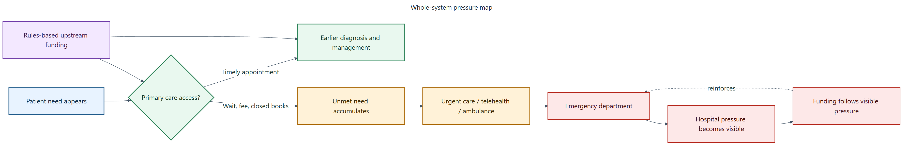

# Are we buying hospital growth by rationing cheaper care upstream?

**Subtitle:** The upstream-care question behind hospital pressure, access gaps, and avoidable escalation.

There is a simple question underneath a lot of New Zealand health policy.

Are we managing primary care, urgent care and ambulance services so tightly that we are unintentionally buying more hospital demand?

That sounds provocative. I do not mean it as a slogan. I mean it as a system-design question.

Primary care is usually the cheaper, earlier and more human part of the system. It is where a person asks about a cough before it becomes pneumonia. It is where a child’s fever is assessed before a parent panics and goes to the emergency department. It is where blood pressure, diabetes, pain, frailty, prescriptions, forms, mental health and uncertainty are dealt with before they become bigger problems.

*Figure 1. Whole-system flow. Read this as a pressure map: constrained primary care pushes more patients toward urgent and hospital settings.*

A caution: Current reforms may already improve this problem, it’s just that the policy isn’t particularly transparent. This post is not saying nothing is happening. Nor am I using it as a platform to address NZ’s extensive Duty of Candour problem. It asks whether the reforms change the upstream supply game enough, or whether hospital demand still becomes the visible pressure valve. Also, just because change has occurred, 1) doesn’t mean it’s the right/effective change, and 2) doesn’t mean it’s occured for the correct reasons.

But primary care does not expand by magic. Someone has to pay for the next appointment. Someone has to fund the room, the nurse, the doctor, the pharmacist, the nurse practitioner, the receptionist, the software, the phone calls, the follow-up and the risk. Many forget that primary care in NZ is only partly[ publicly funded and entirely privately delivered](https://www.thepost.co.nz/nz-news/360984722/risks-we-run-labelling-all-changes-needed-health-privatisation).

That is why funding architecture matters.

*(Wait, want to skip the reading and play with the numbers yourself? Try the **Primary Care Pulse interactive dashboard** [here] to see how these funding choices actually change the system).*

When people hear “primary care funding”, they often think the debate is just about whether general practitioners should be paid more. That is too narrow. Of course money matters. But the deeper issue is how the money moves.

A funding model is not just accounting. It is a set of rules. It tells providers what work is viable, what work is risky, what work is invisible, what work is someone else’s problem and what work citizens are “on their own” for.

In New Zealand, the [core funding model](https://www.health.govt.nz/strategies-initiatives/programmes-and-initiatives/primary-and-community-health-care/capitation-reweighting) for general practice is capitation. Capitation means a clinic receives a fixed amount per enrolled person each year. The Ministry of Health says capitation was introduced in 2002 and remains the core way general practice is funded. The formula is now being reweighted because the old formula no longer reflects today’s population, complexity, rurality and deprivation.

That reweighting is sensible. But it may not be enough.

Here is the problem. Capitation is good at giving a practice responsibility for a population. It is useful for continuity and planned care. But once a patient is enrolled, the next appointment often creates extra cost without an equivalent extra payment. Capitation cannot be a solution to all-of-population health, because no one is even remotely close to that solution.

That is what economists call a marginal problem. Marginal just means “the next one”. The next consultation. The next phone call. The next urgent appointment. The next wound dressing. The next follow-up. The next rural session. The next child with a fever.

If the next piece of work is weakly funded, the system will eventually ration it. Rationing may not look like a sign on the door. It may look like a three-week wait, closed books, higher co-payments, shorter appointments, fewer rural clinics, care that is different for some compared to others, or patients being told to try online care or go to the emergency department.

> The need does not disappear. It moves. It may become latent and hidden.

Some of it moves to urgent care. Some moves to ambulance. Some moves to hospital. Some becomes silent unmet need. Some becomes worse illness later.

This is where the hospital always has an advantage. Hospital pressure is visible. Ambulances ramping outside an emergency department are visible. Waiting lists are visible. Media stories about delayed cancer treatment are visible. A missed primary care appointment is not visible in the same way.

So the system can end up doing something perverse. It tightly manages growth in the lower-cost, earlier-intervention parts of the system, using contracting mechanisms that can be strictly adhered to, then funds the more expensive hospital consequences later.

> That is the “hospital growth by default” hypothesis.

The answer is not to abolish capitation. Capitation has important strengths. The answer is also not to create an uncontrolled fee-for-service free-for-all. Fee-for-service means paying for each service, and if it is poorly designed it can reward low-value volume.

The answer is a hybrid. Hybrid models are well established and are referred to as blended funding models.

My working proposal is this:

Keep capitation for continuity and population responsibility. Add an uncapped, rules-based, fee-for-service stream for eligible primary medical activity, similar in logic to Accident Compensation Corporation treatment payments. Pair that with place-based accountability so providers cannot simply cherry-pick easy work.

Uncapped does not mean uncontrolled. It means the total volume of eligible primary medical work is not artificially fixed in advance. The controls sit elsewhere: item rules, public contribution rates, clinical necessity, provider scope, documentation, audit, co-payment protections, and accountability for whole populations.

That is the “big idea” in this series, albeit the intention is to provide context, background, mechanistic and empirical modelling that support this suggestion.

I want to explain it slowly, which is why I’ve drawn it out over so many posts. I will cover fee-for-service, capitation, co-payments, primary health organisations, Accident Compensation Corporation, urgent care, ambulance, game theory, microeconomics, modelling, and why formula fights can go on forever without solving the real problem.

## What would change my mind?

I would be less convinced if better appointment data showed that tight control of upstream care was not associated with higher emergency department use, ambulatory-sensitive admissions/presentations, longer waits, closed books, or delayed care once need, rurality and deprivation were taken into account.

**Deep dive (optional, not required reading):** I’ve kept the fuller explanation, game table, modelling notes and full source list in the appendix for this post.

**Note:** This series is exploratory policy analysis. It is not a party-political argument, not a position sponsored by an external body, not a claim that any single funding model is perfect, and not a calibrated prediction of savings. The central question is whether New Zealand’s current funding architecture lets lower-cost upstream care expand safely before need becomes hospital demand.

**Disclosures:** I haven’t received any funding for this work nor have I been asked to produce it for any other reason. I don’t personally benefit from the proposal, as I do not work as a primary care practitioner.

## Useful links

- Ministry of Health: capitation reweighting
- Cabinet material: Primary Health Care Funding Improvements
- Health New Zealand: National Primary Care Dataset and new primary care health target
- Ministry of Health: primary care health target
- Treasury: Vote Health 2025/26 Estimates

# Deep dive appendix for Post 01: Are we buying hospital growth by rationing cheaper care upstream?

This appendix is supporting material for the public post. It carries the longer explanation, sources and assumptions for readers who want the detail.

## Additional context

The core question is not “how do we spend more on primary care?”.

The core question is:

> Are we letting the cheaper, earlier, safer parts of the system grow when patients need them, or are we forcing growth into hospitals because that is where the pressure finally becomes impossible to ignore?

This series is an attempt to make that question visible.

### Why I am starting here

This is also why I am not starting with a technical formula. New Zealand has a long history of formula debates. A formula can be improved and still leave the main game unchanged. If the cheaper parts of the system are held inside tight activity limits, the unmet need does not disappear. It moves.

It moves into after-hours care. It moves into ambulance call-outs. It moves into emergency departments. It moves into hospital wards. It also moves into families, who absorb the cost through time off work, transport, stress and delayed care.

So the question is not just whether a formula is fair. The question is whether the whole system is allowed to respond before problems become acute. That is the practical test I will keep coming back to through the series.

## The game underneath the policy

Every post in this series is built around a game. A game is simply a situation where each player responds to the rules and to what the other players do.

| Player | What they are trying to avoid | What they may do under pressure |
| --- | --- | --- |
| Patients | Delay, cost, uncertainty, worsening illness | Wait, pay, delay, use telehealth, call ambulance, go to hospital |
| Providers | Unfunded work, burnout, financial risk | Close books, shorten appointments, raise fees, limit extra activity |
| Health New Zealand | Visible failure, deficits, hospital pressure | Prioritise urgent hospital pressures |
| Primary Health Organisations or locality bodies | Loss of role, loss of funding, accountability risk | Defend functions, manage pass-through, shape provider incentives |
| Accident Compensation Corporation | Uncontrolled claims cost, poor outcomes | Tighten payment rules or shift toward commissioning |
| Ministers | Publicly visible service failure | Fund the pressure people can see |

This is why an apparently technical funding issue becomes a political economy issue very quickly.

## How this fits the hybrid model

The hybrid model has five parts:

1. capitation for continuity and population responsibility;
2. uncapped scheduled fee-for-service for eligible primary medical activity;
3. place-based accountability so providers cannot simply cherry-pick easy activity;
4. scope-enabled supply so safe care can be generated by the right provider, not only the traditional provider;
5. data, audit and top-tier key performance indicators so the system can see access failure before it becomes hospital pressure.

The model is deliberately not a blank cheque. The point is to remove the global cap on eligible primary medical activity, while keeping item prices, clinical eligibility, provider scope, documentation, audit, co-payment protections and place accountability.

## What this adds to the modelling

In the demonstrative model, this post corresponds to one or more component games. The model asks what happens if the system stays in the current equilibrium, and what happens if the policy architecture shifts the equilibrium.

The model does not claim, yet, that the preferred architecture will reduce emergency department presentations by a precise number. That would require linked data, calibration and validation. What the model does show is the logic of the mechanism and the assumptions that need to be tested.

The most important empirical tests are:

1. whether scheduled activity payments increase safe primary care supply;
2. whether unmet primary care need flows into urgent care, ambulance and hospitals;
3. whether Accident Compensation Corporation activity payments help sustain local primary care capacity;
4. whether Primary Health Organisation payment arrangements create material pass-through, transparency or entry barriers;
5. whether scope-enabled providers can expand supply safely and equitably.

## Sources and further reading

- Ministry of Health: capitation reweighting
- Cabinet material: Primary Health Care Funding Improvements
- Health New Zealand: National Primary Care Dataset and new primary care health target
- Ministry of Health: primary care health target
- Treasury: Vote Health 2025/26 Estimates
- Ministry of Health: Health Crown entities and Health New Zealand roles
- Health and Disability System Review final report
- Ministry of Health: PHO finances briefing
- Ministry of Health: meeting with General Practice New Zealand, July 2025
- Accident Compensation Corporation: paying patient treatment
- Health New Zealand: the Ambulance Team
- Beehive: new and improved urgent and after-hours healthcare
- Cochrane: payment methods for outpatient healthcare providers
- RACGP/AJGP: understanding general practice funding models

**Appendix note:** Supporting material for readers who want the longer explanation, sources and assumptions.
