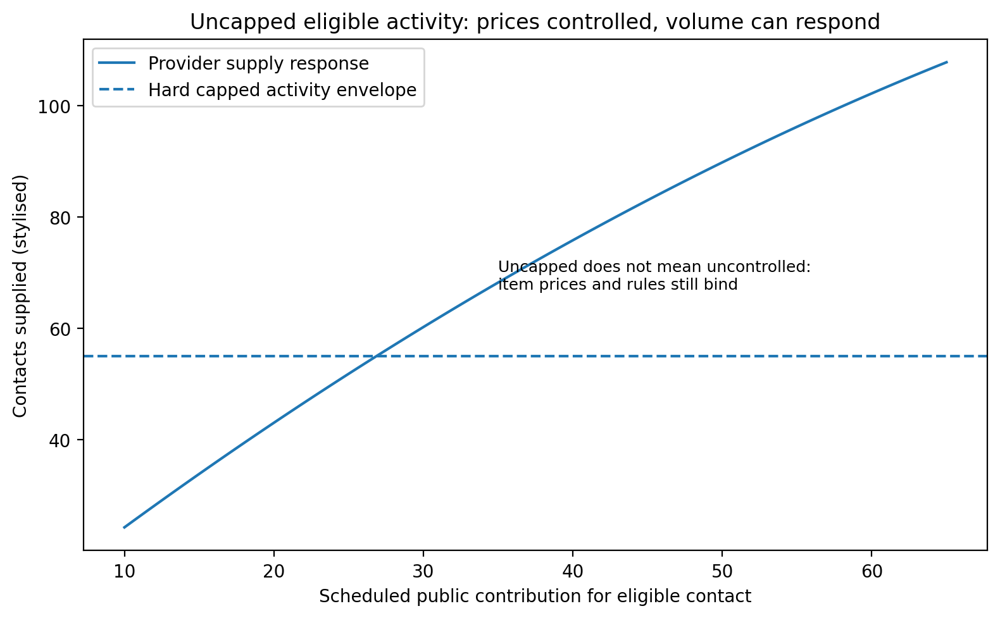
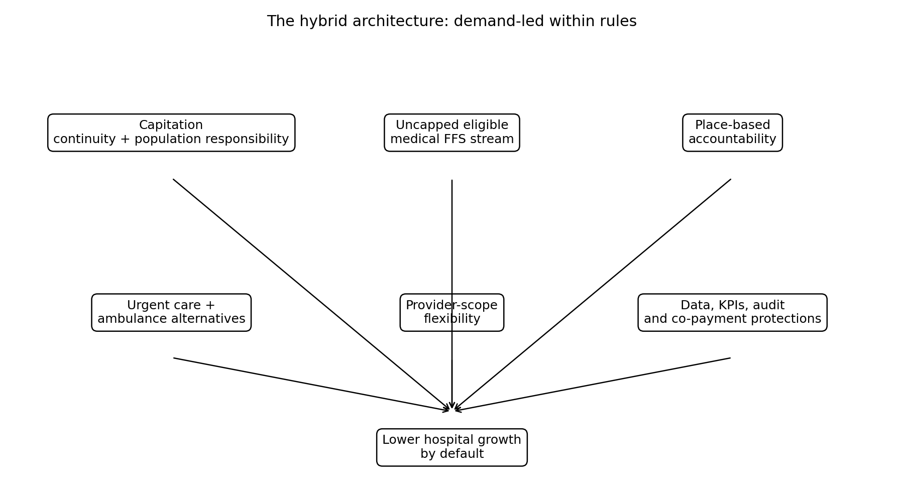

# What I mean by uncapping primary care funding

**Source-confidence label:** public-document supported policy hypothesis, economic theory and model assumption; not calibrated prediction.

When I say primary care funding should be “uncapped”, I need to be precise.

I do not mean every provider should be able to bill anything, for anything, at any price.

I do not mean abolishing capitation.

I do not mean removing clinical governance.

*Figure: conceptual explainer for this post. It is not an observed outcome chart or calibrated prediction.*

**Red-team check:** The weak-control version of uncapped fee-for-service is explicitly not the proposal. The proposal is scheduled, rules-based, audited, clinically governed, equity-protected and place-accountable.

I do not mean ignoring equity.

I mean something narrower and more useful:

> Eligible primary medical activity should not be limited by a hard global funding envelope. It should be demand-led within rules.

That is an important difference.

A capped envelope says: here is the total pool; once the pool is exhausted, the system must ration.

A rules-based benefit says: if the service is eligible, the provider is qualified, the patient meets criteria, the documentation is adequate and the claim is not suspicious, the public contribution flows.

That is closer to how Accident Compensation Corporation treatment funding works.

Accident Compensation Corporation does not pay for everything. It pays or contributes to injury treatment when the treatment is clinically appropriate, delivered by an appropriately qualified provider, documented, necessary, and within the relevant regulation or contract.

There are rules. There are item codes. There are contribution rates. There are contracts. Some services require pre-approval. There are expectations about quality and the number of treatments needed.

That is why the Accident Compensation Corporation analogy is useful.

It shows that activity-sensitive funding can be controlled without using a fixed global cap as the main rationing tool.

For primary medical care, an uncapped benefit stream could start with specific contact types:

- same-day or next-day urgent primary medical assessment;
- complex consultations requiring longer time;
- rural in-person assessment;
- minor procedures that prevent escalation;
- follow-up after ambulance non-conveyance;
- care after emergency department discharge;
- clinically necessary reviews for frailty or multimorbidity;
- defined nurse practitioner, pharmacist, paramedic, physiotherapist or general practitioner services within scope.

The public contribution would be scheduled. The patient might pay a co-payment, depending on policy settings. For high-need groups, children, Community Services Card holders, rural patients or priority services, the co-payment could be reduced or removed.

The key point is that the total number of eligible services would not be fixed in advance.

If patients need care, and providers can safely deliver it, the system should not suppress that activity just because the envelope has been capped.

The controls should be smarter:

- item definitions;
- clinical eligibility;
- scope of practice;
- documentation;
- audit;
- unusual-billing detection;
- outcome monitoring;
- co-payment caps;
- locality obligations;
- minimum service coverage;
- reporting against access and equity.

This is what I mean by “uncapped does not mean uncontrolled”.

Why does this matter?

Because if the main control is a hard cap, the system often controls the budget by suppressing care upstream.

That does not mean people stop needing care.

It means they wait. Or pay. Or go elsewhere. Or deteriorate. Or call an ambulance. Or end up in hospital.

The hospital system is then funded to deal with the pressure because hospital pressure is more visible and less avoidable.

That is not good economics. It is delayed spending at a higher cost.

A better model would let eligible primary medical activity grow safely.

It would still keep capitation. Capitation is important for continuity and population accountability. It would still keep place-based responsibility. Otherwise providers could cherry-pick easy work and leave hard-to-reach populations behind.

The proposal is a hybrid:

- capitation for having responsibility;
- fee-for-service for doing eligible medical work;
- place-based accountability for reaching everyone;
- data and audit for controlling gaming;
- co-payment protections for equity.

That is not neoliberal. It is not a blank cheque. It is not an anti-public model.

It is a way of paying for the care we want to happen before the hospital becomes the only place left to go.

### What would still be controlled?

This is the part people often miss. If eligible activity is uncapped, almost everything else still needs rules.

The item price is scheduled. The provider must be eligible. The service must match a defined contact type. The provider must act within legal scope. The record must show clinical need. Repeated patterns can be audited. Co-payment protections can be applied. Some services can require pre-approval or additional documentation.

That is why Accident Compensation Corporation is such a useful analogy. It does not mean every provider can bill anything they want forever. It means there is a rules-based stream where eligible injury-related treatment can generate payment.

## What would change my mind?

I would be less convinced if an uncapped scheduled stream could not be governed through item rules, scope, audit, co-payment protections and place accountability. The weak-control version is not the proposal.

---

**Deep dive (optional, not required reading):** I’ve kept the fuller explanation, game table, modelling notes and full source list in the [appendix for this post](../appendices-v1.7.2/appendix-06-what-i-mean-by-uncapping-primary-care-funding-v1.7.2.md).

**Note:** This series is exploratory policy analysis. It is not a party-political argument, not a RACMA-sponsored position, not a claim that any single funding model is perfect, and not a calibrated prediction of savings. The central question is whether New Zealand's current funding architecture lets lower-cost upstream care expand safely before need becomes hospital demand.

## Useful links

- [Ministry of Health: capitation reweighting](https://www.health.govt.nz/strategies-initiatives/programmes-and-initiatives/primary-and-community-health-care/capitation-reweighting)
- [Accident Compensation Corporation: paying patient treatment](https://www.acc.co.nz/for-providers/invoicing-us/paying-patient-treatment)
- [Ministry of Business, Innovation and Employment: ACC regulated payments for treatment](https://www.mbie.govt.nz/business-and-employment/employment-and-skills/employment-legislation-reviews/increasing-regulated-acc-payments-for-treatment/proposed-updates-to-acc-regulated-payments-for-treatment/options-for-payment-increases-and-how-they-were-assessed)
- [Cochrane: payment methods for outpatient healthcare providers](https://www.cochrane.org/evidence/CD011865_payment-methods-healthcare-providers-outpatient-healthcare-settings)
- [RACGP/AJGP: understanding general practice funding models](https://www1.racgp.org.au/ajgp/2024/december/understanding-general-practice-funding-models-in-a)