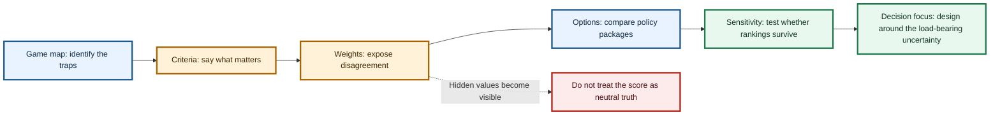

# Game-informed Multi-Criteria Decision Analysis: making disagreement useful

*Multi-Criteria Decision Analysis* sounds technical, but the practical idea is simple. When a decision has many competing goals, the method makes the trade-offs visible before people pretend that a single score has settled the argument.

Primary care funding has many goals at once. We want access, continuity, equity, fiscal control, rural care, less hospital pressure, less gaming, provider viability, patient choice, local relationships and national consistency. No policy option maximises all of these at once, which is why disagreement is not a failure of the process. It is the material the process has to work with.

A Treasury official may give more weight to fiscal risk. A rural provider may give more weight to in-person access. A Maori provider may give more weight to trust, whanau-centred care and Te Tiriti legitimacy. A general practice owner may give more weight to viability and pass-through. A hospital manager may give more weight to emergency department deflection. A Primary Health Organisation may give more weight to place-based integration, while a patient advocate may give more weight to cost and choice.

Multi-Criteria Decision Analysis does not remove those disagreements. It structures them so the policy conversation can move from slogans to explicit judgements.

Caption: A game-informed Multi-Criteria Decision Analysis does not make disagreement disappear. It turns disagreement into visible policy design work.

The game-informed version asks two questions. First, where does each game currently sit? For example, is the capitation marginal-supply game a major problem or a minor one? Is the Primary Health Organisation intermediation game real or overstated? Is the urgent-care policy game tractable? Is the co-payment game too risky? Is the hospital salience game the main driver?

Second, which policy option shifts the system toward a better equilibrium? A simple scorecard can compare the current reform pathway, capitation reweighting only, current reform plus place accountability, uncapped eligible medical fee-for-service, a hybrid model with capitation and place accountability, urgent and ambulance alternatives, scope-enabled supply, weak-control demand-led benefits and hospital investment priority.

The criteria should cover access and supply generation, hospital deflection, equity and Te Tiriti legitimacy, rural and in-person resilience, fiscal sustainability, gaming and low-value activity risk, administrative simplicity, market entry, governance, clinical safety, political feasibility, data readiness and comprehensive population responsibility. The point is not to hide a political judgement inside a spreadsheet. The point is to make the judgement inspectable.

The result is not a magic ranking. It is a conversation tool. If people disagree, that is useful because the disagreement tells us where the policy uncertainty sits. If everyone agrees that access matters but disagrees about gaming risk, then gaming control becomes the design focus. If everyone agrees that urgent care matters but disagrees about evidence, then urgent-care advice and outcomes become the research focus. If everyone agrees that capitation reweighting is useful but not sufficient, then the question becomes what second mechanism should be added.

This is why Multi-Criteria Decision Analysis belongs in the package. The game map explains the traps, the demonstrative model tests the logic, and the decision framework helps policy-makers decide which traps matter most.

## What disagreement can teach us

The most useful outcome of a Multi-Criteria Decision Analysis may not be agreement. It may be clearer disagreement.

A hospital leader may weight hospital deflection highly. A rural provider may weight local in-person resilience. A Maori provider may weight trust, whanau-centred care and Te Tiriti legitimacy. Treasury may weight fiscal sustainability. A general practice owner may weight viability and administrative simplicity. An ambulance leader may weight alternative disposition and handover delays.

Those are not just opinions. They are different views of the same game. The value of the method is that it makes those values visible. Instead of pretending the decision is purely technical, it asks people to say what they care about, how confident they are, and what risks they are willing to tolerate.

That is much better than hiding judgement inside a formula and calling it neutral.

## Why MCDA belongs after the game map

Multi-Criteria Decision Analysis works best when the decision problem has already been structured. The game map does that structuring by saying: these are the traps, these are the players, these are the incentives and these are the plausible failure modes.

The Multi-Criteria Decision Analysis then asks which outcomes matter most, which options perform best and how the answer changes when different people weight the criteria differently. Without the game map, the exercise can become a generic scoring ritual. With the game map, it becomes a way to test whether a policy shifts the system out of bad equilibria.

## What I would ask stakeholders

I would ask stakeholders to score each game on five questions: whether the game is real, whether it is harmful, whether it drives hospital pressure, whether it worsens equity and whether it is tractable. That is enough to separate disagreement about values from disagreement about facts.

## What would change my mind?

I would be less convinced if a decision process without Multi-Criteria Decision Analysis could make the trade-offs more transparent. At the moment, disagreement is often hidden inside slogans.

## Useful links

- [ISPOR MCDA overview](https://www.ispor.org/heor-resources/good-practices/article/multiple-criteria-decision-analysis-for-health-care-decision-making---an-introduction)
- [ISPOR-SMDM modelling practices](https://www.ispor.org/heor-resources/good-practices/article/modeling-good-research-practices---overview)
- [PRISMA Scoping Reviews](https://www.prisma-statement.org/scoping)
- [Ministry primary care target](https://www.health.govt.nz/strategies-initiatives/programmes-and-initiatives/primary-and-community-health-care/primary-care-health-target)
- [Health NZ dataset target](https://www.healthnz.govt.nz/about-us/what-we-do/planning-and-performance/primary-care-tactical-action-plan/national-primary-care-dataset-and-new-primary-care-health-target)

---

## Public companion links

- [Streamlit model lab](https://gtpcnz.streamlit.app/)
- [GitHub Pages report](https://edithatogo.github.io/gtpcnz/)

## v1.8.1 model update

The current Streamlit model release is v1.8.1. Its public aggregate validation lane is `public_aggregate_validated`, and its claim level is `empirically_supported_if_gated` for registered gates only.

The value-of-information and evidence-priority layer has expanded. The model now gives clearer decision-uncertainty outputs about which public evidence gaps matter most, while remaining bounded away from forecast claims.

Claim boundary: value-of-information results are not forecasts and not stakeholder preference estimates. They are transparent, normative decision-support calculations under public evidence constraints.
