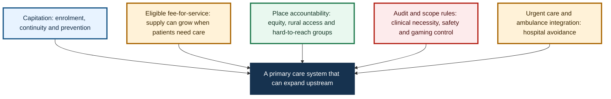
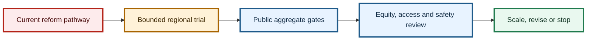

# Recommendations: a primary care system that can grow before hospitals have to

Here is the practical version of the proposal. New Zealand should not abandon capitation, simply copy Medicare, create an uncontrolled fee-for-service system or pretend that telehealth replaces local care.

It should also avoid letting Primary Health Organisation debates become a proxy war between incumbents, corporate entrants and provider groups. The better question is whether the funding architecture can let primary care grow before hospital pressure rises.

My answer is a hybrid architecture: capitation for responsibility, uncapped eligible fee-for-service for primary medical activity, place-based accountability for equity, and urgent and ambulance integration for hospital avoidance.

Caption: The recommendation is a controlled hybrid architecture, not a blank cheque and not a claim that implementation effects have already been proven.

## Recommendation 1: Keep and reweight capitation

Capitation should remain for continuity, enrolment, preventive care, proactive follow-up, team-based care, population responsibility and baseline practice viability. The current reweighting work is necessary, but it is not sufficient on its own because a better capitation formula still does not guarantee marginal supply when a patient needs an appointment.

## Recommendation 2: Add an uncapped eligible primary medical fee-for-service stream

Eligible primary medical activity should be able to grow when patients need it. This should be modelled on the logic of Accident Compensation Corporation treatment payments: scheduled contribution rates, clinical necessity, documentation, provider qualifications, scope rules, audit and pre-approval where needed.

The stream should start with defined high-value contacts such as urgent primary medical care, complex consultations, rural in-person care, minor procedures, ambulance follow-up, emergency department discharge follow-up and other hospital-avoidance contacts. This is demand-driven within rules, not demand-driven without rules.

## Recommendation 3: Add place-based accountability

Uncapped activity without place accountability risks cherry-picking. Every locality needs responsibility for hard-to-reach patients, rural communities, Maori and Pacific populations, disabled people, older people, complex patients and people without digital access.

This is where Primary Health Organisations, locality entities, iwi Maori partnership, Maori providers, Pacific providers and Health New Zealand commissioning may still have roles. The point is not to declare one institution good or bad. The point is to make responsibility visible.

## Recommendation 4: Separate PHO functions from PHO intermediation

Do not ask whether Primary Health Organisations are good or bad. Ask which functions add value and which payment-gateway functions create opacity or friction.

Financial transparency, pass-through rules, non-capitated funding and performance accountability should be much clearer. If a Primary Health Organisation is adding coordination, equity work, locality intelligence or provider support, that should be visible. If it is mainly obscuring the path between public money and care, that should be visible too.

## Recommendation 5: Treat urgent care and ambulance as access infrastructure

Urgent care and ambulance are not side issues. They are part of the upstream access system.

Ambulance should be measured not only on response time, but on safe alternative disposition, non-conveyance, handover delay and connection to primary or urgent care. Urgent care should be integrated with general practice, Accident Compensation Corporation, digital care and emergency departments.

## Recommendation 6: Let provider scope generate safe supply

Funding should follow eligible contact types and scope of practice, not professional habit. General practitioners, nurse practitioners, nurses, pharmacists, paramedics, physiotherapists, mental health workers and Maori and Pacific providers can all generate supply in different ways.

Clinical governance should determine safety. Professional title should matter where it predicts safe care, but it should not become an automatic veto on well-governed supply.

## Recommendation 7: Protect patients from co-payment harm

Co-payments can be a demand signal, but they can also block necessary care. Use low or zero co-payments for priority groups and essential contacts, publish fees and monitor unmet need by deprivation, ethnicity, disability, rurality and age.

This is easy to misunderstand, so let me say what I am not saying. I am not arguing for a system that treats every contact as equally valuable. I am arguing for a system that does not let patient charges silently ration high-value care.

## Recommendation 8: Lift primary care and ambulance to top-tier accountability

Primary care and ambulance outcomes should sit beside hospital targets, not beneath them. The hospital problem shouts, while the primary care problem murmurs until it becomes a hospital problem.

The system should measure appointment access, closed books, co-payment burden, urgent care access, ambulance alternatives, continuity, patient experience, avoidable admissions and equity. If those measures are not visible, the architecture will keep rewarding the parts of the system that are easiest to count.

## Recommendation 9: Use the model as a validation tool

Do not wait for a fully calibrated predictive model before starting the conversation. Use the game map, demonstrative modelling and Multi-Criteria Decision Analysis to run stakeholder workshops and identify the load-bearing assumptions.

The first validation work should test marginal supply response, unmet primary care to hospital flow, Accident Compensation Corporation stabilisation effects, Primary Health Organisation transaction costs, and scope-enabled provider safety and productivity. These are the points where the recommendation either becomes stronger or has to be revised.

## The final line

The issue is not whether New Zealand has started reform. It has. The issue is whether the reform changes the game enough.

My answer is: not yet. The model I think New Zealand should test is capitation for responsibility, uncapped eligible fee-for-service for primary medical activity, place-based accountability for equity, and urgent and ambulance integration for hospital avoidance.

Caption: The next step is a staged public-learning programme, not a claim that measured implementation impact has already been established.

## What I would do first

I would not start with a national big-bang implementation. I would start with a tightly designed policy trial.

Choose regions with different access problems: one metropolitan area, one rural area, one mixed area with high deprivation, and one area with significant urgent-care or ambulance pressure. Define eligible contact types, set the benefit, apply co-payment protections, allow accredited providers, require place accountability, and track access, emergency department flow, ambulance conveyance, patient cost, provider behaviour, equity and safety.

Then compare it against the current reform pathway.

## What would change my mind?

I would be less convinced if the current reform pathway, without uncapped scheduled primary medical activity, place accountability and stronger upstream key performance indicators, produced the access and hospital-avoidance effects we need.

## Useful links

- [Capitation reweighting](https://www.health.govt.nz/strategies-initiatives/programmes-and-initiatives/primary-and-community-health-care/capitation-reweighting)
- [Cabinet funding material](https://www.health.govt.nz/information-releases/cabinet-material-primary-health-care-funding-improvements-and-update-on-primary-health-care)
- [Primary care health target](https://www.health.govt.nz/strategies-initiatives/programmes-and-initiatives/primary-and-community-health-care/primary-care-health-target)
- [Health NZ dataset target](https://www.healthnz.govt.nz/about-us/what-we-do/planning-and-performance/primary-care-tactical-action-plan/national-primary-care-dataset-and-new-primary-care-health-target)
- [ACC treatment payments](https://www.acc.co.nz/for-providers/invoicing-us/paying-patient-treatment)

---

## Public companion links

- [Streamlit model lab](https://gtpcnz.streamlit.app/)
- [GitHub Pages report](https://edithatogo.github.io/gtpcnz/)

## v1.8.1 model update

The Streamlit model release is v1.8.1. Its public aggregate validation lane is `public_aggregate_validated`, and its claim level is `empirically_supported_if_gated` for registered gates only.

The recommendation should now be framed as a staged public-learning programme: publish the bounded architecture, run the public aggregate gates, expose uncertainty and downgrade claims when gates fail.

Claim boundary: do not present the recommendation as implementation proof. The v1.8.1 public aggregate validation status supports a disciplined next testing step, not a claim that the reform will deliver measured impacts.
