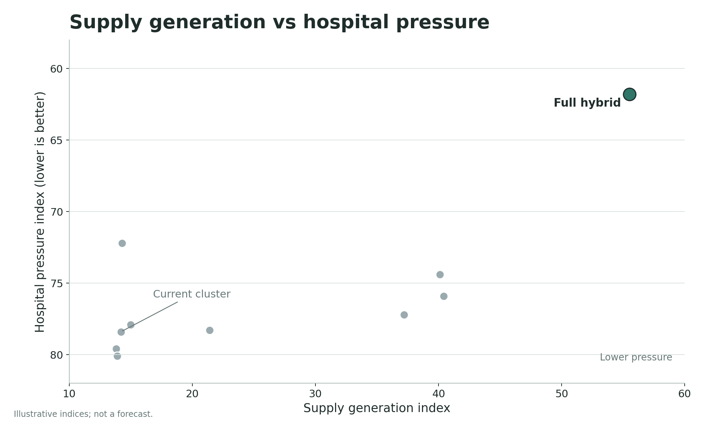
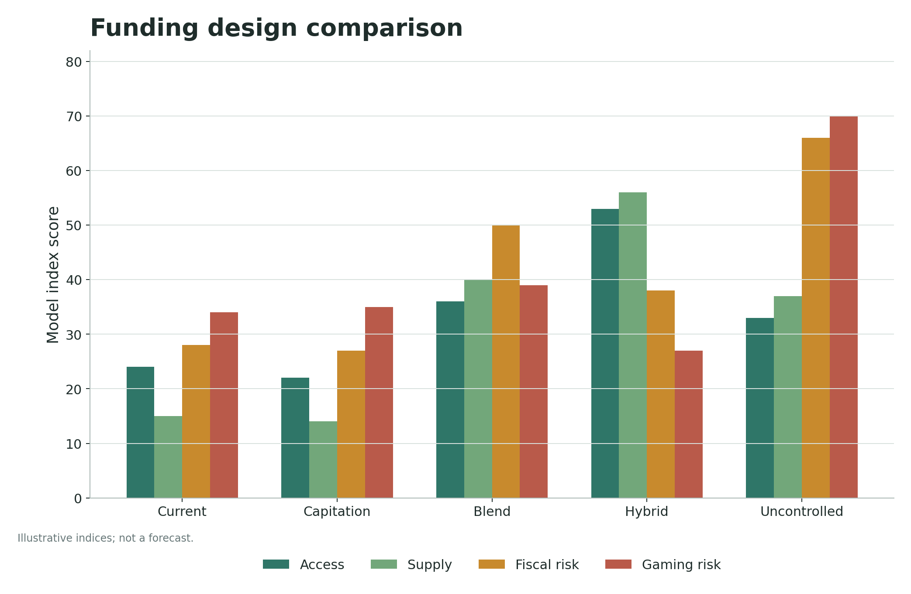

# GTPCNZ model results: start with the architecture

**Subtitle:** The model is not a forecast. It is a way of making the primary care funding architecture visible.

The primary care funding series has already made the policy argument in words. This shorter model-results series does something different. It takes the GTPCNZ simulation outputs and asks what the pictures are actually showing. The goal is not to retrofit the figures into the released articles. The goal is to give the model its own interpretive space, with the caveats close to the plots rather than scattered through the main series.

The model is not a forecast. It does not estimate next year's hospital admissions, general practice workload or government expenditure. It is a demonstrative model. It uses index scores and stylised relationships to make a funding architecture visible enough to inspect, argue with and improve.

That distinction matters. A forecast asks what will happen. This model asks what has to be true for a funding design to generate upstream care before the pressure spills into urgent care, ambulance services, emergency departments and hospitals. It is not a prediction machine. It is a disciplined way to test whether the architecture is coherent.

## The core map

The first result is the simplest. In the model index space, the stronger hybrid architecture sits toward higher upstream supply generation and lower hospital pressure. Weaker upstream settings remain closer to the part of the map where constrained primary care continues to push pressure downstream.

The point is not the exact coordinate of any dot. The point is the direction of movement. A funding design that cannot generate extra primary care supply is unlikely to relieve downstream pressure, even if it allocates the existing envelope more neatly.

## Why the model separates the levers

The second result is that primary care funding is not one lever. Access, supply generation, fiscal exposure and gaming risk do not all move together. A design can improve access while increasing fiscal risk. It can control expenditure while rationing the next appointment. It can look administratively tidy while leaving the marginal incentive too weak to generate supply.

That is why the model uses several indices rather than a single score. The useful question is not whether fee-for-service, capitation or blending is good in the abstract. The useful question is which part of the system each design strengthens, which part it weakens, and which control has to carry the residual risk.

## How to read this mini-series

The next post looks at supply and hospital pressure. It explains why the upstream supply problem cannot be solved by better allocation alone if the funding architecture still suppresses the next unit of clinically necessary care.

The third post looks at funding design. It explains why the model treats payment design as a bundle of trade-offs rather than a contest between pure capitation and pure fee-for-service.

The final post looks at gaming risk, controls and model boundaries. It explains why a governed uncapped benefit is different from uncontrolled activity, and why the model should be read as an argument map rather than a claim of empirical precision.

The test of this model is not whether the plots look convincing at first glance. The test is whether the assumptions are visible enough to challenge. If someone thinks a relationship is wrong, the model gives them something concrete to point to: the payment signal, the marginal cost curve, the control adjustment, the gaming-risk frontier, or the comparison between current reform and the stronger hybrid architecture.

That is the value of the exercise. It turns a vague argument about "more primary care" into a more specific argument about what kind of supply, under what payment signal, with what controls, and with what downstream consequences.

## Claim boundary

Claim boundary: This post is a public-data anchored benchmark and educational explainer. The GTPCNZ model status is `public_aggregate_validated` and the claim level is `empirically_supported_if_gated`. The figures are not linked-data calibrated, not a patient-level forecast, and not an estimate of precise fiscal savings, ED reductions, hospital-demand reductions, workforce effects or implementation impacts.

That boundary is what makes the model useful. It keeps the argument testable without pretending the model has data it does not have. The plots should be read as structured hypotheses about the funding architecture. They identify where a policy design has to explain itself: supply generation, payment viability, fiscal control, claim behaviour and downstream pressure.

The mini-series therefore uses the simulation outputs as a map, not as a promise. A reader should be able to ask whether the model has put the pressure in the right place, whether the controls are too optimistic, whether current reform deserves a stronger score, or whether a different supply constraint should dominate. Those are the right questions.

## What would change my mind?

Several findings would weaken this interpretation. Direct linked-data evidence showing that the current capped architecture already generates adequate marginal supply would reduce the force of the argument. Evidence that controlled activity-sensitive payments consistently fail to improve access, even when eligibility and audit rules are strong, would also matter.

I would also change the model if better public evidence showed that the hospital-pressure relationship is much weaker than assumed, that the marginal cost curve should be flatter, or that gaming risk cannot be governed without destroying the supply signal. The point of publishing the model is to make those disagreements inspectable.

## Useful links

- GitHub front door: https://edithatogo.github.io/gtpcnz/
- Interactive simulation lab: https://edithatogo-gtpcnz-dashboard.hf.space/
- Source repository: https://github.com/edithatogo/gtpcnz
