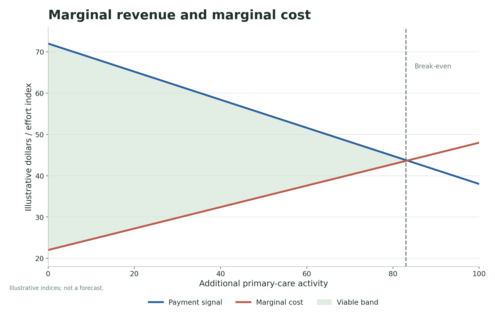

# GTPCNZ model results: supply, pressure and the next appointment

**Subtitle:** The model shows why downstream pressure is tied to whether the next unit of upstream care is viable.

The supply problem in primary care is easy to describe and hard to model. Patients need care before their problems become urgent. Providers can only add activity if the next appointment is clinically, operationally and financially viable. Hospitals feel the pressure when the upstream system cannot absorb the work. The GTPCNZ model does not prove the size of that pathway, but it makes the mechanism visible.

The main result is that supply generation and hospital pressure should be read together. If the funding architecture cannot generate the next unit of primary care, the unmet need does not vanish. Some of it waits. Some of it becomes more severe. Some of it appears later in urgent care, ambulance services, emergency departments or hospital beds.

That is why a marginal appointment matters. It is the point where a policy promise becomes a real piece of care or remains a line in a plan. The model keeps that point visible because small changes at the margin can decide whether constrained patients are seen upstream or displaced downstream.

The practical question is not whether hospitals are important. They are. The practical question is whether the system keeps buying hospital visibility because it has failed to fund earlier, quieter and cheaper care. The supply-pressure result is a way to inspect that mechanism without pretending to forecast a precise admission count.

## Supply and downstream pressure

The scatter plot shows the modelled relationship between supply generation and hospital pressure across scenarios. The stronger hybrid setting sits away from the low-supply, high-pressure cluster. That is the architecture the series has been pointing toward: not a single uncapped payment stream, but a system that combines capitation, scheduled activity payments, eligibility rules, audit and place-based accountability.

This is not a claim that a specific reform will reduce hospital use by a precise percentage. The model is saying something narrower. If a policy design raises upstream supply generation while retaining controls, the direction of travel is away from downstream pressure. If the design keeps primary care supply constrained, pressure is likely to remain somewhere else in the system.

## The marginal appointment

The marginal-supply plot is the simplest way to see why this matters. Additional appointments remain viable while the payment signal sits above the marginal cost of delivering the next clinically necessary contact. When those lines cross, the next appointment becomes economically fragile.

That does not mean every practice has the same break-even point. It means that the system cannot assume that demand automatically creates supply. A patient may need care, a clinician may want to provide it, and the system may still fail to produce the appointment if the next unit of care is underfunded, administratively blocked or operationally impossible.

The model therefore treats missing appointments as an architecture problem, not only a workforce problem. Workforce matters, but so does the payment signal attached to the next hour of work. A capped envelope can make the total spend predictable while still making the marginal appointment hard to provide.

## Why control still matters

The activity-payment plot shows the other half of the argument. A demand-led payment stream cannot be a blank cheque. Gross scheduled payment rises with eligible activity, but the net incentive bends once eligibility rules, control adjustments and audit are introduced.

That is why the series uses the phrase "uncapped but controlled." The modelled design tries to preserve the ability to generate upstream activity while preventing the payment signal from becoming a simple volume-maximisation machine. The public contribution follows eligible care, but the rules decide what counts as eligible care.

The finding is that supply expansion and control are not opposites. A well-designed system needs both. If control dominates too heavily, the next appointment disappears. If expansion dominates without control, gaming and fiscal risk increase. The architecture has to keep the next legitimate unit of care viable while making illegitimate volume growth unattractive.

That is the supply-pressure result in plain language. Hospitals do not just need better hospital policy. They need an upstream funding architecture that can produce care before the hospital becomes the only visible place left to go.

## Claim boundary

Claim boundary: This post is a public-data anchored benchmark and educational explainer. The GTPCNZ model status is `public_aggregate_validated` and the claim level is `empirically_supported_if_gated`. The figures are not linked-data calibrated, not a patient-level forecast, and not an estimate of precise fiscal savings, ED reductions, hospital-demand reductions, workforce effects or implementation impacts.

The supply-pressure plots should therefore be read directionally. They do not say how many admissions would be avoided or how many appointments would appear under a named programme. They say that a funding design that suppresses the next legitimate unit of upstream care has to explain where unmet need goes.

That is the modelling contribution. It keeps the marginal appointment visible. A system can have good intentions, better planning language and stronger equity goals, but if the next unit of care remains clinically or financially unviable, the practical effect may still be rationing. The model makes that rationing mechanism explicit.

## What would change my mind?

I would revise this interpretation if public aggregate evidence showed that marginal supply is not materially affected by the payment signal, or that current reform settings already make the next clinically necessary appointment viable across constrained communities. Strong linked-data evidence separating primary-care access, urgent-care use, ambulance demand, ED presentation and admission pathways would also improve the model.

The most useful challenge would be concrete: change the assumed marginal cost curve, payment signal or downstream-pressure relationship, then show whether the architecture still moves in the same direction. If the result changes, the model has done its job by locating the contested assumption.

## Useful links

- GitHub front door: https://edithatogo.github.io/gtpcnz/
- Interactive simulation lab: https://edithatogo-gtpcnz-dashboard.hf.space/
- Source repository: https://github.com/edithatogo/gtpcnz
