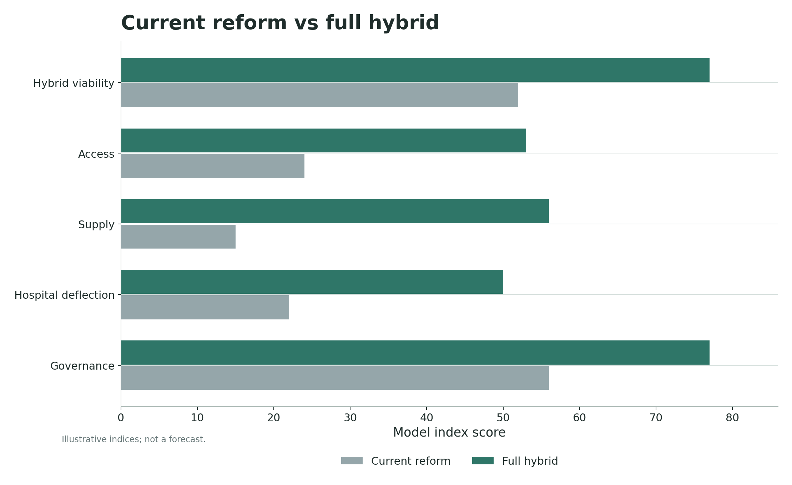

# GTPCNZ model results: funding design is not one lever

**Subtitle:** Access, supply, fiscal risk and gaming risk move differently, so the model keeps them separate.

A common funding debate treats payment design as if it were a single choice. One side argues for capitation. Another argues for fee-for-service. Someone else proposes blending and calls it the compromise. The GTPCNZ model is built to resist that simplification.

The reason is straightforward. A payment method can improve one part of the system while damaging another. Capitation can support enrolled-population responsibility but weaken the marginal incentive to add activity. Fee-for-service can make the next contact viable but create volume and gaming risk. A blended design can combine strengths, but only if the surrounding rules are strong enough to stop the weak parts of each design from dominating.

That is why the model does not collapse the result into one preferred payment label. It separates access, supply generation, fiscal risk and gaming risk so that a reader can see which problem is being solved and which problem is being moved somewhere else.

This matters for public debate because funding labels often sound cleaner than the systems they create. A cap can look prudent while rationing marginal care. An activity payment can look responsive while increasing claim risk. A blend can look moderate while failing to resolve either problem. The model asks the architecture to show its work.

## The funding comparison

The grouped bar plot separates access, supply generation, fiscal risk and gaming risk. That separation is the point. The model does not ask which funding method is morally or ideologically pure. It asks what each setting does to the system.

The stronger hybrid setting improves access and supply generation in the model, but the plot also keeps fiscal and gaming risk visible. That is important because a policy that expands supply without controlling claim behaviour can become fiscally unstable. A policy that controls fiscal risk without making the next appointment viable can leave access unchanged in practice.

The finding is that the real design problem sits in the combination. A useful architecture has to pay for enough activity to change access, retain enough capitation or population responsibility to avoid fragmentation, and use enough audit and governance to prevent the activity stream from drifting into opportunistic volume.

## Current reform and the stronger hybrid

The current-reform comparison is useful because it avoids an easy straw man. The model does not say that current reform directions are meaningless. It says that they may be incomplete if they do not create a controlled mechanism for generating extra upstream supply.

In the selected model indices, the stronger hybrid architecture scores higher on access, supply generation, hospital deflection and governance. The point is not that the current pathway is bad. The point is that better allocation inside a constrained envelope may still leave the system without enough ability to produce the next clinically necessary appointment.

This is why the model keeps returning to architecture. A reform can improve purchasing, planning, equity targeting or accountability and still fail to solve marginal supply. If the next unit of care is not viable, the system may still ration upstream care and buy the consequences downstream.

## What a blended architecture has to do

A blended architecture has to make several promises at once. It has to preserve continuity and population responsibility. It has to pay for additional clinically necessary activity. It has to protect patients from inequitable co-payment effects. It has to limit provider gaming. It has to give funders enough visibility to detect unusual patterns. It has to do all of that without turning the clinical encounter into paperwork first and care second.

That is why the model is uncomfortable with single-answer funding debates. A pure answer is usually only pure because it has ignored a dimension of the problem. The model's value is that it forces those dimensions back into the same frame.

The practical conclusion is not "choose the highest bar." The practical conclusion is that any funding proposal should be asked four questions. Does it improve access? Does it generate supply? Does it keep fiscal exposure governable? Does it reduce the incentive to game the system? A design that cannot answer all four questions is not yet a funding architecture. It is only a payment preference.

## Claim boundary

Claim boundary: This post is a public-data anchored benchmark and educational explainer. The GTPCNZ model status is `public_aggregate_validated` and the claim level is `empirically_supported_if_gated`. The figures are not linked-data calibrated, not a patient-level forecast, and not an estimate of precise fiscal savings, ED reductions, hospital-demand reductions, workforce effects or implementation impacts.

The grouped bars and comparison plot are a discipline for discussion, not a ranking table for procurement. They show why a proposal can look attractive on one dimension while becoming weak on another. A funding design that improves access but increases gaming risk still needs controls. A design that contains fiscal exposure but suppresses supply still needs a credible answer for unmet need.

That is why the model separates the indices. It prevents a single favourable number from hiding the trade-offs. The more useful question is not which payment label wins. The more useful question is whether the architecture has enough moving parts to make access, supply, fiscal governance and claim integrity work at the same time.

## What would change my mind?

I would change the design interpretation if better public evidence showed that one payment mechanism reliably improves access, generates supply, contains fiscal exposure and limits gaming risk without a broader architecture. I would also revise the scenario scores if current reforms can demonstrate a controlled path to material marginal supply expansion.

The model is intentionally easy to argue with. If a reader thinks fiscal risk should dominate, that weight can be increased. If a reader thinks current reform deserves a stronger governance score, that score can be tested. If a reader thinks activity-sensitive payment creates too much residual gaming risk, the control assumptions should be made harsher.

## Useful links

- GitHub front door: https://edithatogo.github.io/gtpcnz/
- Interactive simulation lab: https://edithatogo-gtpcnz-dashboard.hf.space/
- Source repository: https://github.com/edithatogo/gtpcnz
