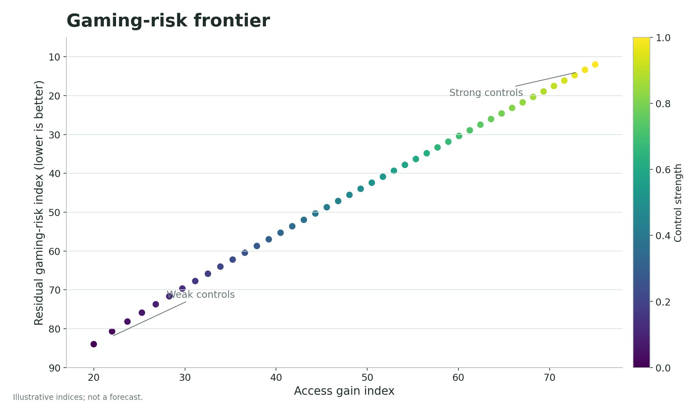
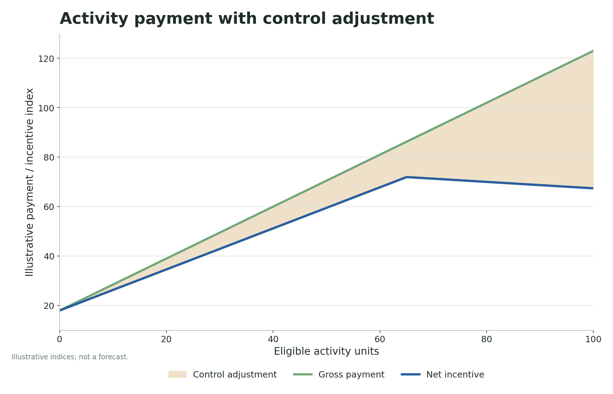

# GTPCNZ model results: controls, games and model boundaries

**Subtitle:** The model shows why an uncapped benefit needs governance, and why the results should be read as directional.

The GTPCNZ model is deliberately not a black box forecast. Its purpose is to make the policy logic visible. That includes the uncomfortable parts of the logic: provider incentives, gaming risk, fiscal risk, eligibility rules, audit and the difference between a payment formula and a functioning funding architecture.

The final result in this model-results series is that controls are not an optional layer added after the funding design has been chosen. They are part of the design. A system that pays for more activity has to decide what activity counts, who can provide it, how claims are checked, and how unusual patterns are handled.

That is the difference between an uncapped benefit and uncontrolled volume. The former expands payment for eligible care inside rules. The latter lets the payment signal drift away from the clinical purpose. The model is built to keep that distinction visible.

The boundary also protects the reader. These plots are not an invitation to treat the model as a settled answer. They are an invitation to test whether the proposed control stack is strong enough, whether the gaming assumptions are too optimistic, and whether the payment signal still leaves legitimate care viable.

## Gaming risk is part of the architecture

The gaming-risk frontier shows the modelled relationship between access gain and residual gaming risk as control strength changes. Stronger controls move the system toward higher access gain with lower residual gaming risk. Weak controls leave the system more exposed.

The finding is not that any particular audit rule has been empirically proven to produce this exact curve. The finding is structural. If a payment design increases the reward for activity, the architecture must also increase the reliability of eligibility, documentation and accountability. Otherwise, the same mechanism that makes legitimate care viable can also make illegitimate volume attractive.

That is why formulas do not solve games by themselves. A formula describes how money flows. It does not guarantee that the behaviour around the formula will be the behaviour the policy intended. The control stack is what turns the formula into a governed system.

## Uncapped does not mean uncontrolled

The activity-payment plot shows why the phrase "uncapped" needs precision. Gross scheduled payment rises with eligible activity, but the net incentive bends once controls are applied. That bend is the policy design. It is the difference between paying for whatever volume appears and paying for clinically legitimate, rule-bound upstream care.

This is why the proposed architecture does not remove capitation, clinical governance or audit. It adds a demand-led benefit stream inside rules. The system can pay for additional eligible activity without treating every extra claim as automatically desirable.

The model therefore supports a narrow claim. A governed, scheduled, activity-sensitive benefit can help generate upstream care in a way that a hard global cap cannot. But the benefit only works as intended if the controls are strong enough to keep the payment signal connected to legitimate access rather than raw volume.

## What the model does not show

The model does not show how many doctors, nurse practitioners, pharmacists, paramedics, physiotherapists or other clinicians New Zealand would need under a specific implementation. It does not show the exact price of each item. It does not estimate how quickly providers would respond. It does not prove the hospital effect size. It does not replace consultation with patients, clinicians, funders or communities.

Those limits are not a problem if the model is used honestly. The model is an argument map. It shows the relationships that a serious proposal has to address. If someone disagrees, the right response is not to treat the model as failed because it is not a forecast. The right response is to identify the relationship they think is wrong and change the assumption.

That is why the plots are useful. They make disagreement more precise. Someone can argue that the marginal cost curve is too simple, that the control adjustment is too optimistic, that the fiscal-risk score should be heavier, or that current reforms should score higher. Those are useful disagreements because they improve the architecture.

The model's main contribution is therefore discipline. It keeps access, supply generation, fiscal exposure and gaming risk in the same conversation. It makes clear that a primary care funding design is not finished when a payment formula has been written. It is only finished when the formula, controls and implementation pathway can survive the behaviour they create.

## Claim boundary

Claim boundary: This post is a public-data anchored benchmark and educational explainer. The GTPCNZ model status is `public_aggregate_validated` and the claim level is `empirically_supported_if_gated`. The figures are not linked-data calibrated, not a patient-level forecast, and not an estimate of precise fiscal savings, ED reductions, hospital-demand reductions, workforce effects or implementation impacts.

That boundary is especially important for the control plots. The model does not prove that a particular audit rule or eligibility rule would produce the curve shown here. It says that a demand-led public benefit has to carry a control stack strong enough to keep the payment signal attached to legitimate care. Without that stack, the architecture is incomplete.

The model also does not remove implementation politics. Real policy would still need item design, clinical scope rules, workforce planning, equity safeguards, data collection, audit capacity and consultation. The useful claim is narrower: a serious funding architecture has to model those behaviours before it treats the formula as solved.

## What would change my mind?

I would change this interpretation if public evidence showed that control mechanisms reliably erase the access benefit of activity-sensitive payment, or that gaming risk remains ungovernable even under strict eligibility, audit and place-accountability rules. I would also change the model if better evidence showed that capped funding can generate enough marginal supply without an activity-sensitive stream.

The strongest challenge would specify the failure mode. Does the proposed architecture fail because controls are too weak, too expensive, too slow, too inequitable or too burdensome for clinical practice? Each answer implies a different model change. That is more useful than arguing over the word "uncapped" in isolation.

## Useful links

- GitHub front door: https://edithatogo.github.io/gtpcnz/
- Interactive simulation lab: https://edithatogo-gtpcnz-dashboard.hf.space/
- Source repository: https://github.com/edithatogo/gtpcnz
