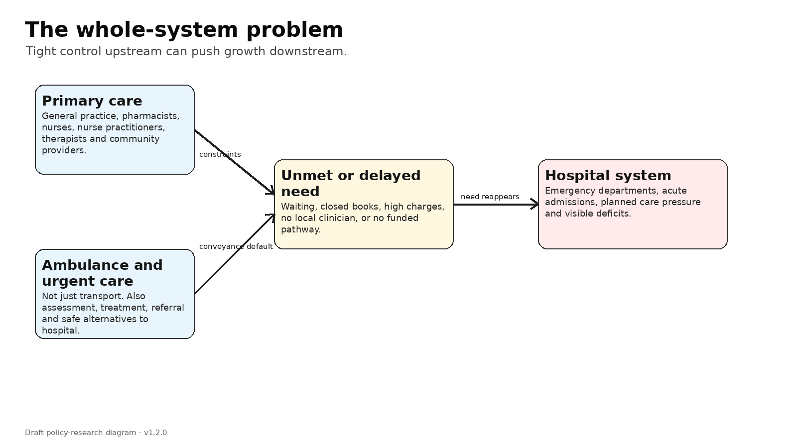
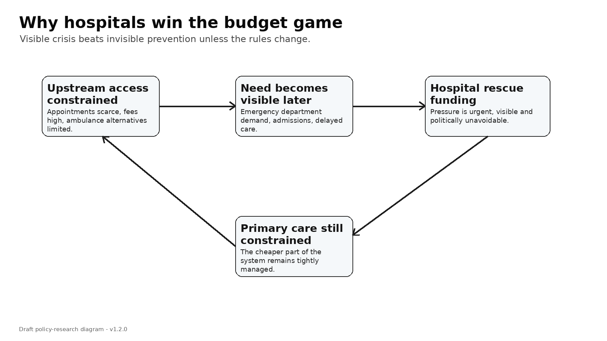

# Primary care funding: what this series is, and what it is not

This series is about a simple but uncomfortable question:

> Are we controlling lower-cost care so tightly that we are accidentally buying more hospital demand later?

I am writing this as an exploratory policy series, not as a partisan campaign and not as a finished government business case.

The argument is not anti-general practice. It is not anti-Primary Health Organisation. It is not anti-Health New Zealand. It is not anti-capitation. It is not a call for an uncontrolled fee-for-service free-for-all.

The argument is that New Zealand may need a better hybrid:

> capitation for continuity and population responsibility; uncapped scheduled fee-for-service for eligible primary medical activity; place-based accountability for equity and anti-cherry-picking; urgent care and ambulance integration for hospital avoidance; provider-scope flexibility for safe supply expansion; and data, audit and key performance indicators to prevent gaming.

The word “uncapped” needs care. I do not mean unlimited public money with no rules. I mean the total volume of eligible primary medical work should not be artificially fixed in advance if the work is clinically necessary, delivered by an eligible provider, documented, auditable, and governed by item rules and equity protections.

In this series I will explain the background slowly: fee-for-service, capitation, marginal supply, Primary Health Organisations, Accident Compensation Corporation payments, ambulance, urgent care, co-payments, game theory, modelling, and decision-making.

Each post is short enough to read with a coffee. Each post has an optional appendix for readers who want the detail.

## What would change my mind?

I would be less convinced of this argument if current reforms — capitation reweighting, the primary care access target, the National Primary Care Dataset, urgent care expansion, digital access and Primary Health Organisation accountability — materially increased appointment supply, reduced closed books, protected rural in-person care, lowered unmet need, and reduced avoidable emergency department demand without adding an uncapped scheduled primary medical stream.

That is testable. It is exactly why this series includes assumptions, diagrams, models and suggested empirical checks.

## How to read the series

Start with Posts 1 to 3. They explain the basic problem and the economics. Posts 4 to 6 move into current reform and the uncapped scheduled benefit idea. Posts 7 to 14 map the games. Posts 15 to 18 bring the games together into modelling, decision-support and recommendations.

The appendices are there for readers who want sources, tables, assumptions and modelling notes. The main posts should stand on their own.

## Series index

- Post 01: [Are we buying hospital growth by rationing cheaper care upstream?](posts-v1.6.0-public/post-01-are-we-buying-hospital-growth-by-rationing-cheaper-care-upstream-v1.6.0.md)
- Post 02: [Fee-for-service, capitation and blended funding: the plain-English version](posts-v1.6.0-public/post-02-fee-for-service-capitation-and-blended-funding-the-plain-english-version-v1.6.0.md)
- Post 03: [Marginal supply: the tiny economic idea that decides whether appointments exist](posts-v1.6.0-public/post-03-marginal-supply-the-tiny-economic-idea-that-decides-whether-appointments-exist-v1.6.0.md)
- Post 04: [Why formulas do not solve games](posts-v1.6.0-public/post-04-why-formulas-do-not-solve-games-v1.6.0.md)
- Post 05: [The current reform pathway: stronger than a straw man, but maybe still incomplete](posts-v1.6.0-public/post-05-the-current-reform-pathway-stronger-than-a-straw-man-but-maybe-still-incomplete-v1.6.0.md)
- Post 06: [What I mean by uncapping primary care funding](posts-v1.6.0-public/post-06-what-i-mean-by-uncapping-primary-care-funding-v1.6.0.md)
- Post 07: [The hospital salience game and the Health New Zealand allocation game](posts-v1.6.0-public/post-07-the-hospital-salience-game-and-the-health-new-zealand-allocation-game-v1.6.0.md)
- Post 08: [The capitation marginal-supply game and the consumer access game](posts-v1.6.0-public/post-08-the-capitation-marginal-supply-game-and-the-consumer-access-game-v1.6.0.md)
- Post 09: [Primary Health Organisations: useful functions, payment friction and cherry-picking](posts-v1.6.0-public/post-09-primary-health-organisations-useful-functions-payment-friction-and-cherry-picking-v1.6.0.md)
- Post 10: [Accident Compensation Corporation, ambulance and urgent care: the hidden upstream system](posts-v1.6.0-public/post-10-accident-compensation-corporation-ambulance-and-urgent-care-the-hidden-upstream-system-v1.6.0.md)
- Post 11: [Who should be allowed to generate primary care supply?](posts-v1.6.0-public/post-11-who-should-be-allowed-to-generate-primary-care-supply-v1.6.0.md)
- Post 12: [Telehealth is an extender, not a replacement for local supply](posts-v1.6.0-public/post-12-telehealth-is-an-extender-not-a-replacement-for-local-supply-v1.6.0.md)
- Post 13: [Co-payments: demand signal or equity failure?](posts-v1.6.0-public/post-13-co-payments-demand-signal-or-equity-failure-v1.6.0.md)
- Post 14: [The 19 games: a map of the New Zealand primary care funding problem](posts-v1.6.0-public/post-14-the-19-games-a-map-of-the-new-zealand-primary-care-funding-problem-v1.6.0.md)
- Post 15: [The hybrid game: why no single lever is enough](posts-v1.6.0-public/post-15-the-hybrid-game-why-no-single-lever-is-enough-v1.6.0.md)
- Post 16: [Composite modelling: what the demonstrative model adds, and what it does not](posts-v1.6.0-public/post-16-composite-modelling-what-the-demonstrative-model-adds-and-what-it-does-not-v1.6.0.md)
- Post 17: [Game-informed Multi-Criteria Decision Analysis: making disagreement useful](posts-v1.6.0-public/post-17-game-informed-multi-criteria-decision-analysis-making-disagreement-useful-v1.6.0.md)
- Post 18: [Recommendations: a primary care system that can grow before hospitals have to](posts-v1.6.0-public/post-18-recommendations-a-primary-care-system-that-can-grow-before-hospitals-have-to-v1.6.0.md)

## Core sources to start with

- [Ministry of Health: capitation reweighting](https://www.health.govt.nz/strategies-initiatives/programmes-and-initiatives/primary-and-community-health-care/capitation-reweighting)
- [Health New Zealand: National Primary Care Dataset and primary care health target](https://www.healthnz.govt.nz/about-us/what-we-do/planning-and-performance/primary-care-tactical-action-plan/national-primary-care-dataset-and-new-primary-care-health-target)
- [Accident Compensation Corporation: paying for patient treatment](https://www.acc.co.nz/for-providers/invoicing-us/paying-patient-treatment)
- [Treasury: Vote Health Estimates](https://www.treasury.govt.nz/publications/estimates/vote-health-health-sector-estimates-appropriations-2025-26)

---

# Are we buying hospital growth by rationing cheaper care upstream?

There is a simple question underneath a lot of New Zealand health policy.

Are we managing primary care, urgent care and ambulance services so tightly that we are accidentally buying more hospital demand?

That sounds provocative. I do not mean it as a slogan. I mean it as a system-design question.

Primary care is usually the cheaper, earlier and more human part of the system. It is where a person asks about a cough before it becomes pneumonia. It is where a child’s fever is assessed before a parent panics and goes to the emergency department. It is where blood pressure, diabetes, pain, frailty, prescriptions, forms, mental health and uncertainty are dealt with before they become bigger problems.

But primary care does not expand by magic. Someone has to pay for the next appointment. Someone has to fund the room, the nurse, the doctor, the pharmacist, the nurse practitioner, the receptionist, the software, the phone calls, the follow-up and the risk.

That is why funding architecture matters.

*(Wait, want to skip the reading and play with the numbers yourself? Try the **Primary Care Pulse interactive dashboard** [here] to see how these funding choices actually change the system).*

When people hear “primary care funding”, they often think the debate is just about whether general practitioners should be paid more. That is too narrow. Of course money matters. But the deeper issue is how the money moves.

A funding model is not just accounting. It is a set of rules. It tells providers what work is viable, what work is risky, what work is invisible, and what work is someone else’s problem.

In New Zealand, the core funding model for general practice is capitation. Capitation means a clinic receives a fixed amount per enrolled person each year. The Ministry of Health says capitation was introduced in 2002 and remains the core way general practice is funded. The formula is now being reweighted because the old formula no longer reflects today’s population, complexity, rurality and deprivation.

That reweighting is sensible. But it may not be enough.

Here is the problem. Capitation is good at giving a practice responsibility for a population. It is useful for continuity and planned care. But once a patient is enrolled, the next appointment often creates extra cost without an equivalent extra payment.

That is what economists call a marginal problem. Marginal just means “the next one”. The next consultation. The next phone call. The next urgent appointment. The next wound dressing. The next follow-up. The next rural session. The next child with a fever.

If the next piece of work is weakly funded, the system will eventually ration it. Rationing may not look like a sign on the door. It may look like a three-week wait, closed books, higher co-payments, shorter appointments, fewer rural clinics, or patients being told to try online care or go to the emergency department.

The need does not disappear. It moves.

Some of it moves to urgent care. Some moves to ambulance. Some moves to hospital. Some becomes silent unmet need. Some becomes worse illness later.

This is where the hospital always has an advantage. Hospital pressure is visible. Ambulances ramping outside an emergency department are visible. Waiting lists are visible. Media stories about delayed cancer treatment are visible. A missed primary care appointment is not visible in the same way.

So the system can end up doing something perverse. It tightly manages growth in the lower-cost, earlier-intervention parts of the system, then funds the more expensive hospital consequences later.

That is the “hospital growth by default” hypothesis.

The answer is not to abolish capitation. Capitation has important strengths. The answer is also not to create an uncontrolled fee-for-service free-for-all. Fee-for-service means paying for each service, and if it is poorly designed it can reward low-value volume.

The answer is a hybrid.

My working proposal is this:

> Keep capitation for continuity and population responsibility. Add an uncapped, rules-based, fee-for-service stream for eligible primary medical activity, similar in logic to Accident Compensation Corporation treatment payments. Pair that with place-based accountability so providers cannot simply cherry-pick easy work.

Uncapped does not mean uncontrolled. It means the total volume of eligible primary medical work is not artificially fixed in advance. The controls sit elsewhere: item rules, public contribution rates, clinical necessity, provider scope, documentation, audit, co-payment protections, and accountability for whole populations.

That is the big idea in this series.

I want to explain it slowly. I will cover fee-for-service, capitation, co-payments, primary health organisations, Accident Compensation Corporation, urgent care, ambulance, game theory, microeconomics, modelling, and why formula fights can go on forever without solving the real problem.

## What would change my mind?

I would be less convinced if better appointment data showed that tight control of upstream care was not associated with higher emergency department use, longer waits, closed books, or delayed care once need, rurality and deprivation were taken into account.

---

**Deep dive (optional, not required reading):** I’ve kept the fuller explanation, game table, modelling notes and full source list in the [appendix for this post](appendices-v1.6.0/appendix-01-are-we-buying-hospital-growth-by-rationing-cheaper-care-upstream-v1.6.0.md).

## Useful links

- [Ministry of Health: capitation reweighting](https://www.health.govt.nz/strategies-initiatives/programmes-and-initiatives/primary-and-community-health-care/capitation-reweighting)
- [Cabinet material: Primary Health Care Funding Improvements](https://www.health.govt.nz/information-releases/cabinet-material-primary-health-care-funding-improvements-and-update-on-primary-health-care)
- [Health New Zealand: National Primary Care Dataset and new primary care health target](https://www.healthnz.govt.nz/about-us/what-we-do/planning-and-performance/primary-care-tactical-action-plan/national-primary-care-dataset-and-new-primary-care-health-target)
- [Ministry of Health: primary care health target](https://www.health.govt.nz/strategies-initiatives/programmes-and-initiatives/primary-and-community-health-care/primary-care-health-target)
- [Treasury: Vote Health 2025/26 Estimates](https://www.treasury.govt.nz/publications/estimates/vote-health-health-sector-estimates-appropriations-2025-26)

---

# Fee-for-service, capitation and blended funding: the plain-English version

Before talking about reform, it helps to understand the three basic ways we pay for primary care.

The first is fee-for-service. A provider does a service and receives a payment. The service might be a consultation, a procedure, a review, a wound dressing, a vaccination, a minor operation or an urgent assessment.

Fee-for-service has one major strength: it pays for the next piece of work.

If a clinic sees more patients, it receives more revenue. If a nurse practitioner provides more eligible consultations, those consultations can be funded. If a rural clinician does more urgent-care sessions, there is a payment signal attached to that work.

That can increase supply. It tells the system that doing more work is financially possible.

But fee-for-service has a danger. If it is poorly designed, it can reward volume rather than value. It can make short, simple, repeat contacts more attractive than slow, complex, relationship-based care. It can also encourage providers to focus on services that are easy to bill, rather than services that matter most.

So fee-for-service is useful, but dangerous.

The second model is capitation. A provider receives a fixed payment for each enrolled person, usually adjusted by patient characteristics such as age, sex, deprivation, rurality and illness burden.

Capitation has real strengths. It supports continuity. It gives a clinic responsibility for a defined population. It can support preventive care and team-based work that does not fit neatly into a single consultation. It is also attractive to funders because the total funding is more predictable.

But capitation has a different danger. Once the patient is enrolled, the next contact is often a cost rather than a revenue event. If a person needs more visits, more phone calls, more follow-up, more complexity and more risk management, the practice may receive little additional payment.

That can lead to rationing. Not necessarily because anyone is being lazy or uncaring. It happens because time and workforce are finite.

The third model is programme or targeted funding. This is money for specific activities, such as immunisation, long-term condition care, screening, care coordination or access programmes.

Targeted funding can be useful when government wants to promote particular outcomes. But it can become complicated. It can fragment care into many little funding streams, each with its own forms, rules, audits and reporting.

This is why most sensible systems use a blend.

A blended model uses capitation for baseline responsibility, fee-for-service for eligible activity, and targeted funding for priority programmes. The trick is not choosing one model as if it were perfect. None of them is perfect.

The trick is matching the payment signal to the type of care.

For example:

- continuity and preventive care suit capitation;
- urgent appointments and procedures suit fee-for-service;
- immunisation catch-up or outreach may suit targeted funding;
- rural access may need loading or place-based support;
- complex long-term care may need both capitation and activity-sensitive payments.

In New Zealand, the Government itself describes primary care funding as blended: capitation, co-payments and targeted streams. That is true. But the important question is whether the blend is strong enough at the margin.

The margin is the next appointment.

If the next appointment is clinically needed but weakly funded, the system may still ration access even if the overall model is technically “blended”.

That is why I keep coming back to an Accident Compensation Corporation-style analogy. Accident Compensation Corporation payments are not unlimited chaos. They are rules-based. Providers must be qualified. Treatment must be clinically appropriate. Documentation is required. Some items require approval. There are scheduled contributions.

In other words, activity can be demand-led without being uncontrolled.

That is the distinction I think New Zealand needs to explore for primary medical care.

Not a blank cheque.

Not a return to 1980s medicine.

Not replacing capitation.

A properly designed hybrid.

Capitation for population responsibility.

Fee-for-service for eligible medical activity.

Place-based commissioning for people and communities who might otherwise be left behind.

And transparent data so we can see whether the system is actually improving access, rather than just shifting patients around.

### The useful way to think about all three

A simple way to remember the three models is this:

- capitation pays for **responsibility**;
- fee-for-service pays for **activity**;
- programme funding pays for **specific organised work**.

A mature system usually needs all three. The argument starts when one of them is asked to do a job it cannot do well.

## What would change my mind?

I would be less convinced if one payment model consistently delivered access, equity, continuity, fiscal control and rural supply without needing the others. I do not think the evidence or lived system experience shows that.

---

**Deep dive (optional, not required reading):** I’ve kept the fuller explanation, game table, modelling notes and full source list in the [appendix for this post](appendices-v1.6.0/appendix-02-fee-for-service-capitation-and-blended-funding-the-plain-english-version-v1.6.0.md).

## Useful links

- [Ministry of Health: capitation reweighting](https://www.health.govt.nz/strategies-initiatives/programmes-and-initiatives/primary-and-community-health-care/capitation-reweighting)
- [RACGP/AJGP: understanding general practice funding models](https://www1.racgp.org.au/ajgp/2024/december/understanding-general-practice-funding-models-in-a)
- [Cochrane: payment methods for outpatient healthcare providers](https://www.cochrane.org/evidence/CD011865_payment-methods-healthcare-providers-outpatient-healthcare-settings)
- [Australian Department of Health: Review of General Practice Incentives](https://www.health.gov.au/resources/publications/review-of-general-practice-incentives-expert-advisory-panel-report-to-the-australian-government?language=en)
- [Accident Compensation Corporation: paying patient treatment](https://www.acc.co.nz/for-providers/invoicing-us/paying-patient-treatment)

---

# Marginal supply: the tiny economic idea that decides whether appointments exist

A lot of this debate turns on one small economic idea: marginal supply.

“Marginal” means the next one.

The next appointment. The next prescription review. The next same-day urgent slot. The next rural clinic. The next wound dressing. The next complex consultation. The next follow-up after an ambulance crew decides not to take someone to hospital.

The question is simple:

> Is the next clinically useful contact financially viable for the provider to deliver?

That does not mean clinicians think only about money. They do not. But clinics are not abstract moral machines. They are organisations with finite staff, rooms, phones, software, admin support, rent, indemnity, clinical risk and exhaustion.

If the next contact has a cost, but little or no payment signal, the system will ration it.

That is especially true when workforce is tight.

Under a mostly capitated system, a practice receives a fixed payment per enrolled person. That payment helps support the practice. But after the patient is enrolled, seeing them more often may not bring enough additional revenue to cover the extra time and cost.

Under fee-for-service, the next eligible contact brings a payment. That payment may not fully cover cost either, but it creates a marginal signal. It tells the provider that expanding activity is possible.

The diagram below is deliberately simple. It shows marginal cost rising as a practice takes on more contacts. Early contacts may be easy to absorb. Later ones are harder because the practice needs extra staff, longer hours, more rooms or more administration.

Under weak marginal revenue, supply stops early. Under scheduled fee-for-service, more contacts become viable.

This is not an argument that fee-for-service is always good. It is an argument that every system needs some way to pay for the next clinically necessary contact.

If it does not, the rationing still happens. It just happens less honestly.

The system rations by:

- waiting time;
- closed books;
- appointment length;
- phone triage;
- co-payment increases;
- referral thresholds;
- telling patients to use emergency departments;
- shifting work to ambulance or urgent care;
- using telehealth for problems that may still need hands-on examination.

Some of those tools are useful. Triage is useful. Telehealth is useful. Co-payments can play a role. But when they become the main rationing mechanism, the system is in trouble.

A hard funding envelope can look tidy from the centre. The budget is controlled. The line item is stable. The formula is updated. The target is announced.

But from the patient’s point of view, the question is simpler: can I get care when I need it?

From the provider’s point of view: can we afford to open another slot without burning out staff or bankrupting the practice?

From the hospital’s point of view: why are more people turning up at the emergency department?

Those are all marginal-supply questions.

This is why I think New Zealand should explore an uncapped, scheduled, rules-based primary medical fee-for-service stream. Not uncapped prices. Not uncapped provider behaviour. Uncapped eligible activity.

The public contribution would be scheduled. The service would need to be eligible. The provider would need to be working within scope. Documentation would be required. Patterns of overuse would be audited. Co-payment protections would be needed for children, Community Services Card holders, rural patients, high-need groups and people with complex long-term conditions.

The point is to stop using a capped envelope as the main control.

A capped envelope is simple, but it pushes pressure elsewhere.

A rules-based activity stream is more complicated, but it can let supply grow where care is lower cost and earlier.

Microeconomics does not tell us the exact policy answer. But it does tell us what to look for.

If the next clinically useful contact is unfunded, that contact will eventually disappear.

And if enough contacts disappear upstream, they reappear downstream as ambulance calls, urgent care demand and hospital pressure.

### Why this matters for rural areas

Marginal supply is especially important in rural areas. A city practice may be able to absorb a bit more work by using a larger team, extending hours or shifting some care to telehealth. A rural service may have fewer staff, fewer rooms, longer travel times, fewer locums and less backup.

That means the marginal cost of the next in-person clinic can rise very quickly. If the payment signal does not rise with it, the system will drift toward remote-only care or no care at all.

## What would change my mind?

I would be less convinced if practices could reliably increase timely appointments under fixed capitation alone, without higher co-payments, shorter consultations, hidden rationing, or extra activity-linked funding.

---

**Deep dive (optional, not required reading):** I’ve kept the fuller explanation, game table, modelling notes and full source list in the [appendix for this post](appendices-v1.6.0/appendix-03-marginal-supply-the-tiny-economic-idea-that-decides-whether-appointments-exist-v1.6.0.md).

## Useful links

- [Ministry of Health: capitation reweighting](https://www.health.govt.nz/strategies-initiatives/programmes-and-initiatives/primary-and-community-health-care/capitation-reweighting)
- [Accident Compensation Corporation: paying patient treatment](https://www.acc.co.nz/for-providers/invoicing-us/paying-patient-treatment)
- [Cochrane: payment methods for outpatient healthcare providers](https://www.cochrane.org/evidence/CD011865_payment-methods-healthcare-providers-outpatient-healthcare-settings)
- [RACGP/AJGP: understanding general practice funding models](https://www1.racgp.org.au/ajgp/2024/december/understanding-general-practice-funding-models-in-a)
- [Cabinet material: Primary Health Care Funding Improvements](https://www.health.govt.nz/information-releases/cabinet-material-primary-health-care-funding-improvements-and-update-on-primary-health-care)

---

# Why formulas do not solve games

Funding formulas look technical. They feel objective. They use numbers, weights, datasets, regression models and official language.

But formulas do not remove politics. They often concentrate it.

New Zealand has seen this before with the Population-Based Funding Formula, which was used to distribute District Health Board funding. A New Zealand Medical Journal article analysed 487 newspaper articles about that formula between 2003 and 2016. The formula became a public flashpoint, especially in the South Island. A central theme was dissatisfaction with allocations and concern about transparency.

That should not surprise anyone.

A funding formula is a way of deciding shares. Once shares are at stake, everyone has a reason to argue that the formula misses something important.

Rurality. Deprivation. Age. Ethnicity. Unmet need. Complexity. Diseconomies of scale. Transport. Workforce costs. Growth. Decline. Fixed infrastructure. Historical underfunding. Future demand.

All of those things matter.

But the more variables you add, the more the debate becomes a contest about weights. One group says deprivation is underweighted. Another says rurality is underweighted. Another says age is underweighted. Another says historical utilisation bakes in past access failure. Another says the model punishes efficient providers. Another says it rewards providers who generate activity.

That does not mean formulas are useless. They are necessary. If public money is being allocated across populations, there must be some logic to the allocation.

But a formula can only answer one kind of question:

> How should a funding pool be distributed?

It cannot fully answer a different question:

> Should the pool itself be capped in a way that suppresses clinically useful activity?

That is the distinction I think matters in primary care.

The current capitation reweighting work is sensible. The Ministry of Health says the old formula was based on how people used general practice in the late 1990s. Since then New Zealand has changed: more long-term conditions, more multimorbidity, more treatment options, more complexity managed in the community, and different rural and deprivation patterns.

So yes, the formula should change.

But reweighting capitation does not solve the marginal-supply problem by itself.

It can make funding distribution fairer across practices. It can move more funding toward practices with higher-need enrolled populations. It can reduce some inequity. Those are good things.

But if the overall architecture remains heavily capped, the next appointment may still be weakly funded.

This is why I worry about “missing the wood from the trees”.

The tree is the formula. The wood is the system game.

The formula asks whether Practice A should get more than Practice B.

The game asks whether either practice can afford to provide the next clinically needed contact.

The formula asks whether rurality should have a higher weight.

The game asks whether a rural patient can actually see someone in person.

The formula asks whether multimorbidity is included.

The game asks whether complex patients get enough time, follow-up and coordination.

The formula asks whether deprivation is measured properly.

The game asks whether people in deprived communities are rationed by cost, waiting time or closed books.

The formula asks whether the model is fair.

The game asks whether the system grows in the right place.

That is why my proposal is not to stop capitation reweighting. It is to add another layer.

Keep improving the formula.

But do not expect the formula to do the job of a funding architecture.

The architecture should include:

- capitation for continuity and population accountability;
- uncapped scheduled fee-for-service for eligible primary medical contacts;
- targeted funding for priority programmes;
- place-based accountability to prevent cherry-picking;
- co-payment protections;
- transparent data;
- urgent-care and ambulance integration;
- audit and clinical governance.

That is more complicated than a formula.

But the system is complicated.

The danger is that we spend years arguing over capitation weights while the real supply constraint remains intact.

A better formula may distribute scarcity more fairly.

It may not remove the scarcity.

### The trap in formula politics

Formula fights are seductive because they look technical. Everyone can point to a variable. Age. Deprivation. Rurality. Ethnicity. Multimorbidity. Workforce cost. Practice size. Travel time.

All of those variables matter. But the deeper problem is that no formula can carry all the political expectations placed on it. If the total envelope is fixed, every added weight creates a redistribution. Someone gains. Someone loses. The debate then becomes a fight over the denominator, the coefficients and the evidence base.

## What would change my mind?

I would be less convinced if capitation reweighting alone materially improved access, reduced closed books, protected rural in-person care and reduced avoidable hospital demand. That is testable.

---

**Deep dive (optional, not required reading):** I’ve kept the fuller explanation, game table, modelling notes and full source list in the [appendix for this post](appendices-v1.6.0/appendix-04-why-formulas-do-not-solve-games-v1.6.0.md).

## Useful links

- [Ministry of Health: capitation reweighting](https://www.health.govt.nz/strategies-initiatives/programmes-and-initiatives/primary-and-community-health-care/capitation-reweighting)
- [Cabinet material: Primary Health Care Funding Improvements](https://www.health.govt.nz/information-releases/cabinet-material-primary-health-care-funding-improvements-and-update-on-primary-health-care)
- [New Zealand Medical Journal: media content analysis of the Population-Based Funding Formula](https://nzmj.org.nz/media/pages/journal/vol-131-no-1480/a-media-content-analysis-of-new-zealand-s-district-health-board-population-based-funding-formula/6ff2e1d910-1696474509/a-media-content-analysis-of-new-zealand-s-district-health-board-population-based-funding-formula.pdf)
- [New Zealand Medical Journal: Population-Based Funding Formula transparency article](https://nzmj.org.nz/media/pages/journal/vol-126-no-1376/6c9b9d56a4-1696469440/vol-126-no-1376.pdf)
- [Ministry of Health: PHO finances briefing](https://www.health.govt.nz/system/files/2025-11/H2025069314-Briefing-PHO-finances-a-summary-of-available-information.pdf)

---

# The current reform pathway: stronger than a straw man, but maybe still incomplete

One criticism of my early framing was fair: New Zealand is not doing nothing.

The current reform pathway is more substantial than simply tweaking capitation.

The Government is reweighting capitation. It is introducing a primary care access target. Health New Zealand is building a National Primary Care Dataset. There is performance-based funding. There is 24/7 digital general practitioner access. There is a large urgent and after-hours programme. There are workforce initiatives. There is policy work on Primary Health Organisations. There is a separate appropriation for primary, community, public and population health services.

That matters.

If the critique is written as if the only thing happening is capitation reweighting, it becomes too easy to dismiss.

So the better question is not:

> Why is New Zealand only changing the capitation formula?

The better question is:

> Does the current reform pathway change the game enough?

That is a much stronger question.

The current reform has some obvious strengths.

First, the new capitation formula should be fairer. It includes factors such as age, sex, multimorbidity, rurality and deprivation. That is better than an old formula built from late-1990s utilisation patterns.

Second, the primary care access target makes access visible. For the first time, primary care has a national access target. The proposed target is that more than 80 percent of people can access an appointment with a general practice provider within one week.

Third, the National Primary Care Dataset should improve observability. If we can see when appointments are booked, when people are seen, and what the outcome was, we can start to understand access rather than guessing.

Fourth, urgent and after-hours care is being expanded. The Government has announced investment to support a goal of 98 percent of New Zealanders being able to access urgent care within one hour’s drive.

Fifth, official policy is starting to talk about the broader general practice team, not only doctors.

All of that is important.

But there are still gaps.

A target does not create appointments by itself.

A dataset does not create supply by itself.

A better capitation formula does not necessarily fund the next urgent contact.

A digital service does not replace all local, in-person care.

Urgent care does not solve routine continuity.

Performance payments do not necessarily fix the base economics of practices.

Separate appropriations do not automatically prevent hospital pressure from dominating political attention.

This is why I think the current reform should be treated as the comparator, not the endpoint.

The current reform may improve allocation, visibility and some access. The question is whether it removes the hard cap on eligible primary medical activity.

I do not think it fully does.

The most important missing mechanism is still the marginal supply signal.

If a practice has extra patient demand but no viable way to fund the next clinically useful contact, the system still rations. If a nurse practitioner, pharmacist, paramedic, physiotherapist, general practitioner or other clinician can safely deal with a defined problem, but the funding architecture does not let that activity be generated and paid for, supply is still artificially constrained.

That is why the proposal is to add an uncapped, rules-based fee-for-service stream for eligible primary medical care.

Not all care. Not all providers doing anything they want. Not all volume without controls.

Eligible medical activity.

Scheduled contribution rates.

Scope-based provider eligibility.

Clinical necessity rules.

Documentation.

Audit.

Co-payment protections.

Place-based accountability.

This would sit beside capitation, not replace it.

In other words, the current reform pathway may be the foundation. The hybrid model is the next layer.

The diagram below compares the current reform pathway with the hybrid architecture I am suggesting. It is not a statistical forecast. It is a structured way of thinking about where each architecture is strong and weak.

The current reform is strongest on allocation fairness, data, targets and some urgent-care access. The hybrid model is stronger where the current pathway may remain weaker: marginal supply, provider-scope flexibility, whole-population accountability and uncapped eligible activity.

So the critique is not “the Government has done nothing”.

The critique is:

> The Government has started to change the system. But it may still be managing upstream activity too tightly, while hospital demand remains the pressure valve.

That is the game we need to test.

### Why this matters for criticism

If we ignore the current reform agenda, the critique becomes weak. It sounds like we are arguing against a system that no longer exists. That is why the current reform pathway should be the real comparator.

## What would change my mind?

I would be less convinced if the current reform pathway proves it can expand safe upstream supply, not only measure access or redistribute existing capitation funding.

---

**Deep dive (optional, not required reading):** I’ve kept the fuller explanation, game table, modelling notes and full source list in the [appendix for this post](appendices-v1.6.0/appendix-05-the-current-reform-pathway-stronger-than-a-straw-man-but-maybe-still-incomplete-v1.6.0.md).

## Useful links

- [Ministry of Health: capitation reweighting](https://www.health.govt.nz/strategies-initiatives/programmes-and-initiatives/primary-and-community-health-care/capitation-reweighting)
- [Cabinet material: Primary Health Care Funding Improvements](https://www.health.govt.nz/information-releases/cabinet-material-primary-health-care-funding-improvements-and-update-on-primary-health-care)
- [Ministry of Health: primary care health target](https://www.health.govt.nz/strategies-initiatives/programmes-and-initiatives/primary-and-community-health-care/primary-care-health-target)
- [Health New Zealand: National Primary Care Dataset and new primary care health target](https://www.healthnz.govt.nz/about-us/what-we-do/planning-and-performance/primary-care-tactical-action-plan/national-primary-care-dataset-and-new-primary-care-health-target)
- [Ministry of Health: PHO finances briefing](https://www.health.govt.nz/system/files/2025-11/H2025069314-Briefing-PHO-finances-a-summary-of-available-information.pdf)

---

# What I mean by uncapping primary care funding

When I say primary care funding should be “uncapped”, I need to be precise.

I do not mean every provider should be able to bill anything, for anything, at any price.

I do not mean abolishing capitation.

I do not mean removing clinical governance.

I do not mean ignoring equity.

I mean something narrower and more useful:

> Eligible primary medical activity should not be limited by a hard global funding envelope. It should be demand-led within rules.

That is an important difference.

A capped envelope says: here is the total pool; once the pool is exhausted, the system must ration.

A rules-based benefit says: if the service is eligible, the provider is qualified, the patient meets criteria, the documentation is adequate and the claim is not suspicious, the public contribution flows.

That is closer to how Accident Compensation Corporation treatment funding works.

Accident Compensation Corporation does not pay for everything. It pays or contributes to injury treatment when the treatment is clinically appropriate, delivered by an appropriately qualified provider, documented, necessary, and within the relevant regulation or contract.

There are rules. There are item codes. There are contribution rates. There are contracts. Some services require pre-approval. There are expectations about quality and the number of treatments needed.

That is why the Accident Compensation Corporation analogy is useful.

It shows that activity-sensitive funding can be controlled without using a fixed global cap as the main rationing tool.

For primary medical care, an uncapped benefit stream could start with specific contact types:

- same-day or next-day urgent primary medical assessment;
- complex consultations requiring longer time;
- rural in-person assessment;
- minor procedures that prevent escalation;
- follow-up after ambulance non-conveyance;
- care after emergency department discharge;
- clinically necessary reviews for frailty or multimorbidity;
- defined nurse practitioner, pharmacist, paramedic, physiotherapist or general practitioner services within scope.

The public contribution would be scheduled. The patient might pay a co-payment, depending on policy settings. For high-need groups, children, Community Services Card holders, rural patients or priority services, the co-payment could be reduced or removed.

The key point is that the total number of eligible services would not be fixed in advance.

If patients need care, and providers can safely deliver it, the system should not suppress that activity just because the envelope has been capped.

The controls should be smarter:

- item definitions;
- clinical eligibility;
- scope of practice;
- documentation;
- audit;
- unusual-billing detection;
- outcome monitoring;
- co-payment caps;
- locality obligations;
- minimum service coverage;
- reporting against access and equity.

This is what I mean by “uncapped does not mean uncontrolled”.

Why does this matter?

Because if the main control is a hard cap, the system often controls the budget by suppressing care upstream.

That does not mean people stop needing care.

It means they wait. Or pay. Or go elsewhere. Or deteriorate. Or call an ambulance. Or end up in hospital.

The hospital system is then funded to deal with the pressure because hospital pressure is more visible and less avoidable.

That is not good economics. It is delayed spending at a higher cost.

A better model would let eligible primary medical activity grow safely.

It would still keep capitation. Capitation is important for continuity and population accountability. It would still keep place-based responsibility. Otherwise providers could cherry-pick easy work and leave hard-to-reach populations behind.

The proposal is a hybrid:

- capitation for having responsibility;
- fee-for-service for doing eligible medical work;
- place-based accountability for reaching everyone;
- data and audit for controlling gaming;
- co-payment protections for equity.

That is not neoliberal. It is not a blank cheque. It is not an anti-public model.

It is a way of paying for the care we want to happen before the hospital becomes the only place left to go.

### What would still be controlled?

This is the part people often miss. If eligible activity is uncapped, almost everything else still needs rules.

The item price is scheduled. The provider must be eligible. The service must match a defined contact type. The provider must act within legal scope. The record must show clinical need. Repeated patterns can be audited. Co-payment protections can be applied. Some services can require pre-approval or additional documentation.

That is why Accident Compensation Corporation is such a useful analogy. It does not mean every provider can bill anything they want forever. It means there is a rules-based stream where eligible injury-related treatment can generate payment.

## What would change my mind?

I would be less convinced if an uncapped scheduled stream could not be governed through item rules, scope, audit, co-payment protections and place accountability. The weak-control version is not the proposal.

---

**Deep dive (optional, not required reading):** I’ve kept the fuller explanation, game table, modelling notes and full source list in the [appendix for this post](appendices-v1.6.0/appendix-06-what-i-mean-by-uncapping-primary-care-funding-v1.6.0.md).

## Useful links

- [Ministry of Health: capitation reweighting](https://www.health.govt.nz/strategies-initiatives/programmes-and-initiatives/primary-and-community-health-care/capitation-reweighting)
- [Accident Compensation Corporation: paying patient treatment](https://www.acc.co.nz/for-providers/invoicing-us/paying-patient-treatment)
- [Ministry of Business, Innovation and Employment: ACC regulated payments for treatment](https://www.mbie.govt.nz/business-and-employment/employment-and-skills/employment-legislation-reviews/increasing-regulated-acc-payments-for-treatment/proposed-updates-to-acc-regulated-payments-for-treatment/options-for-payment-increases-and-how-they-were-assessed)
- [Cochrane: payment methods for outpatient healthcare providers](https://www.cochrane.org/evidence/CD011865_payment-methods-healthcare-providers-outpatient-healthcare-settings)
- [RACGP/AJGP: understanding general practice funding models](https://www1.racgp.org.au/ajgp/2024/december/understanding-general-practice-funding-models-in-a)

---

# The hospital salience game and the Health New Zealand allocation game

Game theory sounds more dramatic than it needs to be.

For this series, a “game” just means a situation where different players respond to incentives, rules, constraints and each other’s behaviour.

The first game is the hospital rescue game.

Hospitals have a special kind of political visibility. When hospital pressure rises, it is hard to ignore. Emergency departments fill. Waiting lists grow. Media stories appear. Ambulances queue. Elective surgery is delayed. Ministers get briefed. The public notices.

Primary care failure is different.

A person who could not get an appointment is not always counted. A person who paid more than they could afford is not always visible. A person who gave up and waited is not always in the dataset. A practice that quietly closed its books may be a local crisis but not a national headline.

So hospital demand is a visible crisis, while upstream unmet need is often invisible until it becomes hospital demand.

That creates a repeated game.

Round one: primary care access is constrained.

Round two: some unmet need flows to urgent care, ambulance and emergency departments.

Round three: hospital pressure becomes visible.

Round four: funding and management attention go to the hospital pressure.

Round five: primary care remains constrained.

Then the cycle repeats.

This is not about hospital managers being villains. It is about salience. The hospital problem is immediate, measurable and politically urgent.

The second game is the Health New Zealand allocation game.

New Zealand now has formal separate appropriations for hospital/specialist services and primary/community/public/population health services. That matters. It means the old simple claim — that primary care is just residual inside a hospital budget — is too crude.

But separate appropriations do not eliminate the game.

Health New Zealand still operates in a world of workforce shortages, hospital deficits, urgent public expectations, ministerial targets, capital pressures, and competing service demands. It must manage hospital delivery while also commissioning primary and community services.

So the allocation game is not simply “money can be moved anywhere”. It is more subtle.

The question is:

> Which pressures become visible, urgent and fundable?

Hospital pressure usually wins that contest.

That is why upstream access needs top-tier visibility. Primary care and ambulance outcomes should not be treated merely as inputs to hospital performance. They should be visible system performance domains in their own right.

A primary care access target is a start. But the target should be interpreted carefully. If it only measures appointment timing within general practice, it may miss urgent care, ambulance alternatives, digital care, rural in-person access, co-payment burden and closed books.

The hospital rescue game can only be changed if upstream access is measured and funded in a way that matters.

That means:

- primary care access measures;
- urgent-care access measures;
- ambulance non-conveyance and safe alternative-disposition measures;
- co-payment burden measures;
- closed-books measures;
- rural in-person access measures;
- continuity measures;
- avoidable hospitalisation measures;
- lower-acuity emergency department flow measures;
- patient experience by deprivation, ethnicity, rurality and disability.

Once upstream failure is visible, it becomes harder to ignore.

But visibility is still not enough.

The system also needs a funding pathway that allows upstream supply to grow.

That is where the uncapped eligible primary medical fee-for-service stream fits. It gives the system a way to fund clinically useful activity before it becomes hospital demand.

The goal is not to starve hospitals.

Hospitals need funding. Hospitals are essential.

The goal is to stop using hospitals as the default growth pathway for needs that could have been met earlier, cheaper and closer to home.

### The subtle version of the hospital game

It is tempting to describe this as hospitals stealing money from primary care. That is too crude. Hospitals are not the villain. Hospital managers are not sitting around trying to undermine general practice.

The problem is structural. Hospital pressure is immediate. If elective surgery slows, people notice. If emergency department waiting times blow out, people notice. If beds are full, the system has no choice but to respond.

Primary care pressure is different. It is distributed across thousands of small moments: the appointment not available, the follow-up delayed, the fee that is too high, the practice that closes its books, the rural clinic that reduces sessions.

Those moments are real, but they are less visible. By the time they become visible, they often appear as hospital pressure.

That is the hospital game. It is not about bad intent. It is about what the system can see, what it is forced to rescue, and what it can postpone.

## What would change my mind?

I would be less convinced if Health New Zealand’s internal incentives gave primary and community care the same operational salience as emergency departments, hospitals, waiting lists and deficits.

---

**Deep dive (optional, not required reading):** I’ve kept the fuller explanation, game table, modelling notes and full source list in the [appendix for this post](appendices-v1.6.0/appendix-07-the-hospital-salience-game-and-the-health-new-zealand-allocation-game-v1.6.0.md).

## Useful links

- [Ministry of Health: Health Crown entities and Health New Zealand roles](https://www.health.govt.nz/about-us/new-zealands-health-system/health-system-roles-and-organisations/health-crown-entities)
- [Treasury: Vote Health 2025/26 Estimates](https://www.treasury.govt.nz/publications/estimates/vote-health-health-sector-estimates-appropriations-2025-26)
- [Cabinet material: Primary Health Care Funding Improvements](https://www.health.govt.nz/information-releases/cabinet-material-primary-health-care-funding-improvements-and-update-on-primary-health-care)
- [Health New Zealand: National Primary Care Dataset and new primary care health target](https://www.healthnz.govt.nz/about-us/what-we-do/planning-and-performance/primary-care-tactical-action-plan/national-primary-care-dataset-and-new-primary-care-health-target)
- [Ministry of Health: primary care health target](https://www.health.govt.nz/strategies-initiatives/programmes-and-initiatives/primary-and-community-health-care/primary-care-health-target)

---

# The capitation marginal-supply game and the consumer access game

The capitation supply game is simple.

A clinic receives a fixed payment for an enrolled person. That payment supports the practice and gives it responsibility for that person’s care.

But the patient’s need can change.

They might become frail. They might develop diabetes. They might need mental health care. They might have a child with repeated infections. They might need forms, follow-up, prescriptions, referrals and coordination.

The workload rises.

The fixed payment does not necessarily rise with each contact.

At some point, the practice faces a choice. It can absorb the extra work, charge more, shorten appointments, limit enrolments, increase waits, rely on triage, use telehealth where possible, or direct people elsewhere.

That is not a moral failure. It is a predictable supply response.

New Zealand has public evidence of this pressure. A New Zealand Medical Journal study found that in 2022 only 28 percent of surveyed general practices were freely enrolling new people, while 79 percent had closed or limited enrolments at some point since 2019. Another area-based analysis found that 33 percent of general practices had closed books in June 2022.

Closed books are important because they show a boundary in the capitation model.

In theory, capitation gives a practice a financial incentive to enrol more patients. In practice, a practice may decide that more enrolments would overload staff, reduce quality or worsen burnout.

That is the supply constraint.

The patient access game follows from it.

A patient who cannot get timely primary care has choices, but they are not equal choices.

They can wait.

They can pay more.

They can use an online service.

They can go to urgent care.

They can call an ambulance.

They can go to an emergency department.

They can give up.

A wealthy, digitally connected person in an urban area has more options. A rural person, disabled person, older person, Māori or Pacific patient, or a person with low income may have fewer practical options.

This is where equity enters the model.

When a system says it is controlling costs, it must ask: controlling costs for whom?

If the public budget is controlled by pushing cost, delay or risk onto patients, practices, ambulance or hospitals, the saving may be an illusion.

The need still exists.

The New Zealand Health Survey shows this access problem in plain terms. In 2023/24, one in four adults reported that the time taken to get an appointment was too long as a barrier to visiting a general practitioner. One in six adults reported cost as a barrier. Over five years, general practitioner visits decreased while emergency department visits increased for adults and children.

That does not prove one caused the other. But it supports the hypothesis that upstream access constraints and downstream hospital demand need to be analysed together.

The microeconomic point is straightforward.

A fixed funding envelope can ration by waiting time.

If patient need rises faster than funded upstream capacity, something has to give.

In a well-designed system, some of that increased need should be met in primary care, urgent care, community pharmacy, nurse practitioner services, allied health, paramedic pathways and virtual care.

In a poorly designed system, the need leaks into the emergency department.

That is why capitation should be kept, but not asked to do everything.

Capitation is for responsibility.

Fee-for-service is for eligible activity.

Place accountability is for whole populations.

Co-payment protections are for equity.

Data is for visibility.

The patient does not care what the funding model is called.

They care whether care exists.

### The patient game is not theoretical

Patients play the game too, although usually not by choice. They make decisions inside the rules the system gives them.

If the general practice appointment is two weeks away, the patient may wait. If they are worried, they may go to urgent care. If they cannot afford the fee, they may delay. If they cannot travel, they may choose telehealth. If the problem gets worse, they may call an ambulance or present to an emergency department.

None of those choices is irrational. The patient is responding to access, cost, worry, transport, time off work and trust.

That is why access targets have to be interpreted carefully. A target that rewards fast appointments can help. But it can also create pressure to prioritise simple, bookable activity over complex planned care. It can change booking behaviour without actually solving capacity.

## What would change my mind?

I would be less convinced if fixed capitation did not affect the marginal decision to add appointments, or if consumers did not shift between delay, payment, telehealth, ambulance and emergency departments when access changes.

---

**Deep dive (optional, not required reading):** I’ve kept the fuller explanation, game table, modelling notes and full source list in the [appendix for this post](appendices-v1.6.0/appendix-08-the-capitation-marginal-supply-game-and-the-consumer-access-game-v1.6.0.md).

## Useful links

- [Ministry of Health: capitation reweighting](https://www.health.govt.nz/strategies-initiatives/programmes-and-initiatives/primary-and-community-health-care/capitation-reweighting)
- [Ministry of Health: primary care health target](https://www.health.govt.nz/strategies-initiatives/programmes-and-initiatives/primary-and-community-health-care/primary-care-health-target)
- [Health New Zealand: National Primary Care Dataset and new primary care health target](https://www.healthnz.govt.nz/about-us/what-we-do/planning-and-performance/primary-care-tactical-action-plan/national-primary-care-dataset-and-new-primary-care-health-target)
- [Ministry of Health: New Zealand Health Survey annual update](https://www.health.govt.nz/publications/annual-update-of-key-results-202324-new-zealand-health-survey)
- [Cochrane: payment methods for outpatient healthcare providers](https://www.cochrane.org/evidence/CD011865_payment-methods-healthcare-providers-outpatient-healthcare-settings)

---

# Primary Health Organisations: useful functions, payment friction and cherry-picking

It is easy to make the Primary Health Organisation debate too simple.

One version says Primary Health Organisations are essential because they support population health, integration, quality improvement and local relationships.

Another version says Primary Health Organisations are bureaucratic intermediaries that sit between funding and frontline care.

Both can be true in different places.

That is why the better distinction is not “keep Primary Health Organisations” versus “abolish Primary Health Organisations”.

The better distinction is:

> Which functions add value, and which intermediation creates friction?

A Primary Health Organisation may add value by supporting outreach, immunisation, quality improvement, data, population health, locality planning, Māori and Pacific providers, and smaller practices that cannot do everything alone.

But payment intermediation can also create problems. It can reduce transparency. It can create pass-through disputes. It can add contracting complexity. It can make it harder for new providers to enter. It can allow different organisations to accumulate reserves or manage non-capitated funding in different ways.

The Ministry of Health’s PHO finance briefing is important here. It says the Ministry does not have direct access to information about Primary Health Organisations’ financial activity and ownership structures. It also says Primary Health Organisations vary widely and do not appear to follow uniform accounting practices, which constrains monitoring and regulation.

That does not prove Primary Health Organisations are bad.

It proves we need more transparent accountability.

The recent market-entry story makes this more interesting. Tend has been approved as its own Primary Health Organisation. Green Cross has reportedly moved toward its own entity. GenPro has sponsored thePHO. These developments could reduce bureaucracy for some providers, but they also raise questions about corporate power, provider ownership, market positioning and whether Primary Health Organisation status becomes a competitive asset.

That is the Primary Health Organisation intermediation game.

But there is another game that is just as important: cherry-picking.

If we create an uncapped primary medical fee-for-service stream, providers may rationally focus on easier, more profitable work. They may deliver lots of short, low-complexity contacts while hard-to-reach patients remain underserved.

That is not a reason to reject fee-for-service.

It is a reason to pair fee-for-service with place-based accountability.

Place-based accountability means someone is responsible for the whole population in a defined area, not only the people who are easy to serve.

That includes:

- rural patients;
- Māori and Pacific communities;
- disabled people;
- older people;
- people without digital access;
- people with transport barriers;
- people with complex multimorbidity;
- people who are not profitable in a simple activity model.

The Health and Disability System Review recommended a locality approach and said Tier 1 services should be planned around local needs. It also said there should be no requirement to contract primary care through the national Primary Health Organisation Services Agreement.

That combination is useful.

It suggests a middle path:

- national benefit rules for eligible activity;
- direct claiming where appropriate;
- transparent pass-through and financial reporting;
- optional Primary Health Organisation or locality support functions;
- place-based population accountability;
- equity obligations;
- data that shows who is not being reached.

The diagram below shows the risk.

The policy challenge is not just to create more primary care contacts.

It is to create the right contacts, in the right places, for the people most likely to be missed.

That is why I do not want a pure market model.

I want a hybrid.

Uncapped eligible medical activity can help supply grow.

Place-based accountability can stop that growth becoming selective.

Both are needed.

### Why place-based accountability belongs in the model

A national fee-for-service stream can increase activity. That is the point. But if it is not paired with place-based accountability, it can also allow providers to select easier work.

A provider might focus on simple contacts, low-risk patients, urban convenience care or services that are easiest to deliver remotely. Meanwhile, people with complex needs, low income, poor transport, disability, rurality, housing instability or low trust in the system can remain under-served.

That is why I do not think the answer is simply “make everything claimable”.

The better answer is: make eligible primary medical activity claimable, but require the system to remain accountable for whole populations. That may involve Primary Health Organisations, locality structures, Māori and Pacific providers, community health organisations, outreach teams, rural networks and other forms of commissioning.

The funding stream should help generate care. The place-based layer should make sure the care reaches the people who are hardest to reach.

### Why PHOs should not be treated as one thing

## What would change my mind?

I would be less convinced if PHO intermediation were transparent, low-cost, consistently passed through, and clearly superior to direct claiming plus place-based commissioning for the relevant functions.

---

**Deep dive (optional, not required reading):** I’ve kept the fuller explanation, game table, modelling notes and full source list in the [appendix for this post](appendices-v1.6.0/appendix-09-primary-health-organisations-useful-functions-payment-friction-and-cherry-picking-v1.6.0.md).

## Useful links

- [Ministry of Health: PHO finances briefing](https://www.health.govt.nz/system/files/2025-11/H2025069314-Briefing-PHO-finances-a-summary-of-available-information.pdf)
- [Ministry of Health: meeting with General Practice New Zealand, July 2025](https://www.health.govt.nz/system/files/2025-11/H2025070512-Aide-Memoire-Meeting-with-General-Practice-New-Zealand-on-31-July-2025.pdf)
- [Health and Disability System Review final report](https://www.health.govt.nz/system/files/2022-09/health-disability-system-review-final-report.pdf)
- [Ministry of Health: capitation reweighting](https://www.health.govt.nz/strategies-initiatives/programmes-and-initiatives/primary-and-community-health-care/capitation-reweighting)
- [Cabinet material: Primary Health Care Funding Improvements](https://www.health.govt.nz/information-releases/cabinet-material-primary-health-care-funding-improvements-and-update-on-primary-health-care)

---

# Accident Compensation Corporation, ambulance and urgent care: the hidden upstream system

Primary care is not the only upstream part of the health system.

Urgent care, ambulance and Accident Compensation Corporation-funded injury care all matter.

They are different systems, but they meet the same person.

A person with a painful injury may see a general practitioner, nurse practitioner, physiotherapist, urgent care doctor, pharmacist, ambulance crew or emergency department.

Which path they take is shaped by funding rules.

Accident Compensation Corporation matters because it already funds activity in a way that looks more like fee-for-service. It pays or contributes to treatment under Cost of Treatment Regulations, contracts or purchase orders. It has rules about provider qualifications, clinical necessity, documentation, scope and pre-approval.

That is why I use Accident Compensation Corporation as an analogy.

Not because injury funding and general medical care are the same. They are not.

The analogy is that Accident Compensation Corporation shows New Zealand can run a rules-based, activity-sensitive payment architecture.

It can pay for eligible contacts without setting a hard global cap on all activity.

Ambulance matters because it is not only transport. It is access infrastructure.

If ambulance services are funded and governed only as conveyance-to-hospital services, the emergency department becomes the default destination. If ambulance services can safely treat and refer, hear and treat, link to urgent care, arrange primary care follow-up, access diagnostics or connect to community pathways, they can reduce hospital flow.

That requires funding and accountability.

Urgent care matters because it sits between primary care and hospital. The Government has invested in urgent and after-hours services, with a stated aim that 98 percent of New Zealanders can access urgent care within one hour’s drive. That is a major policy shift.

But urgent care can become another silo if it is not integrated with primary care, ambulance, Accident Compensation Corporation, digital care and hospital pathways.

The risk is fragmentation.

A patient might choose between:

- capitation-funded general practice;
- co-payment general practice;
- Accident Compensation Corporation injury care;
- urgent care;
- ambulance;
- digital general practitioner services;
- emergency department;
- doing nothing.

The patient does not experience these as separate appropriations. They experience them as a messy access system.

This creates an Accident Compensation Corporation / Health New Zealand cross-funder game.

If Accident Compensation Corporation tightens payments in isolation, some activity may move to Health New Zealand-funded services or to hospitals. If Health New Zealand underfunds primary medical access, some patients may prefer an Accident Compensation Corporation-funded pathway when injury is involved. If urgent care is easier to access than general practice, urgent care may absorb demand that might otherwise be handled by a regular care team.

None of this is inherently wrong.

But it should be modelled as a whole system.

That is why the recommendation is to treat primary care, urgent care and ambulance as a connected upstream access architecture.

The architecture should include:

- eligible medical fee-for-service contacts;
- Accident Compensation Corporation injury pathways;
- urgent care alternatives to emergency departments;
- ambulance non-conveyance and safe follow-up;
- shared data;
- shared performance measures;
- provider-scope flexibility;
- co-payment protections;
- place accountability.

If those pieces are designed separately, the system will game itself.

If they are designed together, they can reduce hospital growth by default.

### The funding-source problem

One of the strangest features of the New Zealand system is that two patients can enter the same clinic, see similar staff, use similar rooms, and trigger very different payment pathways depending on whether the problem is injury-related.

If the problem is covered by Accident Compensation Corporation, a treatment contribution or contract payment may be available. If the problem is not injury-related, the payment logic can be different.

Providers notice this. Patients notice it indirectly through fees and access. Funders notice it through cost pressure.

The risk is that each funder tries to optimise its own budget without seeing the full system effect. If Accident Compensation Corporation tightens payment in isolation, some primary care supply may become less viable. If Health New Zealand underfunds urgent primary care, ambulance and hospitals absorb more pressure.

That is why I think Accident Compensation Corporation, urgent care and ambulance must sit inside the same analysis as general practice funding. They are not side issues. They are part of the same access game.

### Urgent care is the stress test

Urgent care is where the theory becomes very practical. A person has a problem now. They may not need a hospital, but they do need timely assessment. If that option does not exist, the emergency department becomes the default.

## What would change my mind?

I would be less convinced if Accident Compensation Corporation and ambulance payment settings had little effect on primary, urgent, allied health and emergency department flows.

---

**Deep dive (optional, not required reading):** I’ve kept the fuller explanation, game table, modelling notes and full source list in the [appendix for this post](appendices-v1.6.0/appendix-10-accident-compensation-corporation-ambulance-and-urgent-care-the-hidden-upstream-system-v1.6.0.md).

## Useful links

- [Accident Compensation Corporation: paying patient treatment](https://www.acc.co.nz/for-providers/invoicing-us/paying-patient-treatment)
- [Ministry of Business, Innovation and Employment: ACC regulated payments for treatment](https://www.mbie.govt.nz/business-and-employment/employment-and-skills/employment-legislation-reviews/increasing-regulated-acc-payments-for-treatment/proposed-updates-to-acc-regulated-payments-for-treatment/options-for-payment-increases-and-how-they-were-assessed)
- [Accident Compensation Corporation: using claims data](https://www.acc.co.nz/about-us/using-our-claims-data)
- [Health New Zealand: the Ambulance Team](https://www.healthnz.govt.nz/about-us/what-we-do/programmes-and-initiatives/the-ambulance-team)
- [Beehive: new and improved urgent and after-hours healthcare](https://www.beehive.govt.nz/release/new-and-improved-urgent-and-after-hours-healthcare)

---

# Who should be allowed to generate primary care supply?

One of the quietest constraints in primary care is professional design.

A funding model can accidentally decide who is allowed to create supply.

If the funding system only recognises general-practitioner-led activity, then the system will behave as if primary care supply depends mainly on general practitioner numbers.

General practitioners are essential. This is not an argument against them. But they are not the only clinicians who can safely provide primary care activity.

Nurse practitioners can assess, diagnose, prescribe and manage many conditions. Pharmacists can support medicines optimisation, minor ailments, vaccination, prescribing in defined contexts and medication review. Physiotherapists can manage musculoskeletal problems. Paramedics can support urgent assessment, triage and alternative disposition. Nurses can provide a wide range of planned and acute services. Māori and Pacific providers can deliver care in ways that mainstream models often do not.

If all of that activity is clinically appropriate, why should funding be artificially constrained by one professional pathway?

The answer should be clinical governance, not professional protection.

The funding system should ask:

- Is this contact type eligible?
- Is the provider qualified and credentialed?
- Is it within scope of practice?
- Is prescribing regulated appropriately?
- Is documentation adequate?
- Is the service clinically necessary?
- Is the pattern of use reasonable?
- Is the patient protected from unsafe fragmentation?

Those are safety questions.

They are different from saying only one profession can generate supply.

The current primary care access target is already framed around a general practice provider, not only a general practitioner. That is helpful. But the broader architecture should go further. It should recognise defined contact types across the primary, urgent, community and ambulance workforce.

For example:

- a pharmacist medicine review;
- a nurse practitioner urgent-care consultation;
- a paramedic treat-and-refer episode;
- a physiotherapist first-contact musculoskeletal assessment;
- a general practitioner complex diagnostic consultation;
- a practice nurse wound review;
- a Māori health provider outreach contact;
- a mental health worker brief intervention in primary care.

Each of these could have different rules, item prices, co-payment protections, audit triggers and reporting requirements.

That is not deregulation.

It is smarter regulation.

The problem with a doctor-to-patient ratio mindset is that it can freeze the system around a workforce that is already short. The problem with a pure telehealth model is that it can scale simple contacts but hollow out local in-person supply. The problem with a pure capitation model is that it may fund responsibility without paying enough for activity.

A better model asks what work needs doing, then asks who can safely do it.

This is where the uncapped benefits schedule becomes useful.

A National Primary Medical Benefits Schedule could be provider-neutral where appropriate. That means the item is linked to the service, not automatically to a professional guild.

Some items would be doctor-only.

Some would be general practitioner or nurse practitioner.

Some would be pharmacist.

Some would be allied health.

Some would be paramedic.

Some would require a team.

The point is to fund safe activity, not preserve artificial bottlenecks.

That is especially important in rural areas.

A rural community may not have enough general practitioners. But it may have a nurse practitioner, pharmacist, paramedics, visiting general practitioner sessions, telehealth support, rural hospital staff and community providers. A good funding model would assemble those capabilities rather than pretending supply only exists when a traditional general practitioner clinic is fully staffed.

The recommendation is simple:

> Let scope of practice and clinical governance determine what providers can do. Do not let the payment model artificially restrict who can generate safe primary care supply.

### Funding should not freeze old professional boundaries

Clinical safety absolutely matters. Prescribing rules, scope of practice, competence, supervision, escalation pathways and audit all matter.

But funding rules should not make the workforce problem worse by pretending that only one professional group can generate useful primary care activity.

Some care needs a general practitioner. Some care needs a nurse practitioner. Some care can be provided by a pharmacist, physiotherapist, psychologist, paramedic, nurse, health coach, kaiāwhina or other member of a broader team. The right answer depends on the problem, the patient, the context and the risks.

If the funding model only pays properly when a doctor is involved, it creates an artificial bottleneck. It may also waste scarce medical time on contacts that other professionals could handle safely.

A better funding model would define eligible contact types, then allow the appropriate provider to generate the claim if they are accredited and working within scope. That is not anti-doctor. It is pro-access, pro-team and pro-safety.

## What would change my mind?

I would be less convinced if provider scope expansion did not create safe additional supply, or if clinical governance could not distinguish appropriate pharmacist, nurse practitioner, nurse, allied health, paramedic and general practitioner roles.

---

**Deep dive (optional, not required reading):** I’ve kept the fuller explanation, game table, modelling notes and full source list in the [appendix for this post](appendices-v1.6.0/appendix-11-who-should-be-allowed-to-generate-primary-care-supply-v1.6.0.md).

## Useful links

- [Accident Compensation Corporation: paying patient treatment](https://www.acc.co.nz/for-providers/invoicing-us/paying-patient-treatment)
- [Ministry of Health: capitation reweighting](https://www.health.govt.nz/strategies-initiatives/programmes-and-initiatives/primary-and-community-health-care/capitation-reweighting)
- [Ministry of Health: primary care health target](https://www.health.govt.nz/strategies-initiatives/programmes-and-initiatives/primary-and-community-health-care/primary-care-health-target)
- [Health New Zealand: National Primary Care Dataset and new primary care health target](https://www.healthnz.govt.nz/about-us/what-we-do/planning-and-performance/primary-care-tactical-action-plan/national-primary-care-dataset-and-new-primary-care-health-target)
- [RACGP/AJGP: understanding general practice funding models](https://www1.racgp.org.au/ajgp/2024/december/understanding-general-practice-funding-models-in-a)

---

# Telehealth is an extender, not a replacement for local supply

Telehealth is useful.

It can save time. It can reduce travel. It can help people after hours. It can support rural communities. It can provide quick advice when a physical examination is not needed. It can connect patients to clinicians when local appointments are scarce.

But telehealth is not the whole answer.

Some problems need touch.

A clinician may need to listen to a chest, examine an abdomen, look in an ear, check a rash, assess hydration, dress a wound, remove sutures, feel a pulse, test mobility, take bloods, give an injection or simply see how someone walks into the room.

Some care also needs local knowledge.

Local clinicians know which services are actually available, which hospital is under pressure, which pharmacy is open, which families need extra support, which roads are cut off, which community providers can help and which patient is more unwell than they sound on the phone.

Telehealth can extend local care.

It can also undermine it if used badly.

If scalable virtual providers absorb the easier contacts, local practices may be left with complex, time-consuming, lower-margin work. That could weaken local viability. In rural areas, that matters. Once local in-person supply disappears, it is hard to rebuild.

So the telehealth game is a complement-versus-substitute game.

In the good equilibrium, telehealth supports local care. It provides overflow capacity, after-hours triage, advice, follow-up, prescription support and specialist input. It works with local records and local teams. It helps determine when in-person care is needed.

In the bad equilibrium, telehealth cherry-picks simple contacts, fragments records, weakens continuity and lets policymakers pretend rural access has been solved when it has not.

This is why the current reform pathway needs careful evaluation. A 24/7 digital general practitioner service may be valuable. But it should be measured against more than consultation numbers.

Questions to ask:

- Did it reduce emergency department demand?
- Did it improve continuity or fragment it?
- Did it reduce inequity or mainly help digitally confident patients?
- Did it reduce local practice viability?
- Did it increase or decrease follow-up burden?
- Did it safely identify when in-person care was needed?
- Did it support rural providers or replace them?

This also matters for funding.

If fee-for-service benefits are created, they should distinguish between contact types. Some contacts can be safely virtual. Some should have an in-person loading. Some should require local follow-up. Some should not be claimable virtually except in defined circumstances.

A rural in-person loading may be needed.

That means an extra payment signal for care that is physically present in rural or underserved communities. It recognises that local care has costs that digital care does not.

The goal is not to slow telehealth.

The goal is to stop telehealth being mistaken for total supply.

Telehealth is a bridge.

It should not become an excuse to remove the clinic, the nurse, the pharmacist, the paramedic, the visiting general practitioner or the rural hospital from the community.

### The rural risk

Telehealth can be wonderful for rural communities. It can reduce travel, improve follow-up, support medication reviews and give people faster advice when local appointments are scarce.

But it can also mask a deeper problem. If the local service keeps shrinking while telehealth grows, the community may appear to have access until someone needs examination, procedures, urgent assessment or continuity with a team that knows them.

That is the rural hollowing-out risk.

A funding model should therefore ask two questions at the same time.

First: can digital care improve access? Yes.

Second: does the model protect local in-person capacity when that capacity is clinically necessary? It must.

The goal is not nostalgia for old models of care. The goal is a mixed access system where digital care, local clinics, outreach, ambulance alternatives and urgent care are all funded for the jobs they do best.

### Telehealth can also change provider behaviour

Telehealth does not only change patient access. It changes the economics of supply. A digital provider can centralise clinicians, standardise workflows, reduce room costs and operate across geography. That can be good. It can also outcompete local in-person services for easier contacts.

If local clinics lose the simple work but remain responsible for the complex, procedural and urgent in-person work, their economics can worsen. That is a classic cream-skimming problem. The easy activity becomes scalable and remote. The hard activity stays local, expensive and underfunded.

So the policy design has to ask: does telehealth add capacity to the system, or does it pull the profitable activity away from local services?

## What would change my mind?

I would be less convinced if telehealth demonstrably replaced local in-person capacity safely across rural, complex, procedural, frail and high-need populations. I suspect it mostly extends care, which is still valuable.

---

**Deep dive (optional, not required reading):** I’ve kept the fuller explanation, game table, modelling notes and full source list in the [appendix for this post](appendices-v1.6.0/appendix-12-telehealth-is-an-extender-not-a-replacement-for-local-supply-v1.6.0.md).

## Useful links

- [Ministry of Health: primary care health target](https://www.health.govt.nz/strategies-initiatives/programmes-and-initiatives/primary-and-community-health-care/primary-care-health-target)
- [Health New Zealand: National Primary Care Dataset and new primary care health target](https://www.healthnz.govt.nz/about-us/what-we-do/planning-and-performance/primary-care-tactical-action-plan/national-primary-care-dataset-and-new-primary-care-health-target)
- [Cabinet material: Primary Health Care Funding Improvements](https://www.health.govt.nz/information-releases/cabinet-material-primary-health-care-funding-improvements-and-update-on-primary-health-care)
- [Beehive: new and improved urgent and after-hours healthcare](https://www.beehive.govt.nz/release/new-and-improved-urgent-and-after-hours-healthcare)
- [Health New Zealand: the Ambulance Team](https://www.healthnz.govt.nz/about-us/what-we-do/programmes-and-initiatives/the-ambulance-team)

---

# Co-payments: demand signal or equity failure?

Co-payments are uncomfortable to talk about because they do two things at once.

They can be a demand signal.

They can also be an equity failure.

A demand signal means people face some cost when they use a service. In theory, this discourages low-value use and helps keep the system financially sustainable.

But health care is not like buying a coffee.

Patients often do not know whether their symptom is minor or serious. A parent with a feverish child may not be “shopping”. An older person with chest discomfort may be frightened. A person with mental distress may not have the capacity to navigate options. A rural patient may have only one practical choice.

If co-payments are too high, people delay care.

Delayed care can become more expensive care.

The New Zealand Health Survey shows cost is already a barrier for many people. In 2023/24, one in six adults reported not visiting a general practitioner because of cost. Waiting time was an even more common barrier.

So the co-payment question is not whether prices matter. They do.

The question is how to use co-payments without letting them ration necessary care by income.

In an uncapped eligible fee-for-service model, co-payments could help manage demand. But they need guardrails.

The diagram below shows the basic equity problem. More price-sensitive patients reduce use more sharply as co-payments rise. Those patients are often the very people the system should most protect.

A sensible model might include:

- zero or very low co-payments for children;
- low co-payments for Community Services Card holders;
- co-payment caps for high-need or frequent users;
- lower co-payments for defined urgent primary medical contacts;
- rural protections where travel costs are already high;
- no co-payment for some follow-up after ambulance non-conveyance;
- transparent published fees;
- monitoring by deprivation, ethnicity, disability, age and rurality.

The Accident Compensation Corporation system is useful here too. Accident Compensation Corporation contribution rates are capped by regulation. If provider costs rise faster than the regulated contribution, patients may face higher co-payments. The Ministry of Business, Innovation and Employment explicitly notes that rising co-payments may stop some claimants accessing treatment.

That is exactly the risk in primary care.

An uncapped activity stream is only equitable if the patient price is controlled enough for necessary care to be used.

This is also why I do not think “free care for everything” is the only equity model. Free care can increase demand, but if supply is still capped, the rationing may move to waiting time. Waiting time is also an equity problem.

The goal is not simply low price.

The goal is effective access.

A person should be able to get clinically appropriate care without being blocked by cost, distance, waiting time, digital exclusion or professional bottlenecks.

Co-payments can remain in the model.

But they should be designed as a calibrated signal, not a blunt rationing weapon.

### The uncomfortable trade-off

Co-payments are politically uncomfortable because they sit between two real concerns.

On one side, a zero-price service can create demand that is hard to manage, especially when supply is limited. On the other side, fees can stop people getting care they genuinely need.

Both things can be true.

That is why the real question is not whether co-payments are good or bad in the abstract. The question is where they sit, who pays them, how large they are, what services are protected, and what happens to people with high need.

A co-payment for a low-risk convenience contact is not the same as a co-payment for a child, a person with multiple long-term conditions, a rural patient with transport costs, or someone delaying care because rent is due.

If co-payments are used, they need to be calibrated. They should not become the main way the system rations care.

### Why equity protections have to be designed up front

Equity protections cannot be an afterthought. Once a funding model is running, providers and patients adapt to it. Fees become normal. Workflows become fixed. Business models emerge. Changing them later is hard.

That means the protections have to be designed into the schedule from the beginning.

Some groups may need zero or very low co-payments. Some contact types may need maximum fees. Some rural services may need extra public subsidy because travel and thin markets make care more expensive. Some high-need patients may need annual caps on out-of-pocket costs.

## What would change my mind?

I would be less convinced if co-payments could be used as a demand signal without worsening unmet need, or if equity protections could not be designed tightly enough to protect high-need patients.

---

**Deep dive (optional, not required reading):** I’ve kept the fuller explanation, game table, modelling notes and full source list in the [appendix for this post](appendices-v1.6.0/appendix-13-co-payments-demand-signal-or-equity-failure-v1.6.0.md).

## Useful links

- [Ministry of Health: New Zealand Health Survey annual update](https://www.health.govt.nz/publications/annual-update-of-key-results-202324-new-zealand-health-survey)
- [Ministry of Health: capitation reweighting](https://www.health.govt.nz/strategies-initiatives/programmes-and-initiatives/primary-and-community-health-care/capitation-reweighting)
- [Accident Compensation Corporation: paying patient treatment](https://www.acc.co.nz/for-providers/invoicing-us/paying-patient-treatment)
- [Ministry of Business, Innovation and Employment: ACC regulated payments for treatment](https://www.mbie.govt.nz/business-and-employment/employment-and-skills/employment-legislation-reviews/increasing-regulated-acc-payments-for-treatment/proposed-updates-to-acc-regulated-payments-for-treatment/options-for-payment-increases-and-how-they-were-assessed)
- [Ministry of Health: primary care health target](https://www.health.govt.nz/strategies-initiatives/programmes-and-initiatives/primary-and-community-health-care/primary-care-health-target)

---

# The 19 games: a map of the New Zealand primary care funding problem

This policy problem is not one game. It is many games layered together.

That is why simple slogans fail.

“More capitation” does not solve everything.

“More fee-for-service” does not solve everything.

“More telehealth” does not solve everything.

“More urgent care” does not solve everything.

“More hospital funding” definitely does not solve everything.

The system is a hybrid game.

Here is the plain-English map.

**Game 1: the hospital salience game.** Hospital pressure is visible and politically urgent. Upstream unmet need is quieter until it becomes hospital demand.

**Game 2: the Health New Zealand allocation game.** Separate appropriations exist, but operational pressure, baselines, targets and political attention still shape what becomes fundable.

**Game 3: the capitation marginal-supply game.** Capitation supports responsibility but weakly funds the next contact.

**Game 4: the patient access pathway game.** Patients choose between waiting, paying, telehealth, urgent care, ambulance, emergency department or giving up.

**Game 5: the Primary Health Organisation intermediation game.** Primary Health Organisations may add population-health value, but payment intermediation may add opacity and friction.

**Game 6: the Accident Compensation Corporation / Health New Zealand cross-funder game.** Injury and non-injury funding streams interact. Constraining one can shift pressure to another.

**Game 7: the ambulance conveyance game.** Ambulance can be access infrastructure, but if alternatives are not funded, emergency department conveyance becomes the default.

**Game 8: the scope-of-practice supply game.** If funding recognises too narrow a provider group, safe supply from nurses, nurse practitioners, pharmacists, therapists and paramedics is suppressed.

**Game 9: the telehealth/local supply game.** Telehealth can extend care or hollow out local in-person supply.

**Game 10: the co-payment calibration game.** Co-payments can signal demand or block necessary care.

**Game 11: the key performance indicator salience game.** What is measured at the top tier gets managed. What is invisible gets ignored.

**Game 12: the equity and trust game.** National benefits do not replace trust, kaupapa Māori provision, Pacific models, outreach and local relationships.

**Game 13: the political economy game.** The same policy can be framed as pro-market, anti-GP, anti-PHO, pro-patient, neoliberal, pragmatic, or equity-enhancing depending on who tells the story.

**Game 14: the data observability game.** Unmet need is hard to fund if nobody can see it.

**Game 15: the place-based accountability game.** Demand-led benefits can create cherry-picking unless someone remains responsible for whole populations.

**Game 16: the current reform sufficiency game.** Current reform is real. The question is whether it changes enough incentives.

**Game 17: the formula-fixation game.** Stakeholders can fight about weights forever while the deeper supply constraint remains.

**Game 18: the urgent-care policy game.** Urgent care can reduce emergency department pressure, but only if integrated with primary care, ambulance, data and workforce.

**Game 19: the uncapped entitlement / fiscal-governance game.** Eligible activity can be uncapped at the envelope level, but only if item prices, audit, scope, co-payment and place rules are strong.

This is why the recommendation is a hybrid.

Each game has a failure mode. The policy design needs to avoid all of them at once.

That is difficult.

But it is more honest than pretending one funding model can solve the whole system.

### How to read the map

The map is not meant to be clever for the sake of it. It is meant to stop us arguing about only one piece of the system at a time.

If we argue only about capitation, we miss urgent care. If we argue only about urgent care, we miss ambulance. If we argue only about ambulance, we miss Accident Compensation Corporation. If we argue only about Accident Compensation Corporation, we miss provider scope. If we argue only about provider scope, we miss place-based accountability.

Each game is a small strategic trap. The policy problem is that the traps interact. A fix in one place can create a problem somewhere else.

That is why a hybrid model is needed. It is not a slogan. It is a way of admitting that no single lever is strong enough to solve the whole access problem.

### Why nineteen games is not overcomplication

Nineteen sounds like a lot. But the health system is already playing these games. Naming them does not create complexity. It reveals it.

## What would change my mind?

I would be less convinced if stakeholders scored most of these games as unreal, unimportant or already solved. That is exactly why the mapping should be tested with people inside the system.

---

**Deep dive (optional, not required reading):** I’ve kept the fuller explanation, game table, modelling notes and full source list in the [appendix for this post](appendices-v1.6.0/appendix-14-the-19-games-a-map-of-the-new-zealand-primary-care-funding-problem-v1.6.0.md).

## Useful links

- [Ministry of Health: capitation reweighting](https://www.health.govt.nz/strategies-initiatives/programmes-and-initiatives/primary-and-community-health-care/capitation-reweighting)
- [Treasury: Vote Health 2025/26 Estimates](https://www.treasury.govt.nz/publications/estimates/vote-health-health-sector-estimates-appropriations-2025-26)
- [Ministry of Health: Health Crown entities and Health New Zealand roles](https://www.health.govt.nz/about-us/new-zealands-health-system/health-system-roles-and-organisations/health-crown-entities)
- [Ministry of Health: PHO finances briefing](https://www.health.govt.nz/system/files/2025-11/H2025069314-Briefing-PHO-finances-a-summary-of-available-information.pdf)
- [Ministry of Health: meeting with General Practice New Zealand, July 2025](https://www.health.govt.nz/system/files/2025-11/H2025070512-Aide-Memoire-Meeting-with-General-Practice-New-Zealand-on-31-July-2025.pdf)

---

# The hybrid game: why no single lever is enough

Blended funding can sound like a compromise.

A bit of capitation. A bit of fee-for-service. A bit of programme funding. Everyone gets something. Nobody is too angry.

That is not what I mean.

The hybrid model is not a political compromise. It is a strategic design.

Different types of care need different payment signals.

Capitation is good for continuity and population responsibility.

Fee-for-service is good for marginal activity.

Programme funding is good for targeted priorities.

Place-based commissioning is good for whole-population accountability.

Co-payment protections are good for equity.

Audit is good for controlling gaming.

Data is good for visibility.

Key performance indicators are good for salience.

No one mechanism can do all of that.

A pure capitation model can under-provide activity.

A pure fee-for-service model can over-provide volume.

A pure programme model can fragment care.

A pure market model can cherry-pick.

A pure public-provider model can prioritise visible hospital pressure.

A pure telehealth model can hollow out local care.

A pure target model can distort behaviour.

The hybrid game is about using each tool for the job it does best.

This is the architecture I would test:

1. **Reweighted capitation** for enrolled population responsibility, continuity, preventive care, care coordination and baseline viability.
2. **Uncapped scheduled primary medical fee-for-service** for eligible contact types where marginal supply matters.
3. **Targeted programme funding** for immunisation, outreach, long-term conditions, Māori and Pacific models, and priority public-health activities.
4. **Place-based accountability** to prevent cherry-picking and ensure rural, high-need and hard-to-reach populations are served.
5. **Urgent-care and ambulance integration** to prevent emergency department default.
6. **Provider-scope flexibility** so safe activity can be generated by the right clinician, not only the traditional model.
7. **Co-payment protections** so demand signals do not become inequity.
8. **Data, audit and key performance indicators** so the system can see access, volume, gaming, outcomes and downstream hospital effects.

That is the hybrid game.

It is not simple. But health systems are not simple.

The current reform pathway already moves partly in this direction. It includes capitation reweighting, an access target, a National Primary Care Dataset, urgent-care investment, digital access and workforce initiatives.

The additional step is to remove the hard cap on eligible primary medical activity.

That is the part that changes marginal supply.

Without it, the system may improve fairness within a constrained envelope but still fail to generate enough upstream care.

With it, the system can expand supply — but only if it has enough governance to prevent low-value volume.

That is why the final recommendation is not “fee-for-service”.

It is:

> uncapped eligible fee-for-service within a hybrid architecture.

That phrase is less catchy.

It is also more accurate.

### What makes the hybrid model different

A weak hybrid model simply adds more little funding streams. That is not what I am proposing.

The stronger hybrid model assigns each stream a job.

Capitation pays for population responsibility. Scheduled fee-for-service pays for eligible primary medical activity. Place-based commissioning protects hard-to-reach groups and integration. Urgent-care and ambulance pathways prevent hospitals becoming the default destination. Provider-scope flexibility expands safe supply. Data, key performance indicators and audit make the system observable. Co-payment protections reduce equity failure.

The hybrid game is won only if those pieces work together. If one piece is missing, the model can fail in predictable ways.

Uncapped activity without audit can become gaming. Fee-for-service without place accountability can become cherry-picking. Capitation without activity payment can become rationing. Telehealth without local capacity can become hollowing out. Targets without balancing measures can become box-ticking.

That is why the model has to be designed as a system, not as a list of isolated reforms.

### The hybrid model is also a governance model

The hybrid model is not only about money. It is about governance. It asks who is responsible for which problem.

Capitation asks: who is responsible for this enrolled population?

Fee-for-service asks: who delivered this eligible contact?

Place-based commissioning asks: who is responsible for the whole local population, including people who do not easily present?

Urgent-care and ambulance pathways ask: who prevents avoidable hospital flow?

Data and key performance indicators ask: who can see whether the system is working?

Those are governance questions as much as funding questions. A hybrid model works only when the accountability is as blended as the funding.

### The failure mode to avoid

## What would change my mind?

I would be less convinced if one reform lever repeatedly outperformed the hybrid architecture under different stakeholder values, uncertainty assumptions and equity constraints.

---

**Deep dive (optional, not required reading):** I’ve kept the fuller explanation, game table, modelling notes and full source list in the [appendix for this post](appendices-v1.6.0/appendix-15-the-hybrid-game-why-no-single-lever-is-enough-v1.6.0.md).

## Useful links

- [Ministry of Health: capitation reweighting](https://www.health.govt.nz/strategies-initiatives/programmes-and-initiatives/primary-and-community-health-care/capitation-reweighting)
- [Cochrane: payment methods for outpatient healthcare providers](https://www.cochrane.org/evidence/CD011865_payment-methods-healthcare-providers-outpatient-healthcare-settings)
- [RACGP/AJGP: understanding general practice funding models](https://www1.racgp.org.au/ajgp/2024/december/understanding-general-practice-funding-models-in-a)
- [Australian Department of Health: Review of General Practice Incentives](https://www.health.gov.au/resources/publications/review-of-general-practice-incentives-expert-advisory-panel-report-to-the-australian-government?language=en)
- [Health and Disability System Review final report](https://www.health.govt.nz/system/files/2022-09/health-disability-system-review-final-report.pdf)

---

# Composite modelling: what the demonstrative model adds, and what it does not

I have been building this argument as a model, but I want to be clear about what kind of model it is.

It is not a fully calibrated predictive model.

It does not prove that a particular reform will reduce emergency department attendances by a specific percentage.

It does not prove a five-year fiscal saving.

It does not claim that every parameter is known.

At this stage, the model is demonstrative and source-informed. That means it does three things.

First, it maps the games.

Second, it turns those games into simple executable mechanisms.

Third, it asks whether different policy architectures move the system toward better or worse equilibria.

This is useful because it makes the argument falsifiable.

Instead of saying “I reckon capitation constrains supply”, the model asks: what would have to be true for that mechanism to matter? What parameter would drive it? What evidence would weaken it? What stakeholder would disagree? What data would we need?

The composite model combines several dimensions:

- supply generation;
- equity legitimacy;
- governance resilience;
- hospital deflection;
- fiscal and gaming risk.

A policy option that increases access but creates uncontrolled gaming should not score well.

A policy option that improves allocation but does not increase supply should not score well.

A policy option that improves supply but leaves high-need populations behind should not score well.

That is why the “loose benefits, weak controls” scenario performs poorly in the model. It improves access but creates gaming and equity risk.

The stronger scenario is the full hybrid architecture:

- capitation;
- uncapped eligible medical fee-for-service;
- place-based accountability;
- urgent and ambulance alternatives;
- scope-enabled providers;
- co-payment protections;
- data and audit;
- top-tier key performance indicators.

The model’s main insight is not a number.

The main insight is structural:

> Capitation reweighting improves allocation, but does not necessarily remove the marginal supply constraint. Uncapped eligible fee-for-service improves marginal supply, but requires place accountability and governance. Full hybrid architecture performs better than any single mechanism.

That is the insight.

The next step is not to pretend the model is predictive.

The next step is to use it as a decision-support and validation tool.

That means asking stakeholders:

- Do these games exist?
- Which games matter most?
- Which are overstated?
- Which policy options shift the games?
- Where are the biggest risks?
- What would you need to see before supporting the model?

Then targeted empirical checks can test the load-bearing assumptions:

- Does activity-sensitive payment increase primary care supply?
- Does unmet primary care need convert into ambulance and hospital demand?
- Does Accident Compensation Corporation activity funding stabilise primary care capacity?
- Does Primary Health Organisation intermediation create transaction cost or entry barriers?
- Can scope-enabled providers safely generate additional supply?

That is enough for the current policy conversation.

A fully calibrated model may be useful later.

But it is not necessary before publishing the argument.

The point now is to make the system game visible.

### Why bother modelling if it is not predictive yet?

A demonstrative model is useful for a different reason from a predictive model. It does not tell us exactly what will happen. It tells us whether the logic is coherent, where the assumptions are, and which assumptions matter most.

That is valuable at this stage because the policy debate is still confused. People can agree that access is a problem but disagree about whether the problem is funding quantum, formula design, professional scope, co-payments, urgent care, PHOs, hospitals, workforce or data.

The model forces those arguments into a structure.

If someone thinks the capitation marginal-supply problem is overstated, that can be scored differently. If someone thinks the cherry-picking risk is severe, that can be weighted heavily. If someone thinks urgent care will solve most of the problem, that can be tested.

The model is not a crystal ball. It is a disciplined argument. And disciplined arguments are easier to improve than loose ones.

### What the composite model adds

The composite model takes the individual games and asks how they behave together. That matters because a policy can look good in one game and bad in another.

For example, uncapped fee-for-service improves the marginal supply game. But if it has weak audit, weak place accountability and poor co-payment protections, it worsens the gaming and equity games. Capitation reweighting improves distribution, but may not move the marginal supply game enough. Urgent-care funding may reduce some hospital pressure, but only if it connects to primary care, ambulance and follow-up.

## What would change my mind?

I would be less convinced if the demonstrative and source-informed models failed basic face validity with clinicians, providers, Māori and Pacific leaders, ambulance, Health New Zealand, Accident Compensation Corporation and Treasury.

---

**Deep dive (optional, not required reading):** I’ve kept the fuller explanation, game table, modelling notes and full source list in the [appendix for this post](appendices-v1.6.0/appendix-16-composite-modelling-what-the-demonstrative-model-adds-and-what-it-does-not-v1.6.0.md).

## Useful links

- [STRESS reporting guideline for empirical simulation studies](https://www.equator-network.org/reporting-guidelines/strengthening-the-reporting-of-empirical-simulation-studies-introducing-the-stress-guidelines/)
- [ODD protocol for agent-based models](https://www.usgs.gov/publications/odd-protocol-describing-agent-based-and-other-simulation-models-a-second-update)
- [ISPOR-SMDM modelling good research practices](https://www.ispor.org/heor-resources/good-practices/article/modeling-good-research-practices---overview)
- [PRISMA extension for Scoping Reviews](https://www.prisma-statement.org/scoping)
- [ISPOR: MCDA for healthcare decision-making](https://www.ispor.org/heor-resources/good-practices/article/multiple-criteria-decision-analysis-for-health-care-decision-making---an-introduction)

---

# Game-informed Multi-Criteria Decision Analysis: making disagreement useful

Multi-Criteria Decision Analysis sounds technical, but the idea is simple.

When a decision has many competing goals, make the trade-offs visible.

Primary care funding has many goals.

We want access. We want continuity. We want equity. We want fiscal control. We want rural care. We want less hospital pressure. We want less gaming. We want provider viability. We want patient choice. We want local relationships. We want national consistency.

No policy option maximises all of these at once.

That is why disagreement is inevitable.

A Treasury official may give more weight to fiscal risk.

A rural provider may give more weight to in-person access.

A Māori provider may give more weight to trust, whānau-centred care and Te Tiriti legitimacy.

A general practice owner may give more weight to viability and pass-through.

A hospital manager may give more weight to emergency department deflection.

A Primary Health Organisation may give more weight to place-based integration.

A patient advocate may give more weight to cost and choice.

Multi-Criteria Decision Analysis does not remove those disagreements. It structures them.

The game-informed version asks two questions.

First, where does each game currently sit?

For example, is the capitation marginal-supply game a major problem or a minor one? Is the Primary Health Organisation intermediation game real or overstated? Is the urgent-care policy game tractable? Is the co-payment game too risky? Is the hospital salience game the main driver?

Second, which policy option shifts the system toward a better equilibrium?

A simple scorecard might compare:

- current reform pathway;
- capitation reweighting only;
- current reform plus place accountability;
- uncapped eligible medical fee-for-service;
- uncapped eligible fee-for-service plus capitation and place accountability;
- urgent/ambulance alternatives only;
- scope-enabled supply only;
- weak-control demand-led benefits;
- hospital investment priority.

Each option can be scored against criteria:

- access and supply generation;
- hospital deflection;
- equity and Te Tiriti legitimacy;
- rural and in-person resilience;
- fiscal sustainability;
- gaming and low-value activity risk;
- administrative simplicity and market entry;
- governance and clinical safety;
- political feasibility;
- data and accountability readiness;
- comprehensive population responsibility.

The result is not a magic ranking.

It is a conversation tool.

If people disagree, that is useful. The disagreement tells us where the policy uncertainty sits.

If everyone agrees that access matters but disagrees about gaming risk, then gaming control becomes the design focus.

If everyone agrees that urgent care matters but disagrees about evidence, then urgent-care advice and outcomes become the research focus.

If everyone agrees that capitation reweighting is useful but not sufficient, then the question becomes what second mechanism should be added.

This is why MCDA belongs in the package.

The game map explains the traps.

The demonstrative model tests the logic.

The MCDA helps decision-makers decide which traps matter most.

### What disagreement can teach us

The most useful outcome of a Multi-Criteria Decision Analysis may not be agreement. It may be clearer disagreement.

A hospital leader may weight hospital deflection highly. A rural provider may weight local in-person resilience. A Māori provider may weight trust, whānau-centred care and Te Tiriti legitimacy. Treasury may weight fiscal sustainability. A general practice owner may weight viability and administrative simplicity. An ambulance leader may weight alternative disposition and handover delays.

Those are not just opinions. They are different views of the same game.

The value of the method is that it makes those values visible. Instead of pretending the decision is purely technical, it asks people to say what they care about, how confident they are, and what risks they are willing to tolerate.

That is much better than hiding judgement inside a formula and calling it neutral.

### Why MCDA belongs after the game map

Multi-Criteria Decision Analysis works best when the decision problem has already been structured. The game map does that structuring. It says: these are the traps; these are the players; these are the incentives; these are the plausible failure modes.

The Multi-Criteria Decision Analysis then asks: which outcomes matter most, which options perform best, and how does the answer change when different people weight the criteria differently?

That ordering is important. Without the game map, the Multi-Criteria Decision Analysis can become a generic scoring exercise. With the game map, it becomes a way to test whether a policy shifts the system out of bad equilibria.

### What I would ask stakeholders

I would ask them to score each game on five questions. Is it real? Is it harmful? Does it drive hospital pressure? Does it worsen equity? Is it tractable?

## What would change my mind?

I would be less convinced if a decision process without Multi-Criteria Decision Analysis could make the trade-offs more transparent. At the moment, disagreement is often hidden inside slogans.

---

**Deep dive (optional, not required reading):** I’ve kept the fuller explanation, game table, modelling notes and full source list in the [appendix for this post](appendices-v1.6.0/appendix-17-game-informed-multi-criteria-decision-analysis-making-disagreement-useful-v1.6.0.md).

## Useful links

- [ISPOR: MCDA for healthcare decision-making](https://www.ispor.org/heor-resources/good-practices/article/multiple-criteria-decision-analysis-for-health-care-decision-making---an-introduction)
- [ISPOR-SMDM modelling good research practices](https://www.ispor.org/heor-resources/good-practices/article/modeling-good-research-practices---overview)
- [PRISMA extension for Scoping Reviews](https://www.prisma-statement.org/scoping)
- [Ministry of Health: primary care health target](https://www.health.govt.nz/strategies-initiatives/programmes-and-initiatives/primary-and-community-health-care/primary-care-health-target)
- [Health New Zealand: National Primary Care Dataset and new primary care health target](https://www.healthnz.govt.nz/about-us/what-we-do/planning-and-performance/primary-care-tactical-action-plan/national-primary-care-dataset-and-new-primary-care-health-target)

---

# Recommendations: a primary care system that can grow before hospitals have to

Here is the practical version of the proposal.

New Zealand should not abandon capitation.

It should not simply copy Medicare.

It should not create an uncontrolled fee-for-service system.

It should not pretend telehealth replaces local care.

It should not let Primary Health Organisation debates become a proxy war between incumbents, corporate entrants and provider groups.

It should not spend years arguing only about capitation weights.

It should build a hybrid architecture.

## Recommendation 1: Keep and reweight capitation

Capitation should remain for continuity, enrolment, preventive care, proactive follow-up, team-based care, population responsibility and baseline practice viability.

The current reweighting work is necessary.

But it is not sufficient.

## Recommendation 2: Add an uncapped eligible primary medical fee-for-service stream

Eligible primary medical activity should be able to grow when patients need it.

This should be modelled on the logic of Accident Compensation Corporation treatment payments: scheduled contribution rates, clinical necessity, documentation, provider qualifications, scope rules, audit and pre-approval where needed.

The stream should start with defined high-value contacts: urgent primary medical care, complex consultations, rural in-person care, minor procedures, ambulance follow-up, emergency department discharge follow-up and other hospital-avoidance contacts.

## Recommendation 3: Add place-based accountability

Uncapped activity without place accountability risks cherry-picking.

Every locality needs responsibility for hard-to-reach patients, rural communities, Māori and Pacific populations, disabled people, older people, complex patients and people without digital access.

This is where Primary Health Organisations, locality entities, iwi Māori partnership, Māori providers, Pacific providers and Health New Zealand commissioning may still have important roles.

## Recommendation 4: Separate PHO functions from PHO intermediation

Do not ask whether Primary Health Organisations are good or bad.

Ask which functions add value and which payment-gateway functions create opacity or friction.

Financial transparency, pass-through rules, non-capitated funding and performance accountability should be much clearer.

## Recommendation 5: Treat urgent care and ambulance as access infrastructure

Urgent care and ambulance are not side issues. They are part of the upstream access system.

Ambulance should be measured not only on response time, but on safe alternative disposition, non-conveyance, handover delay and connection to primary or urgent care.

Urgent care should be integrated with general practice, Accident Compensation Corporation, digital care and emergency departments.

## Recommendation 6: Let provider scope generate safe supply

Funding should follow eligible contact types and scope of practice, not professional habit.

General practitioners, nurse practitioners, nurses, pharmacists, paramedics, physiotherapists, mental health workers and Māori and Pacific providers can all generate supply in different ways.

Clinical governance should determine safety.

## Recommendation 7: Protect patients from co-payment harm

Co-payments can be a demand signal, but they can also block necessary care.

Use low or zero co-payments for priority groups and essential contacts. Publish fees. Monitor unmet need by deprivation, ethnicity, disability, rurality and age.

## Recommendation 8: Lift primary care and ambulance to top-tier accountability

Primary care and ambulance outcomes should sit beside hospital targets, not beneath them.

Measure access, closed books, co-payment burden, urgent care access, ambulance alternatives, continuity, patient experience, avoidable admissions and equity.

## Recommendation 9: Use the model as a validation tool

Do not wait for a fully calibrated predictive model before starting the conversation.

Use the game map, demonstrative modelling and Multi-Criteria Decision Analysis to run stakeholder workshops and identify the load-bearing assumptions.

Then test five things:

- marginal supply response;
- unmet primary care to hospital flow;
- Accident Compensation Corporation stabilisation effects;
- Primary Health Organisation transaction costs;
- scope-enabled provider safety and productivity.

## Fair Counterargument: The Equity Risk

A strong counterargument against an uncapped fee-for-service model is that it risks worsening health inequities for Māori, Pacific peoples, and rural communities. Without strict controls, providers might "cream-skim" by setting up in affluent areas, prioritizing quick/simple cases over complex multimorbidity, or charging high co-payments that exclude low-income patients. 

This risk is entirely real. That is why the "controlled" part of the architecture is non-negotiable. An uncapped stream cannot be introduced without:
1. **Mandatory Co-payment Protection:** Zero-fee or highly subsidized tiers for high-need populations as a condition of accessing the scheduled funding stream.
2. **Place-Based Accountability:** Requiring providers to take responsibility for geographic or demographic populations, preventing cherry-picking.
3. **Targeted Rural Loading:** Higher scheduled benefit rates for rural areas to overcome the volume disadvantage.
4. **Te Tiriti Governance:** Ensuring data sovereignty and active protection of Māori health outcomes in how new claims data is governed and utilized.

## The final line

The issue is not whether New Zealand has started reform. It has.

The issue is whether the reform changes the game enough.

My answer is: not yet.

The next step is a hybrid model:

> capitation for responsibility, uncapped eligible fee-for-service for primary medical activity, place-based accountability for equity, and urgent/ambulance integration for hospital avoidance.

That is the model I think New Zealand should test.

### What I would do first

I would not start with a national big-bang implementation. I would start with a tightly designed policy trial.

Choose a few regions with different access problems: one metropolitan area, one rural area, one mixed area with high deprivation, and one area with significant urgent-care or ambulance pressure. Define eligible primary medical contact types. Set the public benefit. Apply co-payment protections. Allow claims from accredited providers working within scope. Require place-based accountability. Track appointment access, emergency department flow, ambulance conveyance, patient cost, provider behaviour, equity and safety.

Then compare it against the current reform pathway.

## What would change my mind?

I would be less convinced if the current reform pathway, without uncapped scheduled primary medical activity, place accountability and stronger upstream key performance indicators, produced the access and hospital-avoidance effects we need.

---

**Deep dive (optional, not required reading):** I’ve kept the fuller explanation, game table, modelling notes and full source list in the [appendix for this post](appendices-v1.6.0/appendix-18-recommendations-a-primary-care-system-that-can-grow-before-hospitals-have-to-v1.6.0.md).

## Useful links

- [Ministry of Health: capitation reweighting](https://www.health.govt.nz/strategies-initiatives/programmes-and-initiatives/primary-and-community-health-care/capitation-reweighting)
- [Cabinet material: Primary Health Care Funding Improvements](https://www.health.govt.nz/information-releases/cabinet-material-primary-health-care-funding-improvements-and-update-on-primary-health-care)
- [Ministry of Health: primary care health target](https://www.health.govt.nz/strategies-initiatives/programmes-and-initiatives/primary-and-community-health-care/primary-care-health-target)
- [Health New Zealand: National Primary Care Dataset and new primary care health target](https://www.healthnz.govt.nz/about-us/what-we-do/planning-and-performance/primary-care-tactical-action-plan/national-primary-care-dataset-and-new-primary-care-health-target)
- [Accident Compensation Corporation: paying patient treatment](https://www.acc.co.nz/for-providers/invoicing-us/paying-patient-treatment)
