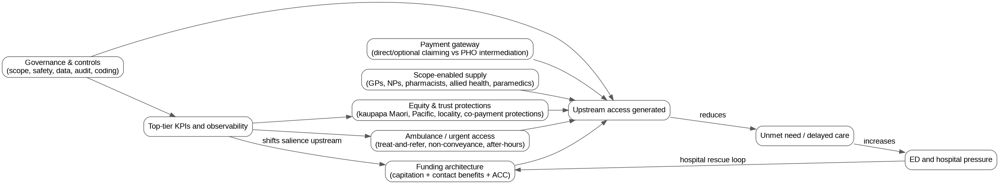
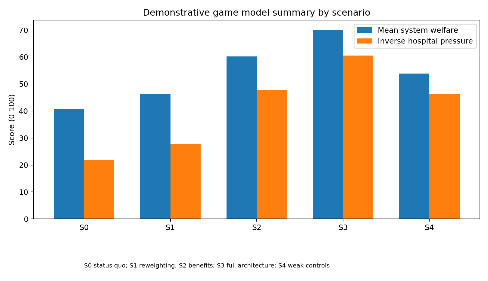
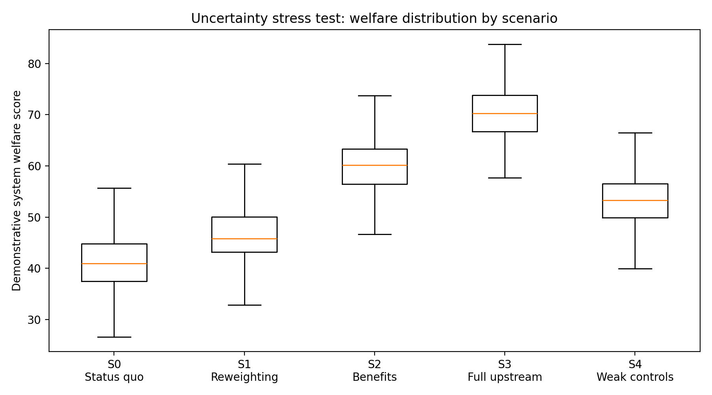
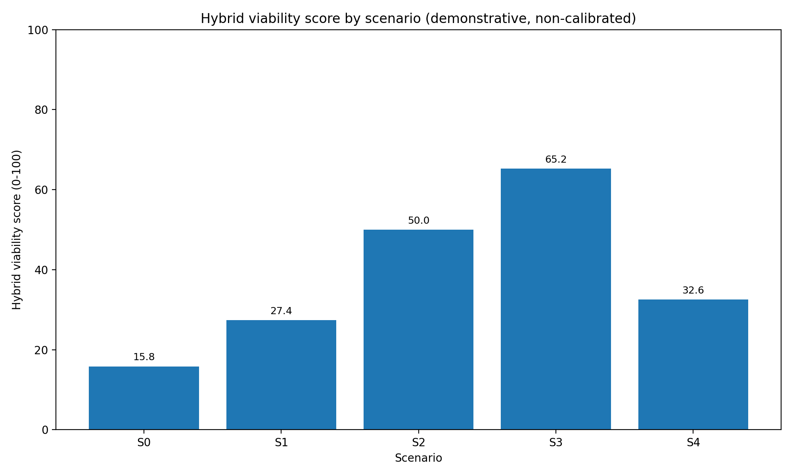
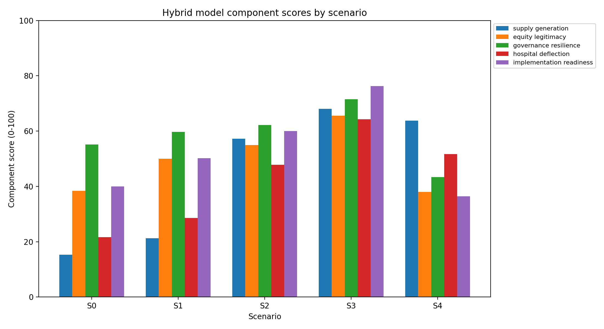
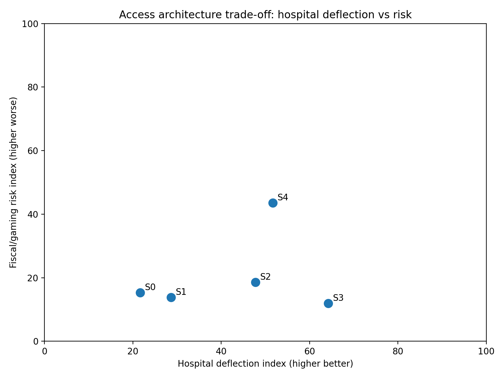
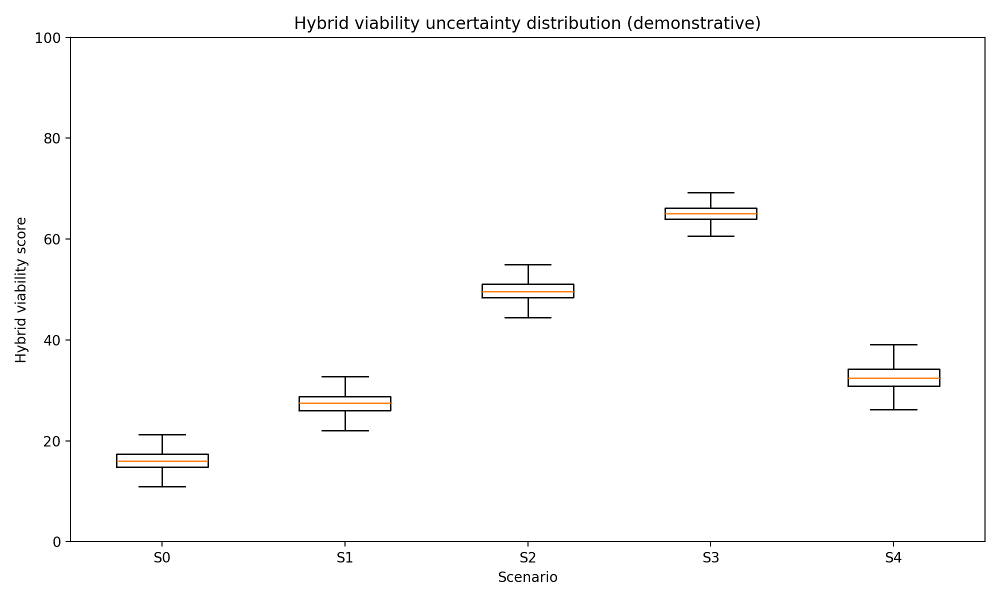

# Primary care funding architecture in Aotearoa New Zealand

## A final hybrid game-theoretic and demonstrative simulation model

**Version:** v0.8.0 final synthesis pack  
**Date:** 8 May 2026  
**Status:** Demonstrative, non-calibrated, audit-ready policy hypothesis  
**Author/workstream:** Dylan A Mordaunt - primary care funding architecture project  

> **Core thesis:** New Zealand may be tightly managing primary care, urgent care and ambulance funding in ways that improve short-run fiscal control but constrain lower-cost upstream supply. If unmet need is not made visible and claimable upstream, it can reappear as visible, unavoidable and fundable hospital demand.

> **Central model result:** The best-performing demonstrative architecture is not pure capitation and not loose fee-for-service. It is a **hybrid upstream access architecture**: capitation for continuity and population responsibility, plus a rules-based Primary Care Benefits Schedule for eligible contact types, plus scope-based provider eligibility, direct/optional claiming, co-payment protections, ambulance alternatives, strong data, and hospital-equivalent KPIs.

> **Important limitation:** This model is not yet empirically calibrated. It is a structured, executable and source-traceable hypothesis intended for validation through OIA material, data access, stakeholder review, equity review and calibrated simulation.

# 1. Executive summary

This report consolidates the project from v0.1.0 to v0.8.0. The work began as a policy hypothesis about blended primary care funding in Australia and New Zealand and has now been developed into a New Zealand-focused game-theoretic map, executable demonstrative models, uncertainty analysis, calibration protocol, audit ledger, and final hybrid model.

The policy problem is not simply that primary care needs more money. The problem is that the **rules of the game** may be directing growth into hospitals by constraining supply in lower-cost upstream settings. The visible hospital system has immediate operational and political salience. Primary care, urgent care and ambulance access failures are more dispersed, can be absorbed by co-payments, waiting times and closed books, and often become fundable only after they have escalated into ED presentations, ambulance demand, admissions, delayed discharge and hospital deficits.

The public evidence base supports the need for this architecture-level analysis. Capitation is publicly described as the core way general practice is funded, introduced in 2002, with the current reweighting process proposed to take effect from 1 July 2026. The released Sapere briefing states that the reweighting work is a technical analysis to improve the formula and **has not considered fundamental changes to the overall funding model for primary care**. The 2020 Health and Disability System Review separately recommended moving away from mandatory PHO contracting and toward new commissioning arrangements, including direct payment to providers. A 2025 Ministry briefing on PHO finances also records limited direct visibility of PHO financial activity and ownership structures. Together, these sources support a transparent architecture review, not merely formula reweighting.

The final hybrid proposal is a **National Primary Care Benefits Schedule** layered onto capitation. It is **demand-driven within rules**, not unrestricted fee-for-service. Public subsidy would be available for defined primary, urgent and ambulance/prehospital contact types, claimable by accredited providers acting within scope and clinical governance requirements. Co-payment settings would provide a demand signal, but with strong protections for high-need groups, children, rural populations, Community Services Card holders and people with multimorbidity.

The model explicitly rejects two extremes:

1. **Capitation-only reform:** improves allocation but may not solve the marginal supply problem.
2. **Loose demand-driven benefits:** may improve access but increases fiscal, gaming, safety and equity risk.

The preferred architecture is the third path: **hybrid benefits with controls**.

# 2. What has been completed

The project now includes these artefact groups:

| Workstream | Status at v0.8.0 | Main artefacts |
|---|---|---|
| Conceptual thesis | Complete at hypothesis stage | `core-thesis`, `causal-logic-model`, policy architecture options |
| Game-theory mapping | Complete at conceptual stage | 14 NZ policy games, actor/strategy/payoff maps |
| Demonstrative modelling | Complete for all mapped games | One executable model per game |
| Uncertainty analysis | Complete at demonstrative level | Monte Carlo stress test and sensitivity rankings |
| Hybrid synthesis | Complete at demonstrative level | Integrated model across supply, equity, governance and hospital deflection |
| Research audit | Complete for conceptual provenance | Claim-source ledger, artefact manifest, falsification register |
| Evidence review | Ready, not complete | PRISMA-ScR protocol, eligibility criteria, search strings |
| Calibration | Ready, not complete | Parameter register, calibration protocol, data request dashboard |
| Stakeholder validation | Ready, not complete | Sampling frame, validation pack |
| Policy translation | Drafted | Briefs, Substack series, NZMJ viewpoint/protocol scaffolds |

# 3. Policy problem

The policy question is:

> **Does New Zealand's current funding architecture optimise distribution within constrained upstream sectors while allowing growth to emerge in the higher-cost hospital sector?**

This differs from a narrow question about whether capitation weights should be improved. Capitation reweighting asks how funding should be allocated across enrolled populations. The architecture question asks whether the system allows clinically appropriate primary, urgent and ambulance care to expand before unmet need becomes hospital demand.

The hypothesised mechanism is:

1. Primary care and ambulance are tightly managed through capitation, contracts, PHO mediation, professional bottlenecks and fixed-budget controls.
2. Marginal clinically necessary activity is weakly funded or administratively constrained.
3. Practices and other providers respond through closed books, waiting time, co-payments, selective service, telehealth substitution or reduced local in-person supply.
4. Consumers delay care, pay privately, seek telehealth, call ambulance or attend ED.
5. Hospital pressure becomes visible, operationally urgent and politically costly.
6. Resources then flow to hospitals because the downstream failure is observable and unavoidable.
7. The upstream constraint remains under-corrected.

This is the **hospital-rescue equilibrium**.

# 4. Public evidence anchors

The report uses official public sources as anchors for the policy architecture question.

| Evidence anchor | Relevance |
|---|---|
| Capitation introduced in 2002 and remains the core way general practice is funded | Establishes the baseline funding model. |
| Current reweighting considers age, sex, multimorbidity, rurality and deprivation | Establishes that allocation improvement is underway. |
| Sapere briefing says reweighting did not consider fundamental changes to the overall funding model | Establishes the gap this project addresses. |
| Health and Disability System Review recommended moving away from mandatory PHO contracting | Establishes public precedent for separating PHO functions from mandatory funding intermediation. |
| PHO finance briefing says Ministry lacks direct access to PHO financial activity and ownership structures | Establishes transparency and accountability concerns. |
| National Primary Care Dataset focuses initially on encounters and appointment data for the 80% within-seven-days target | Establishes emerging observability infrastructure. |
| Health NZ commissions hospital, primary and community services | Establishes the internal allocation game. |
| Ambulance services are commissioned for Health NZ and ACC, with medical patients funded by Health NZ and injury patients by ACC | Establishes the cross-funder ambulance/ACC game. |
| Australian GP Incentives Review proposed a new funding architecture for primary care practices | Establishes that blended funding architecture is an active Australian policy issue. |

# 5. Final hybrid architecture

The proposed architecture has eight linked components.

## 5.1 Retain capitation, but narrow its job

Capitation should remain for continuity, enrolment, team infrastructure, baseline viability, population accountability and equity-oriented planning. It should not be expected to solve marginal access and supply on its own.

## 5.2 Add a National Primary Care Benefits Schedule

The schedule would define eligible primary care, urgent care, chronic care, procedural care, mental health, allied health, pharmacy, nurse practitioner and ambulance/prehospital contact types. Public subsidy would follow the eligible contact.

The rule is:

> **Provider payment = public benefit for eligible contact type + permitted patient co-payment + modifiers.**

Potential modifiers include complexity, rurality, after-hours care, in-person requirement, continuity, high-needs groups, multimorbidity and safe ambulance alternative disposition.

## 5.3 Make the system demand-driven within rules

The proposal is **not** a fixed ring-fenced envelope. It is a rules-based benefit stream: the public subsidy is available when eligible care is delivered to an eligible patient by an accredited provider within scope. The controls are at the transaction, scope, audit, data, quality and co-payment level.

## 5.4 Enable direct or optional claiming

PHO and locality functions may remain valuable, especially for population health, equity, outreach, quality improvement and local relationship work. But PHO intermediation should not necessarily remain the gateway to public payment for all eligible primary care activity.

## 5.5 Remove funding-model professional bottlenecks

Funding eligibility should follow safe scope and governance, not professional category alone. Activity should be generated by GPs, nurse practitioners, pharmacists, allied health professionals, paramedics, Māori and Pacific providers, and other accredited providers where the service is within legal scope, competence, prescribing rules and clinical governance.

## 5.6 Calibrate co-payments as a demand signal, not an equity failure

Co-payments can signal demand and partly protect fiscal sustainability, but unmanaged co-payments can ration by ability to pay. The architecture therefore needs fee caps, zero-fee or low-fee groups, higher subsidies for deprivation/rurality/multimorbidity, patient protections for frequent users, and transparent monitoring of unmet need due to cost.

## 5.7 Treat ambulance and prehospital care as access infrastructure

Ambulance should not be modelled only as transport to ED. Treat-and-refer, hear-and-treat, non-conveyance, alternative destination and rural PRIME-type services can be hospital-avoidance infrastructure if funded, governed, measured and connected to follow-up.

## 5.8 Lift primary care and ambulance to hospital-equivalent accountability

Top-tier KPIs should include primary care access, urgent care access, co-payment burden, open enrolment, continuity, lower-urgency ED presentations, ambulatory-sensitive hospitalisations, ambulance response, ambulance non-conveyance with safe follow-up, and ambulance-ED interface delay.

# 6. Game-theoretic mapping

The NZ policy problem was mapped into 14 component games.

| Game | Name | Core mechanism |
|---|---|---|
| G1 | Hospital-salience budget game | Visible hospital failure attracts rescue funding; upstream access failure is dispersed and delayed. |
| G2 | Health NZ internal allocation game | Health NZ commissions hospital, primary and community care, but hospital operations are more immediate. |
| G3 | Capitation marginal-supply game | Fixed revenue can weakly reward additional clinically necessary contacts. |
| G4 | Consumer access pathway game | Patients choose among waiting, paying, delaying, telehealth, ambulance and ED. |
| G5 | PHO intermediation game | PHOs may add value but payment intermediation may add friction and entry barriers. |
| G6 | ACC/Health NZ cross-funder game | ACC activity payments may stabilise supply; constraining them in isolation may shift pressure. |
| G7 | Ambulance conveyance game | ED conveyance can become the default unless alternatives are funded and governed. |
| G8 | Scope-of-practice supply game | Funding rules can create artificial bottlenecks if narrower than clinical scope. |
| G9 | Telehealth/local-supply game | Telehealth extends access but can fragment care if not integrated with local in-person services. |
| G10 | Co-payment calibration game | Co-payment can signal demand or deter necessary care. |
| G11 | KPI salience game | What is elevated to top-tier reporting becomes managed. |
| G12 | Equity and trust game | Direct benefits must not displace kaupapa Māori, Pacific, outreach and trust functions. |
| G13 | Political economy game | The same reform can be framed as pro-market, anti-PHO, anti-GP, pro-patient or anti-equity. |
| G14 | Data observability game | Unmet need remains less fundable if not visible and linked to downstream outcomes. |

# 7. Demonstrative modelling

Each game was converted into an executable, stylised model. The models use normalised inputs and outputs from 0 to 100. They are deliberately non-calibrated.

Five scenarios were modelled:

| Scenario | Meaning |
|---|---|
| S0 | Status quo tight control |
| S1 | Capitation reweighting only |
| S2 | Primary Care Benefits Schedule |
| S3 | Full upstream access architecture |
| S4 | Loose benefits, weak controls |

Across the 14 demonstrative models, capitation reweighting improves the model modestly; the Primary Care Benefits Schedule improves access and hospital-pressure logic; full upstream architecture performs best; and loose benefits with weak controls improve access but increase risk.

# 8. Uncertainty analysis

The v0.7.0 uncertainty layer perturbed each scenario lever across 1,000 draws per scenario, producing 70,000 game-level model rows. This is still demonstrative rather than empirical uncertainty. It shows whether the architecture logic is robust to variation in assumptions and identifies the parameters that most require validation.

Key sensitivity drivers were: local in-person loading, direct claiming, narrative coherence, marginal contact benefit, data observability, primary care KPI salience, PHO transaction cost, ambulance alternative funding, ambulance KPI salience and stakeholder alignment.

# 9. Final hybrid model

The v0.8.0 hybrid model integrates the 14 games into one scenario-level synthesis. It produces seven weighted base metrics and six architecture indices.

## 9.1 Base metrics

- weighted access;
- weighted provider viability;
- weighted equity;
- weighted fiscal control;
- weighted hospital pressure;
- weighted gaming risk;
- weighted welfare.

## 9.2 Architecture indices

- **Supply generation index:** whether funding, claiming, scope, local in-person support and reduced friction allow upstream supply to grow.
- **Equity legitimacy index:** whether access is protected by co-payment controls, capitation need weighting, equity programmes and trust infrastructure.
- **Governance resilience index:** whether safety, data, audit, coding, stakeholder alignment and fiscal controls can keep demand-driven benefits safe.
- **Hospital deflection index:** whether upstream supply, ambulance alternatives and KPI salience plausibly reduce hospital pressure.
- **Implementation readiness index:** whether the architecture has enough governance, data, narrative coherence and stakeholder support.
- **Fiscal/gaming risk index:** whether loose benefits, weak controls, high co-payments, weak integration or weak data create risk.

## 9.3 Interaction penalties

The model applies penalties where the architecture is internally inconsistent:

- benefits without governance;
- co-payments without protections;
- telehealth scale without local integration;
- direct claiming without data and audit;
- hospital salience without primary/ambulance KPI salience;
- capitation reweighting without marginal supply architecture.

# 10. Hybrid model results

Scenario key:

| Scenario | Architecture |
|---|---|
| S0 | Status quo tight control |
| S1 | Capitation reweighting only |
| S2 | Primary Care Benefits Schedule |
| S3 | Full upstream access architecture |
| S4 | Loose benefits, weak controls |

The final hybrid model deliberately separates **deflection** from **risk**. S4 shows why broad benefits without strong controls are not the preferred model: supply and deflection improve, but risk and implementation weakness reduce overall viability.

| Scenario | Supply | Deflection | Risk | Penalty | Viability |
|---|---:|---:|---:|---:|---:|
| S0 | 15.28 | 21.65 | 15.27 | 16.99 | 15.85 |
| S1 | 21.21 | 28.63 | 13.80 | 12.89 | 27.38 |
| S2 | 57.20 | 47.78 | 18.61 | 6.19 | 50.00 |
| S3 | 68.02 | 64.24 | 11.93 | 3.34 | 65.23 |
| S4 | 63.80 | 51.68 | 43.60 | 15.87 | 32.57 |

## Interpretation

The deterministic hybrid synthesis produces the clearest policy signal in the project:

- **S0 status quo** has low hybrid viability because upstream access remains constrained and hospital pressure remains high.
- **S1 capitation reweighting only** improves equity and allocation but does not materially solve the supply-generation problem.
- **S2 Primary Care Benefits Schedule** improves supply generation and hospital deflection, but requires stronger governance, ambulance, equity and KPI architecture.
- **S3 full upstream access architecture** performs best because it combines benefits, capitation, scope, direct claiming, data, KPIs, ambulance alternatives and equity protections.
- **S4 loose benefits** demonstrates the danger of unrestricted activity payments: access and supply rise, but risk and equity problems undermine the result.

The model therefore supports the phrase:

> **Demand-driven within rules; not demand-driven without rules.**

# 11. Hybrid uncertainty results

The v0.8.0 hybrid uncertainty analysis perturbs the same scenario levers and computes hybrid viability uncertainty for each scenario.

| Scenario | Mean viability | P05 | P95 |
|---|---:|---:|---:|
| S0 | 16.08 | 12.77 | 19.40 |
| S1 | 27.41 | 24.05 | 30.61 |
| S2 | 49.71 | 46.54 | 52.83 |
| S3 | 65.07 | 62.25 | 67.75 |
| S4 | 32.49 | 28.71 | 36.30 |

Again, these are not real-world probabilities. They are stress tests of the demonstrative architecture logic.

# 12. Policy design implications

## 12.1 The policy should not be sold as "more GP funding"

The strongest framing is system design:

> **Do not tightly ration lower-cost access and then treat the hospital growth that follows as unavoidable.**

## 12.2 The policy should not be sold as abolition of capitation

Capitation remains useful for continuity, population health and baseline viability. The critique is that capitation cannot carry the whole access and marginal-supply function alone.

## 12.3 The policy should separate PHO function from PHO intermediation

PHO or locality functions may be valuable. Mandatory payment intermediation is a separate question.

## 12.4 The policy should enable supply by scope, not guild

Payment rules should allow activity from providers acting within scope, including GPs, nurse practitioners, pharmacists, nurses, physiotherapists, other allied health providers, paramedics and kaupapa Māori/Pacific providers.

## 12.5 The policy should include ambulance from the start

Ambulance and prehospital care are part of access architecture. If alternative pathways are not funded and measured, conveyance to ED remains the organisationally safe default.

## 12.6 The policy should elevate upstream KPIs

Primary care and ambulance access should be reported at hospital-equivalent levels. Otherwise, hospital pressure remains the dominant management signal.

# 13. Minimum empirical work before policy claims become predictive

The next stage should not be another conceptual paper. It should estimate the key parameters.

| Parameter area | Data needed |
|---|---|
| Capitation | Current formula, rate tables, proposed reweighting, enrolment data, unmet need proxies |
| Co-payments | Practice fee schedules, actual patient charges, cost-related unmet need |
| Supply | Workforce by scope/geography, practice open books, appointment capacity, entry/exit |
| PHO intermediation | Pass-through rules, administrative costs, contract timelines, entry barriers |
| ACC | Claim volumes, payment rates, practice revenue mix, injury/non-injury substitution |
| Ambulance | Response, dispatch, non-conveyance, treat-and-refer, ED handover/offload delay |
| Hospital pressure | ED, admissions, ambulatory-sensitive hospitalisations, delayed discharge |
| Equity | Ethnicity, deprivation, rurality, disability, multimorbidity, age, experience data |
| Governance | Audit rules, coding, adverse events, prescribing, clinical governance models |
| Political economy | Stakeholder support, narrative testing, submissions, media/policy discourse |

# 14. Audit position

At v0.8.0 the project is:

| Gate | Status |
|---|---|
| Conceptual mapping | Passed |
| Claim traceability | Passed |
| Demonstrative model for each game | Passed |
| Hybrid synthesis | Passed at demonstrative level |
| Uncertainty testing | Passed at demonstrative level |
| Artefact audit | Passed |
| Empirical calibration | Not yet passed |
| Stakeholder validation | Not yet passed |
| Equity / Te Tiriti review | Not yet passed |
| Fiscal validation | Not yet passed |
| Policy implementation validation | Not yet passed |

The correct claim is therefore:

> **This project has produced an audit-ready, executable and falsifiable policy hypothesis. It has not yet proven the hypothesis empirically.**

# 15. Recommended outputs from this point

## 15.1 RACMA discussion paper

A 6-10 page policy committee paper should focus on the system-design argument, not the full modelling.

## 15.2 NZMJ Viewpoint

The NZMJ Viewpoint should use the repeated-game architecture and argue that capitation reweighting is necessary but insufficient. It should not present demonstrative model outputs as empirical findings.

## 15.3 NZMJ methods/protocol article

A second article could present the game-theoretic map, system dynamics/ABM protocol and empirical validation plan.

## 15.4 Substack series

The public series should proceed in this order: funding architecture, capitation/FFS 101, hospitals win the game, benefits schedule, co-payments, scope, PHOs, ambulance, ACC, telehealth, Australia comparison, election questions.

## 15.5 Data and OIA work

The OIA/data work should request the full current capitation formula, operational calculation method, rate tables, formula code/workbooks, PHO pass-through rules, PHO advice H2025067082, ambulance alternative disposition data and ACC primary care payment mix.

# 16. Final conclusion

The final hybrid model supports a nuanced policy position.

A capitation-only model can improve allocation but may under-reward marginal clinically necessary activity. A loose fee-for-service model can expand activity but risks gaming, fiscal exposure and inequity. The better architecture is a **hybrid game**:

- capitation for continuity, enrolment and population accountability;
- a Primary Care Benefits Schedule for eligible contact types;
- direct or optional claiming for accredited providers;
- scope-based supply rather than doctor-only supply constraints;
- co-payment protections;
- PHO/locality functions where they add value, but not mandatory payment intermediation;
- ambulance and urgent care as access infrastructure;
- data, audit, coding and clinical governance;
- hospital-equivalent accountability for primary care and ambulance outcomes.

The core policy sentence is:

> **New Zealand should stop tightly rationing lower-cost upstream care and then treating hospital growth as unavoidable.**

## References and source anchors

1. Ministry of Health. Capitation reweighting. Last updated 30 July 2025. Public webpage describing capitation, the 2002 formula, proposed reweighting and proposed 1 July 2026 implementation.
2. Ministry of Health. Briefing H2024057558: The Sapere report and re-weighting primary care capitation funding. Released 2025. Key source for the limitation that the reweighting work did not consider fundamental changes to the overall funding model.
3. Health and Disability System Review. Final report / Pūrongo Whakamutunga. 2020. Key source for recommendations on Tier 1 funding, PHO contracting and direct payment/commissioning arrangements.
4. Ministry of Health. Briefing H2025069314: PHO finances - a summary of available information. Released 2025. Key source for PHO financial transparency and monitoring limitations.
5. Health New Zealand. National Primary Care Dataset. Last updated 5 February 2026. Key source for encounter and booking data collection linked to the 80% within-seven-days target.
6. Health New Zealand. The Ambulance Team. Key source for ambulance commissioning, Health NZ/ACC funding split, provider KPIs and performance reporting.
7. Ministry of Health. Health Crown entities. Key source for Health NZ responsibility for planning and commissioning hospital, primary and community health services.
8. Australian Government Department of Health, Disability and Ageing. Review of General Practice Incentives - Expert Advisory Panel Report to the Australian Government. Published 8 October 2024. Key source for Australian blended funding architecture.

# Appendix A. Key repository artefacts

A full artefact index is available at `docs/final/artefact-pack-index-v0.8.0.csv`. The most important files are:

| Artefact | Purpose |
|---|---|
| `docs/final/final-comprehensive-report-v0.8.0.md` | This report |
| `models/primarycare_model/hybrid_model.py` | Final hybrid model code |
| `docs/modelling/hybrid-model-results-v0.8.0.csv` | Deterministic hybrid model results |
| `docs/modelling/hybrid-uncertainty-summary-v0.8.0.csv` | Hybrid uncertainty summary |
| `docs/figures/hybrid-model-synthesis-v0.8.0.png` | Final architecture diagram |
| `docs/audit/claim-to-source-ledger-v0.5.0.csv` | Claim-source traceability |
| `docs/audit/game-map-traceability-matrix-v0.4.1.csv` | Game-map audit matrix |
| `docs/modelling/demonstrative-modelling-report-v0.6.0.md` | Per-game model report |
| `docs/modelling/uncertainty-analysis-report-v0.7.0.md` | Monte Carlo uncertainty report |
| `docs/review/rapid-scoping-review-protocol-v0.2.0.md` | Review protocol |
| `docs/qualitative/stakeholder-validation-pack-v0.5.0.md` | Stakeholder validation guide |
| `docs/oia/data-request-dashboard-v0.5.0.csv` | Data/OIA request dashboard |

# Appendix B. Model governance statement

The model should be cited as **demonstrative and non-calibrated** unless and until empirical calibration is completed. It should be used to structure policy discussion, identify assumptions, prioritise data collection and design validation, not to estimate fiscal savings or predict hospital demand.
